# 操作系统学习笔记-I/O管理和磁盘调度

> 📌 转载自 **花猪のBlog（作者 CNhuazhu）** —— 原文：https://cnhuazhu.top/butterfly/2021/06/02/%E6%93%8D%E4%BD%9C%E7%B3%BB%E7%BB%9F/%E6%93%8D%E4%BD%9C%E7%B3%BB%E7%BB%9F%E5%AD%A6%E4%B9%A0%E7%AC%94%E8%AE%B0-I-O%E7%AE%A1%E7%90%86%E5%92%8C%E7%A3%81%E7%9B%98%E8%B0%83%E5%BA%A6/
> 学习笔记，版权归原作者所有，仅供学弟学妹学习参考；如有侵权请联系删除。

---

# 前言

*正在学习操作系统，记录笔记。*

> 参考资料：
>
> 《操作系统（精髓与设计原理 第8版） 》

------------------------------------------------------------------------

# 第十一章：I/O管理和磁盘调度

## I/O设备

I/O设备大体上可以分为如下三类：

- 人可读：顾名思义就是其面向的用户群体是人，具体有：
  - 打印机
  - 终端（包含：显示器、键盘、鼠标等）
- 机器可读：面向电子设备通信，具体有：
  - 磁盘、磁带驱动器
  - 传感器
  - 控制器
- 通信：适用于与远程设备通信，如：
  - 数字线路驱动器
  - 调制解调器

数据传送速率：不同类型的I/O设备，数据传送速率可能会相差几个数量级，如下图：

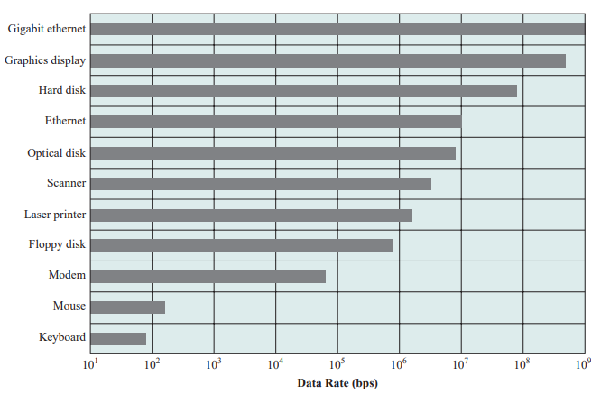

用途：设备用途对操作系统及其支撑设施中的软件和策略都有影响。

- 用于存储文件的磁盘需要文件管理软件的支持
- 虚拟内存需要特殊硬件软件支持
- 终端既可被普通用户使用，也可被系统管理员使用。

控制的复杂性：例如，打印机仅需要一个相对简单的控制接口，而磁盘的控制接口则要复杂得多。

传送单位：数据可按字节流或字符流的形式传送（如终端I/O），也可按更大的块传送（如磁盘I/O）。

错误条件：随着设备的不同，错误的性质、报告错误的方式、错误造成的后果及有效的响应范围，都各不相同。

> 以上的差异使得不管是从操作系统的角度，还是从用户进程的角度，都很难找到一种统一的、一致的I/O解决方法。

## I/O功能的组织

有三种执行I/O的技术（具体可以看<a href="https://cnhuazhu.gitee.io/2021/03/14/%E6%93%8D%E4%BD%9C%E7%B3%BB%E7%BB%9F/%E6%93%8D%E4%BD%9C%E7%B3%BB%E7%BB%9F%E5%AD%A6%E4%B9%A0%E7%AC%94%E8%AE%B0-%E8%AE%A1%E7%AE%97%E6%9C%BA%E7%B3%BB%E7%BB%9F%E6%A6%82%E8%BF%B0/" target="_blank" rel="noopener external nofollow noreferrer">第一章</a>的内容，这里不过多介绍）：

- 可编程I/O：处理器代表一个进程给I/O模块发送一个I/O命令；该进程进入忙等待，直到操作完成才能继续执行。

  > 缺点：当执行I/O操作时，处理器容易进入忙等待状态（空闲），造成处理器资源浪费。

- 中断驱动I/O：处理器代表进程向I/O模块发出一个I/O命令。有两种可能性：

  - 若来自进程的I/O指令是非阻塞的，则处理器继续执行发出I/O命令的进程的后续指令。

  - 若I/O指令是阻塞的，则处理器执行的下一条指令来自操作系统，它将当前的进程设置为阻塞态并调度其他进程。

    > 引入中断机制。
    >
    > 缺点：虽然缓解了忙等待状况，但是最后数据在I/O设备与主存之间传输的过程要依赖于处理器。

- 直接存储器访问（Direct Memory Access，DMA）：一个DMA模块（作为“代理CPU”）控制内存和I/O模块之间的数据交换。为传送一块数据，处理器给DMA模块发请求，且只有在整个数据块传送结束后，它才被中断。

  > 数据在I/O设备与主存之间传输的整个过程只产生两次中断：
  >
  > - 在调用I/O设备前，处理器向I/O设备发出指令
  > - 数据传输完之后，DMA模块向I/O设备发出中断（告知“数据传输完毕”）
  >
  > 优势：数据在I/O设备与主存之间传输不依赖于处理器。

小结I/O执行技术

|                                 | 无中断    | 使用中断              |
|---------------------------------|-----------|-----------------------|
| 通过处理器实现I/O和内存间的传送 | 可编程I/O | 中断驱动I/O           |
| I/O和内存间直接传送             |           | 直接存储器访问（DMA） |

### I/O功能的发展

1.  处理器直接控制外围设备：这在简单的微处理器控制设备中可以见到。

2.  增加了控制器或I/O模块：引入无中断的可编程I/O。

    > 从该阶段开始，处理器无需处理外部设备的细节。

3.  同上一阶段基本相同，但是采用了中断的方式：处理器无须费时间等待执行一次I/O操作，因而提高了效率。

4.  DMA模块的引入：数据块在I/O设备和内存中移动无需处理器参与，仅在传送开始和结束时才需要用到处理器。

5.  I/O模块有一个独立处理器：有专门为I/O设计的指令集，中央处理器指导I/O处理器执行内存中的一个I/O程序。I/O处理器在没有中央处理器干涉的情况下取指令并执行这些指令。这就使得中央处理器可以指定一系列的I/O活动，且仅在整个序列执行完成后中央处理器才被中断。

    > 该阶段的I/O模块通常称为：I/O channel (I/O通道)

6.  I/O模块有自己的局部存储器，事实上其本身就是一台计算机：

    - 使用这种体系结构可以控制许多I/O设备，并使需要中央处理器参与的部分降到最小
    - 这种结构通常用于控制与交互终端的通信，I/O处理器负责大多数控制终端的任务

    > 该阶段的I/O模块通常称为：I/O processor (I/O处理器)

### 直接存储器访问（DMA）

下图是典型的DMA框图

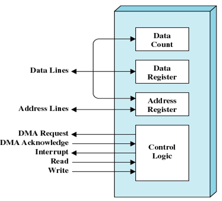

> 说明：
>
> - Data Count：保存此次传输的数据的字节数
> - Data Register：存放正在传输的数据
> - Address Register：基址寄存器
> - Control Logic：其他的一些功能
>
> DMA工作流程：
>
> 1.  处理器和DMA模块之间有读写控制线，基于此处理器可以向DMA模块发送命令（请求I/O）
> 2.  DMA模块直接负责I/O设备到内存之间的数据传输（不需要处理器）
> 3.  在数据传输完之后，DMA模块向处理器发送一个中断信号

DMA机制的配置：

- 所有模块共享同一个系统总线：

  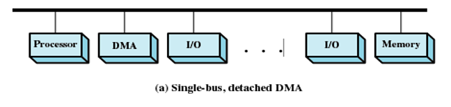

  - DMA模块充当代理处理器
  - 同一时刻只允许一个I/O设备和主存进行交互，否则会出现数据冲突
  - 同一个时间段可以有多台I/O设备和主存进行交互——分时复用
  - 排队的情况很严重，虽然这样的设计开销不大，但是效率很低

- 集成DMA和I/O：

  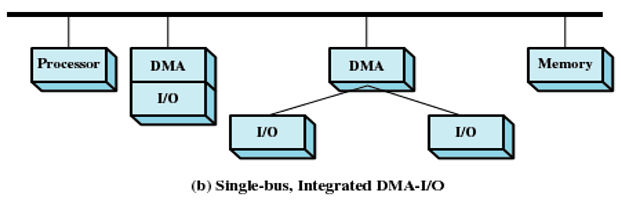

  - 减少了I/O对DMA模块的竞争

    > 在DMA模块和一个或多个I/O模块之间还存在一条不包含系统总线的路径。DMA逻辑实际上可能就是I/O模块的一部分，或可能是控制一个或多个I/0模块的一个单独模块。

- 增加I/O局部总线：

  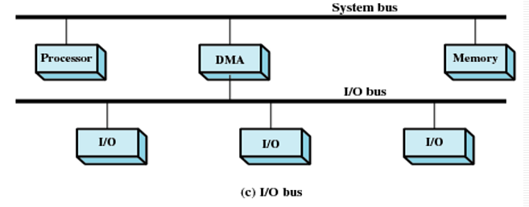

  - DMA模块中I/O接口的数量减少到1
  - 易扩展

  > 第二、三种方式：DMA和I/O模块之间的数据交换是脱离系统总线完成的。

## 操作系统设计问题

### 设计目标

在设计I/O机制时，最重要的两个目标就是：效率（Efficiency）、通用性（Generality）。

- 效率：

  - I/O操作通常是计算机系统的瓶颈。

    > 之前也提到过，大多数I/O设备都是机械运动，而处理器是电信号的处理，二者的速度差距在几个数量级。

  - 解决上述问题的一种方式是引入多道程序设计。这样可以缓解，但不能彻底解决问题。我们想象一种极端情况：在并发度达到最大时，所有的进程都在等待I/O设备，那么这时也会出现CPU空闲状态，效率并不能有效提高。

  - 于是引入交换技术。用于将额外的就绪进程加载进内存，从而使处理器处于工作状态。（这本身就是一个I/O操作）

- 通用性：处于简单和避免错误的考虑，希望能用一种统一的方式处理所有设备。

  > 注：有些版本将“通用性”翻译为“设备的独立性”。

  - 处理器看待I/O设备的方式统一。

  - 操作系统管理I/O设备和IVO操作的方式统一。

    > 由于设备特性的多样性，在实际中很难真正实现通用性。
    >
    > 目前所能做的就是用一种层次化、模块化的方法设计I/O功能。这种方法隐藏了大部分I/O设备低层例程中的细节，使得用户进程和操作系统高层可以通过如读、写、打开、关闭、加锁和解锁等通用的函数来操作I/O设备。

### I/O功能的逻辑结构

分层的原理是：操作系统的功能可以根据其复杂性、特征时间尺度和抽象层次来分开。

将分层原理应用于I/O机制，具体如下图：

### *（⚠️ 原图已失效）*

> 说明：
>
> - 逻辑I/O（Logical I/O）：逻辑I/O模块把设备当作一个逻辑资源来处理，它并不关心实际控制设备的细节。
> - 设备I/O（Device I/O）：请求的操作和数据（缓冲的数据、记录等）被转换为适当的I/O指令序列、通道命令和控制器命令。
> - 调度和控制（Scheduling & control）：I/O操作的排队、调度实际上发生在这一层。
> - 目录管理（Directory management）：在这一层，符号文件被转换为标识符，采用标识符时可通过文件描述符表或索引表直接或间接地访问文件。
> - 文件系统（File system）：这一层处理文件的逻辑结构及用户指定的操作，如打开、关闭、读、写等。这一层还管理访问权限。
> - 物理组织（Physical organization）：考虑到辅存设备的物理磁道和扇区结构，对于文件和记录的逻辑访问必须转换为物理外存地址。辅助存储空间和内存缓冲区的分配通常也在这一层处理。

## I/O缓冲

缓存（buffering）的原因：

- 处理器在I/O完成之前必须等待
- 在页交换的过程中，某些页必须驻留内存

> 缓存（buffer）：内存当中预留的一个区域，用来暂存I/O通讯的数据。
>
> 举例：
>
> - printf函数：可能有时候会出现明明在程序中写了printf，但是并没有如期望般那样得到输出结果。这是因为printf是一个带缓冲的输出打印。printf本身会调用一个系统调用，会产生进程切换，如果仅为了打印一句“Hello World”就使用进程切换，可以认为这是没必要的。所以会当缓冲区满了的时候再一次性打印出来。（如果必要，我们也可以用fflush去强制清除缓存，将其打印出来）
> - 打印机：在使用打印机的时候可以看到计算机屏幕上显示进度条（完成一页、两页…），待到进度条完成之后，打印机才开始工作。进度条展示的其实就是将数据存储到缓冲区的进度，当执行完成后，处理器就可以完成其他的任务去了，接下来才是打印机去访问缓冲区，将数据真实地打印出来。
>
> 优点：
>
> - 可以让CPU和I/O并行操作
> - 减少中断次数
> - 提高CPU效率

缓冲的定义：在输入请求发出前就开始执行输入传送，并且在输出请求发出一段时间之后才开始执行输出传送。

> 光看定义可能有些不知所云，往下看，慢慢体会。

在讨论各种缓冲方法之前，首先要区分两类I/O设备：

- 面向块（Block-oriented）的I/O设备：
  - 将信息保存到固定大小的块中
  - 传送过程中一次传输一块
  - 通常可以通过块号访问数据
  - 举例：磁盘、磁带、USB智能卡
- 面向流（Stream-oriented）的I/O设备：
  - 以字节流的方式输入\输出数据
  - 举例：终端、打印机、通信端口、鼠标和其他指示设备及其他大多数非辅存设备

### 单缓冲

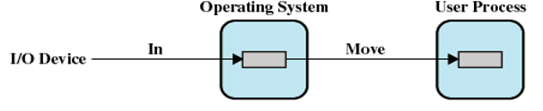

- I/O设备先将传送的数据移入到系统缓冲区中（I/O → 内存）
- 上一步传输完成时，进程把该块移动到用户空间（内存 → 内存）
- 紧接着，根据局部性原理，会预先请求另一个数据块，将其移入缓冲区（预读；或预先输入）

优点：

- 用户进程可在下一数据块读取的同时，处理已读入的数据块
- 输入发生在系统内存而非用户进程内存，因此操作系统可以将该进程换出

缺点：

- 操作系统必须记录给用户进程分配系统缓冲区的情况

  > 操作系统维护用户进程系统缓冲区。

- 交换逻辑也受到影响

  > I/O操作所涉及的磁盘和用于交换的磁盘是同一个磁盘时，磁盘写操作排队等待将进程换出到同一个设备上是没有任何意义的。若试图换出进程并释放内存，则要在I/O操作完成后才能开始，而在这时，把进程换出到磁盘已经不再合适。

面向流的单缓冲：

- 每次传送一行的方式或每次传送一字节的方式
- 用户在终端每次输入一行，用回车表示到达行尾
- 输出到终端时也是类似地每次输出一行

### 双缓冲

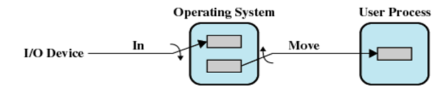

- 在内存中为操作系统分配两个系统缓冲区

- 输入输出交替使用

  > 在一个进程向一个缓冲区中传送数据（从这个缓冲区中取数据）的同时，操作系统正在清空（或填充）另一个缓冲区，这种技术称为双缓冲（double buffering）或缓冲交换（buffer swapping）。

### 循环缓冲

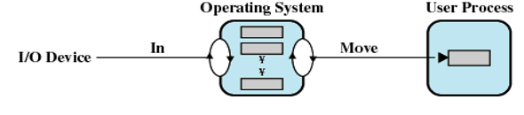

- 内存中有两个以上的缓冲区
- 每个单缓冲区是循环缓冲器的一个单元
- 平滑I/O操作和进程之间的数据流

## 磁盘调度

### 磁盘性能

磁盘的内部结构如下图：

*（⚠️ 原图已失效）*

> 说明：为了读或写，磁头必须定位于指定的磁道和该磁道中指定扇区的开始处。

磁盘性能参数：

- 寻道时间（Seek time ）：磁头定位到磁道所需要的时间称为寻道时间。
- 旋转延迟（Rotational delay ）：磁头到达扇区开始位置的时间称为旋转延迟。
- 传输时间（transfer time）：磁头定位完成就开始读操作或写操作，这就是数据传输，传输的时间就是传输时间。

**磁盘调度（重点）**：

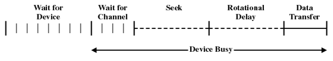

上图为磁盘I/O传送的一般时序图：

**等待I/O设备 → 等待通道 → 寻道（确定磁道） → 旋转延迟（确定扇区） → 数据传输延迟**

> 相关计算：
>
> 传输时间：
>
> ``` math
> T = \frac{b}{rN}
> ```
>
> - T：传输时间
> - b：要传送的字节数
> - N：一个磁道中的字节数
> - r：旋转速度（单位：转/秒）
>
> 总平均存取时间：
>
> ``` math
> T_a = T_s + \frac{1}{2r} +\frac{b}{rN}
> ```
>
> - T<sub>s</sub>：平均寻道时间

### 磁盘调度策略

不同磁盘调度的性能差异的原因可以追溯到寻道时间。因此为了提高性能，需要减少花费在寻道上的时间。

考虑多道程序环境中的一种典型情况：即操作系统为每个I/O设备维护一个请求队列。

- 对于一个磁盘来说，队列中可能有来自多个进程的许多I/O请求（读和写）
- 随机调度（random scheduling）：随机访问磁道。该种方法性能最差，可用于评估其他技术。

下面我们将会介绍八种磁盘调度策略，在介绍时会统一以一个例子进行：

> 例子：
>
> 假设磁盘有200个磁道，磁盘请求队列中是一些随机请求。被请求的磁道，按照磁盘调度程序的接收顺序分别为：
>
> **55、58、39、18、90、160、150、38、184**
>
> 说明：
>
> 假设以磁道号为100处开始寻道。
>
> 具体以折线图的形式展示：纵轴表示磁盘上的磁道；横轴表示时间（或跨越磁道的数量）。

#### 优先级（Priority，PRI）

- 此方法不会优化磁盘的利用率
- 通常较短的批作业和交互作业的优先级较高
- 可以提供较好的交互响应时间

#### 先进先出（First-in First-out，FIFO）

处理请求的顺序（如下图）：`55、58、39、18、90、160、150、38、184`

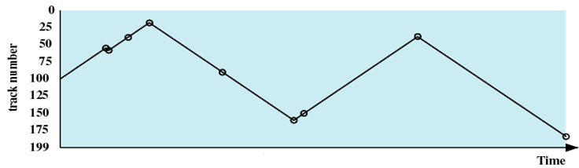

- 这是最简单的调度策略
- 按照收到请求的顺序进行处理
- 优点：公平对待每个请求
- 缺点：并未对磁头的访问有任何优化，效率最差。在多进程环境中，性能接近随机调度。

#### 后进先出（Last-in First-out，LIFO）

处理请求的顺序：`184、38、150、160、90、18、39、58、55`

- 考虑到了局部性原理

  > 在事物处理系统中，由于顺序读取文件的缘故，把设备分配给最后到来的用户，可减少磁臂的运动，甚至没有磁臂运动。

- 缺点：可能会产生饥饿

  > 假设队列中不停地有新的请求，那么最先进入队列的请求很可能饥饿。

#### 最短服务时间优先（Shortest Service Time First ，SSTF）

处理请求的顺序（如下图）：`90、58、55、39、38、18、150、160、184`

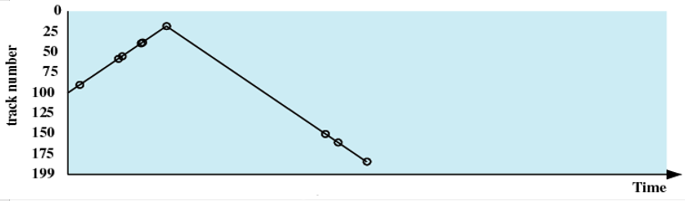

- 策略：选择使磁头臂从当前位置开始移动最少的磁盘I/O请求（如果两个距离相等，随机选择方向）

- 总是选择最小寻道时间的请求

  > 考虑的指标太单一，并不能保证平均寻道时间最小

- 可能会产生饥饿

  > 如果不停有新的请求，该请求距离磁头很近，那么距离磁头较远的请求可能饥饿。

#### SCAN（扫描，电梯算法）

处理请求的顺序（如下图）：`150、160、184、90、58、55、39、38、18`

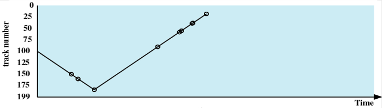

- 策略：磁头臂仅沿一个方向移动，并在途中满足所有未完成的请求，直到它达到这个方向上的最后一个磁道，或者在这个方向上没有其他请求为止，反转扫描方向。

  考虑了局部性原理

  > 这种定向移动的形式类似于电梯，因此也被称为“电梯算法”。

- 可以解决饥饿

- 问题：基于该例假设，假设在处理完184号磁道请求之后，磁头反向扫描，这时又有新的185号磁道访问请求，那么磁头会扫描一轮之后再回来处理，显然是不合理的。

#### C-SCAN（循环扫描）

处理请求的顺序（如下图）：`150、160、184、18、38、39、55、58、90`

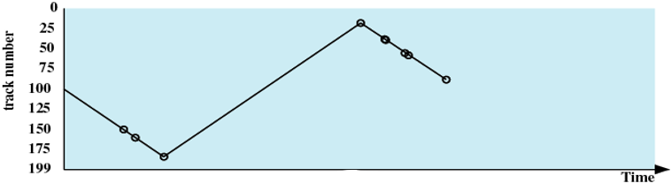

- 策略：将扫描方向固定。当访问到沿某个方向的最后一个磁道时，磁头臂返回到磁道相反方向末端的磁道。
- 可以解决SCAN的问题。减少了新请求的最大延迟。

#### N-step-SCAN

- 将磁盘请求队列划分为长度为N的n个子队列
- 对于n个子队列采取FIFO算法
- 对于子队列中的N个请求，采取SCAN算法
- 如果有新的请求，将其添加到新的队列中去

#### FSCAN

- 使用两个子队列
- 扫描开始时，所有请求都在一个队列中，另一个队列为空。
- 在扫描过程中，所有新到的请求都放入另一个队列。

#### 磁盘调度算法比较

比较FIFO、SSTF、SCANF、C-SCAN算法，如下图：

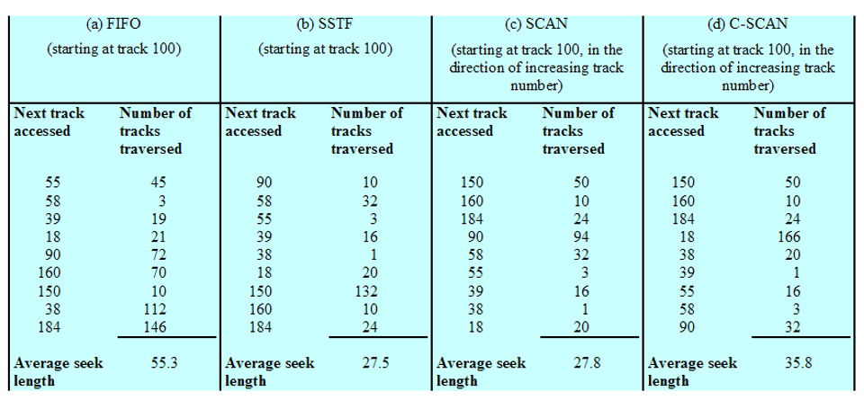

> 注意：计算平均寻道时间时，注意分母的取值。
>
> 以FIFO为例
>
> - 从磁道100处开始：
>
> ``` math
> AVE = \frac{45+3+19+21+72+70+10+112+146}{9} = 55.3
> ```
>
> - 从磁道55处开始：
>
>   ``` math
>   AVE = \frac{0+3+19+21+72+70+10+112+146}{9-1} = 56.625
>   ```
>
> **注意磁头开始的位置**

## RAID

受限于技术，磁盘存储器的大小并不能无限扩大，虽然技术在不断进步，其大小也在逐渐增大，但要意识到一个问题，现实中我们对于磁盘存储的需求可能要远远大于其实际容量。

设计人员认识到这个问题，并提出了并行使用多个磁盘的方案。

独立磁盘冗余阵列（Redundant Array of Independent Disks，RAID）：

- 物理上通过多个磁盘组成一个磁盘组，在逻辑上这是一个大容量的磁盘
- 使用冗余磁盘容量保存奇偶检验信息，保证在一个磁盘失效时，数据具有可恢复性

RAID包含0~6共七个级别，这里仅介绍RAID0、RAID1、RAID5

#### RAID0

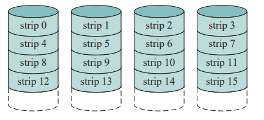

- 实现高数据传送能力
- 实现告诉I/O请求率

#### RAID1

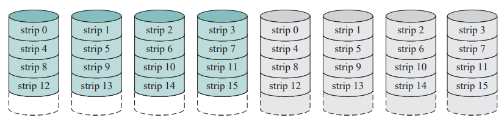

- 读请求可由包含被请求数据的任何一个磁盘提供服务，而不管哪个磁盘拥有最小寻道时间和旋转延迟。
- 写请求需要对两个响应的条带进行更新，但这可并行完成。
- 从失效中恢复很简单：当一个驱动器失效时，仍然可以从第二个驱动器访问到数据。

#### RAID5

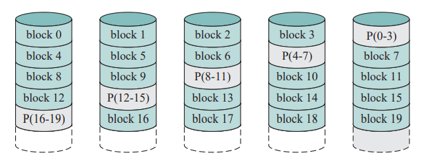

- 把奇偶校验条带分布在所有磁盘中。

------------------------------------------------------------------------

# 后记

本篇已完结

（如有修改或补充欢迎评论）
