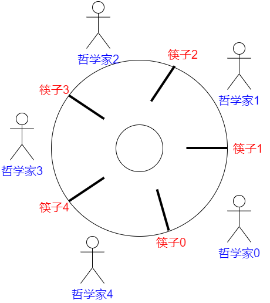

# 操作系统学习笔记-信号量相关问题

> 📌 转载自 **花猪のBlog（作者 CNhuazhu）** —— 原文：https://cnhuazhu.top/butterfly/2021/04/25/%E6%93%8D%E4%BD%9C%E7%B3%BB%E7%BB%9F/%E6%93%8D%E4%BD%9C%E7%B3%BB%E7%BB%9F%E5%AD%A6%E4%B9%A0%E7%AC%94%E8%AE%B0-%E4%BF%A1%E5%8F%B7%E9%87%8F%E7%9B%B8%E5%85%B3%E9%97%AE%E9%A2%98/
> 学习笔记，版权归原作者所有，仅供学弟学妹学习参考；如有侵权请联系删除。

---

# 前言

*正在学习操作系统，记录笔记。*

（补充一下与信号量相关的问题类型以及解决思路）

> 参考资料：
>
> 《操作系统（精髓与设计原理 第6版） 》
>
> 王道考研：<a href="https://www.bilibili.com/video/BV1YE411D7nH?from=search&amp;seid=12220712596266554764" target="_blank" rel="noopener external nofollow noreferrer">2019 王道考研 操作系统_哔哩哔哩 (゜-゜)つロ 干杯~-bilibili</a>

------------------------------------------------------------------------

# 正文

先声明：为了方便（就是我懒），下文可能会用`P操作`来指代`semWait(x)`；用`V操作`来指代`semSignal(x)`。

## 生产者-消费者问题

问题描述：

- 系统中有一组生产者进程和一组消费者进程，生产者进程每次生产一个产品放入缓冲区，消费者进程每次从缓冲区中取出一个产品并使用。（注：这里的“产品理解为某种数据”）

- 生产者、消费者共享一个初始为空、大小为n的缓冲区。

- 只有缓冲区没满时，生产者才能把产品放入缓冲区，否则必须等待。

- 只有缓冲区不空时，消费者才能从中取出产品，否则必须等待。

- 缓冲区是临界资源，各进程必须互斥地访问（只允许一个生产者放入消息，也只允许一个消费者拿出消息）。

  > 再次详细解释一下最后一点。意思是，同一个时刻只能是一个生产者或者一个消费者操作缓冲区，禁止以下情况：多个生产者或者多个消费者操作缓冲区；同样，一个生产者和一个消费者同时操作也是禁止的。

分析：

- 互斥关系：不允许有两方及以上同时访问缓冲区。
- 同步关系：存在两种同步关系，分别为缓冲区满、缓冲区空。（当消费者消费一个产品，应该告诉生产者，缓冲区有一个空位；当生产者生产一个商品，应该告诉消费者，缓冲区非空）

所以根据以上分析得知：应该需要三对P、V操作。因此需要定义如下三个信号量：

<figure class="highlight c++">
<table>
<colgroup>
<col style="width: 50%" />
<col style="width: 50%" />
</colgroup>
<tbody>
<tr>
<td class="gutter"><pre><code>1
2
3</code></pre></td>
<td class="code"><pre><code>semaphore mutex = 1;    //互斥信号量，实现对缓冲区的访问
semaphore empty = n;    //同步信号量，表示空闲缓冲区的数量（初始值为n）
semaphore full = 0;    //同步信号量，表示产品的数量，也即非缓冲区的数量（初始值为0）</code></pre></td>
</tr>
</tbody>
</table>
</figure>

实现：

<figure class="highlight c++">
<table>
<colgroup>
<col style="width: 50%" />
<col style="width: 50%" />
</colgroup>
<tbody>
<tr>
<td class="gutter"><pre><code>1
2
3
4
5
6
7
8
9
10
11
12
13
14
15
16
17
18
19
20
21
22
23
24
25
26
27
28
29
30</code></pre></td>
<td class="code"><pre><code>/*producer*/
void producer()
{
    while(1){
        /*生产一个产品*/;
        semWait(empty);    //检查有无缓冲区可用  (Ⅰ)
        semWait(mutex);    //互斥操作  (Ⅱ)
        /*将产品放入缓冲区*/;
        semSignal(mutex);    //互斥操作
        semSignal(full);    //告诉消费者“生产了一个产品”
    }
}

/*consumer*/
void consumer()
{
    while(1){
        semWait(full);    //检查有无产品（非空缓冲区）  (Ⅲ)
        semWait(mutex);    //互斥操作  (Ⅳ)
        /*从缓冲区中取出一个产品*/;
        semSignal(mutex);    //互斥操作
        semSignal(empty);    //告诉生产者“取走了一个产品，缓冲区有空闲”
        /*使用产品*/;
    }
}

void main()
{
    parbegin(producer(), consumer());
}</code></pre></td>
</tr>
</tbody>
</table>
</figure>

> 思考：能否改变相邻P、V操作的顺序？（即调换`(Ⅰ)`、`(Ⅱ)`以及`(Ⅲ)`、`(Ⅳ)`的顺序）
>
> 分析：
>
> - 分析此种情况：若缓冲区内已经放满产品，则empty=0，full=n。
> - 则生产者先执行`(Ⅱ)`（semWait(mutex)）操作使得mutex变为0，在执行`(Ⅰ)`操作（semWait(empty)），由于已经没有空闲缓冲区，因此生产者被阻塞。接着切换至消费者进程。消费者进程首先执行`(Ⅳ)`（semWait(mutex)）操作，由于mutex为0，即生产者还没有释放对临界资源的控制权，因此消费者也被阻塞。
> - 这就出现了**死锁**的情况（生产者等待消费者释放空闲缓冲区，而消费者又等待生产者释放临界区）
> - 同样的我们分析另一种情况：若缓冲区中没有产品，即empty=n，full=0。按照``` (Ⅳ)``(Ⅲ)``(Ⅱ) ```的顺序也会发生死锁情况。
>
> 因此：
>
> - **实现互斥的P操作一定要在实现同步的P操作之后。**
> - **V操作不会导致进程阻塞，因此两个V操作顺序可以交换。**
>
> 还需要注意的一点：
>
> 生产者`“生产一个产品”`的操作以及消费者`“使用产品”`的操作可以放置P、V操作之间，但是要意识到这些操作是非必要的，如果放置在临界区操作则会导致其代码量变大，在一个进程访问临界区的同时就要耗费更多的时间，这会导致进程之间的并发度降低。（**只在临界区做必要操作**）

## 多生产者-多消费者问题

问题描述：

桌子上有一只盘子，每次只能向其中放入一个水果。爸爸专向盘子中放苹果，妈妈专向盘子中放橘子，儿子专等着吃盘子中的橘子，女儿专等着吃盘子中的苹果。只有盘子空时，爸爸或妈妈才可向盘子中放一个水果。仅当盘子中有自己需要的水果时，儿子或女儿可以从盘子中取出水果。用P、V操作实现上述过程。

分析：

- 互斥关系：将盘子视为缓冲区。每个人（进程）对其访问都是互斥的。
- 同步关系：
  1.  父亲将苹果放入盘子后，女儿才能取苹果。
  2.  母亲将橘子放入盘子后，儿子才能取橘子。
  3.  只有盘子为空时，父亲或母亲才能放入水果。（盘子为空事件可由儿子或者女儿触发）

所以根据以上分析得知，需要定义如下四个信号量：

<figure class="highlight c++">
<table>
<colgroup>
<col style="width: 50%" />
<col style="width: 50%" />
</colgroup>
<tbody>
<tr>
<td class="gutter"><pre><code>1
2
3
4</code></pre></td>
<td class="code"><pre><code>semaphore mutex = 1;    //实现互斥访问盘子（临界区）
semaphore apple = 0;    //盘子中有几个苹果（初始值为0）
semaphore orange = 0;    //盘子中有几个橘子（初始值为0）
semaphore plate = 1;    //盘子中还可以放多少个水果</code></pre></td>
</tr>
</tbody>
</table>
</figure>

实现：

<figure class="highlight c++">
<table>
<colgroup>
<col style="width: 50%" />
<col style="width: 50%" />
</colgroup>
<tbody>
<tr>
<td class="gutter"><pre><code>1
2
3
4
5
6
7
8
9
10
11
12
13
14
15
16
17
18
19
20
21
22
23
24
25
26
27
28
29
30
31
32
33
34
35
36
37
38
39
40
41
42
43
44
45
46
47
48
49
50
51
52
53
54
55
56</code></pre></td>
<td class="code"><pre><code>/*dad*/
void dad()
{
    while(1){
        /*准备一个苹果*/;
        semWait(plate);    //检查盘子是否为空
        semWait(mutex);    //实现对盘子这一缓冲区的互斥访问
        /*把苹果放入盘子*/;
        semSignal(mutex);
        semSignal(apple);    //告诉女儿“盘子里有苹果了”
    }
}

/*mom*/
void mom()
{
    while(1){
        /*准备一个橘子*/;
        semWait(plate);    //检查盘子是否为空
        semWait(mutex);    //实现对盘子这一缓冲区的互斥访问
        /*把橘子放入盘子*/;
        semSignal(mutex);
        semSignal(orange);    //告诉儿子“盘子里有橘子了”
    }
}

/*daughter*/
void daughter()
{
    while(1){
        semWait(apple);    //检查盘子里有没有苹果
        semWait(mutex);    //实现对盘子这一缓冲区的互斥访问
        /*从盘子中取出苹果*/;
        semSignal(mutex);
        semSignal(plate);    //告诉父母“盘子为空了”
        /*吃掉苹果*/;
    }
}

/*son*/
void son()
{
    while(1){
        semWait(orange);    //检查盘子里有没有橘子
        semWait(mutex);    //实现对盘子这一缓冲区的互斥访问
        /*从盘子中取出橘子*/;
        semSignal(mutex);
        semSignal(plate);    //告诉父母“盘子为空了”
        /*吃掉橘子*/;
    }
}

void main()
{
    parbegin(dad(), mom(), daughter(), son());
}</code></pre></td>
</tr>
</tbody>
</table>
</figure>

> 思考：上述案例可不可以不使用互斥信号量（mutex）呢？
>
> 分析（删除上述代码中所有的`semWait(mutex)`以及`semSignal(mutex)`操作）：
>
> - 刚开始，儿子、女儿进程即使上处理机运行也会被阻塞。
> - 如果刚开始是父亲进程先上处理机运行，则：
>   - 父亲执行`semWait(plate)`操作，可以访问盘子。
>   - 母亲执行`semWait(plate)`操作，被阻塞等待盘子。
>   - 父亲执行`semSignal(apple)`操作，放入苹果。
>   - 女儿i进程被唤醒（其他进程即使运行也会阻塞）。
>   - 女儿执行`semWait(apple)`操作，访问盘子。并接着执行`semSignal(plate)`操作。
>   - 父亲或者母亲进程再次被唤醒（儿子进程访问会被阻塞）。
>   - …
>
> 以上分析可以得出结论，即便没有互斥信号量（mutex），也不影响正常运行。
>
> 原因在于：本题中的缓冲区大小为1，在任何时刻，apple、orange、plate三个同步信号量中最多只有一个是1。因此在任何时刻，最多只有一个进程的`P操作`不会被阻塞，并顺利地进入临界区。
>
> 但是加入此题盘子的容量为2及以上，就无法保证进程互斥访问盘子。（分析过程省略）
>
> **最好直接就设置互斥信号量（mutex），以防出错。**

## 吸烟者问题

问题描述：

假设一个系统有三个抽烟者进程和一个供应者进程。每个抽烟者不停地卷烟并抽掉它，但是要卷起并抽掉一支烟，抽烟者需要有三种材料：烟草、纸和胶水。三个抽烟者中，第一个拥有烟草、第二个拥有纸、第三个拥有胶水。供应者进程无限地提供三种材料，供应者每次将两种材料放桌子上，拥有剩下第三种材料的抽烟者卷一根烟并抽掉它，并给供应者进程一个信号告诉完成了，供应者就会放另外两种材料再桌上，这个过程一直重复（让三个抽烟者轮流地抽烟）

分析：

- 互斥关系：将桌子视为缓冲区，每个进程对其访问都是互斥的。

  > 值得注意的是，尽管供应者每次会将两种材料放置在桌子上，但是桌子（缓冲区）的容量仍为1，我们应该将不同的两种材料视为一种组合：
  >
  > - 组合一：纸 + 胶水
  > - 组合二：烟草 + 胶水
  > - 组合三：烟草 + 纸

- 同步关系：

  1.  桌上有组合一 → 第一个抽烟者取走东西。
  2.  桌上有组合二 → 第二个抽烟者取走东西。
  3.  桌上有组合三 → 第三个抽烟者取走东西。
  4.  抽烟者抽完烟 → 供应者将下一种组合材料放到桌子上。

- 需要让三个抽烟者轮流地抽烟。

所以根据以上分析得知，需要定义如下四个信号量：

<figure class="highlight c++">
<table>
<colgroup>
<col style="width: 50%" />
<col style="width: 50%" />
</colgroup>
<tbody>
<tr>
<td class="gutter"><pre><code>1
2
3
4
5</code></pre></td>
<td class="code"><pre><code>semaphore offer1 = 0;    //桌上组合一的数量
semaphore offer2 = 0;    //桌上组合二的数量
semaphore offer3 = 0;    //桌上组合三的数量
semaphore finish = 0;    //抽烟是否完成
int i = 0;    //用于实现“三个抽烟者轮流地抽烟”</code></pre></td>
</tr>
</tbody>
</table>
</figure>

实现：

<figure class="highlight c++">
<table>
<colgroup>
<col style="width: 50%" />
<col style="width: 50%" />
</colgroup>
<tbody>
<tr>
<td class="gutter"><pre><code>1
2
3
4
5
6
7
8
9
10
11
12
13
14
15
16
17
18
19
20
21
22
23
24
25
26
27
28
29
30
31
32
33
34
35
36
37
38
39
40
41
42
43
44
45
46
47
48
49
50
51
52
53
54
55</code></pre></td>
<td class="code"><pre><code>/*provider*/
void provider()
{
    while(1){
        if(i == 0){
            /*将组合一放桌上*/;
            semSignal(offer1);    //告诉第一个抽烟者“桌上有组合一”
        }
        else if(i == 1){
            /*将组合二放桌上*/;
            semSignal(offer2);    //告诉第二个抽烟者“桌上有组合二”
        }
        else if(i == 2){
            /*将组合三放桌上*/;
            semSignal(offer3);    //告诉第三个抽烟者“桌上有组合三”
        }
        i = (i + 1) % 3;
        semWait(finish);    //判断抽烟者是否已经完成吸烟
    }
}

/*smoker1*/
void smoker1()
{
    while(1){
        semWait(offer1);    //判断桌子上有没有组合一
        /*从桌子上拿走组合一；卷烟；抽掉*/;
        semSignal(finish);    //告诉提供者“桌子上已经空了”
    }
}

/*smoker2*/
void smoker2()
{
    while(1){
        semWait(offer2);    //判断桌子上有没有组合二
        /*从桌子上拿走组合二；卷烟；抽掉*/;
        semSignal(finish);    //告诉提供者“桌子上已经空了”
    }
}

/*smoker3*/
void smoker3()
{
    while(1){
        semWait(offer3);    //判断桌子上有没有组合三
        /*从桌子上拿走组合三；卷烟；抽掉*/;
        semSignal(finish);    //告诉提供者“桌子上已经空了”
    }
}

void main()
{
    parbegin(provider(), smoker1(), smoker2(), smoker3());
}</code></pre></td>
</tr>
</tbody>
</table>
</figure>

> 分析：是否需要专门再设置一个互斥信号量（mutex）？
>
> 因为桌子的容量为1（同上面一个例子相同），因此不必设置也不会出错。

## 读者-写者问题

问题描述：

有读者和写者两组并发进程，共享一个文件，当两个或两个以上的读进程同时访问共享数据时不会产生副作用，但若某个写进程和其他进程（读进程或写进程）同时访问共享数据时则可能导致数据不一致的错误。因此我们要求：

- 允许多个读者可以同时对文件执行读操作；
- 只允许一个写者往文件中写信息；
- 任一写者在完成写操作之前不允许其他读者或写者工作；
- 写者执行写操作前，应让已有的读者和写者全部退出。

分析：

- 互斥关系：

  1.  写进程——写进程

  2.  写进程——读进程

      （读进程之间不存在互斥关系，因此可以同时读文件，如何实现该操作是此类问题的关键）

所以根据以上分析得知，需要定义如下三个信号量：

<figure class="highlight c++">
<table>
<colgroup>
<col style="width: 50%" />
<col style="width: 50%" />
</colgroup>
<tbody>
<tr>
<td class="gutter"><pre><code>1
2
3</code></pre></td>
<td class="code"><pre><code>semaphore rw = 1;    //用于实现对文件的互斥访问。表示当前是否有进程在访问共享文件
int count = 0;    //用于记录当前有几个读进程在访问文件
semaphore mutex = 1;    //用于保证对count变量的互斥访问</code></pre></td>
</tr>
</tbody>
</table>
</figure>

实现：

<figure class="highlight c++">
<table>
<colgroup>
<col style="width: 50%" />
<col style="width: 50%" />
</colgroup>
<tbody>
<tr>
<td class="gutter"><pre><code>1
2
3
4
5
6
7
8
9
10
11
12
13
14
15
16
17
18
19
20
21
22
23
24
25
26
27
28
29
30
31
32
33
34</code></pre></td>
<td class="code"><pre><code>/*writer*/
void writer()
{
    while(1){
        semWait(rw);    //在写文件之前“上锁”
        /*写文件*/;
        semSignal(rw);    //在写完之后“解锁”
    }
}

/*reader*/
void reader()
{
    while(1){
        semWait(mutex);    //各读进程互斥访问count
        if(count == 0){
            semWait(rw);    //第一个读进程负责“上锁”
        }
        count++;    //访问文件的读进程数加一
        semSignal(mutex);    
        /*读文件*/;
        semWait(mutex);    //各读进程互斥访问count
        count--;    //访问文件的读进程数减一
        if(count == 0){
            semSignal(rw);    //最后一个读进程负责“解锁”
        }
        semSignal(mutex);
    }
}

void main()
{
    parbegin(writer(), reader1(), reader2(),...,readern());
}</code></pre></td>
</tr>
</tbody>
</table>
</figure>

> 分析：
>
> mutex变量的设置是为了解决读进程对count的访问（解决多个读进程访问的操作）
>
> - 第一个读进程执行`semWait(mutex)`操作，顺利通过，并执行之后的`semWait(rw)`操作（保证了读进程与写进程的互斥）
> - 若此时另一个读进程访问，在执行`semWait(mutex)`操作会被阻塞，直到第一个读进程执行`semSignal(mutex)`操作（“解锁”对count的访问，注意此时count值为1）
> - 当count“解锁”后，另一个读进程再执行`semWait(mutex)`操作，判断count的值不为0，直接跳过`semWait(rw)`访问，这样就避免了各个读进程之间的互斥访问
>
> 再仔细体会会发现上述代码存在一个潜在的问题，即：如果读进程一直在不停地访问（count值永不为0），就无法对文件“解锁”，写者进程就可能“饿死”。
>
> 因此该种写法是**读进程优先**。

如何实现写进程优先呢？

这里我们再增加一个信号量：`semaphore w = 1`。

即现在一共有如下四个信号量：

<figure class="highlight c++">
<table>
<colgroup>
<col style="width: 50%" />
<col style="width: 50%" />
</colgroup>
<tbody>
<tr>
<td class="gutter"><pre><code>1
2
3
4</code></pre></td>
<td class="code"><pre><code>semaphore rw = 1;    //用于实现对文件的互斥访问。表示当前是否有进程在访问共享文件
int count = 0;    //用于记录当前有几个读进程在访问文件
semaphore mutex = 1;    //用于保证对count变量的互斥访问
semaphore w = 1;    //用于实现“写进程优先”</code></pre></td>
</tr>
</tbody>
</table>
</figure>

实现：

<figure class="highlight c++">
<table>
<colgroup>
<col style="width: 50%" />
<col style="width: 50%" />
</colgroup>
<tbody>
<tr>
<td class="gutter"><pre><code>1
2
3
4
5
6
7
8
9
10
11
12
13
14
15
16
17
18
19
20
21
22
23
24
25
26
27
28
29
30
31
32
33
34
35
36
37
38</code></pre></td>
<td class="code"><pre><code>/*writer*/
void writer()
{
    while(1){
        semWait(w);    //Ⅰ
        semWait(rw);    //在写文件之前“上锁”  Ⅱ
        /*写文件*/;
        semSignal(rw);    //在写完之后“解锁”  Ⅲ
        semSignal(w);    //Ⅳ
    }
}

/*reader*/
void reader()
{
    while(1){
        semWait(w);    //Ⅴ
        semWait(mutex);    //各读进程互斥访问count  
        if(count == 0){
            semWait(rw);    //第一个读进程负责“上锁”  Ⅵ
        }
        count++;    //访问文件的读进程数加一
        semSignal(mutex);
        semSignal(w);    //Ⅶ
        /*读文件*/;
        semWait(mutex);    //各读进程互斥访问count
        count--;    //访问文件的读进程数减一
        if(count == 0){
            semSignal(rw);    //最后一个读进程负责“解锁”  Ⅷ
        }
        semSignal(mutex);
    }
}

void main()
{
    parbegin(writer(), reader1(), reader2(),...,readern());
}</code></pre></td>
</tr>
</tbody>
</table>
</figure>

> 分析：*（容我吐槽一下，简直头皮发麻）*
>
> 1.  读者1 → 读者2
>
>     - 第一个读进程顺利通过`Ⅴ（semWait(w)）`操作，并对文件（rw）“上锁”，count++，…，到最后顺利地读文件。
>     - 第二个读进程同上。
>     - 即在增添了`Ⅴ（semWait(w)）`操作以及`Ⅶ（semSignal(w)）`对多个读进程并发访问文件是没有影响的。
>
> 2.  写者1 → 写者2
>
>     - 第一个写进程会顺利通过`Ⅰ（semWait(w)）`操作，`Ⅱ（semWait(rw)）`操作，并顺利写文件。
>     - 第二个写进程如果并发执行会被阻塞在Ⅰ处，直到第一个写进程执行`Ⅳ（semSignal(w)）`“解锁写操作”，才可以继续执行。
>     - 实现了多个写进程之间的互斥。
>
> 3.  写者1 → 读者1
>
>     - 写着进程顺利通过`Ⅰ（semWait(w)）`操作，`Ⅱ（semWait(rw)）`操作，开始写文件。
>     - 此时如果读进程要执行，就会被阻塞在`Ⅴ（semWait(w)）`操作，直到写进程执行完`Ⅳ（semSignal(w)）`“解锁写操作”，才可以继续执行。
>     - 实现了读者与写者的互斥。
>
> 4.  读者1 → 写者1 → 读者2
>
>     - 第一个读进程可以顺利执行到`读文件`操作。
>     - 此时若写进程执行，可以顺利执行`Ⅰ（semWait(w)）`操作，但在`Ⅱ（semWait(rw)）`操作会被阻塞。
>     - 然后第二个读进程并发执行，由于上一步读进程顺利执行`Ⅰ（semWait(w)）`操作，所以第二个读进程会被阻塞在`Ⅴ（semWait(w)）`操作。
>     - 直到第一个读进程执行完`Ⅷ（semSignal(rw)）`操作对文件“解锁”，此时写进程就可以被唤醒，开始写文件。
>     - 第二个读进程依然被阻塞在`Ⅴ（semWait(w)）`操作，直到写进程执行完`Ⅳ（semSignal(w)）`操作，第二个读进程才可以继续执行。
>     - 所以这种情况并不会导致写进程“饥饿”。
>
> 5.  写者1 → 读者1 → 写者2
>
>     - 第一个写进程顺利执行前面的操作，开始写文件。
>
>     - 此时如果读进程执行，则会被阻塞在`Ⅴ（semWait(w)）`操作。
>
>     - 此时如果第二个写进程执行，则也会被阻塞在`Ⅰ（semWait(w)）`操作。
>
>     - 如果第一个写进程执行完`Ⅳ（semSignal(w)）`操作，则此时会根据“先来先得”的原则，首先唤醒读进程，读进程顺利执行。
>
>     - 然后读进程会执行`Ⅵ（semWait(rw)）`操作对文件“上锁”，在执行完`Ⅶ（semWait(w)）`操作时释放对写进程的操作，第二个写进程就继续执行，但是会被阻塞在`Ⅱ（semWait(rw)）`操作。
>
>     - 读进程继续执行，直到结束，释放对文件的访问控制，第二个写进程才可以顺利执行。
>
>     - > 在这种情况我们可以分析出，尽管不会使得写进程“饥饿”，但也不是真正的“写进程优先”，而是符合相对公平的先来先服务的原则。

## 哲学家进餐问题

问题描述：

一张圆桌上坐着5名哲学家，每两个哲学家之间的桌上摆一根筷子，桌子的中间是一碗米饭。哲学家们倾注毕生的精力用于思考和进餐，哲学家在思考时，并不影响他人。只有当哲学家饥饿时，才试图拿起左、右两根筷子（一根一根地拿起）。如果筷子已在他人手上，则需等待。饥饿的哲学家只有同时拿起两根筷子才可以开始进餐，当进餐完毕后，放下筷子继续思考。



分析：

- 互斥关系：系统中有5个哲学家进程，5位哲学家与左右邻居对其中间筷子的访问是互斥关系。

  > 这个问题中只有互斥关系，但与之前遇到的问题不同的是，每个哲学家进程需要同时持有两个临界资源才能开始吃饭。如何避免临界资源分配不当造成的死锁现象，是哲学家问题的关键。

所以根据以上分析得知，需要定义如下信号量数组以及一个互斥信号量：

<figure class="highlight c++">
<table>
<colgroup>
<col style="width: 50%" />
<col style="width: 50%" />
</colgroup>
<tbody>
<tr>
<td class="gutter"><pre><code>1
2</code></pre></td>
<td class="code"><pre><code>semaphore chopstick[5] = {1,1,1,1,1};    //用于实现对5根筷子的互斥访问
semaphore mutex = 1;    //互斥地取筷子</code></pre></td>
</tr>
</tbody>
</table>
</figure>

并规定对哲学家按0~4编号，哲学家 i 左边的筷子编号为 i，右边的筷子编号为 `( i + 1 ) % 5`。

实现：

<figure class="highlight c++">
<table>
<colgroup>
<col style="width: 50%" />
<col style="width: 50%" />
</colgroup>
<tbody>
<tr>
<td class="gutter"><pre><code>1
2
3
4
5
6
7
8
9
10
11
12
13
14
15
16
17
18
19
20</code></pre></td>
<td class="code"><pre><code>/*philosopher*/
void philosopher(int i)
{
    while(1){
        /*思考*/;
        semWait(mutex);
        semWait(chopstick[i]);    //拿起左筷
        semWait(chopstick[(i+1)%5]);    //拿起右筷
        semSignal(mutex);
        /*进餐*/;
        semSignal(chopstick[i]);    //放下左筷
        semSignal(shopstick[(i+1)%5]);    //放下右筷
        /*思考*/;
    }
}

void main()
{
    parbegin (philosopher(0), philosopher(1), philosopher(2), philosopher(3), philosopher(4));
}</code></pre></td>
</tr>
</tbody>
</table>
</figure>

> 分析：
>
> 哲学家进程要想正常进行就需要同时拿起左右两根筷子，一旦请求资源无法满足，就会进入阻塞态。

方法二：

分析：根据“鸽笼原理”，只要最多只有四位哲学家并发争夺筷子进餐，那么肯定会有一位哲学家可以同时拿到两根筷子。为此我们定义如下信号量：

<figure class="highlight c++">
<table>
<colgroup>
<col style="width: 50%" />
<col style="width: 50%" />
</colgroup>
<tbody>
<tr>
<td class="gutter"><pre><code>1
2</code></pre></td>
<td class="code"><pre><code>semaphore chopstick[5] = {1,1,1,1,1};    //用于实现对5根筷子的互斥访问
semaphore room = 4;    //最多允许4为哲学家进餐</code></pre></td>
</tr>
</tbody>
</table>
</figure>

实现：

<figure class="highlight c++">
<table>
<colgroup>
<col style="width: 50%" />
<col style="width: 50%" />
</colgroup>
<tbody>
<tr>
<td class="gutter"><pre><code>1
2
3
4
5
6
7
8
9
10
11
12
13
14
15
16
17
18
19
20</code></pre></td>
<td class="code"><pre><code>/*philosopher*/
void philosopher(int i)
{
    while(1){
        /*思考*/;
        semWait(room);
        semWait(chopstick[i]);    //拿起左筷
        semWait(chopstick[(i+1)%5]);    //拿起右筷
        /*进餐*/;
        semSignal(chopstick[i]);    //放下左筷
        semSignal(shopstick[(i+1)%5]);    //放下右筷
        semSignal(room);
        /*思考*/;
    }
}

void main()
{
    parbegin (philosopher(0), philosopher(1), philosopher(2), philosopher(3), philosopher(4));
}</code></pre></td>
</tr>
</tbody>
</table>
</figure>

方法三：

要求奇数号哲学家先拿左边的筷子，然后再拿右边的筷子；而偶数号的哲学家相反，先拿右边的筷子，再拿左边的筷子。在这种策略下，如果相邻的两个奇偶号哲学家都想吃饭，那么只会有其中一个可以拿起第一只筷子，另一个会直接阻塞。这就避免了占有一支后再等待另一支的情况。

首先定义如下信号量：

<figure class="highlight c++">
<table>
<colgroup>
<col style="width: 50%" />
<col style="width: 50%" />
</colgroup>
<tbody>
<tr>
<td class="gutter"><pre><code>1</code></pre></td>
<td class="code"><pre><code>semaphore chopstick[5] = {1,1,1,1,1};    //用于实现对5根筷子的互斥访问</code></pre></td>
</tr>
</tbody>
</table>
</figure>

实现：

<figure class="highlight c++">
<table>
<colgroup>
<col style="width: 50%" />
<col style="width: 50%" />
</colgroup>
<tbody>
<tr>
<td class="gutter"><pre><code>1
2
3
4
5
6
7
8
9
10
11
12
13
14
15
16
17
18
19
20
21
22
23
24
25
26
27
28
29</code></pre></td>
<td class="code"><pre><code>/*philosopher*/
void philosopher(int i)
{
    while(1){
        if(i % 2 == 1){    //奇数号哲学家
            /*思考*/;
            semWait(chopstick[i]);    //拿起左筷
            semWait(chopstick[(i+1)%5]);    //拿起右筷
            /*进餐*/;
            semSignal(chopstick[i]);    //放下左筷
            semSignal(shopstick[(i+1)%5]);    //放下右筷
            /*思考*/;
        }
        if(i % 2 == 0){    //偶数号哲学家
            /*思考*/;
            semWait(chopstick[(i+1)%5]);    //拿起右筷
            semWait(chopstick[i]);    //拿起左筷
            /*进餐*/;
            semSignal(shopstick[(i+1)%5]);    //放下右筷
            semSignal(chopstick[i]);    //放下左筷
            /*思考*/;
        }
    }
}

void main()
{
    parbegin (philosopher(0), philosopher(1), philosopher(2), philosopher(3), philosopher(4));
}</code></pre></td>
</tr>
</tbody>
</table>
</figure>

## 理发师问题

问题描述：

理发店有一位理发师、一把理发椅和n把供顾客等候用的凳子。若没有顾客，则理发师在理发椅上睡觉，当一个顾客到来时，他必须先叫醒理发师。若理发师正在给顾客理发，如果有空凳子，该顾客在凳子上等待；如果没有空凳子，顾客就离开。

方法一：

整理得到理发师与顾客的工作流程如下：

*（⚠️ 原图已失效）*

> 很容易想到的思路。需要注意的是，这里顾客在进店后需要先找凳子坐下，再找理发椅坐下，不可跳步。

分析：

- 互斥关系：不同顾客对店内的凳子和理发椅（共计n+1）资源的访问是互斥的。

  > 注：尽管题目描述如果理发椅空闲，理发师就会在理发椅睡觉，但是在实现过程中并不认为理发师和顾客对理发椅构成互斥关系。即只要有顾客来，理发师会自动让位（无需代码实现）。（我查阅了一些资料发现很多并未将该点指明）

- 同步关系：

  1.  如果店内有凳子，顾客才可以进店排队。
  2.  顾客准备好后（坐在理发椅上），理发师才可以理发。
  3.  理发师理完发后（当前顾客释放理发椅），下一位顾客才可以准备（占理发椅）。

由上述分析建立如下信号量：

<figure class="highlight c++">
<table>
<colgroup>
<col style="width: 50%" />
<col style="width: 50%" />
</colgroup>
<tbody>
<tr>
<td class="gutter"><pre><code>1
2
3
4
5</code></pre></td>
<td class="code"><pre><code>int waiting = 0;  //顾客数量（包括正在理发的）。最大为 n+1
semaphore mutex = 1;  //用于互斥操作waiting
semaphore bchair = 1;  //理发椅的信号量
semaphore wchair = n;  //凳子的信号量
semaphore ready = finish = 0;  //同步理发师与顾客的信号量</code></pre></td>
</tr>
</tbody>
</table>
</figure>

实现：

<figure class="highlight c++">
<table>
<colgroup>
<col style="width: 50%" />
<col style="width: 50%" />
</colgroup>
<tbody>
<tr>
<td class="gutter"><pre><code>1
2
3
4
5
6
7
8
9
10
11
12
13
14
15
16
17
18
19
20
21
22
23
24
25
26
27
28
29
30
31
32
33
34
35
36
37
38
39
40</code></pre></td>
<td class="code"><pre><code>/*barber*/
void barber()
{
    while(true){
        semWait(ready);  //有顾客坐在理发椅上准备好
        /*理发*/;
        semSignal(finish);  //理发完毕，顾客离开。
    }
}

/*customer*/
void customer(int i)
{
    semWait(mutex);  //申请使用waiting变量
    if(waiting &lt;= n){
        waiting++;  //顾客人数加1
        semSignal(mutex);  //允许其他顾客使用waiting变量
    }
    else{
        semSignal(mutex);  //允许其他顾客使用waiting变量
        /*离开*/;
        exit();  //顾客进程结束，不再继续执行
    }
    
    semWait(wchair);  //先找一个空凳子坐下
    semWait(bchair);  //等待理发椅空闲，坐上理发椅
    semSignal(wchair);  //释放凳子
    semSignal(ready);  //告诉理发师自己准备好了
    semWait(finish);  //等待理发完成
    semSignal(bchair);  //释放理发椅
    
    semWait(mutex);  //申请使用waiting变量
    waiting--;  //顾客人数减1
    semSignal(mutex);  //允许其他顾客使用waiting变量
}

void main()
{
    parbegin (barber(), customer(0), customer(1),..., customer(n));
}</code></pre></td>
</tr>
</tbody>
</table>
</figure>

> 该方法将顾客人数、凳子、理发椅看作三种不同的资源，分别考虑。这是比较自然的思路，容易想到，但是操作起来流程较为复杂。

方法二：

考虑将顾客人数、凳子、理发椅统一为一个变量。因为顾客来了自然优先占用理发椅（与方法一不同），其次是凳子，最后是离开。所以可以将顾客的数量上限设置为理发椅与凳子的和，即 n+1 （这点同方法一），当顾客的数量达到此值后，再到达的顾客就离开了。

理发师的工作也很简单，只要有顾客就会一直理发。顾客会自动从凳子离开坐上理发椅。我么可以换一种视角来看这一过程：将理发椅与凳子统一，只要顾客坐下就不会再改变位置，而是理发师不停地为每个座位上的顾客理发。

由以上的分析可得如下信号量：

<figure class="highlight c++">
<table>
<colgroup>
<col style="width: 50%" />
<col style="width: 50%" />
</colgroup>
<tbody>
<tr>
<td class="gutter"><pre><code>1
2
3
4</code></pre></td>
<td class="code"><pre><code>int chairs = n + 1;  //为顾客准备的凳子和理发椅
semaphore ready = 0;  //等待理发的顾客数量
semaphore finish = 1;  //理发师状态（初始量为1，表示空闲）
semaphore mutex = 1;  //互斥访问chairs</code></pre></td>
</tr>
</tbody>
</table>
</figure>

实现：

<figure class="highlight c++">
<table>
<colgroup>
<col style="width: 50%" />
<col style="width: 50%" />
</colgroup>
<tbody>
<tr>
<td class="gutter"><pre><code>1
2
3
4
5
6
7
8
9
10
11
12
13
14
15
16
17
18
19
20
21
22
23
24
25
26
27
28
29
30
31
32</code></pre></td>
<td class="code"><pre><code>/*barber*/
void barber()
{
    while(true){
        semWait(ready);  //判断是否有准备好的顾客
        /*理发*/;
        semWait(mutex);  //理发结束，互斥访问chairs
        chairs++;  //顾客离开，空出一个座位
        semSignal(mutex);  //允许其他顾客访问chairs
        semSignal(finish);  //理发师空闲，可以为下一个顾客理发
    }
}

/*customer*/
void customer(int i)
{
    semWait(mutex);  //申请使用chairs变量
    if(chairs &gt; 0){
        chairs--;  //占用一个座位
        semSignal(mutex);  //允许其他顾客访问chairs
        semSignal(ready);  //顾客准备好，等待理发师
        semWait(finish);  //理发师为其理发
    }
    else{
        semSignal(mutex);  //允许其他顾客访问chairs
    }
}

void main()
{
    parbegin (barber(), customer(0), customer(1),..., customer(n));
}</code></pre></td>
</tr>
</tbody>
</table>
</figure>

# 后记

反复体会

*（欢迎评论区批评指正）*
