# 操作系统学习笔记-内存管理

> 📌 转载自 **花猪のBlog（作者 CNhuazhu）** —— 原文：https://cnhuazhu.top/butterfly/2021/05/23/%E6%93%8D%E4%BD%9C%E7%B3%BB%E7%BB%9F/%E6%93%8D%E4%BD%9C%E7%B3%BB%E7%BB%9F%E5%AD%A6%E4%B9%A0%E7%AC%94%E8%AE%B0-%E5%86%85%E5%AD%98%E7%AE%A1%E7%90%86/
> 学习笔记，版权归原作者所有，仅供学弟学妹学习参考；如有侵权请联系删除。

---

# 前言

*正在学习操作系统，记录笔记。*

> 参考资料：
>
> 《操作系统（精髓与设计原理 第6版） 》

------------------------------------------------------------------------

# 第七章：内存管理

我们已经知道，在单道程序设计系统中，内存被划分成两部分：

- 一部分供操作系统使用（驻留监控程序、内核）；
- 一部分供当前正在执行的程序使用。

在多道程序设计系统中（我们重点关注于此）：

- 必须在内存中进一步细分出“用户”部分，以支持多道程序
- 内存需要管理已确保有适当数目的就绪进程使用处理器时间

这就是内存管理。

> 内存管理的主要操作是处理器把程序装入内存中执行。

先介绍一下本章将要提到的术语：

| 术语 | 解释 |
|----|----|
| 页框（Frame） | 内存中一个固定长度的块 |
| 页（Page） | 一个固定长度的数据块，储存在二级存储器中（如磁盘）。数据页可以临时复制入内存中的页框中 |
| 段（Segment） | 一个变长的数据块，储存在二级存储器中。整个段可以临时复制到内存的一个可用区域内（分段），或者可以将一个段分为许多页，将每页单独复制到内存中（分段与分页相结合） |

> 强调！强调！强调！
>
> 英文中 `Frame` 有些被翻译为 `帧`，有些被翻译为 `页框`，笔者认为“页框”更加形象：从磁盘中取得页，将其安置在内存的页框中。当然各位都有自己的理解，但这不妨碍阅读。（题外话：`socket`被翻译为`套接字`，我属实有点费解，我觉得本意`插座、插孔`真的还要比“套接字”来的更好理解到底“socket”是为何物）
>
> 只是强调一下后面的内容，笔者都选择“页框”的翻译，这与“帧”是等价的。

## 内存管理的需求

对内存管理提出了五点需求：

1.  重定位（Relocation）
2.  保护（Protection）
3.  共享（Sharing）
4.  逻辑组织（Logical Organization）
5.  物理组织（Physical Organization）

接下来将逐一介绍

### 重定位

- 程序员事先并不知晓在某个程序执行期间会有其他哪些程序驻留在内存中

- 当程序执行的时候，它可能被交换到磁盘，并且在被重新换入内存中时，可能会与上一次内存区域不同（重定位）

  > 为了使处理器利用率最大化，之前提到过采用了交换技术。即活动的进程可以换出/换入内存。但是如果强调被重新换入的进程的位置需要和上一次的内存区域相同，这会是一个很大的限制，为了避免这种限制。我们需要把进程重定位到内存的不同区域。

- 处理器硬件和操作系统软件必须能够通过某种方式把程序代码中的内存访问转换成实际的物理内存地址，并反映程序在内存中的当前位置。

接下来介绍三类地址的概念：

- 逻辑地址（Logical Address）：与当前数据在内存中的物理分配地址无关的访问地址。（在执行对内存的访问之前必须将其转换为物理地址）
- 相对地址（Relative Address）：相对于某些已知点（通常是程序的开始处）的存储单元。
- 物理地址（Physical Address）/绝对地址：数据在内存中的实际位置。

当程序被加载进内存时，它在内存中实际的绝对位置是已经确定的。

- 由于交换技术，可能会导致一个进程占据不同的分区，这意味着在程序执行的过程在内存中会有不同的绝对位置。

- 压缩（Compaction）也会导致一个进程占据不同的分区。

  > （注：绿色部分表示内存空闲区域，红色表示已被进程占用的部分）
  >
  > 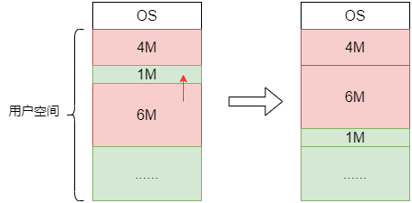
  >
  > 由于交换技术，可能导致内存中会出现某些小区域（空闲）是无法加载任何进程的。称之为**零头（fragment）**。
  >
  > 为了使得内存得以有效利用，采用一种称为压缩/紧凑的技术，动态调整进程在内存中的位置，以减少零头。如此便会导致一个进程占据不同的分区的情况出现。

下面介绍两种重定位的方式：静态重定位（Static Relocation）以及动态重定位（Dynamic Relocation）

1.  静态重定位

    在逻辑地址转换为物理地址的过程中，地址变换是在进程装入内存时一次完成的，以后不再改变。

    - 优点：无需增加硬件地址转换机构，便于实现程序的静态连接。（在早期计算机系统中大多采用这种方案。）
    - 缺点：内存空间不能移动；各个用户进程很难共享内存中同一程序的副本。

2.  动态重定位

    动态运行的装入程序把转入模块装入内存之后，并不立即把装入模块的逻辑地址进行转换，而是把这种地址转换推迟到程序执行时才进行，装入内存后的所有地址都仍是逻辑地址。这种方式需要寄存器的支持，其中放有当前正在执行的程序在内存空间中的起始地址。

    - 优点：内存空间可以移动；各个用户进程可以共享内存中同一程序的副本。
    - 缺点：增加了机器成本，而且实现存储管理的软件算法比较复杂。

下面介绍在进程执行过程中所用到的寄存器：

- 基址寄存器（Base register）：存储进程的起始地址。

- 界限寄存器（Bounds register）：存储进程的结束位置。

  > 这些值是在进程被加载或者被换入时设置的。

> 重定位的硬件支持（如下图）
>
> 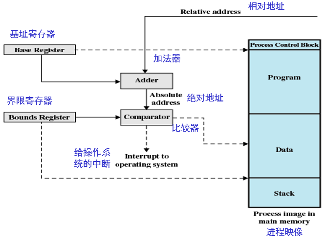
>
> - 基址寄存器的值被添加到相对地址中，以产生一个绝对地址
> - 得到的绝对地址与界限寄存器中的值进行比较
>   - 如果这个地址在界限范围内，则继续该指令的执行
>   - 如果地址不在范围内，就会产生一个中断给操作系统

### 保护

- 进程不应该在未经允许的情况下引用另一进程中的内存位置（进行读操作或写操作）

- 在编译时不可能检查绝对地址来确保保护

- 必须在运行时检查进程产生的所有内存访问，以确保它们只访问分配给该进程的内存空间

- 内存保护需求必须由处理器（硬件）而非操作系统（软件）来满足

  > 操作系统不能预测程序可能产生的所有内存访问。即使可以预测，提前审查每个进程中可能存在的内存违法访问也非常费时。

### 共享

- 允许多个进程访问内存的同一部分。

- 当多个进程正在执行同一个程序时，允许每个进程访问该程序的同一个副本，要比让每个进程有自己单独的副本更有优势。

  > 内存管理系统在不损害基本保护的前提下，必须允许对内存共享区域进行受控访问。

### 逻辑组织

计算机系统中的内存总是被组织成线性（或一维）的地址空间，且地址空间由一系列字节或字组成。外部存储器（简称外存）在物理层上也是按类似的方式组织的。这种组织方式类似实际的机器硬件，但它并不符合程序构造的典型方法。

程序是以模块形式编写的，如果操作系统和计算机硬件能够有效处理这种模块化的用户程序与数据，则会带来很多好处：

- 可以独立地编写和编译模块，系统在运行时解析从一个模块到其他模块的所有引用。

- 通过适度的额外开销，可以为不同的模块提供不同的保护级别（只读、只执行）。

- 可以引入某种机制，使得模块可以被多个进程共享。

  > 模块级提供共享的优点是：它符合用户看待问题的方式，因此用户可很容易地指定需要的共享。

### 物理组织

在之前提及过计算机存储器至少要组织成两级，即内存和外存。

- 内存：提供快速访问，具有易失性，容量小。
- 外存：访问较慢，提供永久性存储，容量大。

在这种两级方案中，系统主要关注的是内存和外存之间信息流的组织。如果让程序员来负责组织这一信息流，考虑以下原因就会发现这是不切实际的：

- 供程序和数据使用的内存可能不足。这时程序员可以采用覆盖（overlaying）技术来组织程序和数据。

  > 覆盖：允许不同的模块被分配到内存中的同一块区域。
  >
  > 覆盖的目的：使大程序可以运行在小内存之上。
  >
  > 覆盖的实例（如下图）：
  >
  > 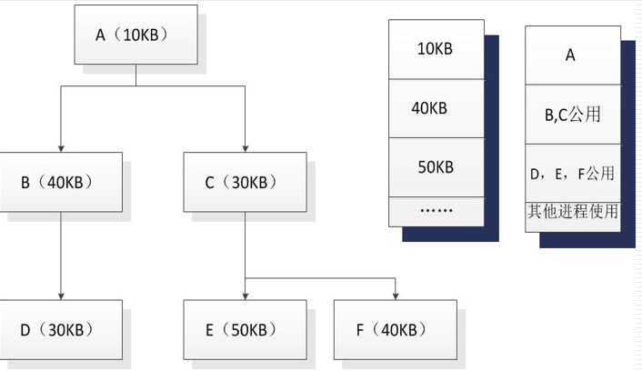
  >
  > - 假设一个程序全部大小为：
  >
  >   A(10KB) + B(40KB) + C(30KB) + D(30KB) + E(50KB) + F(40KB) = 200KB
  >
  > - 而现在可用内存的容量仅有：150KB
  >
  > - 显然直接将程序全部加载进内存是不可行的。
  >
  > - 考虑到该程序有三个层次的进程（不同层次的进程是无法同时执行的），于是我们可以按照每个层次中的最大模块去分配内存。
  >
  > - 即只需分配：A(10KB) + B(40KB) + E(50KB) = 100KB 的内存就可以保证程序的正常运行。
  >
  > （即使有编译工具的帮助，覆盖技术的实现仍然非常浪费程序员的时间）

- 在多道程序设计环境中，程序员在编写代码时并不知道可用空间的大小及位置。

## 内存分区

下表展示了后面（包括下一章：虚拟内存）要介绍的内存管理技术：

| 技术 | 说明 | 优势 | 弱点 |
|----|----|----|----|
| 固定分区 | 在系统生成阶段，内存被划分成许多静态分区。进程可装入大于等于自身大小的分区中 | 实现简单，只需要极少的操作系统开销 | 由于有内部碎片，对内存的使用不充分：活动进程的最大数量是固定的 |
| 动态分区 | 分区是动态创建的，因而每个进程可装入与自身大小正好相等的分区中 | 没有内部碎片；可以更充分地使用内存 | 由于需要压缩外部碎片，处理器利用率低 |
| 简单分页 | 内存被划分成许多大小相等的页框；每个进程被划分成许多大小与页框相等的页；要装入一个进程，需要把进程包含的所有页都装入内存内不一定连续的某些页框中 | 没有外部碎片 | 有少量的内部碎片 |
| 简单分段 | 每个进程被划分成许多段；要装入一个进程，需要把进程包含的所有段都装入内存内不一定连续的某些动态分区中 | 没有内部碎片；相对于动态分区，提高了内存利用率，减少了开销 | 存在外部碎片 |
| 虚存分页 | 除了不需要装入一个进程的所有页外，与简单分页一样；非驻留页在以后需要时自动调入内存 | 没有外部碎片；支持更多道数的多道程序设计；巨大的虚拟地址空间 | 复杂的内存管理开销 |
| 虚存分段 | 除了不需要装入一个进程的所有段外，与简单分段一样；非驻留段在以后需要时自动调入内存 | 没有内部碎片；支持更多道数的多道程序设计；巨大的虚拟地址空间；支持保护和共享 | 复杂的内存管理开销 |

> 在几乎所有的现代多道程序设计系统中，内存管理涉及一种称为虚存（虚拟内存）的复杂方案。虚存基于分段和分页这两种基本技术，或基于这两种技术中的一种。
>
> 在考虑虚存技术之前，先考虑一些不涉及虚存的简单技术。

在介绍分区之前还要明白一件事情，大多数内存管理方案都假定操作系统占据内存中的某些固定部分，而内存中的其余部分则供多个用户进程使用。我们考虑的仅仅是对用户内存空间的管理。

### 固定分区

*（⚠️ 原图已失效）*

如图，有两种固定分区的方案：

- 大小相等的分区（Equal-size partitions）

  - 任何小于等于分区大小的任何进程都可装入任何可用的分区中

  - 若所有的分区都已满，且没有进程处于就绪态或运行态，则操作系统可以换出一个进程的所有分区，并装入另一个进程。

  - 使用此方案有两个难点：

    - 程序可能太大而不能放到一个分区中。此时必须使用覆盖技术。

    - 内存的利用率非常低。任何程序，即使很小，都需要占据一个完整的分区。

      > **内部碎片/内部零头（internal fragmentation）**：
      >
      > 假设存在一个长度小于2MB的程序，当它被换入时，仍占据一个8MB的分区。由于装入的数据块小于分区大小，因而导致分区内部存在空间浪费，这种现象就是内部碎片。

- 大小不等的分区（Unequal-size partitions）

  - 可以使用大分区去存放较大的进程，从而省略覆盖技术；

  - 可以使用小分区去存放较小的进程，以减小内部碎片。

    > 此方案可以缓解大小相等分区中的两个难点，但是无法彻底解决。

放置算法（Placement Algorithm）：

- 大小相等的分区

  因为所有的分区都是同等大小，所以使用哪个分区并不重要。如果所有的分区都被处于不可运行状态的进程占据，那么这些进程中的一个必须被换出，以便为新进程让出空间。

- 大小不等的分区

  对于大小不等的分区策略，有两种把进程分配到内存分区的方法（如下图）：

  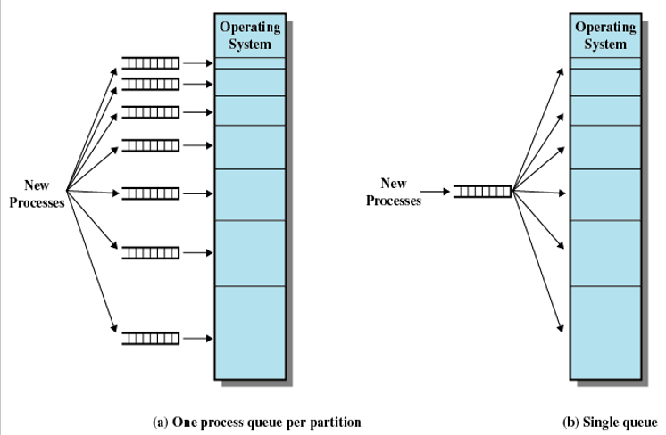

  - 最简单的方法是把每个进程分配到能够容纳它的最小分区中。

    在这种情况下，每个分区都需要维护一个调度队列，用于保存从这个分区换出的进程。如果所有的进程都按照这种方式分配，则可使每个分区内部浪费的空间（内部碎片）最少。

    > 这里假定知道一个进程最多需要的内存大小。但这种假定很难得到保证。如果不知道一个进程将会变得多大，那么唯一可行的替代方案只能是使用覆盖技术或虚存技术。

  - 第二种方式是所有进程只提供一个队列，当需要把一个进程装入内存时，选择可以容纳该进程的最小可用分区。如果所有的分区都已被占据，则必须进行交换。一般优先考虑换出能容纳新进程的最小分区中的进程，或考虑一些诸如优先级之类的其他因素。也可以优先选择换出被阻塞的进程而非就绪进程。

    > 只提供一个队列的好处，被换出的进程可以依照某些规则分配到不同的分区去，而不仅仅是只分配在一个固定的分区。

固定分区的缺点：

- 限制并发度：分区的数量在系统生成阶段已经确定，因而限制了系统中活动（未挂起）进程的数量。
- 产生内部零头：由于分区的大小是在系统生成阶段事先设置的，因而小作业不能有效地利用分区空间。设计者无法设计出一个完美的调度方案。

### 动态分区

为了克服固定分区的缺点，提出了动态分区（如下图）：

- 对于动态分区，分区长度和数量是可变的。
- 进程装入内存时，系统会给它分配一块与其所需容量完全相等的内存空间。

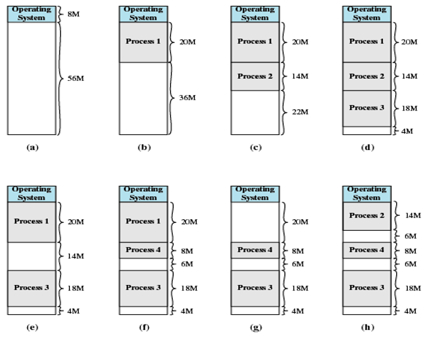

> 说明：
>
> 该实例使用64MB的内存。最初，内存中只有操作系统（a）。从操作系统结束处开始，装入的前三个进程分别占据各自所需的空间大小（b、c、d），这样在内存末尾只剩下一个“空洞”，而这个“空洞”对第4个进程来说就太小。在某个时刻，内存中没有一个就绪进程。操作系统换出进程2（e），这为装入一个新进程（即进程4）腾出了足够的空间（f）。由于进程4比进程2小，因此形成了另一个小“空洞”。然后，在另一个时刻，内存中没有一个进程是就绪的，但处于就绪挂起状态的进程2可用。由于内存中没有足够的空间容纳进程2，操作系统换出进程1（g），然后换入进程2（h）。
>
> **外部碎片/外部零头（external fragmentation）**：
>
> 由上述分析可知，这种方案最终会在内存中形成许多小空洞，这就是外部碎片。
>
> 指所有分区外的存储空间变成了越来越多的碎片。（与前面提到的内部碎片相对应）
>
> 克服外部碎片的方法就是压缩（compaction）：操作系统不时地移动进程，使得进程占用的空间连续，并使所有空闲空间连成一片。

放置算法（Placement Algorithm）：

此处介绍四种算法：最佳适配（Best-fit）、首次适配（First-fit）、邻近适配（Next-fit）、最差适配（Worst-fit）。

#### 最佳适配

- 选择与需求大小最接近的块
- 需要遍历整个内存空间
- 由于需要为进程找到最小的块，所以会留下最小的碎片
- 必须更频繁地进行内存压缩
- 整体性能最差

#### 首次适配

- 从头开始扫描内存，选择第大小足够的第一个可用块
- 可能有许多进程加载在内存的前端，所以当试图找到一个空闲块时，必须进行搜索
- 新能是最好的

#### 邻近适配

- 从上一次放置的位置开始扫描内存，选择下一个大小足够的可用块
- 使最大的内存块被分解成更小的内存块
- 需要进行压缩，以便在内存的末尾获得一个大的区块
- 性能介于最佳适配和首次适配之间

#### 最差适配

- 从头遍历整个内存空间，选择最大的块
- “均贫富”思想，把内存划分为基本上差不多大小的内存分区

> 实例：考虑分配一个大小为16M的新块
>
> 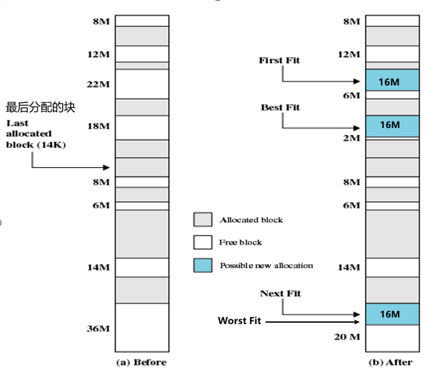

动态分区的缺点：

- 维护特别复杂
- 会引入进行压缩的额外开销

### 伙伴系统

> 先说个额外话题：计算机理论上支持多大的内存？
>
> - 如果是32位操作系统，则理论上最大支持的内存为：232（相当于4GB）
>
>   即便计算机安装了8GB的内存条，它也只能识别4GB。
>
> - 如果是64位操作系统，则理论上最大支持的内存为：264（相当于128GB）
>
> - 计算机理论支持最大内存 = 2操作系统位数

伙伴系统中可用内存块的大小为2K个字，L ≤ K ≤ U，其中2L表示分配的最小块的尺寸，2U表示分配的最大块的尺寸；通常2U是可供分配的整个内存的大小。

内存分配过程如下：

- 最初，可用于分配的整个空间被视为一个大小为2U的块
- 若请求的大小s满足：2U-1 ＜ s ≤ 2U，则分配整个内存空间
  - 否则，该块分成两个大小相等的伙伴，大小均为2U-1
  - 若有2U-2 ＜ s ≤ 2U-1，则给该请求分配两个伙伴中的任何一个
    - 否则，其中的一个伙伴又被分成两半。持续这一过程，直到产生大于或等于s的最小块为止。

内存的回收：

如果一个块的进程被释放，则判断该内存块相邻的伙伴（大小相同），如果伙伴块为空，则两个块合并为一个大块，如果合成的大块相邻的伙伴仍然为空，则继续合成，直到重新合成为最初的内存块。

> 伙伴系统实例：
>
> 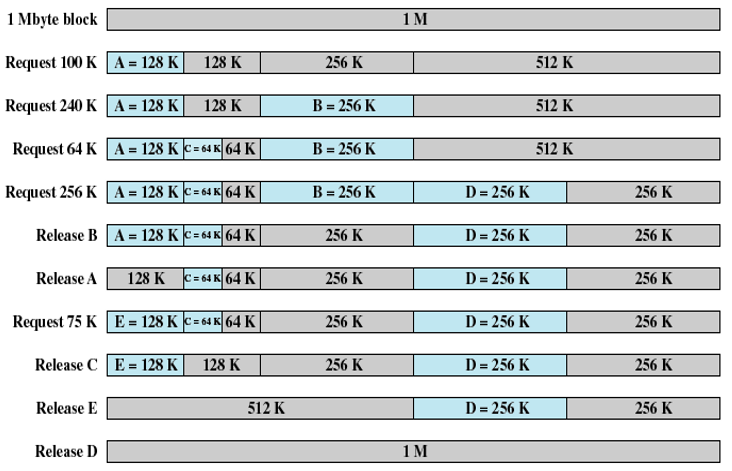
>
> 上图给出了一个初始大小为1MB的块的例子。第一个请求A为100KB，需要一个128KB的块。最初的块被划分成两个512KB大小的伙伴，第一个伙伴又被划分成两个256KB大小的伙伴，其中的第一个又划分成两个128KB大小的伙伴，这两个128KB的伙伴中的一个分配给A。下一个请求B需要256KB的块，因为已有这样的一个块，随即分配给它。在需要时，继续进行这样的分裂和合并过程。注意当E被释放时，两个128KB的伙伴合并为一个256KB的块，这个256KB的块又立即与其伙伴合并成一个512KB的块。

伙伴系统克服了固定分区和可变分区方案的缺陷。（既可以灵活地动态分配内存，又没有零头的产生）

## 分页

为了减少零头，引入了分页技术。

> 使用分页技术时，每个进程在内存中浪费的空间，仅是进程最后一页的一小部分形成的内部碎片。没有任何外部碎片。

将内存划分为固定大小的小块（块远远小于分区），将每个进程也划分为相同大小的块：

- 进程中的块被称为页（page）

- 内存中的块被称为帧/页帧/页框（frame）

- 操作系统会为每一个进程维护一个页表（page table）

  - 页表给出了该进程的每页所对应页框的位置

  - 在程序中，每个逻辑地址包括一个页号（page number）和在该页中的偏移量（offset）

  - 由处理器将逻辑地址转化为物理地址，物理地址包括页框号和偏移量

    > 注意区分

> 分页实例：
>
> 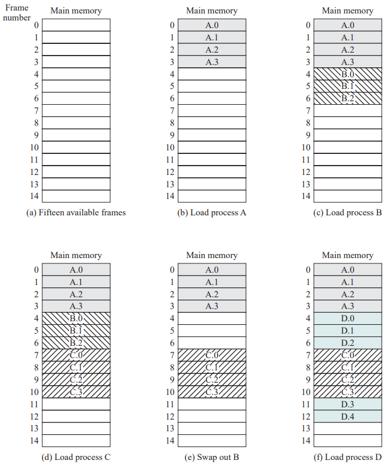
>
> 在某个给定时刻，内存中的某些页框正被使用，某些页框是空闲的，操作系统维护空闲页框的列表。
>
> - 存储在磁盘上的进程A由4页组成。装入这个进程时，操作系统查找4个空闲页框，并将进程A的4页装入这4个页框中，如图（b）所示。
>
> - 进程B包含3页，进程C包含4页，它们依次被装入。
>
> - 然后进程B被挂起，并被换出内存。
>
> - 此后，内存中的所有进程被阻塞，操作系统需要换入一个新进程，即进程D，它由5页组成。进程D的5页被装入页框4、5、6、11和12。
>
>   > 进程在分页中可以不加载到内存连续的区域中，分区要求必须连续。
>
> 下图给出了各个进程的页表：
>
> 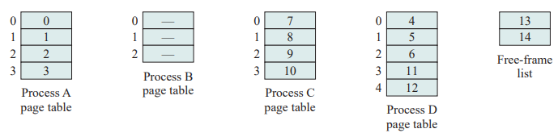
>
> 值得注意的是：操作系统为当前内存中未被占用、可供使用的所有页框维护一个空闲页框列表。

为了使分页方案更加方便，规定页和页框的大小必须是2的幂，以便容易地表示出相对地址。

> 实例：
>
> 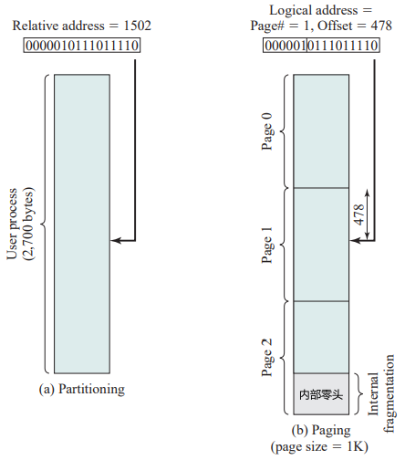
>
> - 上图中使用16位地址，规定页大小为1KB（即1024字节），以相对地址为1502的例子进行分析
> - 相对地址 = 1502(10) = 0000010111011110(2)
> - 页大小 = 1KB = 210 → 偏移量 = 10位 → 页号 = 6位
> - 所以该程序最多由 26 = 64页 组成（每页为1KB）
> - 相对地址1502对应于页1（000001）中的偏移量478（0111011110）
>
> **考虑一个n+m位的地址 → 最左边的n位是页号，最右边的m位是偏移量**
>
> 相对地址 → 逻辑地址 → 物理地址：
>
> - 提取页号，即逻辑地址最左侧的n位
> - 以这个页号为索引，查找进程页表中相应的页框号k
> - 页框的起始物理地址为：k × 2m → 被访问字节的物理地址是这个数加上偏移量
>
> 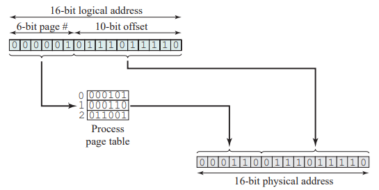
>
> 仍然以逻辑地址1502为例：
>
> - 由上述分析已知：页号为1，偏移量为478
> - 假设该页驻留在内存页框6中（6(10) = 000110(2)）
> - 则物理地址为：页框号\|偏移量 → 即：000110\|0111011110(2) = 6622(10)

## 分段

为了满足用户的逻辑组织需求，引入了分段。

分段同样是将用户程序细分，与分页不同的是，尽管段有最大长度限制，但并不要求所有程序的所有段的长度都相等。

采用分段技术时的逻辑地址也由两部分组成：段号（segment number） + 偏移量（offset）

由于使用大小不等的段，分段类似于动态分区

> 分段实例：
>
> 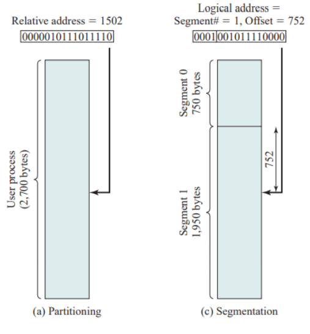
>
> 采用大小不等的段的另一个结果是，逻辑地址和物理地址间不再是简单的对应关系。
>
> - 类似于分页，在简单的分段方案中，每个进程都有一个段表
>   - 系统也会维护一个内存中的空闲块列表
> - 每个段表项必须给出相应段在内存中的起始地址，还必须指明段的长度，以确保不会使用无效地址
> - 当进程进入运行状态时，系统会把其段表的地址装载到一个寄存器中，由内存管理硬件来使用这个寄存器
>
> **考虑一个n+m位的地址 → 最左侧的n位是段号，最侧的m位是偏移量。**
>
> - 在上图的例子中，n=4、m=12
> - 所以最大段长度为：212 = 4096
>
> 相对地址 → 逻辑地址 → 物理地址：
>
> - 提取段号，即逻辑地址最左侧的n位
> - 以这个段号为索引，查找进程段表中该段的起始物理地址
> - 最右侧m位表示偏移量，偏移量和段长度进行比较，若偏移量大于段长度，则该地址无效
> - 物理地址为该段的起始物理地址与偏移量之和
>
> 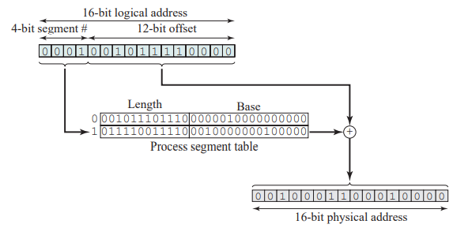
>
> 以逻辑地址4848为例：
>
> - 逻辑地址为：4848(10) = 0001001011110000(2)
> - 段号为：1 = 0001(2)，偏移量为：752 = 001011110000(2)
> - 假设该段驻留在内存中，起始物理地址为0010000000100000
> - 则相应的物理地址为：0010000000100000（起始物理地址）+ 001011110000（偏移量）= 0010001100010000
> - 即物理地址为：8224（起始物理地址）+ 752（偏移量）= 8976

> 分段消除了内部碎片，但是和动态分区一样，它会产生外部碎片。不过由于进程被分成多个小块，因此外部碎片也会很小。

------------------------------------------------------------------------

# 后记

本篇已完结

（如有修改或补充欢迎评论）
