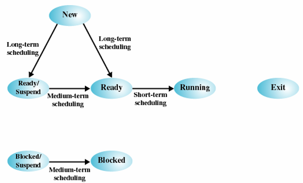
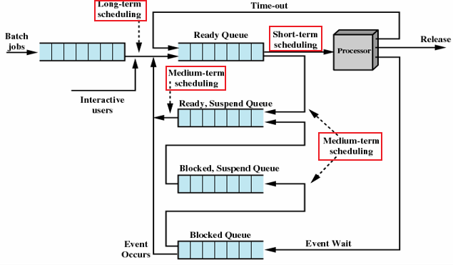
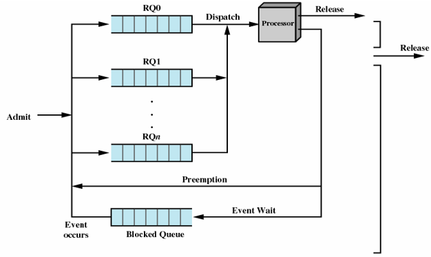
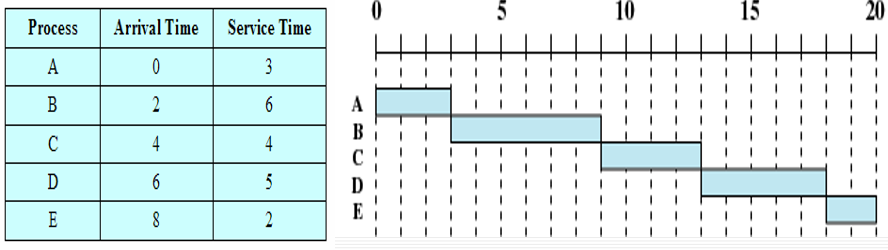
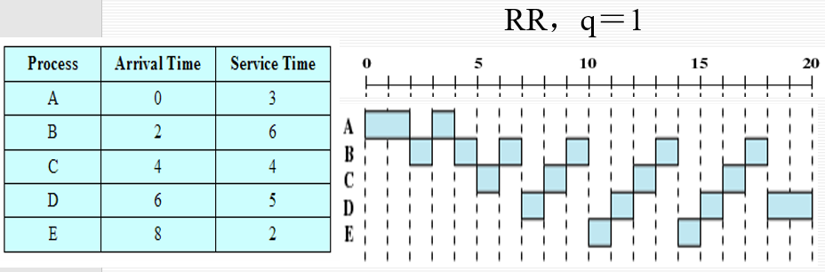
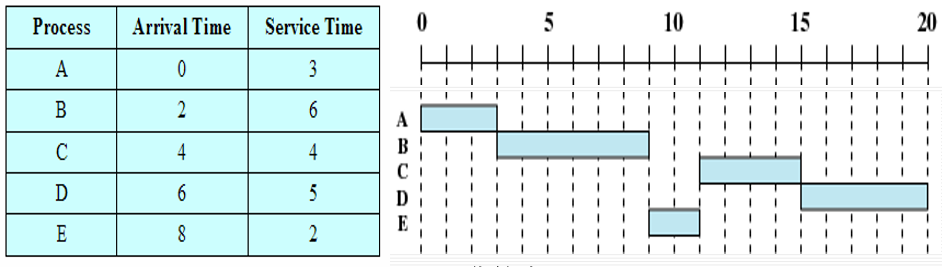
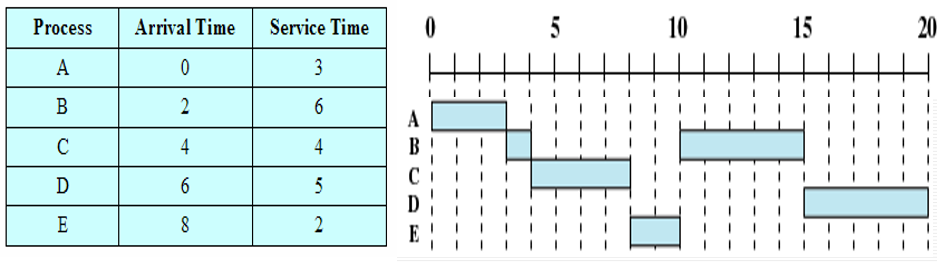
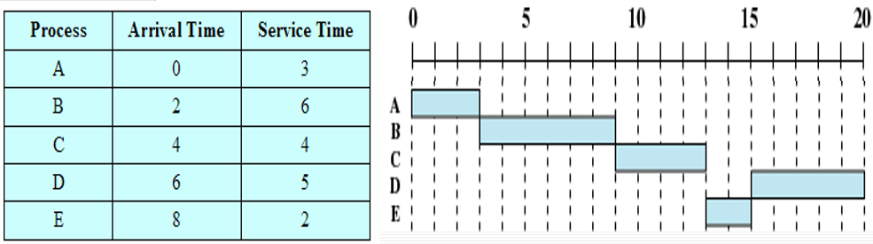
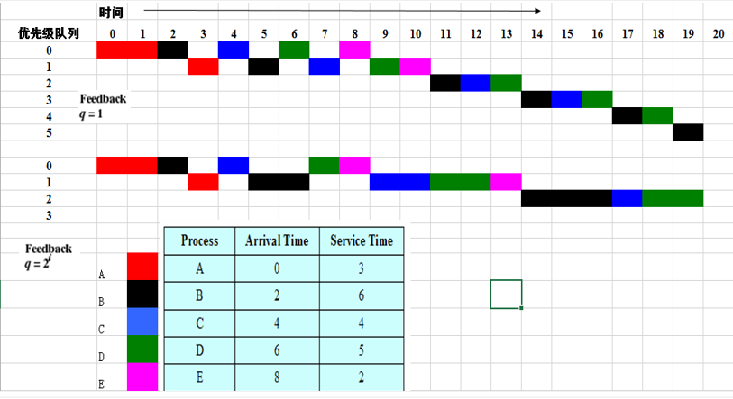
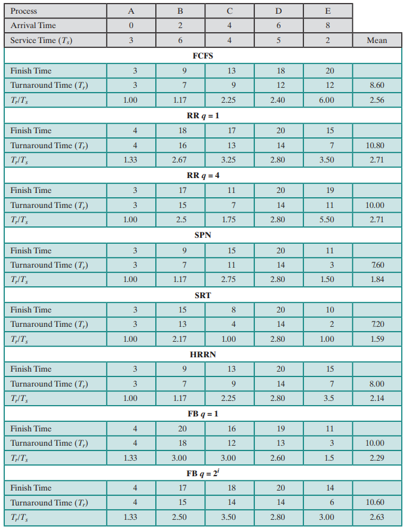

# 操作系统学习笔记-单处理器调度

> 📌 转载自 **花猪のBlog（作者 CNhuazhu）** —— 原文：https://cnhuazhu.top/butterfly/2021/05/30/%E6%93%8D%E4%BD%9C%E7%B3%BB%E7%BB%9F/%E6%93%8D%E4%BD%9C%E7%B3%BB%E7%BB%9F%E5%AD%A6%E4%B9%A0%E7%AC%94%E8%AE%B0-%E5%8D%95%E5%A4%84%E7%90%86%E5%99%A8%E8%B0%83%E5%BA%A6/
> 学习笔记，版权归原作者所有，仅供学弟学妹学习参考；如有侵权请联系删除。

---

# 前言

*正在学习操作系统，记录笔记。*

> 参考资料：
>
> 《操作系统（精髓与设计原理 第8版） 》

------------------------------------------------------------------------

# 第九章：单处理器调度

多道程序设计的关键就是调度。典型的调度有4种（见下表）

| 调度的类型 | 解释 |
|----|----|
| 长程调度（Long-term scheduling） | 决定加入待执行进程池 |
| 中程调度（Medium-term scheduling） | 决定加入部分或全部位于内存中的进程集合 |
| 短程调度（Short-term scheduling） | 决定处理器执行哪个可运行进程 |
| I/O调度（I/O scheduling） | 决定可用I/O设备处理哪个进程挂起的I/O请求 |

> 本章先介绍前三种，I/O调度将在后续章节中介绍。

## 处理器调度的类型

首先要明白调度的目的：根本目的就是提升CPU效率。

有以下三个指标：

- 响应时间（Response time ）
- 吞吐率（Throughput）
- 处理器效率（Processor efficiency ）

结合进程状态图具体展示出不同调度类型的功能：



> 说明：
>
> - 长程调度：在进程创建的时候执行，它决定是否把进程添加到当前活跃的进程集中。
>   - 新建态 → 就绪/挂起态
>   - 新建态 → 就绪态
> - 中程调度：是交换功能的一部分，它决定是否把进程添加到那些至少部分已在内存且可被执行的进程集中。
>   - 就绪/挂起态 → 就绪态
>   - 阻塞/挂起态 → 阻塞态
> - 短程调度：真正决定下次执行哪个就绪进程。
>   - 就绪态 → 运行态
> - （具体长、中、短的含义指的是：进程完成调度的时间）
>
> ------------------------------------------------------------------------
>
> 下图重新组织了进程状态转换图：
>
> *（⚠️ 原图已失效）*
>
> > 值得注意的是：
> >
> > - 长程调度一定嵌套短程调度，但不一定嵌套中程调度。
> > - 中程调度一定嵌套短程调度。
>
> ------------------------------------------------------------------------
>
> 下图给出了进程转换过程中所涉及的队列：
>
> 
>
> > 调度的本质：就是对各种队列的管理，以提高系统的利用率。

### 长程调度

长程调度程序决定了哪个程序可以进入系统中进行处理，因此它**控制了系统的并发度**。

> 长程调度主要出现在批处理系统中，又叫做：作业调度。

长程调度程序运行时，从队列中创建相应的进程，这时会涉及两个决策：

- 决定操作系统何时才能接纳一个或多个进程
  - 创建的进程越多，每个进程占用处理器的时间就越少（因此长程调度程序会限制并发度）
  - 当一个作业终止时，调度程序会决定增加一个或多个新作业
  - 若处理器的空闲时间片超过了某个阈值，可能会启动长程调度程序
- 决定接受哪些作业，将其转化为进程
  - 可以基于先来先服务（First-come-first-service，FCFS）的原则
  - 可以基于系统性能管理工具，所用的原则包括：优先级（include priorty）、期望执行时间（expected execution time）、I/O请求（I/O requirements）
  - 对于分时系统中交互的程序，操作系统接受所有的授权用户，直到系统饱和

### 中程调度

中程调度是交换功能的一部分。（在之前的章节中分析过）

在典型情况下，换入（swapping-in）决定取决于管理系统并发度的需求。

### 短程调度

短程调度程序也被称为**分派器（dispatcher）**。

> 执行的频繁程度：
>
> - 长程调度程序执行的频率相对较低
> - 中程调度程序执行得较为频繁
> - 短程调度程序执行得最为频繁

导致当前进程阻塞或抢占当前运行进程的事件发生时，调用短程调度程序。这类事件包括：

- 时钟中断（Clock interrupts）
- I/O中断（I/O interrupts）
- 操作系统调用（Operating system calls）
- 信号（Signals）（如信号量）

## 调度算法

### 短程调度准则

短程调度的主要目标是：按照优化系统一个或多个方面行为的方式，来分配处理器时间。

短程调度准则（Short-Tem Scheduling Criteria）从两个维度来划分：

1.  面向用户的规则（User-oriented）

    - 交互式系统中的响应时间

      响应时间：指从提交一条请求到输出响应所经历的时间间隔。（对用户可见）

2.  面向系统的规则（System-oriented）

    - 处理器使用的效果和效率

    - 吞吐量：即进程完成的速度

      吞吐量是系统性能的一个重要测度，我们总是希望系统的吞吐量能达到最大。

从另一个维度去判别短程调度算法的优劣就是性能相关（Performance-related）：

- 与性能相关的规则是定量的，例如：响应时间、吞吐率。
- 与性能无关的规则本质上要么是定性的，要么不易测量和分析，例如：可预测性。

下面四张表总结了几种重要的调度规则：

- 面向用户，与性能相关

  | 调度规则 | 解释 |
  |----|----|
  | 周转时间（Turnaround time） | 指一个进程从提交到完成之间的时间间隔，包括实际执行时间和等待资源（包括处理器资源）的时间。对批处理作业而言，这是一种很合适的测度 |
  | 响应时间（Response time） | 对一个交互进程来说，这指从提交一个请求到开始接收响应之间的时间间隔。通常情况下，进程在处理该请求的同时，会开始给用户产生一些输出。因此从用户的角度来看，相对于周转时间，这是一种更好的测度。该调度原则会试图实现较低的响应时间，并在可接受的响应时间范围内，使可交互的用户数量最大 |
  | 最后期限（Deadlines） | 在能指定进程完成的最后期限时，调度原则将降低其他目标，使得满足最后期限的作业数量的百分比最大 |

- 面向用户，其他

  | 调度规则 | 解释 |
  |----|----|
  | 可预测性（Predictability） | 无论系统的负载如何，一个给定作业运行的总时间量和总代价是相同的。用户不希望响应时间或周转时间的变化太大。这可能需要在系统作业负载大范围抖动时发出信号，或需要系统处理不稳定性 |

- 面向系统，与性能相关

  | 调度规则 | 解释 |
  |----|----|
  | 吞吐量（Throughput） | 调度策略应使得单位时间内完成的进程数量最大。这是对能执行多少作业的一种度量。它明显取决于一个进程的平均执行长度，也受调度策略的影响，因为调度策略会影响利用率 |
  | 处理器利用率（Processor utilization） | 这是处理器处于忙状态的时间百分比。对昂贵的共享系统来说，这个规则很重要。在单用户系统和其他一些系统如实时系统中，该规则与其他规则相比不太重要 |

- 面向系统。其他

  | 调度规则 | 解释 |
  |----|----|
  | 公平性（Fairness） | 没有来自用户或其他系统的指导时，进程应被平等地对待，没有进程处于饥饿状态 |
  | 强制优先级（Enforcing priorities） | 指定进程的优先级后，调度策略应优先选择高优先级的进程 |
  | 平衡资源（Balancing resources） | 调度策略使系统中的所有资源处于忙状态，优先调度较少使用紧缺资源的进程。该规则也适用于中程调度和长程调度 |

设计调度策略时，要在互相竞争的各种要求之间进行折中。

> 提供较好的响应时间可能需要调度算法在进程间频繁切换，而这会增加系统开销，降低吞吐量。

### 优先级的使用

在许多系统中，每个进程都被指定一个优先级，调度程序总是优先选择具有较高优先级的进程。（优先级从最高0开始）

下图展示了优先级排队的队列图（简化）：



- 每个优先级有一个队列：RQ0 \> RQ1 \> … \> RQn

  进行调度选择时总是从优先级最高的队列中检查，如果有进程，则对该进程进行调度。只有当较高优先级的队列都为空时，采取调度优先级较低的队列中的进程。

- 这种纯优先级调度的方案可能会引起较低优先级进程饥饿。

  > 如果不希望出现饥饿的状态，只能让一个进程的优先级随时间或执行历史而变化。

### 选择调度策略

决策模式（Decision Mode ）

- 非抢占（Nonpreemptive）：一旦进程处于运行状态，就会不断执行直到终止。进程要么因为等待I/O，要么因为请求某些操作系统服务而被阻塞。

- 抢占（Preemptive）：当前正运行进程可能被操作系统中断，并转换为就绪态。

  > 一个新进程到达时，或中断发生后把一个阻塞态进程置为就绪态时，或出现周期性的时间中断时，需要进行抢占决策。

> - 非抢占模式会导致处理器效率降低
> - 抢占模式可能违反公平

下面我们来分析六种进程调度算法，以下表中五个进程为例：

| 进程(Process） | 到达时间（Arrival Time） | 服务时间（Service Time） |
|----------------|--------------------------|--------------------------|
| A              | 0                        | 3                        |
| B              | 2                        | 6                        |
| C              | 4                        | 4                        |
| D              | 6                        | 5                        |
| E              | 8                        | 2                        |

> 注：这里的到达时间和服务时间都是以时间片的形式展示
>
> - 达到时间：进程进入队列的到达时刻
> - 服务时间：进程需要多少时间片可以结束

以下具体描述进程的调度用\*\*甘特图（Gantt chart）\*\*的形式：

- 非抢占：在甘特图中是连续的
- 抢占：在甘特图中是非连续的

> 注意，以下关于“当前队列”的描述：自左`（队首，进队）`向右`（队尾，出队）`

#### 先来先服务（FCFS）



> 说明：先来先服务（First-Come-First-Served，FCFS）
>
> - 0时刻，A进程进入队列，并开始执行，连续执行3个时间片
> - 2时刻（此时A进程在执行），B进程进入队列，并等待执行
> - 3时刻，A进程执行完毕，B进程开始执行，连续执行6个时间片
> - 以此类推

- 这是一种非抢占的算法

- 在当前进程执行完毕的时刻，调度器会选择队列中等待时间最长的进程，分配处理器资源

- 分析该种算法存在问题：对于短进程（服务时间短）和I/O密集型的进程不利。

  > 以银行取钱为例：
  >
  > 假设我要到银行取钱（办理取钱业务仅需5分钟），但是排在我前面的二十位客户都要开户（办理开户业务需要30分钟），那么我原本仅需5分钟的业务需要等待10h 5min。

  > 相比于I/O密集型更有利于处理器密集型的进程：I/O进程必须等待CPU限制进程完成。
  >
  > FCFS可能导致处理器和I/O设备都未得到充分利用。

#### 轮转（RR）



假设轮转的时钟周期 q = 1

> 说明：轮转（Round-Robin，RR）
>
> - 0时刻，A进程进入队列，并开始执行，执行两个时间片
> - 2-时刻，B进程进入队列，A进程在2时刻也重新进入队列（此时队列：A、B）
> - 2+时刻，B进程开始执行
> - 以此类推

- 轮转是一种基于时钟的抢占算法

- 提出的目的在于解决FCFS短进程长时等待的问题，保证每个进程都占用处理器一段时间

- 周期性产生时钟中断，当中断发生时，当前运行的进程就被放置就绪队列中，进而调度下一个进程

- 关于时间片（as time slicing ）的大小设置：

  - 时间片过小：会产生无效的调度，即进程还没来得及执行就被调出了（高频次的进程调度也会带来巨大的开销）

  - 时间片过大：退化回FCFS算法

    > RR算法从根本上讲并没有解决I/O密集型等待CPU密集型进程的问题

  - 通常时间片的长度设置为：一次交互（产生输出）的时间

基于轮转法又提出了一种改进：虚拟轮转法（Virtual Round-Robin Scheduler，VRR）

引入一个辅助队列，解决了I/O进程长时等待的问题。

- 一个进程因I/O而阻塞时，会加入一个I/O队列
- 解除了I/O阻塞的进程都会转移到一个FCFS辅助队列中。进行调度决策时，辅助队列中的进程优先于就绪队列中的进程。

#### 最短进程优先（SPN）



> 说明：最短进程优先（Shortest Process Next ，SPN）
>
> - 0时刻，A进程进入队列，并开始执行，连续执行3个时间片
> - 2时刻（此时A进程在执行），B进程进入队列，并等待执行
> - 3时刻，A进程执行完毕，判断队列中只有B进程，B进程开始执行，并连续执行6个时间片
> - 4时刻（此时B进程正在执行），C进程进入队列，并等待执行（此时队列：C）
> - 6时刻（此时B进程正在执行），D进程进入队列，并等待执行（此时队列：D、C）
> - 8时刻（此时B进程正在执行），E进程进入队列，并等待执行（此时队列：E、D、C）
> - 9时刻，B进程执行完毕，判断队列中服务时间最小的进程为E，所以执行E进程（此时队列：D、C）
> - 以此类推

- 这是一种非抢占的算法

- 原则：短进程优先（这也是该算法的初衷：为了解决FCFS短进程长时等待的问题）

- 潜在的问题：

  - 需要估计每个进程的服务时间（预测）。若估计值远低于实际运行时间，系统可能终止该作业。

    > 预估时间的算法：**指数平均法（Exponential averaging）**。一种基于过去时间值的时间序列预测将来值得算法。
    >
    > ``` math
    > S_{n+1} = αT_n + （1-α）S_n
    > ```
    >
    > α是一个常数加权因子（0 \> α \> 1），用于确定距现在较近或较远的观测数据的相对权值。

  - 还可能导致长进程饥饿

#### 最短剩余时间（SRT）



> 说明：最短剩余时间（Shortest Remaining Time ，SRT）
>
> 注意：当前队列中进程后面的数字表示剩余时间（还有多少时间片执行完毕）
>
> - 0时刻，A进程进入队列，并开始执行，连续执行2个时间片
> - 2-时刻，B进程进入队列，2时刻A进程重新进入队列（此时队列：A(1)、B(6)）
> - 2+时刻，执行A进程
> - 3时刻，A进程执行完毕，此时队列中只有B进程，因此B进程执行
> - 4-时刻，C进程进入队列，4时刻B进程重新进入队列（此时队列：B(5)、C(4)）
> - 4+时刻，执行C进程，连续执行两个时间片
> - 6-时刻，D进程进入队列，6时刻C进程重新进入队列（此时队列：C(2)、D(5)、B(5)）
> - 6+时刻，执行C进程
> - 以此类推

- SRT算法是最短进程优先（SPN）的抢占版本
- 潜在的问题：
  - 同样需要估计每个进程的服务时间（预测），还需要记录过去的服务时间（增加开销）
  - 仍然可能导致长进程饥饿

#### 最高响应比优先（HRRN）



> 说明：最高响应比优先（Highest Response Ratio Next，HRRN）
>
> 注意：当前队列中进程后面的数字表示响应比
>
> ``` math
> R(响应比) = \frac{w+s}{s}
> ```
>
> - w（time spent waiting）：等待处理器的时间。
>   - w = 当前时间 - 到达时间(Arrival Time)
> - s（expected service time）：预计的服务时间。
>   - s = 服务时间(Service Time)
>
> 分析：
>
> - 0时刻，A进程进入队列，并开始执行，连续执行3个时间片
> - 2时刻（此时A进程在执行），B进程进入队列，并等待执行（此时队列：B(1)）
> - 3时刻，A进程执行完毕，队列中只有B进程，执行B进程
> - 4时刻（此时B进程在执行），C进程进入队列，并等待执行（此时队列：C(1)）
> - 6时刻（此时B进程在执行），D进程进入队列，并等待执行（此时队列：D(1)、C(3/2)）
> - 8时刻（此时B进程在执行），E进程进入队列，并等待执行（此时队列：E(1)、D(7/5)、C(2)）
> - 9时刻，B进程执行完毕，此时队列：E(3/2)、D(8/5)、C(9/4)，C进程的响应比最高，因此执行C进程
> - 以此类推

- 是一种非抢占的算法
- 优势：
  - 如果等待时间相同，则短进程优先
  - 长进程等待时间越久，其优先级会逐渐提升
- 潜在的问题：依旧需要估计每个进程的服务时间（预测），还有其他的开销

#### 反馈法（Feedback）

如果不存在各个进程的预计服务时间（事实上我们也希望如此）,则不能使用SPN、SRT、HRRN算法。于是又提出了反馈法：

*（⚠️ 原图已失效）*

反馈法（Feedback）：同样是考虑短进程优先，对于长时间占有处理器使用权的进程会给予”惩罚“，使其降低优先级。

- 有多个优先级的队列（RQ0、RQ1、…、RQn）
- 新进程加载进队列时总是先进入优先级最高的队列（RQ0）
- 有轮转机制：
  - 定长时间片（每个队列的时钟周期：q = 固定值）
  - 变长时间片（不同队列的时钟周期不同：q = 2<sup>i</sup> ，i为队列号（从0开始））
- 当一个正在执行的进程被调出时，会调到比之前低一级的队列中



> 说明：假设为定长时间片：q = 1
>
> - 0时刻，A进程进入队列`RQ0`，执行A进程，持续执行2个时间片
> - 2-时刻，B进程进入队列`RQ0`，2时刻A进程被调入到队列`RQ1`，此时
>   - 队列`RQ0`：B
>   - 队列`RQ1`：A
> - 2+时刻，执行B进程
> - 3时刻，B进程被调入到队列`RQ1`，此时
>   - 队列`RQ0`：无进程
>   - 队列`RQ1`：B、A
> - 3+时刻，执行A进程
> - 4-时刻，C进程进入队列`RQ0`，A进程执行完毕，此时
>   - 队列`RQ0`：C
>   - 队列`RQ1`：B
> - 4+时刻，执行C进程
> - 5时刻，C进程被调入到队列`RQ1`，此时
>   - 队列`RQ0`：无进程
>   - 队列`RQ1`：C、B
> - 5+时刻，执行B进程
> - 依次执行

#### 调度策略的比较



> 说明：
>
> - Finish Time（完成时间）：进程最终结束的时刻
> - Turnaround Time (T<sub>r</sub> ，周转时间)：完成时间 - 到达时间
> - T<sub>r</sub> / T<sub>s</sub>：周转时间 / 服务时间
> - 最后一列：平均值

------------------------------------------------------------------------

# 后记

本篇已完结

（如有修改或补充欢迎评论）
