# 操作系统学习笔记-并发性：互斥和同步

> 📌 转载自 **花猪のBlog（作者 CNhuazhu）** —— 原文：https://cnhuazhu.top/butterfly/2021/04/21/%E6%93%8D%E4%BD%9C%E7%B3%BB%E7%BB%9F/%E6%93%8D%E4%BD%9C%E7%B3%BB%E7%BB%9F%E5%AD%A6%E4%B9%A0%E7%AC%94%E8%AE%B0-%E5%B9%B6%E5%8F%91%E6%80%A7%EF%BC%9A%E4%BA%92%E6%96%A5%E5%92%8C%E5%90%8C%E6%AD%A5/
> 学习笔记，版权归原作者所有，仅供学弟学妹学习参考；如有侵权请联系删除。

---

# 前言

*正在学习操作系统，记录笔记。*

> 参考资料：
>
> 《操作系统（精髓与设计原理 第6版） 》

------------------------------------------------------------------------

# 第五章：并发性：互斥和同步

操纵系统设计中的核心问题就是关于进程和线程的管理（包括以下三个方面）：

- 多道程序设计技术：管理单处理器系统中的多个进程。
- 多处理技术：管理多处理器系统中的多个进程。
- 分布式处理技术：管理多台分布式计算机系统中多个进程的执行。

支持并发进程的基本要求是加强\*\*互斥（Mutual exclusion）\*\*的能力（即排他性），具体表现为：当一个进程被授予互斥能力时，在该进程的访问共享资源（如文件、I/O访问）的活动期间，不允许其它进程访问该资源。

为了实现互斥，根据上述提到的三类多进程技术，这里会介绍三种实现互斥的方案：**信号量（Semaphores）、管程（Monitors）、消息传递（Message Passing）**。

在正式介绍本章内容之前先理解以下两个部分的内容👇👇👇👇

首先要了解并发可以在三种平台以三种方式进行：

- 三种平台：

  1.  在单处理器上，并发执行（交替）；
  2.  在多处理器平台上，并行执行；
  3.  在分布式系统中，并行执行。

- 三种执行方式：

  1.  多个应用程序，并发执行，以提升计算机系统的运行效率。

      > 比如开着QQ音乐，浏览新闻，同时开着微信与朋友聊天。

  2.  结构化程序：将一个程序采用模块化设计，然后用多线程的方式并发执行。

      > 比如色情图像检测模块，我们分为关键帧抽取模块，检测模块与用户响应模块，将三个模块并发执行减少系统的响应时间。

  3.  在操作系统中采用并发方式，提升操作系统的效率；

接着了解下和并发相关的关键术语：

| 术语 | 说明 |
|----|----|
| 原子操作（Atomic operation） | 一个或多个指令的序列，对外是不可分的；即没有其他进程可以看到其中间状态或者中断此操作（指令集合在执行时不允许被中断，要么就全部执行，要么就不执行） |
| 临界区（Critical section） | 是一段代码，在这段代码中进程将访问共享资源，当另外一个进程已经在这段代码中运行时，这个进程就不能在这段代码中执行 |
| 死锁（Deadlock） | 两个或两个以上的进程因其中的每个进程都在等待其他进程做完某些事情而不能继续执行，这样的情形叫做死锁（比如只能通过一辆汽车的公路上，两辆汽车相向而行） |
| 活锁（Livelock） | 两个或两个以上进程为了响应其他进程中的变化而持续改变自己的状态但不做有用的工作，这样的情形叫做活锁（同样是两个并发的进程可能会死锁，但是其中一个进程会主动改变状态） |
| 互斥（Mutual exclusion） | 当一个进程在临界区访问共享资源时，其他进程不能进入该临界区访问任何共享资源，这种情形叫做互斥（排他性） |
| 竞争条件（Race condition） | 多个线程或者进程在读写一个共享数据时，结果依赖于它们执行的相对时间，这种情形叫做竞争（共享资源的状态由最后执行的进程决定的情形） |
| 饥饿（Starvation） | 是指一个可运行的进程尽管能继续执行，但被调度器无限期地忽视，而不能被调度执行的情况 |

> 从临界区中我们又可以引出**临界资源**的概念：两个或多个进程需要访问的一个不可共享的资源。

## 并发的原理

在操作系统中引入并发的**根本目的是为了提高计算机的运行效率**，并发在三种硬件平台上有两种形式：`Concurrency（并发）`与`Parallel（并行）`,：

- 并发：指的是在同一个时间段内有多个进程在CPU上交替执行，因为计算机执行速度快，人的反应慢，并发给人一种错觉就是在这个时间段内多个程序同时进行。
- 并行：指的是在同一个时刻多个进程同时在执行，这个同时执行就是物理存在而不是虚拟的。

下面两张图可以较为直观的理解并发的原理：

- 在单处理器多道程序设计系统中（图左，**并发**）：进程交替执行，表现出一种同时执行的外部特征。（并未实现真正意义上的并行处理）

  > 即使不能实现真正的并行处理，并且在进程间来回切换也需要一定的开销，交替执行在处理效率和程序结构上还是带来了重要的好处。

- 在多处理系统中（图右，**并行**）：进程不仅可以交替执行，而且可以重叠执行。（能够实现真正意义上的并行处理）

  > 从表面上看，交替和重叠代表了完全不同的执行模式和不同的问题。但实际上两种技术都可以看做是并发处理的一个实例，且都代表了同样的问题。

  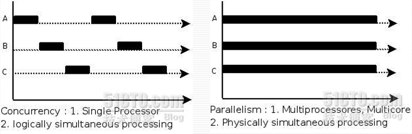

由于多道程序设计系统的一个基本特性：进程的相对执行速度不可预测。（它取决于其他进程的活动、操作系统处理中断的方式、操作系统的调度策略）会导致并发面临以下问题：

- 中断性（破坏了连续性）：为了实现并发，进程交替执行，所以在进程并发执行过程中，进程的执行是走走停停的；
- 失去了封闭性：计算机资源在一个时间段内是为所有的进程所独有；
- 执行的不一致性：在相同的输入下，进程执行可能会产生不同的结果。

### 简单案例及分析

为了更好理解这章的关键，考虑下面一个简单的程序：

<figure class="highlight c">
<table>
<colgroup>
<col style="width: 50%" />
<col style="width: 50%" />
</colgroup>
<tbody>
<tr>
<td class="gutter"><pre><code>1
2
3
4
5
6</code></pre></td>
<td class="code"><pre><code>void echo()
{
  chin = getchar();
 chout = chin;
 putchar(chout);
}</code></pre></td>
</tr>
</tbody>
</table>
</figure>

> 这个过程显示了字符回显程序的基本步骤，每当击一下键，就可从键盘获得输入。每个输入字符就保存在变量chin中，然后传送给变量chout，并回送给显示器。任何程序可以重复地调用这个过程，接收用户输入，并在屏幕上显示。

假定博主本人使用的是一个支持单用户的单处理器多道程序设计系统，我要同时使用多个应用程序，而且每个应用程序都要使用同一个键盘输入，同一块显示器输出，因此每个应用程序都需要使用这个`echo()`函数。为了节省空间，我会把这个程序载入到一个所有应用程序都可以访问的全局存储区域。这种设计一方面节省了空间，另一方面允许各个进程间有效而紧密的交互。但是这样的设计也会带来一些问题，考虑以下P1和P2进程的执行顺序：

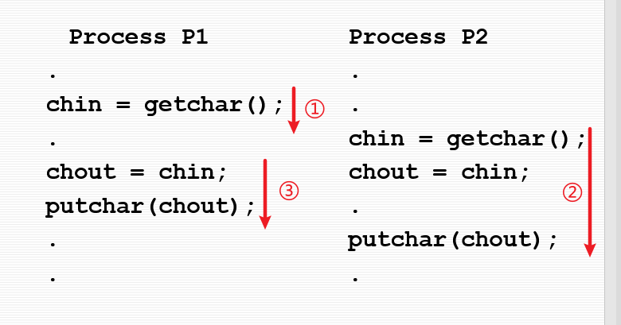

1.  进程P1调用echo过程，并在getchar返回它的值以及将该值存储于chin后立即被中断，此时，最近输入的字符x保存在变量chin中。
2.  进程P2被激活并调用echo过程，echo过程运行得出结果，输入，然后在屏幕上显示单个的字符y。
3.  进程P1被恢复。此时chin中的值x被写覆盖，因此已丢失，而chin中的值y被传送给chout并显示出来。

最终造成的结果就是第一个字符x丢失，第二个字符y被显示了两次。

> 问题的本质在于共享全局变量chin。多个进程访问这个全局变量，如果一个进程修改了它，然后被中断，那么另一个进程可能在第一个进程使用它的值之前又修改了这个变量。

假设在这个过程中一次只可以有一个进程，那么前面的顺序会产生如下结果：

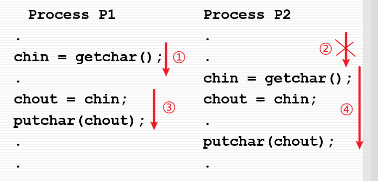

1.  进程P1调用echo过程，并在输入函数取得结果后立即被中断，此时，最近输入的字符x保存在变量chin中。
2.  进程P2被激活并调用echo过程。但是，由于P1仍然在echo过程中，尽管当前P1处于挂起状态，P2仍被阻塞，不能进入这个过程。因此，P2被挂起，等待echo过程可用。
3.  一段时间后，进程P1被恢复，完成echo的执行，并显示出正确的字符x。
4.  当P1退出echo后，解除了对P2的阻塞，P2被恢复，成功地调用echo过程。

这样的输出结果是我们所希望的。

上述这个简单的案例说明，如果需要保护共享的全局变量（以及其他共享的全局资源），唯一的办法是控制访问该变量的代码。如果我们定义了一条规则，一次只允许一个进程进入echo，并且只有在echo过程运行结束后它才对另一个进程是可用的，那么刚才讨论的那类错误就不会发生了。

如何实施此规则是本章的重要内容！！！！

> 上述我们讨论的情况是在单处理器多道程序设计系统中，但其实在多处理器系统中，同样也存在保护共享资源的问题，其解决方法也是相同的：**控制对共享资源的访问**。

### 竞争条件

竞争条件发生在多个进程或线程读写数据时，其最终的结果依赖于多个进程的**指令执行顺序**。

> 考虑下面两个简单的例子：
>
> - 案例一：
>
>   假设两个进程P1和P2共享全局变量a。在某一执行时刻，P1更新a为1，在执行的另外某一时刻，P2更新a为2。因此，两个任务竞争更新变量a。
>
>   （在本例中，竞争的“失败者”（也就是最后更新全局变量a的进程）决定了变量a的最终值。）
>
> - 案例二：
>
>   考虑两个进程P3和P4共享全局变量b和c，并且初始值b=1，c=2。在某一执行时刻，P3执行赋值语句b=b+c，在另一执行时刻，P4执行赋值语句 c=b+c。两个进程更新不同的变量，但两个变量的最终值依赖于两个进程执行赋值语句的顺序。如果P3首先执行赋值语句，那么最终的值为b=3，c=5。如果P4首先执行赋值语句，那么最终的值为b=4，c=3。

### 操作系统关注的问题

并发会带来如下设计和管理问题：

1.  操作系统需要进程控制块（PCB）来记住各个活跃的进程。

2.  操作系统必须为每个活跃进程分配和释放各种资源（因为进程是资源的分配单位），这些资源包括：

    - 处理器时间：这是调度功能。
    - 存储器：大多数操作系统使用虚拟存储方案。
    - 文件
    - I/O设备

3.  操作系统必须保护每个进程的数据和物理资源，避免其他进程的无意干涉。

4.  一个进程的功能和输出结果必须与执行速度（相对于其他并发进程的执行速度）无关。【本章关键就是介绍如何实现这一点】

    > 关于如何实现上述第四点，这里给出两种解决方案：
    >
    > - 取消共享资源：每个进程和每个线程所用到的资源都是独享的，这种方法能够解决前面的问题，但是和操作系统的设计目标不符合（操作系统是资源的管理者，要让计算机系统中的资源得到充分使用）
    > - 让进程和线程的执行顺序满足一定的条件（同步和互斥，核心概念是互斥）

### 进程的交互

根据进程相互间是否指导对方存在的程度，对进程间的交互方式进行如下三种分类：

- 进程之间相互不知道对方的存在

  这是一些独立的进程，它们不会一起工作。关于这种情况的最好例子是多个独立进程的多道程序设计，可以是批处理作业，也可以是交互式的会话，或者是两者的混合。尽管这些进程不会一起工作，但操作系统需要知道它们对资源的竞争情况。（例如，两个无关的应用程序可能都想访问同一个磁盘、文件或打印机，操作系统必须控制这样的访问）

- 进程间接知道对方的存在

  这些进程并不需要知道对方的进程ID，但它们共享某些对象，如一个I/O缓冲区。这类进程在共享同一个对象时表现出合作行为。

- 进程直接知道对方的存在

  这些进程可以通过进程ID互相通信，用于合作完成某些活动。同样，这类进程表现出合作行为。

下面的表格更为详细地说明了进程间的三种交互方式：

<table>
<colgroup>
<col style="width: 25%" />
<col style="width: 25%" />
<col style="width: 25%" />
<col style="width: 25%" />
</colgroup>
<thead>
<tr>
<th>知晓程度</th>
<th>关系</th>
<th>一个进程对其他进程的影响</th>
<th>潜在的控制问题</th>
</tr>
</thead>
<tbody>
<tr>
<td>进程之间相互不知道对方的存在</td>
<td>竞争</td>
<td>·一个进程的结果与其他进程的活动无关 
·进程的执行时间可能会受到影响</td>
<td>·互斥 
·死锁（可复用的资源） 
·饥饿</td>
</tr>
<tr>
<td>进程间接知道对方的存在（如共享对象）</td>
<td>通过共享合作</td>
<td>·一个进程的结果可能依赖于从其他进程获得的信息 
·进程的执行时间可能会受到影响</td>
<td>·互斥 
·死锁（可复用的资源） 
·饥饿 
·数据一致性</td>
</tr>
<tr>
<td>进程直接知道对方的存在（它们有可用的通信原语）</td>
<td>通过通信合作</td>
<td>·一个进程的结果可能依赖于从其他进程获得的信息 
·进程的计时可能会受到影响</td>
<td>·死锁（可消费的资源） 
·饥饿</td>
</tr>
</tbody>
</table>

> 对上述表格中不同关系存在的控制问题做一个详细补充：
>
> - 进程之间相互不知道对方的存在：
>   - 互斥：虽然进程互不知道，但是由于在同一个计算机系统中，对于临界资源需要互斥访问；
>   - 死锁：互斥的进程相互竞争资源，导致所需的资源无法有效释放；
>   - 饥饿：进程具备执行条件，但是由于得不到资源无法执行（低优先级的进程在执行时，前面老有高优先级的进程。）
> - 进程间接知道对方的存在：
>   - 因为进程间存在共享资源的关系，所以“互不知道关系”的三个问题它都具有；
>   - 同时它还多了一个数据的不一致性问题（条件竞争）
> - 进程直接知道对方的存在：
>   - 死锁：错误的同步，导致两个进程同时等待对方发消息；
>   - 饥饿：多个并发执行的进程，某一个进程始终没有得到让他启动的消息。
>
> 实际条件并不总是像上表中给出的那么清晰，几个进程可能既表现出竞争，又表现出合作。然而，对操作系统而言，分别检查表中的每一项并确定它们的本质是必要的。

#### 进程间的资源竞争

当并发进程竞争使用同一资源时，它们之间就会发生冲突。（这类资源包括I/O设备、存储器、处理器时间和时钟）

竞争进程面临以下三个控制问题：

- 互斥：

  一次只允许有一个程序在临界区中。（例如，每次只允许一个进程向打印机发送命令）

- 死锁：

  考虑两个进程P1和P2，以及两个资源R1和R2。假设每个进程为执行部分功能都需要访问这两个资源，那么就有可能出现下列情况：操作系统把R1分配给P2，把R2分配给P1，每个进程都在等待另一个资源，且在获得其他资源并完成功能前，谁都不会释放自己已经拥有的资源。这两个进程发生死锁。

  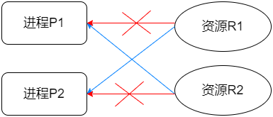

- 饥饿：

  假设有三个进程（P1、P2和P3），每个进程都周期性地访问资源R。考虑这种情况，P1拥有资源，P2和P3都被延迟，等待这个资源。当P1退出它的临界区时，P2和P3都被允许访问R。假设操作系统把访问权授予P3，并且在P3完成临界区之前P1又需要访问该临界区。如果在P3结束后操作系统又把访问权授予P1，并且接下来把访问权轮流授予P1和P3，那么即使没有死锁，P2也可能被无限期地拒绝访问资源。

  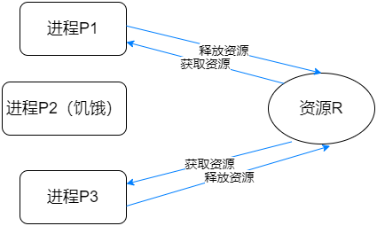

> 下图用抽象术语给出了互斥机制。假设有n个进程并发执行，每个进程都包括了在某资源Ra上操作的临界区以及不涉及资源Ra的替它代码。因为所有的进程都需要访问同一个资源Ra，因此在某一时刻只有一个进程在临界区是很重要的。
>
> 为实施互斥，需要两个函数：`entercritical`和`exitcritical`。每个函数的参数都是竞争使用的资源名。如果一个进程在它的临界区中，那么其他任何试图进入临界区的进程都必须等待。
>
> 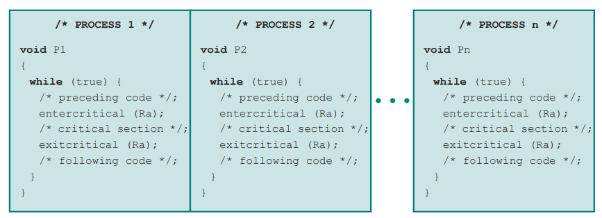

#### 进程间通过共享合作

通过共享进行合作的情况，包括进程间在互相并不确切知道对方的情况下进行交互。

例如，多个进程可能访问一个共享变量、共享文件或数据库，进程可能使用并修改共享变量而不涉及其他进程，但却知道其他进程也可能访问同一个数据。因此，这些进程必须合作，以确保它们共享的数据得到正确的管理。控制机制必须必须确保共享数据的完整性。

#### 进程间通过通信合作

当进程通过通信进行合作时，各个进程都与其他进程进行连接，通信提供了同步和协调各种活动的方法。

> 在典型情况下，通信可由各种类型的消息组成，发送消息和接收消息的原语由程序设计语言提供，或者由操作系统的内核提供。
>
> 由于在传递消息的过程中进程间没有共享任何对象，因而这类合作不需要互斥，但是仍然存在死锁和饥饿的问题。

### 互斥的要求

为了提供对互斥的支持，必须满足以下要求（十六字简记）：

- 空闲让进：如果没有进程访问临界资源，如果没有进程访问，可以允许访问；

- 忙则等待：如果有进程访问，则申请访资源的进程保持等待；

- 有限等待：对于申请访问临界资源的进程，应该在有限的时间内实现对临界资源的访问，避免死锁和饥饿的发生；

- 让权等待：申请临界资源的进程如果不能马上访问临界资源，应该立即释放CPU的使用权给其他进程。

  > 能过满足以上互斥要求的方法主要有三类：
  >
  > - 方法一：让由并发执行的进程担负这个责任。（软件方法）
  >
  >   这类进程，不论是系统程序还是应用程序，都需要与另一个进程合作，而不需要程序设计语言或操作系统提供任何支持来实施互斥。（该方法已被证明会增加开销和缺陷）
  >
  > - 方法二：专用的机器指令，保证原子操作实现互斥。（硬件方法）
  >
  >   这种方法的优点是可以减少开销，但却很难成为一种通用的解决方案。
  >
  > - 方法三：由操作系统或编译器提供工具或方法实现，主要有三种：信号量，管程和消息。

## 互斥：硬件的支持

许多增强互斥的软件算法已经开发出来了。软件方法会带来高开销并且很容易产生逻辑错误。这一部分我们来讨论提供互斥的硬件支持。

### 中断禁用

前文介绍过，在单处理机器中，并发进程不能重叠，只能交替。一个进程直到它调用了一个操作系统服务或者被中断，它将一直运行。因此为了保证互斥，只需要保证一个进程不被中断就可以了。

> 思路：
>
> 1.  进入访问临界资源之前，让中断失效；
> 2.  访问完临界资源之后，使能中断；

这种能力可以通过系统内核为启用和禁用中断定义的原语来提供。一个进程可以通过下面的方法实施互斥：

<figure class="highlight c">
<table>
<colgroup>
<col style="width: 50%" />
<col style="width: 50%" />
</colgroup>
<tbody>
<tr>
<td class="gutter"><pre><code>1
2
3
4
5
6
7</code></pre></td>
<td class="code"><pre><code>while(true)
{
 /*disable interrupts（禁用中断）*/
 /*critical section（临界区）*/
    /*enable interrupts（启用中断）*/
  /*remainder（其余部分）*/
}</code></pre></td>
</tr>
</tbody>
</table>
</figure>

中断禁用的方法使得程序执行到临界区之前不能被其他进程打断，因此可以保证互斥。但是这种方法也有两种缺陷：

- 限制了进程的并发执行：这会导致计算机系统的执行效率有明显的降低。（与原本并发的初衷相悖）
- 在多核计算机或分布式系统中，这种方法可能失效，因为屏蔽中断需要向多个CPU同时发起，屏蔽中断信号的发送有一个时延，这个时延可能导致互斥的失效；

### 专用机器指令

在多处理器系统中，多个处理器共享内存，这种情况处理器之间的行为是无关的，它们之间也没有支持互斥的中断机制。但是在硬件级别上，我们可以追求对存储单元的访问排斥对相同单元的其他访问。基于这一点，处理器的设计者提出了一些机器指令，用于保证两个动作的原子性。

> 原子性：“原子”表示不能被中断的单个步骤的指令。
>
> 例如在一个取指令周期中对一个存储器单元的读和写或者读和测试。在该指令执行的过程中，任何其他的指令访问内存将被阻止。而这些动作在一个指令周期中完成。

接下来会介绍两种常见的指令：

#### compare_and_swap（比较和交换指令）

<figure class="highlight c">
<table>
<colgroup>
<col style="width: 50%" />
<col style="width: 50%" />
</colgroup>
<tbody>
<tr>
<td class="gutter"><pre><code>1
2
3
4
5
6
7</code></pre></td>
<td class="code"><pre><code>int compare_and_swap (int *word, int testval, int newval)
{
    int oldval;
    oldval = *word;
    if (oldval == testval) *word = newval;
    return oldval;
}</code></pre></td>
</tr>
</tbody>
</table>
</figure>

> 以上代码为`比较和交换`指令的一个版本：
>
> - 用一个测试值（teatval）检查一个内存单元（\*word）。如果该内存单元的当前值是testval，就用newval取代该值；否则保持不变。
> - 该指令总是返回旧内存值；因此，如果返回值与测试值相同，则表示该内存单元已被更新。
> - （这个原子指令由两个部分组成：比较内存单元值和测试值；如果值有差异，则产生交换。整个比较和交换功能按原子操作执行，即它不接受中断。）
>
> 该指令的另一个版本返回一个布尔（Boolean）值：交换发生时为真（true）；否则为假（false）。
>
> （几乎所有处理器家族（x86、IA64、sparc、/390等）中都支持该指令的某个版本，而且多数操作系统都利用该指令支持并发。）

下面的代码将展示基于使用`比较和交换`指令的互斥规程：

<figure class="highlight c">
<table>
<colgroup>
<col style="width: 50%" />
<col style="width: 50%" />
</colgroup>
<tbody>
<tr>
<td class="gutter"><pre><code>1
2
3
4
5
6
7
8
9
10
11
12
13
14
15
16
17
18
19
20
21
22</code></pre></td>
<td class="code"><pre><code>/*program mutualexclusion*/

const int n = /*进程个数*/;
int bolt; /*共享变量*/

void p(int i)
{
    while (true){
        while (compare_and_swap(bolt,0,1) == 1){
            /*不做任何事*/;
        }
        /*临界区*/;
        bolt = 0;
        /*其余部分*/;
    }
}

void main()
{
    bolt = o; /*初始化共享变量*/
    parbegin (P(1), P(2),...,P(n)); /*多个进程并发*/
}</code></pre></td>
</tr>
</tbody>
</table>
</figure>

> 共享变量bolt被初始化为0。唯一可以进入临界区的进程是发现bolt等于0的那个进程。所有试图进入临界区的其他进程进入忙等待模式。
>
> 忙等待（busy waiting）/自旋等待（spin waiting）：
>
> 进程在得到临界区访问权之前，它只能继续执行测试变量的指令来得到访问权，除此之外不能做其他事情。
>
> 当一个进程离开临界区时，它把bolt重置为0，此时只有一个等待进程被允许进入临界区。进程的选择取决于哪个进程正好执行紧接着的`比较和交换`指令。

#### exchange（交换指令）

<figure class="highlight c">
<table>
<colgroup>
<col style="width: 50%" />
<col style="width: 50%" />
</colgroup>
<tbody>
<tr>
<td class="gutter"><pre><code>1
2
3
4
5
6
7</code></pre></td>
<td class="code"><pre><code>void exchange(int register, int memory)
{
    int temp;
    temp = memory;
    memory = register;
    register = temp;
}</code></pre></td>
</tr>
</tbody>
</table>
</figure>

> 该指令交换一个寄存器的内容和一个存储单元的内容。

下面的代码将展示基于`exchange`指令的互斥协议：

<figure class="highlight c">
<table>
<colgroup>
<col style="width: 50%" />
<col style="width: 50%" />
</colgroup>
<tbody>
<tr>
<td class="gutter"><pre><code>1
2
3
4
5
6
7
8
9
10
11
12
13
14
15
16
17
18
19
20
21
22
23</code></pre></td>
<td class="code"><pre><code>/*program mutualexclusion*/

int const n = /*进程个数*/;
int bolt; /*共享变量*/

void p(int i)
{
    int keyi = 1;
    while (true){
        do exchange (keyi, bolt)
        while (keyi != 0);
        /*临界区*/;
        bolt = 0;
        /*其余部分*/;
    }
}

void main()
{
    bolt = o; /*初始化共享变量*/
    parbegin (P(1), P(2),...,P(n)); /*多个进程并发*/
}
</code></pre></td>
</tr>
</tbody>
</table>
</figure>

> 共享变量bolt被初始化为0，每个进程都使用一个局部变量key且初始化为1。唯一可以进入临界区的进程是发现bolt等于0的那个进程。它通过把bolt置为1排斥所有其他进程进入临界区。当一个进程离开临界区时，它把bolt重置为0，允许另一个进程进入它的临界区。

机器指令方法的优点：

- 适用于在单处理器或共享内存的多处理器上的任何数目的进程。
- 非常简单且易于实现。
- 可用于支持多个临界区，每个临界区可以用它自己的变量定义。

机器指令方法的缺点：

- 使用了忙等待：

  当一个进程正在等待进入临界区时，它会继续消耗处理器时间。

- 可能导致饥饿：

  当一个进程离开一个临界区并且有多个进程正在等待时，选择哪一个等待进程是任意的，因此，某些进程可能被无限期地拒绝进入。

- 可能导致死锁：

  考虑单处理器中的下列情况。进程P1执行专门指令（如compare&swap、exchange）并进入临界区，然后P1被中断并把处理器让给具有更高优先级的P2。如果P2试图使用同一资源，由于互斥机制，它将被拒绝访问。因此，它会进入忙等待循环。但是，由于P1比P2的优先级低，它将永远不会被调度执行。

## 信号量

*敲黑板！！！！（重点来啦！！！！*

信号量是1965年由荷兰科学家迪杰斯特拉提出来的（数据结构最短路径算法的提出者），信号量的本质是一种数据结构，用来处理并发进程之间的互斥与同步的。

> 在详细介绍信号量之前我们先了解一下常用的并发机制：
>
> | 并发机制 | 说明 |
> |----|----|
> | 信号量（Semaphore） | 用于进程间传递信号的一个整数值。在信号量上只有三种操作可以进行，**初始化**、**递减**和**增加**，这三种操作都是原子操作。递减操作可以用于阻塞一个进程，增加操作可以用于解除阻塞一个进程。也称为**计数信号量**或**一般信号量** |
> | 二元信号量（Binary semaphore） | 只取0值和1值的信号量 |
> | 互斥量（Mutex） | 类似于二元信号量。关键区别在于为其加锁（设定值为0）的进程和为其解锁（设定值为1）的进程必须为同一个进程 |
> | 条件变量（Condition variable） | 一种数据类型。用于阻塞进程或者线程，直到特定的条件为真 |
> | 管程（Monitor） | 一种编程语言结构，在一个抽象数据类型中封装了变量、访问过程和初始化代码。管程的变量只能由管程自己的访问过程来访问，每次只能有一个进程在其中执行。访问过程即临界区。管程可以有一个等待进程队列 |
> | 事件标志（Event flags） | 作为同步机制的一个内存字。应用程序代码可以为标志中的每个位关联不同的事件。通过测试相关的一个或多个位，线程可以等待一个事件或多个事件。在全部的所需位都被设定（AND）或者至少一个位被设定（OR）之前线程会一直被阻塞 |
> | 信箱/消息（Mailboxes/messages） | 两个进程交换信息的一种方法，也可以用于同步 |
> | 自旋锁（Spinlocks） | 一种互斥机制，进程在一个无条件循环中执行，等待锁变量的值变为可用 |

### 基本原理

两个或多个进程可以通过简单的信号进行合作，一个进程可以被迫在某一位置停止，直到它接收到一个特定的信号。（任何复杂的合作需求都可以通过适当的信号结构得到满足）

### 信号量的结构

信号量的结构包括两个成员和两个原子操作：

- 两个成员：

  - 整形变量count：我们可以对这个信号量进行初始化，用来表明共享资源的数目或者是进程执行的状态。
  - 队列：用来存放因为使用了某种操作导致进程阻塞在该信号量的进程。

- 两个原子操作：

  - `semWait(x)`: semWait 对 count 进行**减一**操作，如果操作结果为负数（**小于零**)，执行semWait 的进程会被阻塞到队列上；
  - `semSingal(x)`:semsignal对count进行**加一**操作，如果执行后的结果**小于等于零**，会从阻塞队列的队首的进程出队，并变为就绪状态。

  > 上面的概念定义了一般信号量的概念，下面还有几个衍生的概念：
  >
  > - 计数信号量：如果count的取值是整个整数空间；
  > - 二元信号量：如果count的取值仅限于0和1；
  > - 互斥信号量：如果信号量中的semWait和semSignal操作在一个进程之内；
  > - 强信号量：信号量中阻塞的进程拥有明确的出队队列；
  > - 弱信号量：阻塞进程的出队策略不明确（一会FIFO，一会基于优先级）

说明：

对以上操作的解释如下：

- 开始时，信号量的值为零或者是正数；

- 如果该值为正数，则该值等于发出semWait操作后可立即继续执行的进程的数量；

- 如果该值为零（或者由于初始化，或者由于有等于信号量初值的进程已经等待），则发出semWait操作的下一个进程会被阻塞，此时该信号量的值变为负值。（之后，每个后续的semWait操作都会使信号量的负值更大，）该负值等于正在等待解除阻塞的进程的数量；

- 在信号量为负值的情形下，每一个semSignal操作都会将等待进程中的一个进程解除阻塞。

  > 关于信号量定义的结论：
  >
  > - 通常，在进程对信号量减1之前，无法提前知道该信号量是否会被阻塞。
  > - 当进程对一个信号量加1之后，另一个进程会被唤醒，两个进程继续并发运行。而在一个单处理器系统中，同样无法知道哪一个进程会立即继续运行。
  > - 在向信号量发出信号后，不需要知道是否有另一个进程正在等待，被解除阻塞的进程数量或者没有或者是1个。

### 信号量的使用

如上文所述，引入信号量的的目的是实现同步互斥的，使用信号量的操作一般包含以下两个步骤：

1.  分析问题之间进程的关系和种类；
2.  根据进程的关系定义信号量并实现；

对于不同的关系，操作方法不同：

- 对于互斥关系：
  1.  有几个临界资源，就定义几个信号量；
  2.  根据问题对信号进行初始化；
  3.  使用semWait和semSignal实现对信号量的互斥访问；
- 对于同步关系（一个进程的执行是另外一个进程执行的先决条件）：
  1.  分析进程之间的同步关系，有几种关系就定义几个信号量；
  2.  根据问题的条件对信号量进行初始化；
  3.  调用semwait和semsinal实现同步；（一般两个操作不在相同的进程内）

### 信号量原语的定义

以下代码给出了关于信号原语更规范的定义。（semWait和semsignal原语被假设是原子操作）

（非二元信号量常常也称为**计数信号量**或者**一般信号量**）

<figure class="highlight c">
<table>
<colgroup>
<col style="width: 50%" />
<col style="width: 50%" />
</colgroup>
<tbody>
<tr>
<td class="gutter"><pre><code>1
2
3
4
5
6
7
8
9
10
11
12
13
14
15
16
17
18
19
20
21
22
23
24
25</code></pre></td>
<td class="code"><pre><code>/*semaphore*/
struct semaphore{
    int count;
    queueType queue;
};

/*semWait*/
void semWait(semaphore s)
{
    s.count--;
    if (s.count &lt; 0){
        /*把当前进程插入到阻塞队列当中*/;
        /*阻塞当前进程*/;
    }
}

/*semSignal*/
void semSignal(semaphore s)
{
    s.count++;
    if (s.count &lt;= 0){
        /*把进程p从阻塞队列当中移除*/;
        /*把进程p插入到就绪队列*/;
    }
}</code></pre></td>
</tr>
</tbody>
</table>
</figure>

### 二元信号量

以下代码定义了信号量更为严格的形式，信号量的值只能为0或1。

<figure class="highlight c">
<table>
<colgroup>
<col style="width: 50%" />
<col style="width: 50%" />
</colgroup>
<tbody>
<tr>
<td class="gutter"><pre><code>1
2
3
4
5
6
7
8
9
10
11
12
13
14
15
16
17
18
19
20
21
22
23
24
25
26
27
28
29</code></pre></td>
<td class="code"><pre><code>/*binary_semaphore*/
struct binary_semaphore{
    enum {zero, one} value;
    queueType queue;
};

/*semWaitB*/
void semWaitB(binary_semaphore s)
{
    if (s.value == one){
        s.value = zero;
    }
    else {
        /*把当前进程插入到阻塞队列当中*/;
        /*阻塞当前进程*/;
    }
}

/*semSignalB*/
void semSignalB(semaphore s)
{
    if (s.queue is empty()){
        s.value = one;
    }
    else {
        /*把进程p从阻塞队列中移除*/;
        /*把进程p插入到就绪队列*/;
    }
}</code></pre></td>
</tr>
</tbody>
</table>
</figure>

> 说明：
>
> - 一个二元信号量可以初始化成0或1。
> - semWaitB操作检查信号的值，如果值为0，那么进程执行aemwaitB就会受阻。如果值为1，那么将值改变为0，并且继续执行该进程。
> - semSignalB操作检查是否有任何进程在该信号上受阻，如果有，那么通过semWaitB操作，受阻的进程就会被唤醒，如果没有进程受阻，那么值被设置为1。

### 强、弱信号量

不论是哪一种信号量，都需要使用队列来保存在信号量上等待的进程。这就会产生一个问题：进程按照什么顺序从队列中移出？

- 强信号量：

  最公平的策略是先进先出（FIFO）：被阻塞时间最久的进程最先从队列释放。采用这个策略定义的信号量称为强信号量（strong semaphore）。

- 弱信号量：

  没有规定进程从队列中移出顺序的信号量称为弱信号量（weak semaphore）。

下图将展示（强）信号量机制的一个例子：

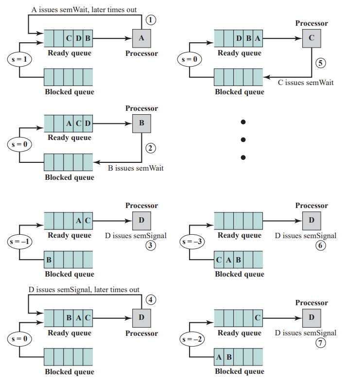

> 说明：
>
> - 初始时刻①，A正在运行，B、D和C就绪，信号量为1。当A执行一条semWait指令后，信号量减为0，A能继续执行，随后它加入就绪队列。
> - 然后在时刻②时，B正在运行，最终执行一条semWait指令，并被挂起（此时信号量为-1）。
> - 在时刻③时，D被允许运行。
> - 在时刻④时，当D完成一个新结果后，它执行一条semSignal指令，允许B移到就绪队列中。
> - 在时刻⑤时，D加入就绪队列，C开始运行，当它执行semWait指令时被挂起。
> - 类似地，在时刻⑥，A和B运行，且被挂起在这个信号量上，允许D恢复执行。
> - 在时刻⑦，当D有一个结果后，执行一条semSlgnal指令，把C移到就绪队列中。

### 互斥

以下代码给出了一种使用信号量s解决互斥问题的方法：

<figure class="highlight c">
<table>
<colgroup>
<col style="width: 50%" />
<col style="width: 50%" />
</colgroup>
<tbody>
<tr>
<td class="gutter"><pre><code>1
2
3
4
5
6
7
8
9
10
11
12
13
14
15
16
17
18</code></pre></td>
<td class="code"><pre><code>/*program mutualexclusion*/
const int n = /*进程数*/;
semaphore s = 1;

void P(int i)
{
    while (true){
        semWait(s);
        /*临界区*/;
        semSignal(s);
        /*其他部分*/;
    }
}

void main()
{
    parbegin (P(1), P(2),...,P(n)); /*多进程并发执行*/
}</code></pre></td>
</tr>
</tbody>
</table>
</figure>

> 说明：
>
> 设有n个进程，用数组P(i)表示，所有的进程都需要访问共享资源。每个进程中进入临界区前执行semWait(s)，如果s的值为负，则进程被挂起；如果值为1，则s被减为0，进程立即进人临界区；由于s不再为正，因而其他任何进程都不能进入临界区。
>
> 可以这样理解，当一个进程想要调用公共资源时，就要发出`semWait(s)`指令，以获取资源，如果获取不到，则一直调用该指令；一旦获取了该资源，则其他进程无法使用；等到该进程使用完资源后，就会调用`semSignal(s)`指令，告诉其它进程：“我用完啦，并且把资源交还回公共区域啦。”
>
> - `s.count ≥ 0`：s.count是可以执行semWait(s)而不被挂起的进程数（如果其间没有semSignal(a)被执行）。这种情形允许信号量支持同步与互斥。
> - `s.count<0`：s.count的大小是挂起在s.queue队列中的进程数.
>
> 下图给出了信号量机制执行过程的另一种表述，这里不再说明（*看得懂，应该看得懂*）
>
> 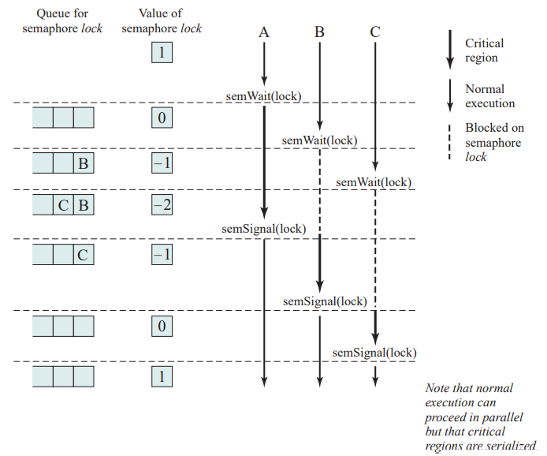

### 信号量问题

*（为了使得文章整体结构看起来不那么混乱，这里用另一篇文章去综合一些关于信号量的问题，点击下方按钮跳转）*

<a href="/butterfly/2021/04/25/%E6%93%8D%E4%BD%9C%E7%B3%BB%E7%BB%9F/%E6%93%8D%E4%BD%9C%E7%B3%BB%E7%BB%9F%E5%AD%A6%E4%B9%A0%E7%AC%94%E8%AE%B0-%E4%BF%A1%E5%8F%B7%E9%87%8F%E7%9B%B8%E5%85%B3%E9%97%AE%E9%A2%98/" class="btn-beautify block outline orange larger" title="点击跳转 至 《信号量相关问题》"><em></em>点击跳转 至 《信号量相关问题》</a>

### 信号量的实现

`semWait`和`semSignal`操作必须作为原子原语实现。可以通过以下三种方式：

- 通过硬件或固件实现。
- 通过软件方案实现。（这会伴随处理开销）
- 对于单处理器系统，可以通过禁用中断的方式实现。

## 管程

从上述内容可以看出信号量有效地提供了进程间互斥与合作的支持，但实际上信号量对于编写者来说是很困难的，用信号量设计一个正确的程序并非易事：由于信号量分布在整个程序中，使用不当，可能造成程序错误，甚至死锁。下面来看三个错误案例：

- 错误一：在利用信号量互斥时，误将 semWait与semSignal的顺序颠倒：

  <figure class="highlight c">
  <table>
  <colgroup>
  <col style="width: 50%" />
  <col style="width: 50%" />
  </colgroup>
  <tbody>
  <tr>
  <td class="gutter"><pre><code>1
  2
  3</code></pre></td>
  <td class="code"><pre><code>semSignal(mutex)
   critical area
  semWait(mutex)</code></pre></td>
  </tr>
  </tbody>
  </table>
  </figure>

  这会导致临界访问失效。

- 错误二：在实现互斥时，误将semSigal 写成semWait, 或误将semWait写成semSigal, 导致临界区无法访问，或者临界区被多次访问；

- 错误三: 实现互斥访问的时候，程序遗漏了semWait，操作临界区失效；

基于这种情况，DJstra在1971年提出为每一个共享的资源设立一个秘书管理他的访问的思想。即：一切进程访问共享资源时，必须通过设立的秘书，秘书一次只允许一个进程访问共享资源，通过这种方式，即实现了资源的共享，同时也保证了资源的互斥访问与同步。1973年，汉森和霍尔又将秘书的概念发展成为管程。

管程定义了一组局部数据和内部操作，只有内部操作才能使用局部变量，访问管程的进程通过内部操作访问或修改内容数据，从而实现进程间的互斥与访问。

> 管程允许程序员用其锁定任何对象（对类似于链表之类的对象，可以用一个锁锁住整个链表，也可以每个表用一个锁，还可以为表中的每一个元素用一个锁）。
>
> 管程天生具有排他性（互斥）。因此程序员只需要在管程当中解决好同步问题，互斥的工作可以完全交由编译器处理。
>
> 关于实现管程的同步的措施：
>
> 1.  一个进程调用管程内的内部操作进入管程后，在管程驻留期间，如果该进程要求的共享资源不满足进程执行的条件，需要将进程阻塞在阻塞队列上，并释放管程的使用权；
> 2.  当阻塞进程等待的条件满足时，需要将该进程从阻塞队列中移除到就绪队列中，允许该进程能够再次进入管程执行。
>
> 上述两种机制的实现时通过条件变量和两个内部操作`cwait` 和`csignal`实现的（下文将详细介绍）：
>
> 1.  在管程内设置若干条件变量用来区分不同的条件；
> 2.  针对条件变量的两个操作 cwait和csignal,cwait 是用来将进程阻塞到对应的条件变量阻塞队列中，csignal是用来将进程从对应的阻塞队列中恢复到就绪队列。

管程本质上也是一种数据结构，包含5个部分：

1.  局部变量
2.  内部过程
3.  初始化操作
4.  条件变量
5.  阻塞队列

管程具有三个特性：

1.  管程的内部数据只能被管程内部的操作访问；
2.  一个进程只能通过管程的内部过程对管程进行访问；
3.  每次最多允许一个进程使用管程的内部操作，即进程互斥的调用内部过程进入管程，其他想进入管程的进程必须在阻塞队列中等待。

### 使用信号的管程

管程是由一个或多个过程、一个初始化序列和局部数据组成的软件模块，其主要特点如下：

- 局部数据变量只能被管程的过程访问，任何外部过程都不能访问。
- 一个进程通过调用管程的一个过程进入管程。
- 在任何时候，只能有一个进程在管程中执行，调用管程的任何其他进程都被阻塞，以等待管程可用。

为了进行并发处理，管程必须包含同步工具。

> 例如，假设一个进程调用了管程，并且当它在管程中时必须被挂起，直到满足某些条件。这就需要一种机制，使得该进程不仅被挂起，而且能释放这个管程，以便某些其他的进程可以进入。以后，当条件满足并且管程再次可用时，需要恢复该进程并允许它在挂起点重新进入管程。

管程通过使用条件变量提供对同步的支持，这些条件变量包含在管程中，并且只有在管程中才能被访问。有两个函数可以操作条件变量：

- `cwait(c)`：调用进程的执行在条件c上挂起，管程现在可被另一个进程使用。

- `csignal(c)`：恢复执行在cwait之后因为某些条件而挂起的进程。如果有多个这样的进程，选择其中一个；如果没有这样的进程，什么也不做。

  > 注意管程的`wait`和`signal`操作与信号量不同：
  >
  > 如果在管程中的一个进程发信号，但没有在这个条件变量上等待的任务，则丢弃这个信号。

下图给出了一个管程的结构：

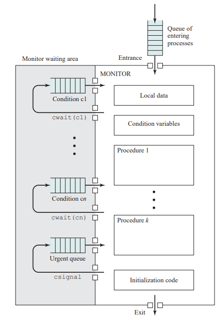

> 说明：
>
> 尽管一个进程可以通过调用管程的任何一个过程进入管程，但我们仍可以把管程想像成具有一个入口点，并保证一次只有一个进程可以进入。其他试图进入管程的进程被阻塞并加入等待管程可用的进程队列中。当一个进程在管程中时，它可能会通过发送cwalt(x)\
> 把自己暂时阻塞在条件x上，随后它被放入等待条件改变以重新进入管程的进程队列中，在cwalt(x)调用的下一条指令开始恢复执行。
>
> 如果在管程中执行的一个进程发现条件变量x发生了变化，它发送csignal(x)，通知相应的条件队列条件已改变。

以下代码给出了一个使用管程的例子，再次考虑生产者/消费者问题：

<figure class="highlight c">
<table>
<colgroup>
<col style="width: 50%" />
<col style="width: 50%" />
</colgroup>
<tbody>
<tr>
<td class="gutter"><pre><code>1
2
3
4
5
6
7
8
9
10
11
12
13
14
15
16
17
18
19
20
21
22
23
24
25
26
27
28
29
30
31
32
33</code></pre></td>
<td class="code"><pre><code>/*program producerconsumer*/
monitor boundedbuffer;          
char buffer [N];          /*分配N个数据项空间*/
int nextin, nextout;          /*缓冲区指针*/
int count;          /*缓冲区中数据项个数*/
cond notfull, notempty;          /*为同步设置的条件变量*/

void append(char x)
{
    if (count == N){
        cwait(notfull);          /*缓冲区满，防止溢出*/
    }
    buffer[nextin] = x;
    nextin = (nextin + 1) % N;
    count++;
    /*缓冲区中数据项个数加一*/
    csignal(nonempty);          /*释放任何一个等待的进程*/
}

void take(char x)
{
    if (count == 0){
        cwait(notempty);          /*缓冲区空，防止下溢*/
    }
    x = buffer[nextout];
    nextout = (nextout + 1) % N;
    count--;          /*缓冲区中数据项个数减一*/
    csignal(notfull);          /*释放任何一个等待的进程*/
}

{          /*管程体*/
    nextin = 0; nextout = 0; count = 0;          /*缓冲区初始化为空*/
}</code></pre></td>
</tr>
</tbody>
</table>
</figure>

<figure class="highlight c">
<table>
<colgroup>
<col style="width: 50%" />
<col style="width: 50%" />
</colgroup>
<tbody>
<tr>
<td class="gutter"><pre><code>1
2
3
4
5
6
7
8
9
10
11
12
13
14
15
16
17
18
19
20
21
22
23
24</code></pre></td>
<td class="code"><pre><code>/*producer*/
void producer()
{
    char x;
    while (true){
        produce(x);
        append(x);
    }
}

/*consumer*/
void consumer()
{
    char x;
    while (true){
        take(x);
        consume(x);
    }
}

void main()
{
    parbegin(producer, consumer);
}</code></pre></td>
</tr>
</tbody>
</table>
</figure>

> 说明：
>
> 管程模块boundedbuffer控制着用于保存和取回字符的缓冲区，管程中有两个条件变量（使用结构cond声明）：当缓冲区中至少有增加一个字符的空间时，notfull为真；当缓冲区中至少有一个字符时，notempty为真。
>
> 生产者可以通过管程中的过程append往缓冲区中增加字符，它不能直接访问buffer。该过程首先检查条件notfiull，以确定缓冲区是否还有可用空间。如果没有，执行管程的进程在这个条件上被阻塞。其他某个进程（生产者或消费者）现在可以进入管程。然后，当缓冲区不再满时，被阻塞进程可以从队列中移出，重新被激活，并恢复处理。在往缓冲区中放置了一个字符后，该进程发送notempty条件信号。对消费者函数也可以进行类似的描述。

### 使用通知和广播的管程

Hoare关于管程的定义\[HOAR74\]要求在条件队列中至少有一个进程，当另一个进程为该条件产生caigna1时，该队列中的一个进程立即运行。因此，产生caigna1的进程必须立即退出管程，或者阻塞在管程上。

这种方法有两个缺陷：

- 如果产生csignal的进程在管程内还没有结束，则需要两个额外的进程切换：阻塞这个进程需要一次切换，当管程可用时恢复这个进程又需要一次切换。
- 与信号相关的进程调度必须非常可靠。当产生一个csignal时，来自相应条件队列中的一个进程必须立即被激活，调度程序必须确保在激活前没有其他进程进入管程，否则，进程被激活的条件又会改变。

因此又开发出了一种不同的管程以解决以上问题：

<figure class="highlight c">
<table>
<colgroup>
<col style="width: 50%" />
<col style="width: 50%" />
</colgroup>
<tbody>
<tr>
<td class="gutter"><pre><code>1
2
3
4
5
6
7
8
9
10
11
12
13
14
15
16
17
18
19
20
21</code></pre></td>
<td class="code"><pre><code>void append(char x)
{
    while (count == N){
        cwait(notfull);          /*缓冲区满，防止溢出*/
    }
    buffer[nextin] = x;
    nextin = (nextin + 1) % N;
    count++;          /*缓冲区中数据项个数加一*/
    cnotify(notempty);          /*通知正在等待的进程*/
}

void take(char x)
{
    while (count == 0){
        cwait(notempty);          /*缓冲区空，防止下溢*/
    }
    x = buffer[nextout];
    nextout = (nextout + 1) % N;
    count--;          /*缓冲区中数据项个数减一*/
    cnotify(notfull);          /*通知正在等待的进程*/
}</code></pre></td>
</tr>
</tbody>
</table>
</figure>

> 说明：
>
> csignal原语被 cnotify取代。当一个正在管程中的进程执行cnotify(x)时，它使得x条件队列得到通知，但发信号的进程继续执行。通知的结果是使得位于条件队列头的进程在将来合适的时候且当处理器可用时被恢复执行。但是，由于不能保证在它之前没有其他进程进入管程，因而这个等待进程必须重新检查条件。
>
> if语句被 while循环取代，因此，这个方案导致对条件变量至少多一次额外的检测。作为回报，它不再有额外的进程切换，并且对等待进程在cnotify之后什么时候运行没有任何限制。

## 消息传递

进程交互式，必须满足两个基本要求：同步和通信。为实施互斥，进程间需要同步；为了合作，进程间需要交换信息。之前介绍的两种机制（信号量以及管程）可以在单处理器系统以及多处理器系统中实现，但是对于分布式系统而言，没有办法提供支持。此外，管程对编译器有依赖，而很多编程语言的编译器并没有提供对管程的支持（比如gcc）。为此，引入了消息传递。

消息传递的实际功能以一对原语的形式提供：

<figure class="highlight c">
<table>
<colgroup>
<col style="width: 50%" />
<col style="width: 50%" />
</colgroup>
<tbody>
<tr>
<td class="gutter"><pre><code>1
2</code></pre></td>
<td class="code"><pre><code>send(destination, message)
receive(source, message)</code></pre></td>
</tr>
</tbody>
</table>
</figure>

> 说明：
>
> 这是进程间进行消息传递所需要的最小操作集。一个进程以消息(message)的形式给另一个指定的目标(destination)进程发送信息；进程通过执行receive原语接收信息，receive原语中指明发送消息的源进程(source)和消息。
>
> send与receive操作既可以是阻塞操作也可以是非阻塞操作：
>
> - 阻塞操作：在执行一个指令时，在获得这个指令的结果之前，程序不得向下推进；
>
> - 非阻塞操作：在执行一个指令时，在调用这条指令后，不待指令的结果返回，程序可以立即执行下一条指令的操作方式成为非阻塞方。
>
> > 因此对于阻塞send 而言，当程序调用了这条指令后，在send中的消息传送给指定进程之前，程序始终停留在send指令上，不向后推进；
> >
> > 而对于非阻塞send,当程序调用这条指令后，指令马上返回，立即执行后面的指令；
> >
> > 同理，对于receive也是如此，阻塞的receive在收到消息之前，程序停留在这条指令之上不会向下执行，非阻塞receive则是调用指令后，立即向下执行。

### 同步（Synchronization）

两个进程间的消息通信隐含着某种同步的信息：只有当一个进程发送消息之后，接收者才能接收消息。

当一个进程执行时，在它发送`send`或`receive`原语时，都有阻塞或不阻塞两种状态，因此会有如下四种组合：

- 无阻塞send，无阻塞receive：

  等待消息接收，收到消息后继续执行。

- 阻塞send，阻塞receive：

  发送者和接收者都被阻塞，直到信息被送达。（这种情况有时也称做会合(rendezvous)，它考虑到了进程间的紧密同步。）

- 无阻塞send，阻塞receive：

  发送者可以继续，但接收者被阻塞直到请求的消息到达。

  > 这可能是最有用的一种组合，它允许一个进程给各个目标进程尽快地发送一条或多条消息。在继续工作前必须接收到消息的进程将被阻塞，直到这个消息到达。例如，一个服务器进程给其他进程提供服务或资源。

- 阻塞send，无阻塞receive：

  不要求任何一方等待。

对于大多数并发程序设计任务来说：

- 无阻塞send是最自然的：

  > 例如，无阻塞send用于请求一个输出操作，如打印，它允许请求进程以消息的形式发出请求，然后继续。无阻塞send存在一个潜在的危险：错误会导致进程重复地产生消息。由于对进程没有阻塞的要求，这些消息可能会消耗系统资源，包括处理器时间和缓冲区空间，从而损害其他进程和操作系统。同时，无阻塞send给程序员增加了负担，由于必须确定消息是否收到，因而进程必须使用应答消息，以证实收到了消息。

- 阻塞receive是最自然的：

  > 通常，请求一个消息的进程都需要这个期望的信息才能继续执行下去，但是，如果消息丢失了（这在分布式系统中很可能发生），或者一个进程在发送预期的消息之前失败了，那么接收进程将会无限期地被阻塞下去。这个问题可以通过使用无阻塞receive来解决。但是，该方法的危险是，如果消息的发送在一个进程已经执行了与之相匹配的receive之后，该消息将被丢失。其他可能的方法是允许一个进程在发出receive之前检测是否有消息正在等待，或者允许进程在receive原语中确定多个源进程。如果一个进程正在等待从多个源进程发送来的消息，并且只要有一个消息到达就可以继续下去时，后一种方法是非常有用的。

### 寻址（Addressing）

显然，在send原语中确定哪个进程接收消息是很有必要的。同样，大多数实现允许接收进程指明消息的来源。

在send和receive原语中确定目标或源进程的方案可分为两类：**直接寻址**（direct addressing）和**间接寻址**（indirect addressing）。

- 直接寻址：

  send原语包含目标进程的标识符，而receive原语有两种处理方式：

  - 显示寻址：一个进程必须事先知道希望得到来自哪个源进程的消息，这种方式对于处理并发进程间的合作是非常有效的。
  - 隐式寻址：例如打印机服务器进程将接受来自各个进程的打印请求，对这类应用使用隐式寻址更为有效。（不可能指定所期望的源进程）

- 间接寻址：

  在这种情况，消息不是直接从发送者发送到接收者，而是发送到一个共享数据结构，该结构由临时保存消息的队列组成，这些队列通常称为**邮箱(mailbox)**。因此，对两个通信进程，一个进程给合适的邮箱发送消息，另一个从邮箱中获得这些消息。

  > 间接寻址通过解除发送者和接收者之间的耦合关系，在消息的使用上允许更大的灵活性。发送者和接收者之间的关系可以是一对一、多对一、一对多或多对多（如下图）。
  >
  > 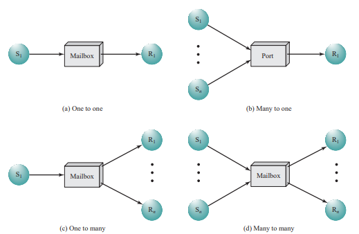
  >
  > - 一对一的关系允许在两个进程间建立专用的通信链接，这可以把它们之间的交互隔离起来，避免其他进程的错误干扰；
  > - 多对一的关系对客户/服务器间的交互非常有用，一个进程给许多别的进程提供服务，这时，信箱常常称为一个端口（port）；
  > - 一对多的关系适用于一个发送者和多个接收者，它对于在一组进程间广播一条消息或某些信息的应用程序非常有用；
  > - 多对多的关系使得多个服务进程可以对多个客户进程提供服务。
  >
  > 进程和信箱的关联可以是静态的，也可以是动态的。端口常常是静态地关联到一个特定的进程上，也就是说，端口是被永久地创建并指定到该进程。（在一对一的关系中就是典型的静态和永久性的关系）

### 消息格式

消息的格式取决于消息机制的目标以及该机制是运行在一台计算机上还是分布式系统中。

> 对某些操作系统，设计者优先选用短的、固定长度的消息，以减少处理和存储的开销。如果需要传递大量的数据，数据可以放置到一个文件中，消息可以简单地引用该文件。一种更灵活的方法是允许可变长度的消息。

下图给出了一种操作系统的支持可变长度消息的典型消息格式：

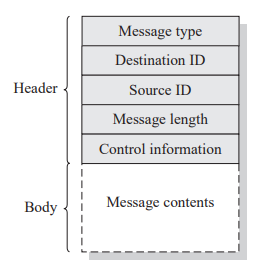

> 该消息被划分成两部分：包含相关信息的消息头和包含实际内容的消息体。
>
> - 消息头用来存放用于控制消息传递的信息。
> - 消息体用来存放进程间进程间通讯的内容。
>
> 消息头可以包含消息的源和目标的标识符、长度域和判定各种消息类型的类型域，还可能含有一些额外的控制信息。（例如用于创建消息链表的指针域、记录源和目标之间传递的消息的数目、顺序和序号，以及一个优先级域）

### 排队原则

最简单的排队原则是先进先出原则，但是当某些消息比其他消息更紧急时，仅有这种原则是不够的。一个可选的原则是允许指定消息的优先级，这可以基于消息的类型或者由发送者指定，另一种选择是允许接收者检查消息队列并选择下一次接收哪个消息。

### 互斥

以下代码给出了可用于实施互斥的消息传递方式：

<figure class="highlight c">
<table>
<colgroup>
<col style="width: 50%" />
<col style="width: 50%" />
</colgroup>
<tbody>
<tr>
<td class="gutter"><pre><code>1
2
3
4
5
6
7
8
9
10
11
12
13
14
15
16
17
18
19
20</code></pre></td>
<td class="code"><pre><code>/*program mutualexclusion*/
const int n = /*进程数*/

void p(int i)
{
    message msg;
    while (true){
        receive (box, msg);
        /*临界区*/;
        send (box, msg);
        /*其他部分*/;
 }
}

void main()
{
    creat mailbox (box);
    send (box, null);
    prabeginc(P(1), P(2),...,P(n));
}</code></pre></td>
</tr>
</tbody>
</table>
</figure>

> 说明：
>
> 假设使用阻塞 receive原语和无阻塞 send原语，一组并发进程共享一个信箱box，它可供所有进程在发送和接收消息时使用，该信箱被初始化成一个无内容的消息。希望进人临界区的进程首先试图接收一条消息，如果信箱为空，则该进程被阻塞；一旦进程获得消息，它执行它的临界区，然后把该消息放回信箱。因此，消息函数可以看做是在进程之间传递的一个令牌。
>
> 上面的解决方案假设有多个进程并发地执行接收操作，则：
>
> - 如果有一条消息，它仅仅被传递给一个进程，其他进程被阻塞。
> - 如果消息队列为空，所有进程被阻塞；当有一条消息可用时，只有一个阻塞进程被激活，并得到这条消息。

作为使用消息传递的另一个例子，以下代码是解决有界缓冲区生产者/消费者问题的一种方法：

<figure class="highlight c">
<table>
<colgroup>
<col style="width: 50%" />
<col style="width: 50%" />
</colgroup>
<tbody>
<tr>
<td class="gutter"><pre><code>1
2
3
4
5
6
7
8
9
10
11
12
13
14
15
16
17
18
19
20
21
22
23
24
25
26
27
28
29
30
31
32
33
34
35
36</code></pre></td>
<td class="code"><pre><code>const int
    capacity = /*缓冲区容量*/
    null = /*空消息*/
int i;

/*producer*/
void producer()
{
    message pmsg;
    while (true){
        receive (mayproduce, pmsg);
        pmsg = produce();
        send (mayconsume, pmsg);
    }
}

/*consumer*/
void consumer()
{
    message cmsg;
    while (true){
        receive (mayconsume, cmsg);
        consume (cmsg);
        send (mayproduce, null);
    }
}

void main()
{
    create_mailbox (mayproduce);
    create_mailbox (mayconsume);
    for (int i = 1; i &lt;= capacity; i++){
        send (mayproduce, null);
    }
    parbegin (producer, consumer);
}</code></pre></td>
</tr>
</tbody>
</table>
</figure>

> 说明：
>
> 它使用了两个信箱。当生产者产生了数据，它作为消息被发送到信箱mayconsume，只要该信箱中有一条消息，消费者就可以开始消费。从此之后mayconsume作为缓冲区，缓冲区中的数据被组织成消息队列，缓冲区的大小由全局变量capacity确定。信箱mayproduce最初填满了空消息，空消息的数量等于信箱的容量，每次生产使得mayproduce中的消息数缩小，每次消费使得mayproduce中的消息数增长。
>
> 这种方法非常灵活，可以有多个生产者和消费者，只要它们都访问这两个信箱即可。系统甚至可以是分布式系统，所有生产者进程和mayproduce信箱在一个站点上，所有消费者进程和mayconsume信箱在另一个站点上。

------------------------------------------------------------------------

# 后记

本篇已完结

（如有修改或补充欢迎评论）
