# 操作系统学习笔记-并发：死锁和饥饿

> 📌 转载自 **花猪のBlog（作者 CNhuazhu）** —— 原文：https://cnhuazhu.top/butterfly/2021/05/04/%E6%93%8D%E4%BD%9C%E7%B3%BB%E7%BB%9F/%E6%93%8D%E4%BD%9C%E7%B3%BB%E7%BB%9F%E5%AD%A6%E4%B9%A0%E7%AC%94%E8%AE%B0-%E5%B9%B6%E5%8F%91%EF%BC%9A%E6%AD%BB%E9%94%81%E5%92%8C%E9%A5%A5%E9%A5%BF/
> 学习笔记，版权归原作者所有，仅供学弟学妹学习参考；如有侵权请联系删除。

---

# 前言

*正在学习操作系统，记录笔记。*

> 参考资料：
>
> 《操作系统（精髓与设计原理 第6版） 》

------------------------------------------------------------------------

# 第六章：并发：死锁和饥饿

本文的标题为“死锁和饥饿”，但是在接下来的内容中讲述的基本上都是死锁的问题。在这里说明一下原因：

先给结论（当然这个说法并不准确，但可以如此理解）：总体来说，从概念上看死锁可以看作是饥饿的**子集**。

为什么这么讲，那我们就来分析一下二者的区别：

**饥饿**：一个以上的进程（具备运行条件），遇到某种情况导致一直无法运行。

**死锁**：可以定义为一组（两个及以上）相互竞争系统资源或进行通信的进程间的“永久”阻塞。如果没有操作系统的干预，死锁无法自己解决问题。

> 二者的共同点：
>
> - 得不到需要的资源，无法运行。
>
> 二者的差异：
>
> - 死锁只是因为双方（或多方）相互干预而无法运行，而导致饥饿无法运行的还有其他原因。
> - 如果没有操作系统的干预，死锁不会自行解决问题，而饥饿有可能自动解除。
>
> 关于死锁的一点补充：死锁的问题有多种，但是并没有一种“万金油”式的通用有效的解决方案。需要根据具体问题具体分析。

## 死锁的原理

造成死锁的问题主要分为两类（后面会有案例）：

- 稀缺资源的抢夺
- 资源充足，但是请求顺序不当

对于资源的概念，通常可以分为两类：可重用资源以及可消耗资源。

### 可重用资源

- 一次只被一个进程安全地使用（资源是互斥的），并且不会由于使用而耗尽。
- 进程使用完资源后释放，其他进程可以再次使用。
- 包括：处理器、I/O通道、内存和外存、设备以及诸如文件、数据库和信号量之类的数据结构。
- 如果每个进程持有一个资源并请求另一个资源，就会发生死锁。

下面将给出涉及可重用资源死锁的例子：

- 案例一：

  如下图所示，考虑竞争独占访问磁盘文件D和磁带设备T的两个进程。如果多道程序设计系统按照p<sub>0</sub>、p<sub>1</sub>、q<sub>0</sub>、q<sub>1</sub>、p<sub>2</sub>、q<sub>2</sub>的顺序交替地执行P、Q两个进程，则会发生死锁。

  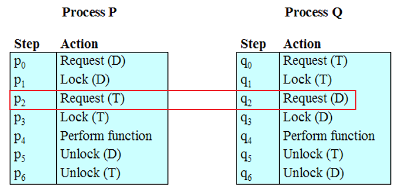

  处理这类死锁的一个策略是给系统设计施加关于资源请求顺序的约束。

- 案例二：

  如下图所示，假设可用的内存分配空间为200KB，且进程P1、P2发生如下请求序列：

  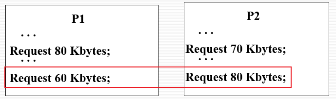

  如果两个进程都前进到它们的第二个请求时，则会发生死锁。解决这类特殊问题的最好办法是，通过使用虚拟内存。

### 可消耗资源

- 可消耗资源是指可以被创建（生产）和销毁（消耗）的资源。（通常对某种类型可消耗资源的数目没有限制，一个无阻塞的生产进程可以创建任意数目的这类资源。）

- 包括：中断、信号、消息和I/O缓冲区中的信息。

- 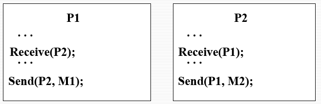

  如果Receive阻塞（即接收进程被阻塞直到收到消息），则发生死锁。

- 很少的事件组合也可能导致死锁。

### 资源分配图

为了更有效刻画进程的资源分配情况，引入了资源分配图（如下图）。

- 圆：表示并发的进程

- 方框：表示待分配的资源（其中的点的数量表示可用资源的数量）

- 有向线：

  - 进程→资源（圆→方框）：表示进程请求资源，但还没有得到授权。
  - 资源→进程（方框→圆）：表示资源请求已经被授权。（资源已经被进程占有）

  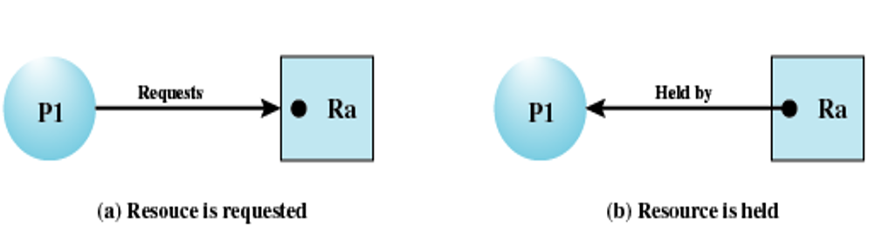

下面看一个例子：

> 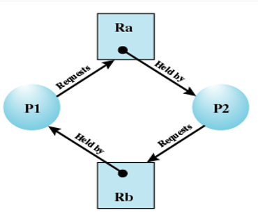
>
> 分析：
>
> 这是一个死锁的例子。资源Ra和Bb都仅拥有一个单位的资源。进程P1持有Rb同时请求Ra，同时，P2进程持有Ra同时又请求Rb。

### 死锁的条件

- 死锁的必要条件（一旦出现死锁，则必然发生的条件）：

  - **互斥**：一次只有一个进程可以使用一个资源。
  - **占有且等待**：当一个进程等待其他进程时，继续占有已经分配的资源。
  - **非抢占**：不能强行抢占进程已占有的资源。

- 第四个条件：

  - **循环等待**：存在一个封闭的进程链，使得每个进程至少占有此链中下一个进程所需要的一个资源。（如下图所示）

    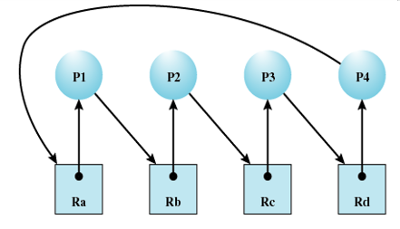

  > 说明：
  >
  > 第四个条件实际上是前三个条件的潜在结果，即假设前三个条件存在，可能发生的一系列事件会导致不可解的循环等待。这个不可解的循环等待实际上就是死锁的定义。条件4中列出的循环等待之所以是不可解的，是因为有前面三个条件的存在。因此，这四个条件连在一起构成了死锁的充分必要条件。

有了上述对死锁成因的分析，接下来我们将讨论如何解决死锁问题。这里分为两类，其中每一类又可以细分。

死锁的解除方案：

- 允许死锁发生
  - 静态策略：无
  - 动态策略：
    - **鸵鸟算法**
    - **死锁检测与死锁恢复**
- 不允许死锁发生
  - 静态策略：**死锁预防**
  - 动态策略：**死锁避免**

> 关于鸵鸟算法：
>
> 传说中鸵鸟看到危险就把头埋在地底下，使自己看不到危险。所以鸵鸟算法也是一种“不作为”的办法。在死锁问题出现概率很低的情况下，大多数工程师不会以性能损失或者易用性损失的代价来消除死锁，处理死锁问题的办法仅仅是忽略它。因为解决死锁的问题，通常代价很大。所以鸵鸟算法，是平衡性能和复杂性而选择的一种方法。（现在商业大部分都使用此算法）

下面我们重点讨论除鸵鸟算法之外的其他三种解决方法。

## 死锁预防

简单理解，死锁预防就是通过适当的策略，来消除死锁的四个成因之一，从而避免死锁的发生。

### 互斥

一般来讲，在所列出的四个条件中，第一个条件不可能禁止。如果需要对资源进行互斥访问，那么操作系统必须支持互斥。

### 占有且等待

为预防占有且等待的条件，可以要求进程一次性地请求所有需要的资源，并且阻塞这个进程直到所有请求都同时满足。

> 这种方法在两个方面是低效的。首先，一个进程可能被阻塞很长时间，以等待满足其所有的资源请求。而实际上，只要有一部分资源，它就可以继续执行。其次，分配给一个进程的资源可能有相当长的一段时间不会被使用，且在此期间，它们不能被其他进程使用。
>
> 另一个问题是一个进程可能事先并不会知道它所需要的所有资源。

### 不可抢占

下面的方法可以预防这个条件：

1.  如果占有某些资源的一个进程进行进一步资源请求被拒绝，则该进程必须释放它最初占有的资源。（如果有必要，可再次请求这些资源和另外的资源）
2.  如果一个进程请求当前被另一个进程占有的一个资源，则操作系统可以抢占另一个进程，要求它释放资源。（只有在任意两个进程的优先级都不相同的条件下才可以实现）

### 循环等待

循环等待条件可以通过定义资源类型的线性顺序来预防。

> 如果一个进程已经分配到了R类型的资源，那么它接下来请求的资源只能是那些排在R类型之后的资源类型。
>
> 循环等待的预防方法可能是低效的，它会使进程执行速度变慢，并且可能在没有必要的情况下拒绝资源访问。

## 死锁避免

要注意与死锁避免与死锁预防的差异：

- 死锁预防是通过约束资源请求，防止死锁的四个成因之一发生，从而避免死锁产生。

- 死锁避免允许三个必要条件的发生，但是通过进程启动拒绝算法，去规避可能导致死锁情况的事件发生。

  - 死锁避免比死锁预防允许更多的并发。

  - 是否允许当前的资源分配请求是通过判断该请求是否可能导致死锁来决定的。

    > - 如果一个进程的请求会导致死锁，则不启动此进程，进程启动拒绝
    > - 如果一个进程增加资源的请求会导致死锁，则不容许此分配，资源分配拒绝

  - 死锁避免需要知道将来的进程资源请求的情况。

### 进程启动拒绝

首先需要掌握四种数据结构：

- Resource（资源总量表）：系统中每种资源的总量
- Available（资源可用表）：未分配给进程的每种资源的总量（可用资源）
- Claim（最大需求矩阵）：C<sub>ij</sub> = 进程 i 对资源 j 的需求
- Allocation（资源分配矩阵）：A<sub>ij</sub> = 当前分配给进程 i 的资源 j

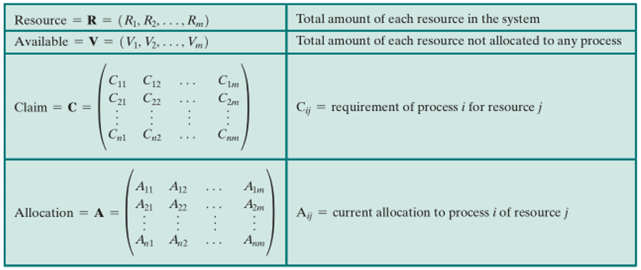

从以上定义中可以得出以下三个关系：

1.  
    ``` math
    R_{j} = V_{j} + \sum_{i=1}^{N} A_{ij}
    ```

    > 对所有 j ，所有资源或者可用，或者已被分配

2.  
    ``` math
    C_{ij} \le R_{i}
    ```

    > 对所有 i、j ，任何一个进程对任何一种资源的请求都不能超过系统中该种资源的总量。

3.  
    ``` math
    A_{ij} \le C_{ij}
    ```

    > 对所有 i、j ，分配给任何一个进程的任何一种资源都不会超过该进程最初声明的此资源的最大请求个数。

根据以上的关系，就可以定义一个死锁避免的策略：

对于所有的 j ，满足：

``` math
R_{j} \ge C_{(n+1)j} + \sum_{i=1}^{n} C_{ij}
```

才会启动一个进的进程P<sub>n+1</sub>。（只有所有当前进程的最大请求量加上新的进程请求可以满足时，才会启动该进程。）

> 案例分析：如下图，资源1、2、3的总量分别为10、10、9，进程一对三种资源的需求分别为1、4、5，进程二对三种资源的需求分别为3、5、4，如果启动进程P3需要请求三种资源的数量为2、3、1，请分析P3进程能否启动。
>
> 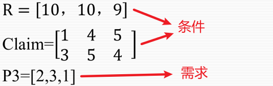
>
> 分析：
>
> - 对于资源1，三种进程的总需求为 1 + 3 + 2 = 6 \< 10 , 满足
> - 对于资源2，三种进程的总需求为 5 + 4 + 3 = 12 \> 10 , 不满足
>
> 所以进程三不得启动。

### 银行家算法（资源分配拒绝策略）

在说明银行家算法之前先明确以下三种状态：

- 系统状态：当前给进程分配的资源情况
- 安全状态：至少有一个资源分配序列不会导致死锁（即所有进程都能运行直到结束）
- 不安全状态：顾名思义，就是指不安全的状态

> 下面来看一个例子：
>
> 下图(a)显示了一个含有4个进程和3个资源的系统的状态。R1、R2和R3的资源总量分别为9、3和6。在当前状态下资源分配给4个进程，R2和R3各剩下1个可用单元。请问这是安全状态吗？
>
> 根据前面的介绍，对于进程 i 下面的条件应该满足对所有的 j，都有：
>
> ``` math
> C_{ij} - A_{ij} \le V_{j}
> ```
>
> 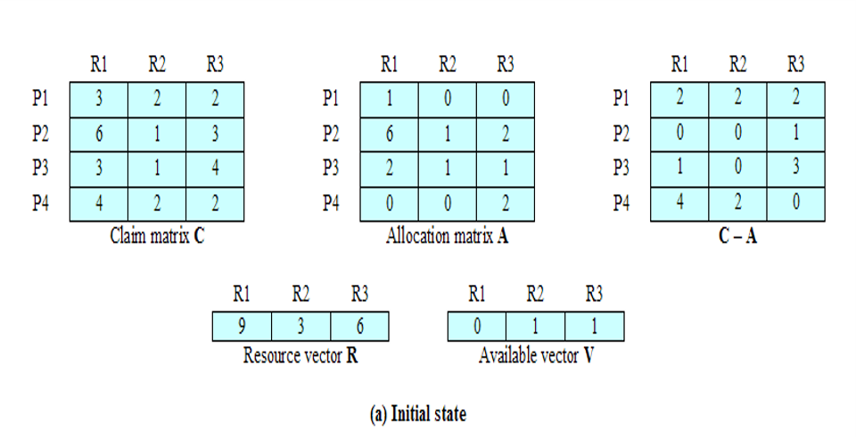
>
> 显然这对P1是不可能的，但是P2是可行的，因为P2只需要一个R3资源就拥有了它所需要的最大资源，因此P2进程运行。当运行完之后，它的资源回到可用资源池中（如下图(b)）
>
> 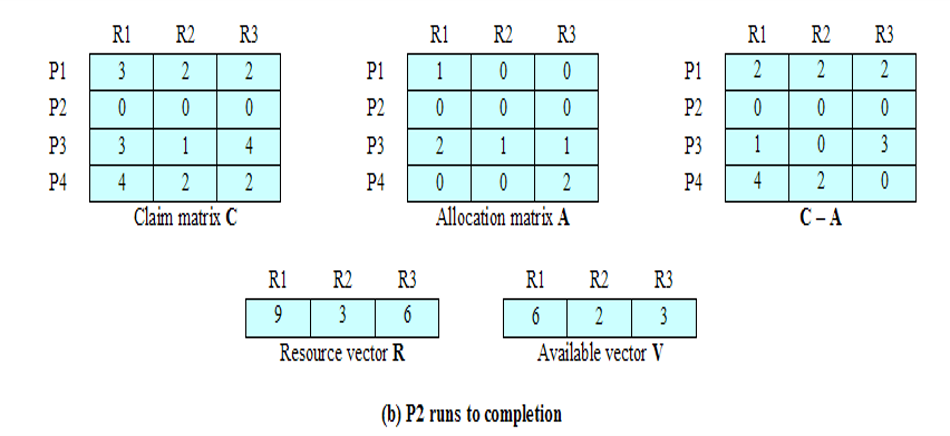
>
> 在这种情况下，所有进程都可以完成，假设选择P1运行，结束之后，资源释放并回到可用资源池中，如下图©。
>
> 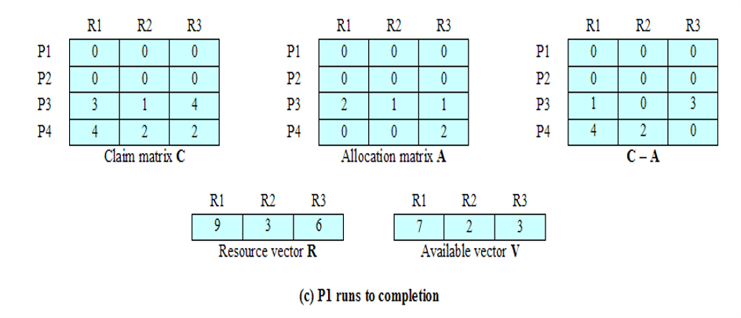
>
> 下一步完成P3进程，结束后资源如下图所示(d)。
>
> 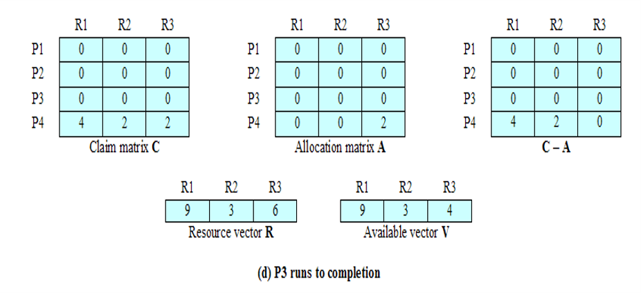
>
> 最后，可以完成P4进程。至此，所有进程运行结束，因此这是一个安全状态。
>
> ------------------------------------------------------------------------
>
> 再考虑下面一种状态：
>
> 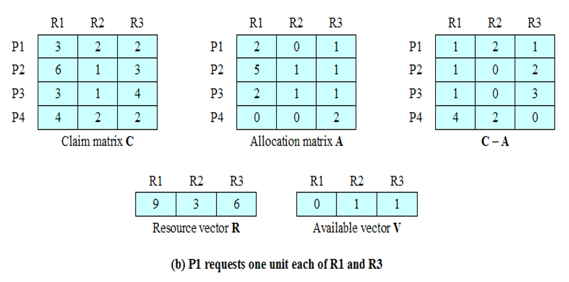
>
> 这种情况没有一个进程是可以运行的，因此这不是一个安全状态。
>
> 但是这并不是一个死锁状态，它仅仅是有死锁的可能（这点很重要）。
>
> （如果P1从这个状态开始运行，先释放一个R1单元和一个R3单元，后来又再次需要这些资源，则一旦这样做，系统将到达一个安全状态。因此，死锁避免策略并不能确切地预测死锁，它仅仅是预料死锁的可能性并确保永远不会出现这种可能性。）

下列代码给出了对死锁逻辑的一个抽象描述：

全局数据结构

<figure class="highlight c++">
<table>
<colgroup>
<col style="width: 50%" />
<col style="width: 50%" />
</colgroup>
<tbody>
<tr>
<td class="gutter"><pre><code>1
2
3
4
5
6
7</code></pre></td>
<td class="code"><pre><code>struct state
{
    int resource[m];
    int available[m];
    int claim[n][m];
    int alloc[n][m];
}</code></pre></td>
</tr>
</tbody>
</table>
</figure>

资源分配算法

<figure class="highlight c++">
<table>
<colgroup>
<col style="width: 50%" />
<col style="width: 50%" />
</colgroup>
<tbody>
<tr>
<td class="gutter"><pre><code>1
2
3
4
5
6
7
8
9
10
11
12
13
14
15
16
17</code></pre></td>
<td class="code"><pre><code>if (alloc [i,*] + request [*] &gt; claim [i,*])
    &lt; error &gt;;              /*总请求量大于需求*/
else if (request [*] &gt; available [*])
    &lt; suspend process &gt;;               /*模拟分配*/
else
{
    &lt; define newstate by:
    alloc [i,*] = alloc [i,*] + request [*];
    available [*] = available [*] - request [*] &gt;;
}
if (safe (newstate))
    &lt; carry out allocation &gt;;
else
{
    &lt;restore original state &gt;;
    &lt; suspend process &gt;;
}</code></pre></td>
</tr>
</tbody>
</table>
</figure>

测试安全算法（银行家算法）

<figure class="highlight c++">
<table>
<colgroup>
<col style="width: 50%" />
<col style="width: 50%" />
</colgroup>
<tbody>
<tr>
<td class="gutter"><pre><code>1
2
3
4
5
6
7
8
9
10
11
12
13
14
15
16
17
18
19
20
21</code></pre></td>
<td class="code"><pre><code>boolean safe (state S)
{
    int currentavail[m];
    process rest[&lt;number of processes&gt;];
    currentavail = available;
    rest = {all processes};
    possible = true;
    while (possible)
    {
        &lt; find a process Pk in rest suck that
            claim [k,*] - alloc [k,*] &lt;= currentavail;&gt;
        if (found)              /*模拟Pk的执行*/
        {
            currentavail = currentavail + alloc [k,*];
            rest = rest - {Pk};
        }
        else
            possible = false;
    }
    return (rest == null);
}</code></pre></td>
</tr>
</tbody>
</table>
</figure>

> 说明：
>
> 数据结构`state`定义了系统状态，`request[*]`是一个向量，定义了进程 i 的资源请求。
>
> 首先，进行一次检测，确保该请求不会超过进程最初声明的要求。如果该请求有效，下一步确定是否可能实现这个请求（即有足够的可用资源）。如果不可能，则该进程被挂起；如果可能，则最后一步是确定完成这个请求是否是安全的。为做到这一点，资源被暂时分配给进程 i 以形成一个newstate。

死锁避免的优点是它不需要死锁预防中的抢占和回滚进程，并且比死锁预防的限制少。但是仍有以下限制：

- 必须事先声明每个进程请求的最大资源
- 考虑的进程必须是无关的，也就是说，它们执行的顺序必须没有任何同步要求的限制
- 分配的资源数目必须是固定的，且只考虑可重用资源
- 在占有资源时，进程不能退出
- 时间复杂度高（O(m·n<sup>2</sup>)）

## 死锁检测

死锁预防策略是非常保守的，它们通过限制访问资源和在进程上强加约束来解决死锁问题。

死锁检测策略则完全相反，它不限制资源访问或约束进程行为。对于死锁检测来说，只要有可能，被请求的资源就被授权给进程。操作系统周期性地执行一个算法检测“循环等待”条件（上文提到的死锁成因中的条件4）。

### 死锁检测算法

该算法使用了上文提到的`Allocation矩阵`以及`Available向量`，除此之外，还定义了请求(Requset)矩阵Q，其中Q<sub>ij</sub>表示进程 i 请求的类型 j 的资源量。算法主要是一个标记没有死锁的进程的过程。最初，所有的进程都是未标记的，然后执行下列步骤：

1.  标记Allocation矩阵中一行全为零的进程。
2.  初始化一个临时向量W，令其等于Available向量。
3.  查找下标 i，使用进程 i 当前未标记且 Q 的第 i 行小于等于 W，即对所有的 1 ≤ K ≤ m，Q<sub>ik</sub>≤W<sub>k</sub>。如果找不到这样的行，终止算法。
4.  如果找到这样的行，标记进程 i，并把Allocation矩阵中的相应行加到W中，也就是说，对所有的1 ≤ K ≤ m，令W<sub>k</sub> = W<sub>k</sub> + A<sub>ik</sub>。返回步骤3。

> 下面来看一个例子：
>
> 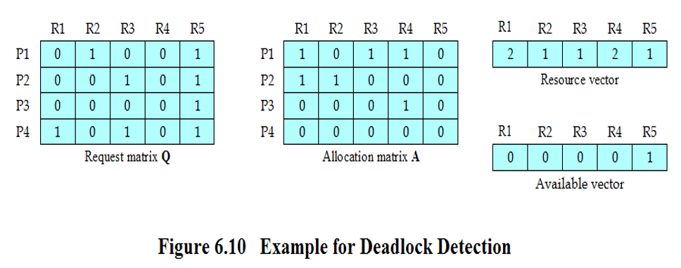
>
> 1.  令 W =（ 0 0 0 0 1 ）（W = A）。
> 2.  进程P3的请求小于或等于W，因此标记P3，并令W = W +（ 0 0 0 1 0 ）=（ 0 0 0 1 1 ）。
> 3.  再去检测Request矩阵，发现其他进程都不满足运行条件，因此终止算法。
>
> 算法的结果是P1、P2、P4未标记，表示这三个进程是死锁的。

### 恢复

一旦检测到死锁，就需要某种策略以恢复死锁。下面按复杂度递增的顺序列出可能的方法：

1.  取消所有的死锁进程。

2.  把每个死锁进程回滚到前面定义的某些检查点，并且重新启动所有进程。

    > 这要求在系统中构造回滚和重启机制。该方法的风险是原来的死锁可能再次发生。但是，并发进程的不确定性通常能保证不会发生这种情况。

3.  连续取消死锁进程直到不再存在死锁。

    > 选择取消进程的顺序基于某种最小代价原则。在每次取消后，必须重新调用检测算法，以测试是否仍存在死锁。

4.  连续抢占资源直到不再存在死锁。

    > 同第3条一样，需要使用一种基于代价的选择方法，并且需要在每次抢占后重新调用检测算法。一个资源被抢占的进程必须回滚到获得这个资源之前的某一状态。

对于上述的第3、4条，选择原则可以采用下面中的一种：

- 目前为止消耗的处理器时间最少。
- 目前为止产生的输出最少。
- 预计剩下的时间最长。
- 目前为止分配的资源总量最少。
- 优先级最低。

## 一种综合的死锁策略

我们先以表格的形式小结一下前文讲述的解决死锁的策略：

<table>
<colgroup>
<col style="width: 20%" />
<col style="width: 20%" />
<col style="width: 20%" />
<col style="width: 20%" />
<col style="width: 20%" />
</colgroup>
<thead>
<tr>
<th>原则</th>
<th>资源分配策略</th>
<th>不同的方案</th>
<th>主要优点</th>
<th>主要缺点</th>
</tr>
</thead>
<tbody>
<tr>
<td>预防</td>
<td>保守的；预提交资源</td>
<td>一次性请求所有资源</td>
<td>·对执行一连串活动的进程非常有效<br />
·不需要抢占</td>
<td>·低效<br />
·延迟进程的初始化<br />
·必须知道将来的资源请求</td>
</tr>
<tr>
<td>预防</td>
<td>保守的；预提交资源</td>
<td>抢占</td>
<td>·用于状态易于保存和恢复的资源时非常方便</td>
<td>·过于经常地没必要地抢占</td>
</tr>
<tr>
<td>预防</td>
<td>保守的；预提交资源</td>
<td>资源排序</td>
<td>·通过编译时检测是可以实施的<br />
·既然问题已经在系统设计时解决了，不需要在运行时间计算</td>
<td>·禁止增加的资源请求</td>
</tr>
<tr>
<td>避免</td>
<td>处于检测和预防中间</td>
<td>操作以发现至少一条安全路径</td>
<td>·不需要抢占</td>
<td>·必须知道将来的资源请求<br />
·进程不能被长时间阻塞</td>
</tr>
<tr>
<td>检测</td>
<td>非常自由；只要可能，请求的资源都允许</td>
<td>周期性地调用以测试死锁</td>
<td>·不会延迟进程的初始化<br />
·易于在线处理</td>
<td>·固有的抢占被丢失</td>
</tr>
</tbody>
</table>

从上表中可见，所有的解决死锁的策略都各有其优缺点。与其将操作系统机制设计为只采用其中一种策略，还不如在不同情况下使用不同的策略更有效。为此提供了一种方法：

- 把资源分成几组不同的资源类。
- 为预防在资源类之间由于循环等待产生死锁，可使用前面定义的线性排序策略。
- 在一个资源类中，使用该类资源最适合的算法。为此，考虑下列的资源类：
  - 可交换空间：在进程交换中所使用的外存中的存储块。
  - 进程资源：可分配的设备，如磁带设备和文件。
  - 内存：可以按页或按段分配给进程。
  - 内部资源：诸如I/O通道。
- 以上列出的次序表示了资源分配的次序。考虑到一个进程在其生命周期中的步骤顺序，这个次序是最合理的。在每一类中，可采用以下策略：
  - 可交换空间：通过要求**一次性分配所有请求的资源**来预防死锁，就像占有且等待预防策略一样。如果知道最大存储需求（通常情况下都知道），则这个策略是合理的。死锁避免也是可能的。
  - 进程资源：对这类资源，**死锁避免策略**常常是很有效的，这是因为进程可以事先声明它们将需要的这类资源。采用**资源排序的预防策略**也是可能的。
  - 内存：对于内存，基于**抢占**的预防是最适合的策略。当一个进程被抢占后，它仅仅被换到外存，释放空间以解决死锁。
  - 内部资源：可以使用基于**资源排序**的预防策略。

## 哲学家就餐问题

同样移步至下方链接👇👇👇👇

<a href="/butterfly/2021/04/25/%E6%93%8D%E4%BD%9C%E7%B3%BB%E7%BB%9F/%E6%93%8D%E4%BD%9C%E7%B3%BB%E7%BB%9F%E5%AD%A6%E4%B9%A0%E7%AC%94%E8%AE%B0-%E4%BF%A1%E5%8F%B7%E9%87%8F%E7%9B%B8%E5%85%B3%E9%97%AE%E9%A2%98/" class="btn-beautify block outline orange larger" title="点击跳转 至 《信号量相关问题》"><em></em>点击跳转 至 《信号量相关问题》</a>

------------------------------------------------------------------------

# 后记

本篇已完结

（如有修改或补充欢迎评论）
