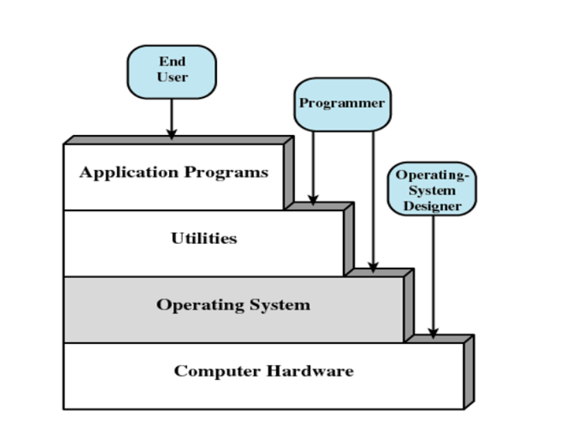
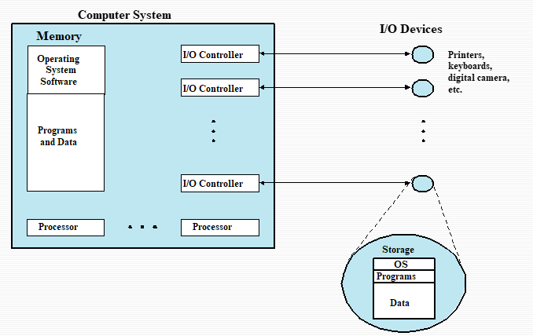
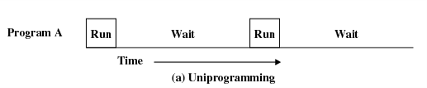
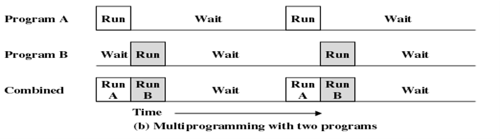
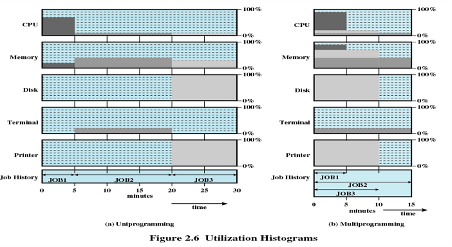
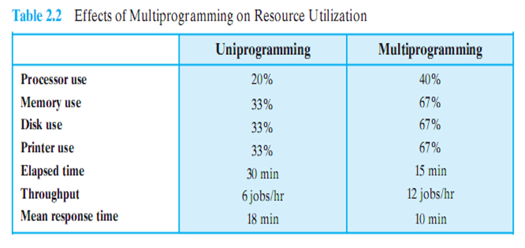
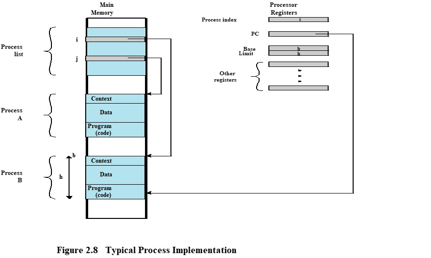
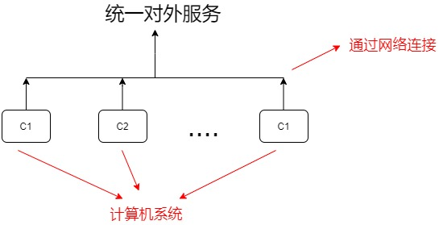

# 操作系统学习笔记-操作系统概述

> 📌 转载自 **花猪のBlog（作者 CNhuazhu）** —— 原文：https://cnhuazhu.top/butterfly/2021/03/22/%E6%93%8D%E4%BD%9C%E7%B3%BB%E7%BB%9F/%E6%93%8D%E4%BD%9C%E7%B3%BB%E7%BB%9F%E5%AD%A6%E4%B9%A0%E7%AC%94%E8%AE%B0-%E6%93%8D%E4%BD%9C%E7%B3%BB%E7%BB%9F%E6%A6%82%E8%BF%B0/
> 学习笔记，版权归原作者所有，仅供学弟学妹学习参考；如有侵权请联系删除。

---

# 前言

*正在学习操作系统，记录笔记。*

> 参考资料：
>
> 《操作系统（精髓与设计原理 第6版）

------------------------------------------------------------------------

# 第二章：操作系统概述

## 操作系统的目标和功能

### 操作系统定义

操作系统是一组控制应用程序执行的程序，并充当应用程序和计算机硬件之间的接口。（A group of program that controls the execution of application programs. Acts as an interface between applications and hardware）

> 无操作系统也可以使用计算机，但是操作十分复杂，只有受过相当训练的专业人士才可以使用。

操作系统的目标：

- 方便（Convenience）：使计算机更易于使用。
- 有效（Efficiency）：允许以更有效地方式使用计算机系统资源。
- 扩展能力（Ability to evolve ）：允许在不妨碍服务的前提下有效地开发、测试和引入新的系统功能。

### 操作系统作为用户与计算机的接口

我们先来看一下计算机系统的层次：



> 自上向下看：终端用户一般不会去考虑底层的硬件细节，只需要操作不同的应用程序就好。开发应用的工作由程序员完成，如果需要用一组完全负责控制计算机硬件的机器指令开发应用程序是一件极其复杂的事。为了简化这一开发过程，需要一些系统程序（其中一部分就称为实用工具，Utilities），提供一些如创建程序、管理文件、控制I/O设备功能的接口。最重要的系统程序就是操作系统，它为程序员屏蔽了硬件细节，并为程序员提供各种便于开发的接口。

操作系统为开发者提供各种服务的接口，以便于更容易地访问和使用以下7类服务：

- 程序开发（Program development）：操作系统提供各种工具以及服务（如：编辑器、调试器…）用于帮助开发程序。（并不属于操作系统核心的一部分）
- 程序执行（Program execution）：程序运行需要很多步骤——把指令和数据载入内存、为其分配CPU资源、将运行结果保存到外部、释放CPU资源。这一系列的步骤需要操作系统全程参与，做好调度工作。
- I/O设备访问（Access to I/O devices）：每个I/O设备的操作都需要特有的指令集或者控制信号，操作系统为此提供了统一的接口，以便使用。
- 文件访问控制（Controlled access to files）：对于有多个用户的系统，操作系统可以提供保护机制来控制对文件的访问。
- 系统访问（System access）：对于共享或公共的系统，操作系统可以控制特殊资源的访问（授权/非授权），以此对资源和数据进行保护。
- 错误检测和响应（Error detection and response）：计算机系统运行可能发生各种错误（包括软件和硬件），对于这些错误操作系统都必须要能检测并且提供响应，以便解决问题。
- 审计（Accounting）：操作系统可以查看各种资源的使用情况，以便于及时调整，提高性能。

### 操作系统作为资源管理者

一台计算机就是一组资源，这些资源用于对数据的移动、存储和处理，以及对这些功能的控制。而操作系统负责管理这些资源。

- 操作系统负责管理资源/硬件。

- 工作方式与其他普通的计算机软件一样，操作系统也是由处理器执行的一段程序或一组程序。

- 操作系统经常会释放控制，并且必须依赖处理器才能恢复控制

  > 操作系统本质也是一组计算机程序，它可以通过管理计算机资源，从而控制计算机的基本功能。（所以从某种意义上来讲，是操作系统在控制各种数据的移动、存储和处理）。但是它与一般的计算机软件不同的地方在于，操作系统可以主动获取或释放CPU资源。

操作系统中有一部分常驻于内存中，称之为**内核**（Kernel，也称**核子**，Nucleus）。内核程序包含操作系统中最常使用的功能。

> 内存的其余部分包含用户程序和数据，它的分配由操作系统和处理器中的存储管理硬件联合控制。操作系统决定在程序运行过程中何时使用I/O设备，并控制文件的访问和使用。处理器自身也是一个资源，操作系统必须决定在运行一个特定的用户程序时，可以分配多少处理器时间，在多处理器系统中，这个决定要传到所有的处理器。

下图展示了由操作系统管理的主要资源：



### 操作系统的易扩展性

一个重要的操作系统应该能够不断发展，其原因如下：

- 硬件升级和新型硬件的出现：

  例如，图形终端和页面式终端代替了行滚动终端；图形终端允许允许用户通过屏幕上的多个“窗口”同时查看多个应用程序。

- 新的服务：

  为适应用户的要求或满足管理员的需要，需要扩展操作系统以提供新的服务。

- 纠正错误：

  任何一个操作系统都会有bug，随着时间的推移会发现这些错误并引入相应的补丁。（当然补丁也有可能引入新的错误）

## 操作系统的发展

### 第一阶段：串行阶段（Serial Processing ）

该阶段属于没有操作系统的阶段。（1940s-1950s）

特点：程序员是通过直接与计算机硬件打交道的方式来操作计算机。

操作方式：由于没有操作系统，机器是在一个控制台上运行的，控制台包括：显示灯、触发器（拨动开关）、输入设备、打印机。用机器代码编写的程序通过输入设备（如卡片阅读机）载入计算机，如果错误导致程序终止运行，显示灯会给出指示，如果程序正常完成，运行结果会出现在打印机中。

主要问题：包括两个方面

- 调度问题（Scheduling）：大多数装置都使用一个硬拷贝（hardcopy）的登记表预定机器时间。如果一个用户在预定时间之内没有完成程序的运行，那么将会强制终止；如果在程序运行完成之后还有大量的时间，则会造成当时极为宝贵的CPU资源的浪费。（”人机矛盾“）
- 准备时间（Setup time）：一个程序在当时称为作业（job）。它包括往内存中加载编译器和高级语言程序（源程序），保存编译后的程序（目标程序），然后加载目标程序和公用函数，并链接在一起。（这里每一步都有可能安装或拆卸磁带，或者准备卡片组，在此期间一旦发生错误，只能重新开始。而且用户是独占计算机系统资源，资源并没有得到有效利用。）

### 第二阶段：简单批处理系统（Simple Batch Systems）

简单批处理方案的核心思想是使用一个称为**监控程序**（monitor）的软件。

工作流程：

用户不再直接访问机器，他们把卡片或磁带中的作业（分批）交给计算机操作员，由操作员将其按顺序组织起来，放在输入设备上，交给监控程序使用。要执行作业时，控制程序会将CPU控制权移交给作业，每个作业执行完毕又都会将CPU的控制权交还给控制程序。接着监控程序继续加载下一个作业。

> 注意程序（program）与作业（job）的区别：
>
> **作业 = 程序 + 数据 + 作业说明书**

下面分别从监控程序（Monitor）和处理器（CPU）两个角度分析工作原理：

- 监控程序角度：

  监控程序控制事件的顺序。因此需要大部分监控程序必须总是处于内存中并且可以执行，这部分称作**常驻监控程序**（resident monitor）。监控程序每次从输入设备（通常是卡片阅读机或磁带驱动器）中读取一个作业，并将其置于内存中的一个用户程序区域，并把控制权交给该作业，当作业完成后，控制权返还给监控程序，它继续读取下一个作业。每个作业的结果被发送到输出设备（如打印机），交付给用户。

- 处理器角度：

  从某个角度看，处理器执行内存中存储的监控程序中的指令；这些指令读入下一个作业并将其存储到内存中的另一个部分。一旦已经读入一个作业，处理器将会遇到监控程序中的**分支指令**，分支指令指导处理器在用户程序的开始处继续执行。处理器继而执行用户程序中的指令，直到遇到一个结束指令或错误条件。不论哪种情况都将导致处理器从监控程序中取下一条指令。

  因此，“控制权交给作业”仅仅意味着处理器当前取和执行的都是用户程序中的指令，而“控制权返回给监控程序”的意思是处理器当前从监控程序中取指令并执行指令。

> 监控程序改善了作业的准备时间，每个作业中的指令均以一种**作业控制语言**（Job Control Language，JCL）的基本形式给出，这是一种特殊类型的程序设计语言，用于为监控程序提供指令。

监控程序（或者说批处理操作系统），只是一个简单的计算机程序。它依赖于处理器可以从内存的不同部分取指令的能力，以交替地获取或释放控制权。此外还考虑到了其他硬件功能：

- 内存保护（Memory protection）：当用户程序正在运行时，不能改变包含监控程序的内存区域。如果试图这样做，处理器硬件将发现错误，并将控制转移给监控程序，监控程序取消这个作业，输出错误信息，并载入下一个作业。
- 定时器（Timer）：防止一个作业长期独占系统。在每个作业开始时，设置定时器，如果定时器时间到，用户程序被停止，控制权返回给监控程序。
- 特权指令（Privileged instructions）：某些机器语言只能由监控程序执行。如果处理器在运行一个用户程序时遇到这类指令，则会发生错误，并将控制权转移给监控程序。（I/O指令属于特权指令，因此监控程序可以控制所有的I/O设备）
- 中断（Interrupts）：早期的计算机模型并没有中断能力。这个特征使得操作系统在让用户程序放弃控制权或从用户程序获得控制权时具有更大的灵活性。

CPU模式：

- 用户模式（user mode）：用户程序在用户模式下运行。这便意味着：
  - 某些指令是不会被执行的（如特权指令）
  - 有些内存区域是无法被访问的
- 系统模式（system mode）：监控程序在系统模式下运行。（这也可以成为**内核模式**，Kernel mode）
  - 特权指令可以被执行
  - 受保护的内存区域也可以被访问（可以访问所有内存区域）

### 第三阶段：多道批处理系统（Multiprogrammed Batch Systems）

简单批处理系统提高了CPU资源的利用率，但是由于I/O设备相对于处理器的速度太慢（一个用户程序要使用I/O设备，CPU必须要等待），处理器依然是空闲的。

下图显示了只有一个单独程序的情况，被称为**单道程序设计**（Uniprogramming）：



这种低效率是可以避免的。内存空间可以保存操作系统（常驻监控程序）和一个用户程序。假设内存空间容得下操作系统和两个用户程序，那么当一个作业需要等待I/O时，处理器可以切换到另一个可能并不在等待I/O的作业，进一步还可以扩展存储器以保存三个、四个或更多的程序，并且在它们之间进行切换。这种处理称做**多道程序设计**（Multiprogramming）或**多任务处理**（Multitasking），它是现代操作系统的主要方案。



下面是单道程序设计以及多道程序设计对于硬件设备的利用率对比：





> 利用率的计算方法（以单道程序设计中对CPU的利用率为例）：
>
> ``` math
> 利用率 = \frac{\sum不同阶段的使用时长 × 对应的使用率}{总时长}
> ```
>
> ``` math
> Processor use = \frac{5×0.7 + 15×0.1 + 10×0.1}{5+15+10} = 0.2
> ```

同简单的批处理系统一样，多道批处理系统依然需要依赖某些计算机硬件功能：中断机制、DMA模块等。

多道批处理系统也存在一些新的问题：

- 内存管理（Memory Management）：对准备运行的多个作业，他们必须都保留在内存中，这时候就要合理的安排内存空间的使用。
- 调度问题（Scheduling）：如果准备运行多个作业，处理器必须决定运行哪一个，这需要某种调度算法。
- 状态的保存/恢复（save and restore）：一个作业未处理完要去执行其他作业的时候需要考虑到中断时的状态，以及在处理完其他作业之后回头再继续执行被中断作业的恢复问题。
- 资源竞争问题（Contention for resources）：每一个作业的运行都要利用资源，这时应该合理考虑资源的分配。
- 对用户响应时间长（不友好）

### 第四阶段：分时系统（Time-Sharing Systems）

多道批处理系统已经极大地提高了计算机系统的效率，但是对于用户交互性的实现并不好。所以出现了分时技术（Time-Sharing），多个用户可以同时分享处理器时间，以达到减少用户响应时间的目的。

在分时系统中，多个用户可以通过多个终端同时访问系统，由操作系统控制每个用户程序以很短的时间为单位交替执行。（分时复用）

批处理多道程序设计和分时的比较

| 项目           | 批处理多道程序设计         | 分时             |
|----------------|----------------------------|------------------|
| 主要目标       | 充分使用处理器             | 减小响应时间     |
| 操作系统指令源 | 作业提供的作业控制语言命令 | 从终端键入的命令 |

同样的，分时处理系统也需要很多计算机硬件支持（如中断机制等）

像多道批处理系统，分时系统同样也存在以下问题：

- 内存管理（Memory Management）
- 调度问题（Scheduling）
- 状态的保存/恢复（save and restore）
- 资源竞争问题（Contention for resources）

## 主要成就

\[DENN80a\]提出在操作系统开发中的5个重要的理论进展：进程（The Process）、内存管理（Memory Management）、信息保护和安全（Information Protection and Security）、调度和资源管理（Scheduling and Resource Management）、系统结构（System Structure）。下面就从这五个方面逐介绍。

### 进程（The Process）

进程的概念是操作系统的基础。Multics的设计者在20世纪60年代首使用了这个术语\[DALE68\]。

关于进程的定义（4种）：

- 一个正在执行的程序。
- 计算机中正在运行的程序的一个实例（Instance）。
- 可以分配给处理器并由处理器执行的一个实体（Entity）。
- 由单一的顺序的执行线程、一个当前状态和一组相关的系统资源所描述的活动单元。

引入进程的原因：为了实现多道程序批处理操作，以提高计算机的效率。

> 计算机系统的发展有三条主线：多道程序批处理操作、分时系统、实时事物系统。他们在时间安排和同步中所产生的问题推动了进程概念的发展。
>
> 事务处理系统和分时系统的主要差别：事务处理系统局限于一个或几个应用，而分时系统的用户可以从事程序开发、作业执行以及使用各种各样的应用程序。

前文介绍，早期的系统程序员在实现多道程序和多用户交互系统时采用的主要工具就是中断。但是由于I/O设备与CPU速度的巨大差异，导致中断并不能有效地支持多道。这就使得计算机系统容易出现错误，大致可以分为以下4类：

- 不正确的同步（Improper synchronization）

  常常会出现这样的情况，即一个例程（routine）必须挂起，等待系统中其他地方的某一事件传来信号。如果设计不正确的信号机制则可能导致信号丢失或者收到重复信号。

- 失败的互斥（Failed mutual exclusion）

  常常会出现多个用户或程序试图同时使用一个共享资源的情况。例如，两个用户可能试图编辑同一个文件，如果不控制这种访问，就会发生错误。因此需要设计某种互斥机制，以保证一次只允许一个例程对一部分数据执行事务处理。

- 不确定的程序操作（Nondeterminate program operation）

  一个特定程序的结果只依赖于该程序的输入，而并不依赖于共享系统中其他程序的活动。但是，当程序共享内存并且处理器控制它们交错执行时，它们可能会因为重写相同的内存区域而发生不可预测的相互干扰。因此，程序调度顺序可能会影响某个特定程序的输出结果。

- 死锁（Deadlocks）

  很有可能两个或多个程序相互挂起等待。

解决这些问题需要一种系统级的方法监控处理器中不同程序的执行。进程的概念为此提供了基础。

进程的组成

进程的组成为三个部分：`process = program + data + context`。即：

- 一段可执行的程序

- 程序所需要的相关数据（变量、工作空间、缓冲区等）

- 程序的执行上下文（即程序运行的状态）

  > 执行上下文（execution context）是根本，又称为进程状态（process state）。是操作系统用来管理和控制进程所需要的内部数据。这种内部信息和进程是分开的，因为操作系统信息不允许被进程直接访问。



如图是一个典型的进程实现方法。进程索引寄存器表明进程B正在执行。以前执行的进程被临时中断，在A中断的同时，所有寄存器的内容被记录在它的执行上下文环境中，以后操作系统就可以执行进程切换，恢复进程A的执行。进程切换过程包括保存B的上下文和恢复A的上下文。当在程序计数器中载入指向A的程序区域的值时，进程A自动恢复执行。

> 进程索引寄存器（process index register）：包含当前正在控制处理器的进程在进程表中的索引。
>
> 基址寄存器（base register）与界限存储器（limit register）定义了该进程所占据的存储器区域。基址寄存器中保存了该存储器区域的开始地址；界限存储器中保存了该区域的大小（以字节或字为单位）。
>
> 程序计数器和所有的数据引用相对于基址寄存器被解释，并且不能超过界限寄存器中的值，这就可以保护内部进程间不会相互干涉。
>
> 进程的本质是一种软件机制。
>
> 进程被当作数据结构来实现，（一个进程可以是正在执行，也可以是等待执行）：
>
> - 采用这种结构是为了解决多道程序设计和资源共享带来的问题。
> - 操作系统管理进程所需的所有信息都存储在数据结构中。

### 内存管理（Memory Management）

操作系统担负着5个基本的存储器管理（storage management）责任：

- 进程隔离（Process isolation）

  操纵系统必须保护独立的进程，防止互相干涉各自的存储空间，包括数据和指令。

- 自动分配和管理（Automatic allocation and management）

  程序应该根据需要在存储层次间动态地分配，分配对程序员是透明的。因此，程序员无需关心与存储限制有关的问题，操作系统有效地实现分配问题，可以仅在需要时才给作业分配存储空间。

- 支持模块化程序设计（Support of modular programming）

  程序员应该能够定义程序模块，并且动态地创建、销毁模块，动态地改变模块大小。

- 保护和访问控制（Protection and access control）

  不论在存储层次中的哪一级，存储器的共享都会产生一个程序访问另一个程序存储空间的潜在可能性。当一个特定的应用程序需要共事时，这是可取的。但在别的时候，它可能威胁到程序的完整性，甚至威胁到操作系统自身。操作系统必须允许一部分内存可以由各种用户以各种方式进行访问。

- 长期存储（Long-term storage）

  许多应用程序需要在计算机关机后长时间保存信息。

在典型情况下，操作系统使用文件系统机制（File System ）和虚拟存储器机制（Virtual Memory / VM）来满足上述要求。

- 文件系统：实现了长期存储，它在一个有名字的对象中保存信息，这个对象称作文件。（对程序员来说，文件是一个很方便的概念，对操作系统来说，文件是访问控制和保护的一个有用单元）。

- 虚拟存储器：允许程序从逻辑的角度访问存储器，而不考虑物理内存上可用空间的容量。虚拟存储器的构想是为了满足有多个用户作业同时驻留在内存中的要求，这样，当一个进程被写出到辅助存储器中并且后继进程被读人时，在连续的进程执行之间将不会脱节。

  > 可以把虚拟存储简单的理解为一种存储机制：以小内存去运行大程序。

- 分页系统（Page）：由于进程大小不同，如果处理器在很多进程间切换，则很难把它们紧密地压入内存中，因此引进了分页系统。在分页系统中，进程由许多固定大小的块组成，这些块称作页。进程的每一页都可以放置在内存中的任何地方。

  > 分页系统提供了程序中使用的虚地址（virtual address）和内存中的实地址（real address）或物理地址之间的动态映射。

### 信息保护和安全（Information Protection and Security）

大多数与操作系统相关的安全和保护问题可以分为以下4类：

- 可用性（Availability）：保护系统不被打断。
- 保密性（Confidentiality）：在多个用户共享一个计算机系统时，保证用户不能读取到未授权访问的数据。
- 数据完整性（Data integrity）：保护数据不被未授权篡改。
- 认证（Authenticity）：涉及用户身份的正确认证和消息或数据的合法性。

### 调度和资源管理（Scheduling and Resource Management）

操作系统的一个关键任务就是管理各种可用资源，包括：CPU（进程）管理、内存管理、I/O设备管理、信息（文件）管理。

任何资源分配和调度策略都必须考虑以下3个因素：

- 公平性（Fairness）

  通常希望给竞争使用某一特定资源的所有进程提供几乎相等和公平的访问机会。对同一类作业，也就是说有类似请求的作业，更是需要如此。

- 有差别的响应（Differential responsiveness）

  操作系统需要区分有不同服务要求的不同进程。操作系统将试图做出满足所有要求的分配和调度决策，并且动态地做出决策。

- 高效性（Efficiency）

  操作系统希望获得最大的吞吐量（throughput）和最小的响应时间（response time），并且在分时的情况下，能够容纳尽可能多的用户。

  > 可以看出这些标准是相互矛盾的，所以操作系统需要在这些条件下寻找适当的平衡。

  > 操作系统在进行调度和资源管理时使用了一种非常重要的数据结构：队列（Queue）

### 系统结构（System Structure）

随着操作系统中增加了越来越多的功能，并且底层硬件变得更强大、更加通用，导致操作系统的大小和复杂性也随着增加。

> - MIT在1963年投入使用的CTSS，大约包含32000个36位字。
> - 1964年IBM开发的OS/360有超过100万条的机器指令
> - 1975年MIT和Bel1实验室开发的Multics系统增长到了2000万条机器指令
> - 关于Windows：
>   - Windows NT 4.0: 1600万行代码
>   - Windows 2000: 3200多万行代码
>   - Windows XP: 3500万行代码
>   - Windows Vista: 5000万行代码
> - Linux 2.6.27: 1000万行代码

一个功能完善的操作系统的大小和它所处理的任务的困难性，导致了以下4个普遍存在的问题：

- 操作系统在交付使用时就习惯性地表现出落后的态势。这就要求有新的操作系统或者升级老的操作系统
- 具体的表现总是事与愿违，难以达到期望的性能。
- 随着时间的推移会发现越来越多的缺陷，这些缺陷必须及时修复。
- 理论表明，不可能开发出既复杂的又不易受各种包括病毒、蠕虫和未授权访问之类的安全性攻击的操作系统。

针对以上问题提出的解决方案：

- 软件必须是模块化的：有助于组织软件开发过程、限定诊断范围和修正错误。

- 模块相互之间必须有定义很好的接口：接口必须尽可能简单，这不但可以简化程序设计任务，还可以使系统的扩展更加容易。（把不同模块之间的耦合度尽可能降低）

- 分层：现代操作系统的层次结构按照复杂性、时间刻度、抽象级进行功能划分。

  > 我们可以把系统看作是一系列的层（a series of levels）：
  >
  > - 每一层执行操作系统所需功能的相关子集。
  > - 每一个层次实现功能都要依靠下一个更低的层次，较低层次执行更为原始的功能并隐藏这些功能的细节。
  >
  > 这就把一个问题分解成了许多更容易处理的子问题。

## 现代操作系统（Modern Operating Systems）

在过去数年中，由于硬件的发展、新的应用程序的出现以及新的安全威胁，操作系统的结构和功能得到逐步发展，是操作系统发生了本质的变化。

对操作系统要求上的变化速度之快不仅需要修改和增强现有的操作系统体系结构，而且需要有新的操作系统组织方法。在实验用和商用操作系统中有很多不同的方法和设计要素，大致可以分为：微内核体系结构（Microkernel architecture）、多线程（Multithreading ）、对称多处理（Symmetric multiprocessing ，SMP）、分布式操作系统（Distributed operating systems ）、面向对象设计（–Object-oriented design）。下面来逐一介绍：

- 微内核结构（Microkernel architecture）

  微内核与宏内核结构（或单体内核，monolithic kernel architecture）的差别在于微内核体系结构仅给内核分配以下最基本的功能：

  - 地址空间（Address spaces），地址转换
  - 进程间的通讯（Interprocess communication ，IPC）
  - 基本的调度（Basic scheduling）

  > 大多数认为操作系统应该提供的功能应该由宏内核提供，包括调度、文件系统、网络、设备驱动器、存储管理等。

- 多线程（Multithreading ）

  多线程技术是指：把执行一个应用程序的进程划分为可以同时运行的多个线程。

  > 线程和进程的差别：
  >
  > - 线程：
  >
  >   可分派的工作单元。
  >
  >   线程顺序执行，并且是可中断的，这样处理器可以转到另一个线程。
  >
  > - 进程：
  >
  >   一个或多个线程和相关系统资源（如包含数据和代码的存储器空间、打开的文件和设备）的集合。（这紧密对应于一个正在执行的程序的概念）
  >
  > 通过把一个应用程序分解成多个线程，程序员可以在很大程度上控制应用程序的模块性和应用程序相关事件的时间安排。

- 对称多处理（Symmetric multiprocessing ，SMP）

  对称多处理计算机可以定义为具有以下特征的一个独立的计算机系统：

  - 有多个处理器。
  - 这些处理器共享同一个内存和I/O设备，它们之间通过通信总线或别的内部连接方案互相连接。
  - 所有的处理器都可以执行相同的功能。（因此称为对称）

- 分布式操作系统（Distributed operating systems ）

  分布式操作系统使用户产生错觉，使多机系统好像具有一个单一的内存空间、外存空间以及其他的统一存取措施。（如分布式文件系统）

  

  > 尽管集群正变得越来越流行，市场上也有很多集群产品，但是，分布式操作系统的技术发展水平落后于单处理器操作系统和对称多处理操作系统。

- 面向对象设计（–Object-oriented design）

  面向对象的设计原理：

  - 用于给小内核增加模块化的扩展。
  - 在操作系统一级，基于对象的结构使程序员可以定制操纵系统，而不会破坏操作系统的完整性。

  > 面向对象技术还使得分布式工具和分布式操作系统的开发变得更容易。

------------------------------------------------------------------------

# 后记

本篇已完结。

（如有修改或补充欢迎评论）
