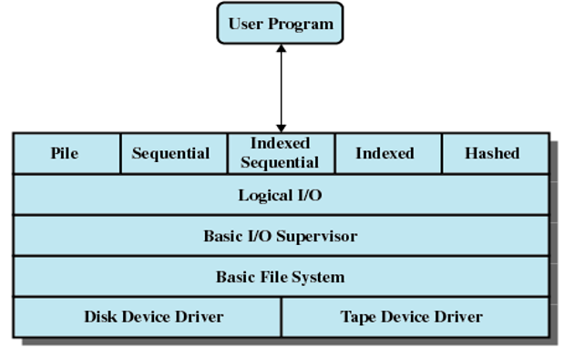
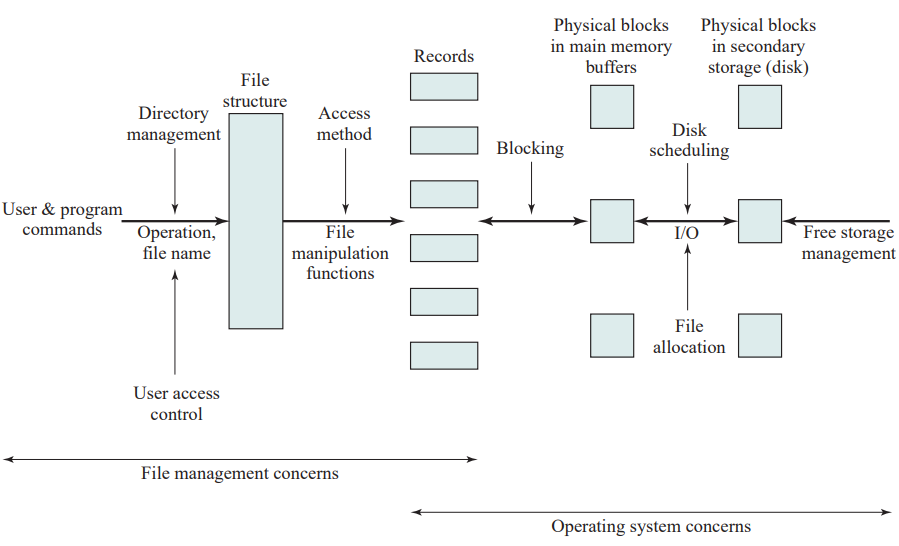
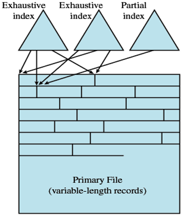
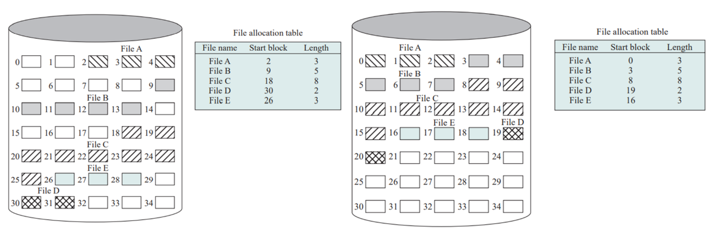
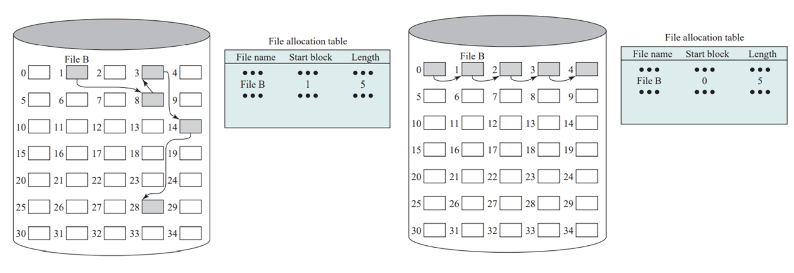
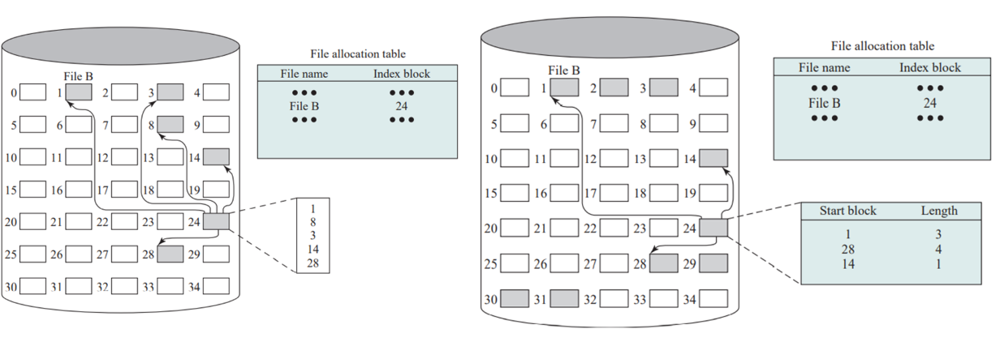

# 操作系统学习笔记-文件管理

> 📌 转载自 **花猪のBlog（作者 CNhuazhu）** —— 原文：https://cnhuazhu.top/butterfly/2021/06/09/%E6%93%8D%E4%BD%9C%E7%B3%BB%E7%BB%9F/%E6%93%8D%E4%BD%9C%E7%B3%BB%E7%BB%9F%E5%AD%A6%E4%B9%A0%E7%AC%94%E8%AE%B0-%E6%96%87%E4%BB%B6%E7%AE%A1%E7%90%86/
> 学习笔记，版权归原作者所有，仅供学弟学妹学习参考；如有侵权请联系删除。

---

# 前言

*正在学习操作系统，记录笔记。*

> 参考资料：
>
> 《操作系统（精髓与设计原理 第8版） 》

------------------------------------------------------------------------

# 第十二章：文件管理

## 概述

### 文件和文件系统

文件管理（File Management）

在大多数一应用中，文件都是核心元素，相对应的就需要文件管理。文件管理的基本目标就是能够快速准确地找到存储在磁盘当中的文件，并将其加载进内存，进行读/写操作。

要实现文件管理可以有两种方式：

- 用户编程实现：对于用户来讲，需要知晓磁盘的物理特性，还有很多其他的要求，显然这并不是一个很好的方案，对于用户来说要求太高。
- 操作系统实现：我们重点就是要讨论此方案。

实际上所有的操作系统都提供了文件管理系统，它由系统实用程序组成，可以作为具有特权的应用程序来运行。

文件系统属性：

- 长期存在：文件存储在硬盘或其他辅存中，用户退出系统时文件不会丢失，

- 进程共享：文件有名字，具有允许受控共享的相关访问权限。

- 结构化存储：取决于具体的文件系统，一个文件具有针对某个特定应用的内部结构。

  > 此外，文件可组织为层次结构或更复杂的结构，以反映文件之间的关系。

文件系统提供对文件进行操作的接口，典型的有以下六种：

- 创建（Create）：在文件结构中定义并定位一个新文件。

- 删除（Delete）：从文件结构中删除并销毁一个文件。

  > 注意这里的删除并不能真正地把数据从物理磁盘中抹除。（格式化同样如此）

- 打开（Open）：进程将一个已有文件声明为“打开”状态，以便允许该进程对这个文件进行操作。

- 关闭（Close）：相关进程关闭一个文件，以便不再能对该文件进行操作，直到该进程再次打开它。

- 读（Read）：进程读取文件中的所有或部分数据。

- 写（Write）：进程更新文件，要么通过添加新数据来扩大文件的尺寸，要么通过改变文件中已有数据项的值。

### 文件结构

讨论文件时通常要用到如下四个术语：

- 域（Field）：域是基本的数据单元。

  - 一个域包含一个值

    > 比如：现有一个工资管理系统，其中有一个名为“花猪”的对象（也可视为一条记录），其中有一个属性叫做性别，这个属性就称为一个域。

  - 可分为`基本域`和`组合域`：

    - 基本域：不可再分，通常为定长。
    - 组合域：可以再分成子域，通常为变长。（如工资属性可以细分为基本工资、绩效工资等）

- 记录（Record）：是一组相关域的集合。

  - 可视为应用程序的一个单元。

    > 比如：一条雇员记录可能包含以下域：名字、社会保险号、工作类型、雇用日期等。

  - 记录的长度可以是定长的或变长的

- 文件（File）：一组相似记录的集合。

  - 被用户和应用程序视为一个实体，并可通过名字访问

  - 有唯一的文件名，可以被创建或删除

  - 访问控制通常在文件级实施

    > 在有些更复杂的系统中，控制访问也可以在记录级或域级实施。

- 数据库（Database）：是一组相关数据的集合。

  - 其本质特征是数据元素间存在着明确的关系
  - 可供不同的应用程序使用

### 文件管理系统

文件管理系统是一组系统软件，它为使用文件的用户和应用程序提供服务。

- 文件管理系统是用户或应用程序访问文件的唯一方式
- 用户或程序员不需要为每个应用程序开发专用软件

文件管理系统需要满足以下七大需求：

1.  满足数据管理的要求和用户的需求，包括存储数据和执行上述操作的能力。
2.  最大限度地保证文件中的数据有效。
3.  优化性能：包括总体吞吐量（从系统的角度）和响应时间（从用户角度）。
4.  为各种类型的存储设备提供I/O支持。
5.  减少或消除丢失或者破坏数据的可能性。
6.  向用户进程提供标准I/O接口例程集。
7.  在多用户系统中为多个用户提供I/O支持。

在上述第一条中，用户需求的范围取决于各种应用程序和计算机系统的使用环境。对于交互式的通用系统，最小需求集合如下：

- 每个用户实现基本操作：如创建、删除、读取和修改文件
- 每个用户都应能受控地访问其他用户的文件
- 每个用户都应能控制允许对用户文件进行哪种类型的访问
- 每个用户应该能够按照自己的需要从而对文件进行重构
- 每个用户都应能在文件间移动数据
- 每个用户都应能备份用户文件，并在文件遭到破坏时恢复文件
- 每个用户都应能通过名字而非数字标识符访问自己的文件

文件系统架构

下图展示了文件系统软件架构：

从底层逐层向上介绍：

1.  设备驱动层：

    - 直接与外围设备通信
    - 设备驱动程序负责启动设备上的I/O操作，处理I/O请求的完成

2.  基本文件系统：也称为物理I/O层，是计算机系统外部环境的基本接口。

    - 处理在磁盘间或磁带系统间交换的数据块
    - 关注块在辅存和内存缓冲区的位置，而非数据的内容或所涉及的文件结构
    - 通常是操作系统的一部分

3.  基本I/O管理程序：

    - 负责所有文件I/O的初始化和终止
    - 需要一定的控制结构来维护设备的输入、输出、调度和文件状态
    - 根据所选的文件来选择执行文件I/O的设备
    - 为了优化性能，参与调度对磁盘和磁带的访问
    - 是操作系统的一部分

4.  逻辑I/O：

    - 使用户和应用程序能够访问记录

    - 提供一种通用的记录I/O能力

    - 维护关于文件的基本数据

      > 基本文件系统处理的是数据块，而逻辑I/O模块处理的是文件记录。

5.  访问方法：

    - 文件系统中与用户最近的一层

    - 在应用程序和文件系统以及保存数据的设备之间提供了一个标准接口

    - 不同的访问方法反映了不同的文件结构及访问和处理数据的不同方法

      > 堆（Pile）、顺序（Sequential）、索引顺序（Indexed Sequential）、索引（Indexed）、散列（Hashed）

文件管理功能：

下图展示了文件管理的要素

- 用户或应用进程发送操作文件的命令（创建、删除等）与文件系统进行交互

- 在执行操作任何文件之前，文件系统必须确认和定位所选择的文件

- 定位文件要求使用某种类型的目录来描述所有文件的位置及它们的属性

- 大多数共享系统都实行用户访问控制

  > 只有被授权用户才允许以特定方式访问特定的文件

- 文件的访问是以块的形式

  > 虽然用户和应用程序关注的是记录，但I/O是以块为基础来完成的，因此文件中的记录必须组织成一组块序列来输出，并在输入后将各块组合起来。

- 支持文件的块I/O需要许多功能：

  - 管理辅存：包括把文件分配到辅存中的空闲块
  - 管理空闲存储空间：以便知道新文件和现有文件增长时可以使用哪些块
  - 必须调度单个的块I/O请求

## 文件组织和访问

### 文件管理的评价标准

- 短的存取时间：

  - 需要时可以随机访问单一记录

  - 无需批处理模式

    > 如果一个文件仅以批处理方式处理，且每次都要访问到它的所有记录，则基本无须关注用于检索一条记录的快速访问。

- 易于修改：

  > 存储在CD-ROM中的文件永远不会被修改，因此易于修改这一点根本不需要考虑。

- 存储经济性：

  - 为了节约存储空间，数据冗余应最小（类似内存管理中考虑减小零头的道理）

    > 另一方面，冗余是提高数据访问速度的一种主要手段。例如：使用索引。

- 维护简单

- 可靠性

下面要介绍五类常见的文件组织结构：

### 堆文件（Pile ）

*（⚠️ 原图已失效）*

- 最简单的文件组织形式，简单有效

- 数据按照到达的顺序被组织起来，每条记录由一串数据组成。没有固定的结构

  > 类似于本人考试时候时候草稿纸，按照【会写的】题目顺序依次演算，最后再演算之前较难的题，稿纸上的记录就是做题的顺序，不固定。

- 堆的目的仅仅是积累大量的数据并保存数据

- 记录可以有不同的域，或者相似但顺序不同

  > 因此，每个域都应能自我描述，并包含域名和值。

- 缺点：

  - 写入的数据必须具有自解释性：包含域名和值，

    > 每个域的长度由分隔符隐式地指定，要么明确地包含在一个子域中，要么是该域类型的默认长度。

  - 对于记录的访问是通过穷举查找的方式（由于非结构化的原因）

    > 当数据在处理前采集并存储时，或当数据难以组织时，会用到堆文件。当保存的数据大小和结构不同时，这种类型的文件空间使用情况很好，能较好地用于穷举查找，且易于修改。但是，除了这些受限制的使用外，这类文件对大多数应用都不适用。

### 顺序文件（Sequential File ）

*（⚠️ 原图已失效）*

- 最常用的文件组织形式

  > 使用场景：批量的写入数据，例如：爬虫

- 每条记录都使用一种固定的格式

- 所有记录都具有相同的长度

- 所有记录都由相同数量、长度固定的域按特定的顺序组成

  > 以上三点可以避免数据的自解释性，降低成本开销。

- 缺点：

  - 对记录的查询仍然是穷举查询
  - 插入一条记录时并不方便，需要移动后续的所有记录位置

- 为了解决数据插入的繁琐，引入了一个特殊的域：**关键域（key field）/ 主域**

  - 通常是每条记录的第一个域
  - 可以唯一地标识该记录（类似数据库中的主键）

- 为了高效处理数据，引入**日志文件（log file）/ 事务文件（transaction file）**

  - 进行文件处理时，把新的记录放在一个单独的堆文件中，即日志文件
  - 通过周期性地执行成批更新，把日志文件合并到主文件中，并按正确的关键字顺序产生一个新文件

### 索引顺序文件（Indexed Sequential File）

*（⚠️ 原图已失效）*

- 索引提供了一个查询功能，以快速到达所需记录的附近区域

- 索引文件中的每条记录由两个域组成：关键域和指向主文件的指针，其中关键域和主文件中的关键域相同

- 查找某个特定的域，首先要查找索引：

  - 查找关键域值等于目标关键域值或者位于目标关键域值之前且最大的索引
  - 然后在该索引的指针所指的主文件中的位置处开始查找

  > 举个例子说明该方法的有效性：
  >
  > 考虑一个包含100万条记录的顺序文件
  >
  > - 查找某个特定的关键域值，平均需要访问50万次记录（`(1000000 + 1) / 2`）
  > - 假设现在创建一个包含了1000项的索引，如果要查找特定记录：
  >   - 平均在索引文件中访问500次（`(1000 + 1 ) / 2`）
  >   - 接着在主文件中平均访问500次（`(1000 + 1 ) / 2`）
  >
  > 由此可见，平均访问次数从500000降低到了1000，大大降低了查询开销。

- 文件按如下方式处理：

  - 主文件中的每条记录都包含一个附加域（附加域对应用程序不可见）

  - 附加域是指向溢出文件的一个指针

  - 向文件中插入一条新记录时，它被添加到溢出文件（overflow file）中

  - 修改主文件中逻辑顺序位于这条新纪录之前的记录，使其包含指向新纪录前面的那条记录的指针

    > 如果新纪录前面的那条记录也在溢出文件中，那么修改新纪录前面的那条记录的指针

  - 索引顺序文件有时也按照批处理的方式合并溢出文件

- 为提供更有效的访问，可以为关键域设置多级索引

  > 同样以访问包含100万条记录的顺序文件
  >
  > - 首先构建10000项的低级索引
  > - 低级索引再构建100项的高级索引
  > - 查询过程从高级索引开始：
  >   - 查询低级索引的一项，平均50次访问（`(50 + 1) / 2`）
  >   - 找到主文件中的一项，平均50次访问（`(50 + 1) / 2`）
  >   - 最后查找主文件，平均50次访问（`(50 + 1) / 2`）
  > - 总共平均查找150次

### 索引文件（Indexed File ）

索引顺序文件的是基于文件的一个域（关键域）进行处理，但是在现实中，可能需要对我们所关注的一些域（属性）进行记录查询，这时索引顺序文件就失去了作用。为此，引入了一个多索引的结构。

- 索引文件摒弃了顺序性和关键字的概念，只通过索引访问记录

- 要求至少有一个索引的指针指向一条记录就好，不限制记录放置的位置

  > 还可以使用长度可变的记录

- 可以使用两种类型的索引：

  - 完全索引（exhaustive index）：包含主文件中每条记录的索引项

    查询速度快，但是由于包含记录的全部索引项，因此会多占用一部分内存空间

    > 为了易于查找，索引自身被组织成一个顺序文件

  - 部分索引（partial index）：只包含那些有感兴趣域的记录的索引项

  > 对于变长记录，某些记录并不包含所有的域。向主文件中增加一条新记录时，索引文件必须全部更新。

### 直接文件或散列/哈希文件（Direct or Hashed File）

- 可以直接访问磁盘中任何一个地址已知的块

- 每条记录中都需要一个关键域

  > 这里对关键域进行Hash操作，较索引文件节约空间，但是存在哈希冲突，因此查询速度要慢一些。

## 文件目录

### 内容

文件目录解决了这样一个问题：即给定一个文件名，就能够在外存中准确地访问到对应文件。

与任何文件管理系统和文件集合相关联的是文件目录。目录包含文件的相关信息，包括：

- 属性（Attributes）
- 位置（Location）
- 所有权（Ownership）

目录自身是一个文件，它可被各种文件管理例程访问。

> 尽管用户和应用程序也可得到目录中的某些信息，但这通常是由系统例程间接提供的。

从用户角度看，目录在用户和应用程序所知道的**文件名**和**文件自身**之间提供映射。

> 每个文件项都包含文件名。

> 下表列出了文件目录的信息单元
>
> **基本信息**
>
> | 信息单元 | 说明                                                         |
> |----------|--------------------------------------------------------------|
> | 文件名   | 由创建者（用户或程序）选择的名字，在同一个目录中必须是唯一的 |
> | 文件类型 | 如文本文件、二进制文件、加载模块等                           |
> | 文件组织 | 供那些支持不同组织的系统使用                                 |
>
> **地址信息**
>
> | 信息单元 | 说明                                                       |
> |----------|------------------------------------------------------------|
> | 卷       | 指示存储文件的设备                                         |
> | 起始地址 | 文件在辅存中的起始物理地址（如在磁盘上的柱面、磁道和块号） |
> | 使用大小 | 文件的当前大小，单位为字节、字或块                         |
> | 分配大小 | 文件的最大尺寸                                             |
>
> **访问控制信息**
>
> | 信息单元 | 说明 |
> |----|----|
> | 所有者 | 控制文件的用户。所有者可授权或拒绝其他用户的访问，并改变给予它们的权限 |
> | 访问信息 | 该单元的最简形式包括每个授权用户的用户名和口令 |
> | 许可的行为 | 控制读、写、执行及在网上传送 |
>
> **使用信息**
>
> | 信息单元 | 说明 |
> |----|----|
> | 数据创建 | 文件首次放到目录中的时间 |
> | 创建者身份 | 通常是当前所有者，但不一定必须是当前所有者 |
> | 最后一次访问的日期 | 最后一次读记录的日期 |
> | 最后一次读用户的身份 | 最后一次进行读的用户 |
> | 最后一次修改的日期 | 最后一次修改、插入或删除的日期 |
> | 最后一次修改者的身份 | 最后一次进行修改的用户 |
> | 最后一次备份的日期 | 最后一次把文件备份到另一个存储介质中的日期 |
> | 当前使用 | 当前文件活动的信息，如打开文件的进程、是否被一个进程加锁、文件是否在内存中被修改但未在磁盘中修改等 |

### 结构

在介绍目录结构之前，为了理解文件结构的需求，我们可以考虑可能在目录上执行的操作：

- 查找：用户或应用程序引用一个文件时，必须查找目录，以找到该文件相应的目录项。
- 创建文件：创建一个新文件时，必须在目录中增加一个目录项。
- 删除文件：删除一个文件时，必须在目录中删除相应的目录项。
- 显示目录：可能会请求目录的全部或部分内容。通常，这个请求是由用户发出的，用于显示该用户所拥有的所有文件和每个文件的某些属性（如类型、访问控制信息、使用信息）。
- 修改目录：由于某些文件属性保存在目录中，因而这些属性的变化需要改变相应的目录项。

#### 简单目录结构

- 最简单的结构是一个目录项列表，每个文件都有一个目录项

- 该结构可表示最简单的顺序文件，文件名作为关键域

- 在组织文件的时候该结构提供不了帮助

- 用户在使用这种结构时需要注意不能给两个不同的文件取相同的名字（强制性的）

- 文件查询速度慢

  > 实际上若目录是一个简单的顺序列表，则它对于组织文件没有任何帮助。很难满足用户需求，尤其在共享系统中会变得更糟。

#### 两级目录方案

- 有一个主目录

- 每位用户有一个用户目录

- 主目录中的每一项为用户目录，并提供地址和访问控制信息

- 每个用户目录为简单列表文件

- 对构造结构化文件集合没有任何帮助

- 在不同的目录下，允许给文件进行相同命名

- 较简单目录结构加快了文件查询速度

  > 举例，有n个用户，每个用户有m个文件：
  >
  > - 简单目录结构：`(n × m) / 2`
  > - 两级目录方案：`(n + m) / 2`

#### 层次/树状结构目录

*（⚠️ 原图已失效）*

- 有一个主目录，主目录下是许多用户目录
- 每个用户目录下又可以包含子目录的目录项和文件的目录项
- 树状结构目录降低了为文件提供唯一名称的难度

### 命名

路径名（pathname）：系统中的任何文件都可以按照从根目录或主目录向下到各个分支，最后直到该文件的路径来定位。这一系列目录名和最后到达的文件名组成了该文件的路径名。

文件名称可以相同，只要路径名不同就可以。

现假设有一个名为“`HuaZhu”`的用户目录，其包含子目录：`OS → Nachos → code → thread`

在`thread`目录下有一个名为`thread.cc`文件，现在要定位该文件

**绝对路径**：/HuaZhu/OS/Nachos/code/thread/thread.cc

工作目录（working directory ）：（如果要求用户在每次访问文件时都必须拼写完整的绝对路径仍比较复杂）在典型情况下，对交互用户或进程而言，总有一个当前路径与之相关联，通常称为工作目录。文件通常按相对于工作目录的方式访问，即采用相对路径。

现假设我正处于`Nachos`目录下，定位`thread.cc`文件

**相对路径**：./code/thread/thread.cc

> 绝对路径和相对路径的使用没有绝对的优劣，针对不同的使用场景有不同的选择。

## 文件共享

在多用户系统中，几乎总是要求允许文件在多个用户间共享，这就会产生两个问题：

- 访问权限
- 对同时访问的管理

### 访问权限

下面列出了一些具有代表性的访问权限：

- 无（None）：

  - 用户不知道文件是否存在
  - 为了实施这种限制，不允许用户读包含该文件的用户目录

- 知道（Knowledge）：

  - 用户仅仅可确定文件是否存在并确定其所有者

    > 没有更多的访问权限，当然用户可以向文件所有者申请。

- 执行（Execution）：

  - 用户可以加载并执行一个程序，但不能复制它（看不到程序内部，即不可读文件）

    > 私有程序通常具有这种访问限制。

- 读（Reading）：

  - 用户可以读文件，包括复制和执行

    > 有些系统还可区分浏览和复制，对于前一种情况，文件的内容可以呈现给用户，但用户却无法进行复制。

- 追加（Appending）：

  - 用户可给文件添加数据，通常只能在末尾追加，但不能修改或删除文件的任何内容

    > 在许多资源中收集数据时，这种权限非常有用

- 更新（Updating）：

  - 用户可修改、删除和增加文件中的数据

  - 通常包括最初写文件、完全重写或部分重写、移去所有或部分数据

    > 有些系统还区分不同程度的更新

- 改变保护（Changing protection ）：

  - 用户可改变已授给其他用户的访问权限

    > 通常，只有文件的所有者才具有这一权力。在某些系统中，所有者可把这项权力扩展到其他用户。为防止滥用这种机制，文件的所有者通常能指定该项权力的持有者改变哪些权限。

- 删除（Deletion）：

  - 用户可从文件系统中删除该文件

> 这些权限构成了一个层次结构，层次结构中的每个权限都隐含了前面的那些权限

被指定为某个文件所有者的用户，通常是最初创建该文件的用户。所有者具有前面列出的全部权限，并且可给其他用户授予权限。访问可以提供给不同类型的用户：

- 特定用户（Specific user ）：由用户ID指定的单个用户。
- 用户组（User groups ）：非单独定义的一组用户。系统必须能通过某种方式了解用户组的所有成员。
- 全部（All ）：有权访问该系统的所有用户。这些是公共文件。

### 同时访问

如果允许多个用户追加或更新一个文件，操作系统或文件系统必须强加一些规范：

- 在用户修改文件时，允许用户对整个文件加锁
- 更好的方案是对文件中要修改的记录进行加锁

在设计共享访问能力时，必须解决互斥问题和死锁问题。

## 二级存储管理（辅存管理）

在辅存中，文件是由许多块组成的。操作系统或文件管理系统负责为文件分配块。这时会引发两个管理问题：

- 辅存中的空间必须分配给文件
- 必须知道哪些空间可用来进行分配（空闲空间管理）

### 文件分配

文件分配涉及以下几个问题：

- 创建一个新文件时，是否一次性地给它分配所需的最大空间？

- 给文件分配的空间是一个或多个连续的单元，这些单元称为分区。在分配文件时，分区的大小应该是多少？

  > 分区（portion）是一组连续的已分配块。分区的大小可以从一个块大小到整个文件大小。

- 为跟踪分配给文件的分区，应使用哪种数据结构或表？

  在DOS或其他系统中，这种表通常称为**文件分配表（File Allocation Table，FAT）**

#### 预分配

- 要求在发出创建文件的请求时，声明该文件的最大尺寸

- 实际对于许多应用程序来说，可靠的预估文件的最大尺寸是有难度的

- 用户和应用程序会将文件尺寸估计得大一些，此时就会造成浪费

  > 因此采用动态分配要好一些

#### 分区大小

- 一种极端情况是：分配大到足以保存整个文件的分区

  > 大小可变的大规模连续分区：能提供较好的性能。大小可变避免了浪费，且会使文件分配表较小，但这又会导致空间很难再次利用。

- 另一种极端情况是：磁盘空间一次只分配一块

  > 块：小的固定分区能提供更大的灵活性，但为了分配，它们可能需要较大的表或更复杂的结构。邻近性不再是主要目的，主要目的是根据需要来分配块。

  > 因此需要折中考虑单个文件的效率和整个系统的效率，具体要考虑以下内容：
  >
  > - 邻近空间可以提高性能
  > - 数量较多的小分区会增加用于管理分配信息的表的大小
  > - 使用固定大小的分区（例如块）可以简化空间的再分配
  > - 使用可变大小的分区或固定大小的小分区，可减少超额分配导致的未使用存储空间的浪费

下面考虑三种文件分配的方法，首先下表总结了每种方法的特点：

|                        | 连续     | 链式     | 索引   | 索引 |
|------------------------|----------|----------|--------|------|
| 是否预分配             | 需要     | 可能     | 可能   | 可能 |
| 分区大小是固定还是可变 | 可变     | 固定块   | 固定块 | 可变 |
| 分区大小               | 大       | 小       | 小     | 中   |
| 分配频率               | 一次     | 低到高   | 高     | 低   |
| 分配需要的时间         | 中       | 长       | 短     | 中   |
| 文件分配表的大小       | 一个表项 | 一个表项 | 大     | 中   |

#### 连续分配

> 说明：
>
> - 图左：连续文件分配
> - 图右：连续文件分配（紧缩后）

- 在创建文件时，给文件分配一组连续的块

- 这是一种使用大小可变分区的预分配策略

- 在文件分配表中，每个文件只需要一个表项，用于说明起始块和文件的长度

- 缺点：随着使用时长的增加，会出现外部碎片

  > 长时间后很难找到空间大小足够的连续块，因此需要紧缩算法来释放磁盘中的额外空间

#### 链式分配

> 说明：
>
> - 图左：链式分配
> - 图右：链式分配（合并后）

- 链式分配基于单个块

  > 连续分配与链式分配是两个极端

- 链中的每块都包含指向下一块的指针

- 在文件分配表中，每个文件同样只需要一个表项，用于声明起始块和文件的长度

- 优势：无外部碎片。最适合顺序处理的顺序文件

- 缺点：局部性原理失效

  > - 若需要像顺序处理那样一次取入一个文件中的多个块，则需要对磁盘的不同部分进行一系列访问。这对于单用户系统有重大影响，也是共享系统需要关注的。
  > - 为克服这个问题，有些系统会周期性地合并文件（如图右）

#### 索引分配

> 说明：
>
> - 图左：基于块的索引分配
> - 图右：基于长度可变分区的索引分配

- 每个文件在文件分配表中都有一个一级索引

- 分配给该文件的每个分区在索引中都有一个表项

- 文件的索引保存在一个单独的块中，文件分配表中该文件的表项指向这一块

- 可以基于固定大小的块；也可以基于大小可变的分区

  > 基于块来分配可以消除外部碎片，而按大小可变的分区分配可以提高局部性。
  >
  > 在任何一种情况下，都需要不时地进行文件整理。在使用大小可变分区的情况下，文件整理可以减少索引的数量，但对于基于块的分配却不能减少索引的数量。

- 支持顺序访问文件和直接访问文件，因而是最普遍的一种文件分配形式

### 空闲空间管理

当前还未分配给任何文件的空间同样需要管理。

要实现文件分配技术，首先需要知道磁盘中的哪些块是可用的，除了上述提到的文件分配表（FAT），还需要**磁盘分配表（Disk Allocation Table，DAT）**。

**位表（Bit tables ）**：

这种方法使用一个向量，向量的每一位对应于磁盘中的每一块。0表示空闲块，1表示已使用块。

- 优点：

  - 通过它能相对容易地找到一个或一组连续的空闲块。（因此位表适用于前面描述的任何一种文件分配方法）

  - 位表非常小，但其长度仍然很长。一个块位图所需的存储器容量为：`磁盘大小（字节数） / （8 × 文件系统块大小`）

    > 例如：对于一个块大小为512字节的16GB磁盘，位表会占用4MB的空间。

**链式空闲区（Chained free portions）**：

使用指向每个空闲区的指针和它们的长度值，可将空闲区链接在一起。

> - 由于不需要磁盘分配表，而仅需要一个指向链的开始处的指针和第一个分区的长度，因而这种方法的空间开销可以忽略不计。
> - 该方法适用于所有的文件分配方法。

### 可靠性

使用锁来防止进程间干扰和空间分配一致性。

请求一个文件分配时：

1.  在磁盘中对磁盘分配表加锁，以防止在分配完成前另一个用户修改这个表。
2.  查找磁盘分配表，查找可用空间。这里假设磁盘分配表的副本总在内存中，若不在，则须先读入。
3.  分配空间，更新磁盘分配表，更新磁盘。更新磁盘包括把磁盘分配表写回磁盘。对于链式磁盘分配，它还包括更新磁盘中的某些指针。
4.  更新文件分配表和更新磁盘。
5.  对磁盘分配表解锁。

------------------------------------------------------------------------

# 后记

本篇已完结

*先告一段落喽，非常感谢授课老师的指导以及同学们的帮助。*

（如有修改或补充欢迎评论）
