# 操作系统学习笔记-线程、对称多处理（SMP）和微内核

> 📌 转载自 **花猪のBlog（作者 CNhuazhu）** —— 原文：https://cnhuazhu.top/butterfly/2021/04/09/%E6%93%8D%E4%BD%9C%E7%B3%BB%E7%BB%9F/%E6%93%8D%E4%BD%9C%E7%B3%BB%E7%BB%9F%E5%AD%A6%E4%B9%A0%E7%AC%94%E8%AE%B0-%E7%BA%BF%E7%A8%8B%E3%80%81%E5%AF%B9%E7%A7%B0%E5%A4%9A%E5%A4%84%E7%90%86%EF%BC%88SMP%EF%BC%89%E5%92%8C%E5%BE%AE%E5%86%85%E6%A0%B8/
> 学习笔记，版权归原作者所有，仅供学弟学妹学习参考；如有侵权请联系删除。

---

# 前言

*正在学习操作系统，记录笔记。*

> 参考资料：
>
> 《操作系统（精髓与设计原理 第6版） 》

------------------------------------------------------------------------

# 第四章：线程、对称多处理（SMP）和微内核

## 进程和线程

### 线程的引入

上一章涉及到进程的两个特点：

- 资源所有权（Resource ownership）：一个进程包括一个存放进程映像的虚拟地址空间。进程映像是程序、数据、栈和进程控制块中定义的属性的集合。（一个进程总是拥有对资源的控制或所有权）
- 调度/执行（Scheduling/Execution）：一个进程沿着通过一个或多个程序的一条执行路径（轨迹）执行。其执行过程可能与其他进程的执行过程交替进行。

上述两个特点是独立的，因此操作系统可以独立地处理它们。为了区分这两个特点，分派的单位通常称做**线程**（thread）或**轻量级进程**（light weight process，LWP）；拥有资源所有权的单位通常仍称作**进程**（process）或**任务**（task）。

> 进程的优势就是带来了并发的实现，可以提高计算机资源的利用率，但同时这也带来了问题：由于计算机的内存大小受限，并不可能开启任意数量的进程（并发度），如果这样操作，反而会降低计算机系统的运行效率。

这里先用一个描述来通俗地理解何为线程：线程就是程序当中一个正在独立运行的函数。

> 再来一个奇妙的比喻理解下为何要引入线程的概念，或者说线程的引入较进程提高计算机系统的运行效率有何不同：
>
> 作为一个早八🐶，每天起床的唯一动力就是肉包子。有一天突发奇想，我不要读书了，我要去校门口卖包子，于是说干就干，休学去校门口创业。好在天赋异禀，做得一手的好包子，生意那是蒸蒸日上，随着名气逐渐在学生间流传开来，每天的包子销量供不应求。我又重新累成🐶，但是为了提高包子的产量，我又想了两个办法：
>
> 1.  开连锁店，分摊销售压力。
> 2.  只一家店不变，增派人手，每个人负责制作包子的不同流程。
>
> 下面我们来分析一下这两种方案的优劣：
>
> 方案一，开连锁店。我需要再去找其他店铺，商量租金事宜，装修，招募店主，培训等等。这样是可以提高总体包子的产量，但是感觉稍微有“亿些”麻烦。我还得重新安排各种资源，想想看身为懒🐶的我，要不要考虑一下第二个方案。
>
> 方案二，不增设店铺，只招募人手，每个人负责不同的工作。我可以招募个早起买食材的人、和面的、处理食材的、做包子的等等，每个人专注于一个小任务。这样大家干起活来轻松愉快，既提升了包子的产量，又免去了方案一中安排各种资源的繁杂，💰💰💰💰还“哗哗”往腰包里流，岂不美哉。
>
> 方案一的实现就映射了“进程”的概念，虽然可以提高计算机系统的效率，但是会占用大量资源；方案二的实现就映射了“线程”的概念，不必分配大量的资源，只优化实现流程。

### 多线程（Multithreading）

多线程指的是操作系统在一个进程中支持多个线程执行（多个并发执行路径）的能力。

> Windows, Solaris, Linux, Mach, 以及 OS/2 都支持多线程。

单线程（Single-Thread）：每个进程中只有一个线程在执行的传统方法。

> MS-DOS就是一个支持单用户进程和单线程的操作系统的例子。
>
> 一些版本的UNIX操作系统支持多用户进程，但只支持每个进程一个线程。
>
> Java的运行环境（JVM）是单进程多线程的一个例子。

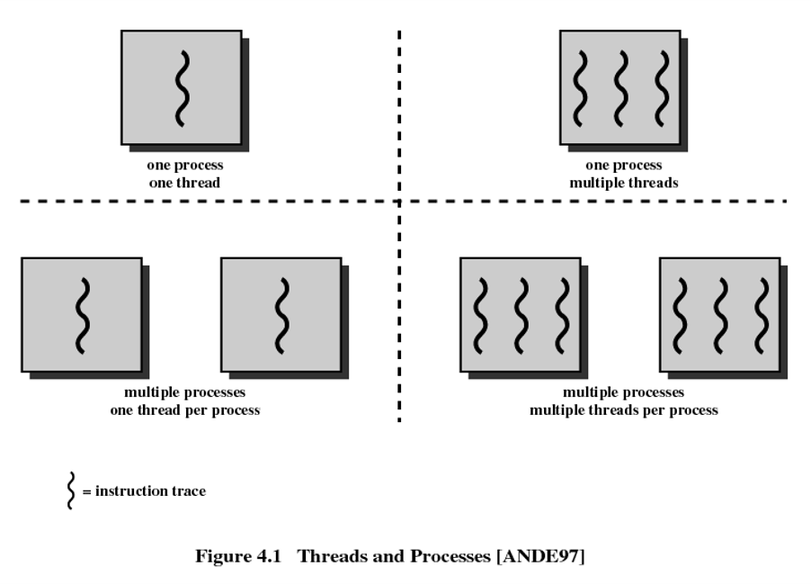

进程与线程的差异：

我们可以从本文最开始的文字去区分进程与线程，即：

- 进程：资源分配和保护的单位。

  - 有一个虚拟地址空间（virtual address space），用来存放进程映像。（包括：数据、代码、栈和PCB）
  - 受保护地对处理器、其他进程（用于进程间通信）、文件和I/O资源（设备和通道）的访问。
  - 每个进程包含一个或多个线程。

- 线程：执行/调度的单位。每个线程都包含：

  - 线程执行状态（运行、就绪等）
  - 在未运行时保存的线程上下文（从某种意义上来看，线程可以被看做进程内的一个被独立地操作的程序计数器）
  - 一个执行栈
  - 用于每个线程局部变量的静态存储空间
  - 与进程内的其他线程共享的对该进程的内存和资源的访问。

  > 如下图为单线程和多线程的进程模型
  >
  > 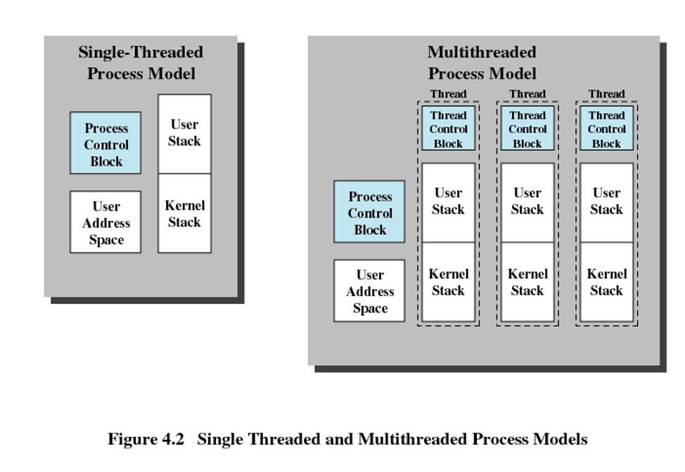

线程的优点（简记为“4快”）：

- 创建快：在一个已有进程中创建一个新线程比创建一个全新进程的时间要少许多。

- 结束快：终止一个线程比终止一个进程花费的时间少。

- 切换快：同一进程内线程间切换比进程间切换花费的时间少。

- 通信快：线程提高了不同的执行程序间通信的效率。由于在同一个进程中的线程共享内存和文件，因此它们无需调用内核就可以互相通信。

  > 在大多数的操作系统中，独立进程间的通信需要内核的介入。

> 如果一个应用程序或函数被实现为一组相关联的执行单位，那么用一组线程比用一组分离的进程更加有效。

线程在单用户多处理系统（Single-User Multiprocessing System）中的应用：

- 前/后台工作（Foreground to background work）：

  例如：在电子表格中，一个线程可以显示菜单并读取用户输入，而另一个线程执行用户命令并更新电子表格。（这种方案允许程序在前一条命令完成前提示输入下一条命令，因而常常会使用户感觉到应用程序的响应速度有所提高）

- 异步处理（Asynchronous processing）：程序中的异步元素可以用线程实现。

  例如：为避免掉电带来的损失，往往把文字处理程序（word 程序）设计成每隔一分钟将随机存取存储器（RAM）缓冲区中的数据写入磁盘一次。可以创建一个线程，其任务是周期性地进行备份，并且直接由操作系统调度该线程。

- 加速执行（Speed of execution）：一个多线程进程在计算这批数据的同时可以从设备读取下一批数据。

  在多处理器系统中，同一个进程中的多个线程可以同时执行。这样，即便一个线程在读取数据时由于I/O操作被阻塞，另外一个线程仍然可以继续运行。

- 模块化程序结构（Modular program structure）：涉及多种活动或多种输入输出的源和目的地的程序更易于用线程设计和实现。

进程的活动会影响线程：

- 因为所有线程共享同一个地址空间，所以当一个进程被挂起，其中的所有线程都会被挂起。
- 进程的终止会导致进程中所有线程的终止。

### 线程的功能特性（Thread Functionality）

和进程一样，线程具有执行状态，且可以相互之间进行同步。

执行状态（4种）：

- 派生（Spawn）：在典型情况下，当派生一个新进程时，同时也为该进程派生了一个线程。随后，进程中的线程可以在同一个进程中派生另一个线程，并为新线程提供指令指针和参数；新线程拥有自己的寄存器上下文和栈空间，且被放置在就绪队列中。

- 阻塞（Block）：当线程需要等待一个事件时，它将被阻塞（保存它的用户寄存器、程序计数器和栈指针），此时处理器转而执行另一个处于同一进程中或不同进程中的就绪线程。

- 解除阻塞（Unblock）：当阻塞一个线程的事件发生时，该线程被转移到就绪队列中。

- 结束（Finish）：当一个线程完成时，其寄存器上下文和栈都被释放。

  > 我们以一个例子来分析多线程的性能获益（暂且考虑线程不会阻塞的情况）：如下图展示，一个执行了两个远程过程调用（RPC）的程序，这两个调用分别涉及两个不同的主机，用于获得一个组合的结果。
  >
  > - 在单线程程序中，其结果是按顺序获得的，因此程序必须依次等待来自每个服务器的响应。
  >
  >   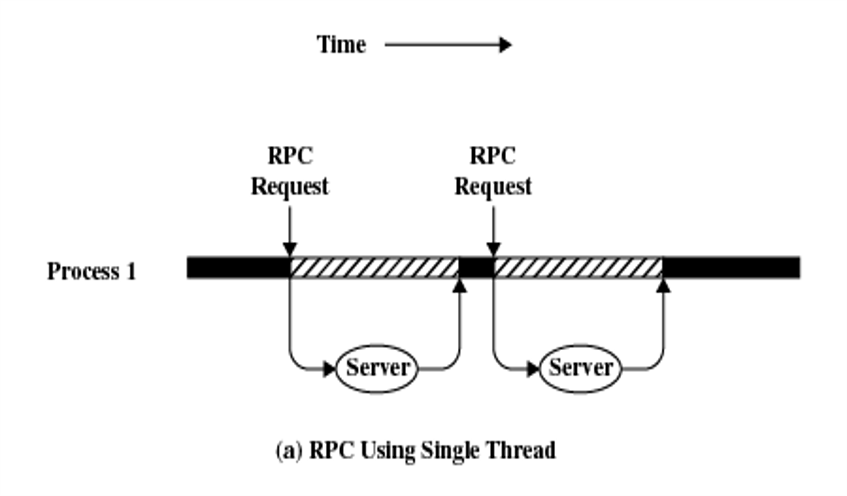
  >
  > - 如果重写这个程序，为每个RPC使用一个独立的线程，可以使速度得到实质性的提高。
  >
  >   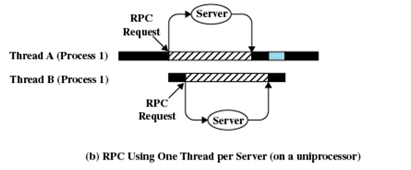
  >
  >   
  >
  > - 需要注意的是：如果这个程序在单处理器上运行，那么必须顺序地产生请求并且顺序地处理结果，但是对两个应答的等待是并发的。
  >
  > 在单处理器中，多道程序设计使得在多个进程中的多个线程可以交替执行。在下图所示的例子中，两个进程中的三个线程在处理器中交替执行。在当前正在运行的线程阻塞或它的时间片用完时，执行传递到另一个线程。
  >
  > 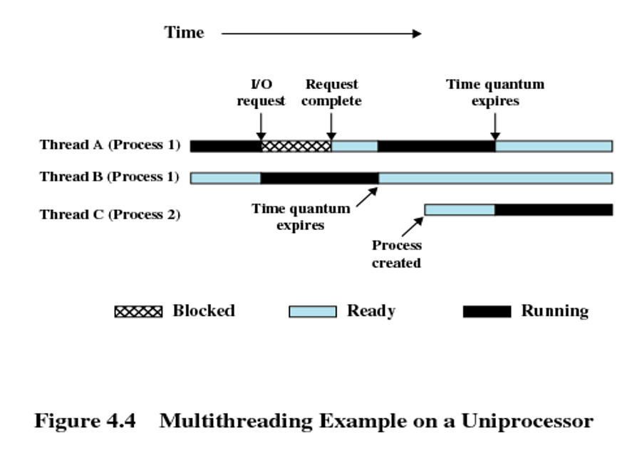

线程同步：

一个进程中的所有线程共享同一个地址空间和诸如打开的文件之类的其他资源。一个线程对资源的任何修改都会影响同一个进程中其他线程的环境。因此，需要同步各种线程的活动，以便它们互不干涉且不破坏数据结构。

### 用户级和内核级线程（User-Level and Kernel-Level Thread）

线程的实现可以分为两大类：用户级线程（User-Level Thread，ULT）和内核级线程（Kernel-Level Thread，KLT）。后者又称做内核支持的线程或轻量级进程。

- 用户级线程（User-Level Thread，ULT）

  - 在一个纯粹的用户级线程软件中，有关线程管理的所有工作都由应用程序完成。

  - 内核意识不到线程的存在

  - 任何应用程序都可以通过使用线程库被设计成多线程程序。

    > 线程库是用于用户级线程管理的一个例程包，它包含用于创建和销毁线程的代码、在线程间传递消息和数据代码、调度线程执行的代码以及保存和恢复线程上下文的代码。

    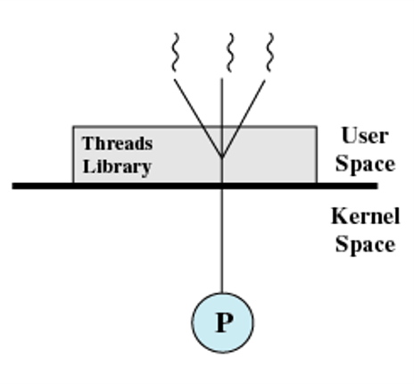

    以下图为例展示用户级线程状态和进程状态间的关系：假设进程B在它的线程2中执行。

    1.  （如图b）线程2中执行的应用程序进行系统调用，阻塞了进程B。例如，进行一次I/O调用。这导致控制转移到内核，内核启动I/O操作，把进程B置于阻塞状态，并切换到另一个进程。在此期间，根据线程库维护的数据结构，进程B的线程2仍处于运行态。

        > 值得注意的是，从在处理器上执行的角度看，线程2实际上并不处于运行态，但是在线程库看来，它处于运行态。

    2.  （如图c）时钟中断把控制传递给内核，内核确定当前正在运行的进程（B）已经用完了它的时间片。内核把进程B置于就绪态并切换到另一个进程。同时，根据线程库维护的数据结构，进程B的线程2仍处于运行态。

    3.  （如图d）线程2运行到需要进程B的线程1执行某些动作的一个点。此时，线程2进入阻塞态，而线程1从就绪态转换到运行态，进程自身保留在运行态。

    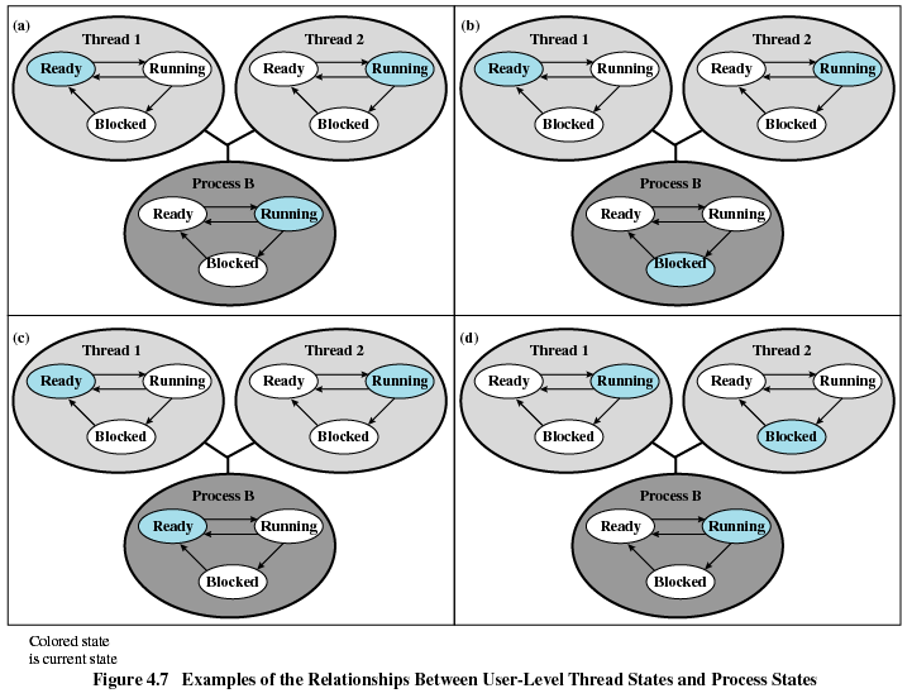

- 内核级线程（Kernel-Level Thread，KLT）：

  - 在一个纯粹的内核级线程软件中，有关线程管理的所有工作都是由内核完成的。

  - 内核为进程及其内部的每个线程维护上下文信息。

  - 调度是由内核以线程为单位完成的。

    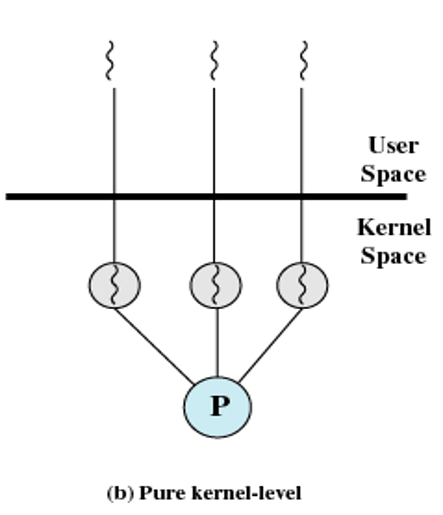

两种线程的比较：

- 用户级较内核级线程的优点：

  - 减少模式的切换

    > 由于所有线程管理数据结构都在一个进程的用户地址空间中，线程切换不需要内核态特权，因此，进程不需要为了线程管理而切换到内核态，这节省了两次状态转换（从用户态到内核态；从内核态返回到用户态）的开销。

  - 调度可以为应用程序所专用

    > 一个应用程序可能更适合简单的轮转调度算法，而另一个应用程序可能更适合基于优先级的调度算法。可以做到为应用程序量身定做调度算法而不扰乱底层的操作系统调度程序。

  - 用户级线程可以在任何操作系统中运行

    > 不需要对底层内核进行修改以支持用户级线程。线程库是一组供所有应用程序共享的应用程序级别的函数。

- 用户级较内核级线程的缺点：

  - 一个线程被阻塞，该进程的所有其他线程都将被阻塞。

  - 在纯粹的用户级线程策略中，一个多线程应用程序不能利用多处理技术。

    > 内核一次只把一个进程分配给一个处理器，因此一个进程中只有一个线程可以执行。

    > 现在已有两个办法可以解决上述两个缺陷：
    >
    > - 把应用程序写成一个多进程程序，而非多线程。
    > - Jacketing技术（无阻塞调用）：把一个产生阻塞的系统调用转化成一个非阻塞的系统调用。

- 内核级较用户级线程的优点：（克服了用户级线程的两个缺陷）

  - 进程中的多个线程可以同时在多个处理器上运行（由内核调度）。
  - 一个线程被阻塞不会使同一进程内的其他线程被阻塞。
  - 内核例程自身也可以使用多线程。

- 内核级较用户级线程的缺点：

  - 在把控制从一个线程传送到同一个进程内的另一个线程时，需要到内核的状态切换。

下图给出了在单处理器VAX机上运行类UNIX操作系统的测量结果：

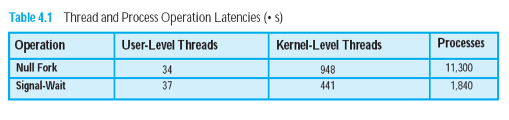

> 可以看出用户级线程和内核级线程之间、内核级线程和进程之间都有一个数量级以上的性能差距。

用户级与内核级的组合方法：

- 线程创建完全在用户空间中完成。

- 线程的调度和同步在应用程序中进行。

- 在用组合方法的操作系统中，Solaris是一个很好的例子。（当前版本的Solaris限制用户级线程/内核级线程的关系仅仅能为1：1的关系）

  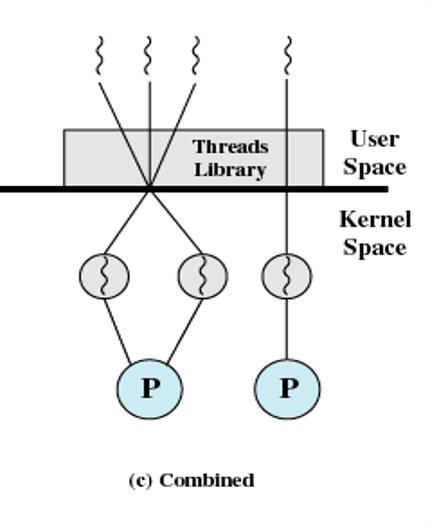

## 对称多处理（Symmetric Multiprocessing）

### SMP体系结构

分为以下4类：

- 单指令单数据流（SISD）：单处理器执行单个指令流，对保存在单个内存中的数据进行操作。

- 单指令多数据流（SIMD）：每条指令由不同的处理器在不同的数据集合上执行。（向量和阵列处理器都属于这一类。）

- 多指令单数据流（MISD）：一系列数据被传送到一组处理器上，每个处理器执行不同的指令序列。（这个结构从未实现过）

- 多指令多数据流（MIMD）：一组处理器同时在不同的数据集上执行不同的指令序列。

  > SIMD和MIMD是主流模式，现代计算机基本都能够实现MIMD。

下图展示了并行处理器的体系结构：

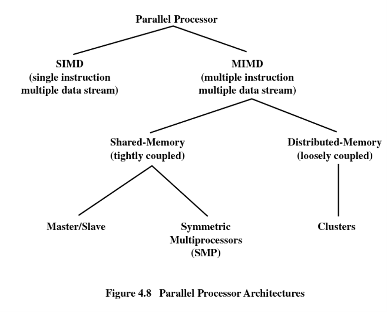

**集群（cluster）**：

如果每个处理器都有一个专用内存，那么每个处理部件都可以被看做一个独立的计算机。计算机间的通信或者借助于固定的路径，或者借助于某些网络设施，这类系统称做**集群（cluster）**，或者多计算机系统。

如果处理器共享一个公用内存，每个处理器都访问保存在共享内存中的程序和数据，处理器之间通过该内存互相通信，则这类系统称为**共享内存多处理器**系统。

> 共享内存多处理器系统的一个常用的分类是基于如何把进程分配给处理器。最基本的两种方法是主/从（Master/Slave）和对称多处理（SMP）。
>
> 关于主/从结构：
>
> 在主/从结构中，操作系统内核总是在某个特定的处理器上运行，其他处理器只用于执行用户程序，还可能执行一些操作系统实用程序。主处理器负责调度进程或线程。当一个进程/线程是活跃时，如果从处理器需要服务（如一次I/O调用），它必须给主处理器发送请求，并等待服务的执行。一个处理器控制了所有的内存和I/O资源。这是很简单的方法，但是会有它的缺陷：
>
> - 主处理器的失效将导致整个系统失效。
> - 由于主处理器必须单独完成所有的调度和进程管理，它可能成为性能瓶颈。

对称多处理（Symmetric Multiprocessing）系统：

- 内核可以在任何处理器上执行。
- 每个处理器从可用的进程或线程池中进行自己的调度工作。

### SMP系统的组织结构（SMP Organization）

（如下图）SMP中有多个处理器，每个都含有它自己的控制单元、算术逻辑单元和寄存器；每个处理器都可以通过某种形式的互连机制访问一个共享内存和1/O设备；共享总线就是一个通用方法。处理器可以通过内存（留在共享地址空间中的消息和状态信息）互相通信，还可以直接交换信号。内存通常被组织成允许同时有多个对内存不同独立部分的访问。

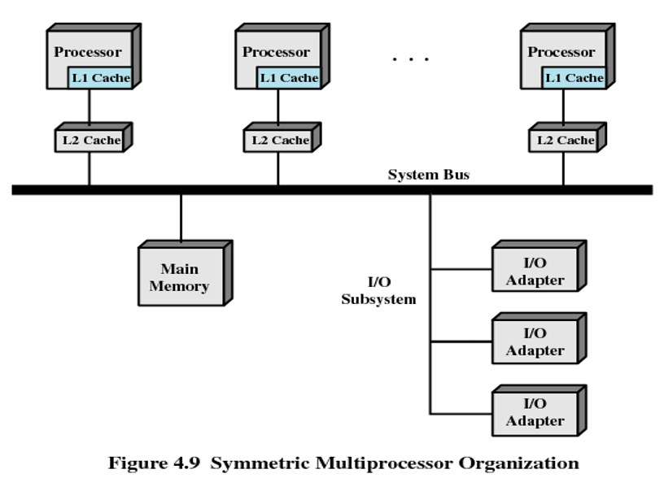

> 在现代计算机中，处理器通常至少有专用的一级高速缓存。

### 多处理操作系统设计的注意事项

- 同时的并发进程或线程（Simultaneous concurrent processes or threads）：

  为允许多个处理器同时执行相同的内核代码，内核例程必须是可重入的（reentrant）。多个处理器执行内核的相同或不相同部分时，必须对内核表和管理结构进行合适的管理，以避免死锁或非法操作。

- 调度（Scheduling）：

  调度可以由任何处理器执行，因此必须避免冲突。如果使用了内核级多线程，则可能出现在多个处理器上同时从同一个进程中调度多个线程的机会。

- 同步（Synchronization）：

  因为多个活动进程都可能访问共享地址空间或共享I/O资源，因而需注意提供有效的同步。同步是保证互斥和事件排序的机制。（锁（lock）是多处理器操作系统中一个通用的同步机制）

- 存储管理（Memory management）：

  多处理器上的存储管理必须处理在单处理器机器上发现的所有问题。此外，为达到最佳性能，操作系统需要尽可能地利用硬件并行性，如多端口内存；还必须协调不同处理器上的分页机制，以保证当多个处理器共享页或段时页面的一致性，以及决定页面置换的策略。

- 可靠性和容错（Reliability and fault tolerance）：

  当处理器失效时，操作系统应该提供适当的功能降低。调度程序和操作系统的其他部分必须知道处理器的失效情况，并且据此重新组织管理表。

## 微内核（Microkernel）

微内核是一个小型的操作系统核心，它为模块化扩展提供基础。

为了更好地掌握微内核的出现，我们先来了解一下**分层内核**的概念：

早期的操作系统开发很少考虑到结构问题，一般我们称之为**单体结构的操作系统**，其内部耦合度很高（任何过程实际上都可以调用任何别的过程）。逐渐地，操作系统规模越来越大，这种单体结构无法支撑（开发和维护起来太过复杂），于是就出现了**分层的操作系统**（如下图），所有功能按层次组织，只在相邻层之间发生交互。

但是分层方法也有问题：每层都处理相当多的功能，一层中的大的变化可能会对相邻层（上一层或下一层）中的代码产生巨大的影响，这些影响跟踪起来有很多困难。其结果是，在基本操作系统上很难通过增加或减少一些功能实现一个专用版本，而且由于在相邻层之间有很多交互，因而很难保证安全性。

> 在分层方法中，大多数层或所有层都在内核态下执行。

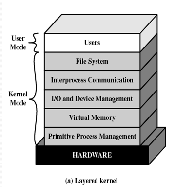

于是，就引入了微内核的概念。

### 微内核体系结构（Microkernel Architecture）

- 小型操作系统核心。

- 只将最基本的操作系统功能放于内核中。

- 许多传统上属于操作系统一部分的功能现在都是外部子系统。（包括设备驱动程序、文件系统、虚存管理程序、窗口系统和安全服务。它们可以与内核交互，也可以相互交互）

- 非基本的服务和应用程序在微内核之上构造，并在用户态下执行。

  > 相对的内核称为**单体内核（monolithic kernel）**

  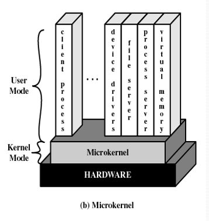

  > 微内核结构用一个水平分层的结构代替了传统的纵向分层的结构。

### 微内核组织结构的优点（Benefits of a Microkernel Organization）

- 一致接口（Uniform interface）：

  - 进程不需要区分是内核级服务还是用户级服务。
  - 所有服务都是通过消息传递提供的。

- 可扩展性（Extensibility）：

  - 允许增加新的服务

- 灵活性（Flexibility）：

  - 可以在操作系统中增加新的功能。
  - 可以删减现有的功能。

- 可移植性（Portability）：

  将操作系统移植到新的处理器时只需改变微内核中的内容，而不用改变其他服务。

- 可靠性（Reliability）：

  - 模块化设计。
  - 小的微内核可以被严格地测试。

- 分布式系统支持（Distributed system support ）：

  - 进程可以在不知道目标服务驻留在哪个机器上的情况下发送信息。

    > 当客户端往一个服务器进程发送消息时，该消息必须包含所请求服务的标识符。如果分布式系统（如集群）被配置为所有的进程和服务都具有唯一的标识符，那么实际上在微内核级别上可以看做只有一个单独的系统映像。

- 对面向对象操作系统支持（Object-oriented operating system ）：

  - 构件是具有明确定义的接口的对象，可以以搭积木的方式通过互连构造软件，构件中的所有交互都使用构件接口。

### 微内核性能（Microkernel Performance）

经常提到，微内核的一个潜在缺点是性能问题。

> 通过微内核构造和发送信息、接受应答并解码所花费的时间比进行一次系统调用的时间要多。但是，由于别的因素的作用，很难概括出是否有性能损失以及损失了多少。

不论对微内核如何优化，上述问题（损失）依旧是存在的。

针对这种问题，其中一个方法是：把一些关键的服务程序和驱动程序重新放回操作系统，这将增大微内核。（回退）

另一种办法是让微内核变得更小：\[LIED96b\]表明，通过正确的设计，一个非常小的微内核可以消除性能损失并提高灵活性和可靠性。

### 微内核设计（Microkernel Design）

微内核必须包括直接依赖于硬件的功能，以及那些支持服务程序和应用程序在用户态下运行的功能。这些功能通常可分为以下几类：低级存储管理（Low-level memory management）、进程间通信（Interprocess communication / IPC）以及I/O和中断管理（I/O and interrupt management ）。

- 低级存储管理（Low-level memory management）：

  微内核必须控制硬件概念上的地址空间，使得操作系统可以在进程级实现保护。微内核只负责把每个虚拟页映射到一个物理页框。

  > 存储管理的大部分功能，包括保护一个进程的地址空间免于另一个进程的干涉，页面置换算法以及其他分页逻辑都可以在内核外实现。

  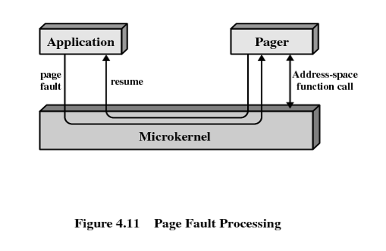

- 进程间通信（Interprocess communication）：

  微内核操作系统中进程之间或线程之间进行通信的基本形式是消息。

  > 消息由消息头和消息体组成，消息头描述了发送消息和接收消息的进程；消息体中含有数据，或者是指向一个数据块的指针，或者是关于进程的某些控制信息。

  - 消息（Message）
  - 端口（Port）
  - 基于线程的IPC（Thread-based IPC）
  - 共享内存（Memory-sharing）

- I/O和中断管理（I/O and interrupt management ）：

  在微内核结构中，可以做到以消息的方式处理硬件中断和把I/O端口包含到地址空间中。微内核可以识别中断但不处理中断，它产生一条消息给与该中断相关联的用户级进程。

  > 当允许一个中断时，一个特定的用户级进程被指派给这个中断，并且由内核维护这个映射。
  >
  > 把中断转换成消息的工作必须由微内核完成，但是微内核并不涉及设备专用的中断处理。

  > \[LIED96a\]提出把硬件看做一组具有唯一标识符的线程，并给用户空间中相关的软件线程发送消息（仅包含线程ID号）。接收线程确定消息是否来自一个中断，并确定具体是哪个中断。这类用户级代码的通用结构如下：
  >
  > 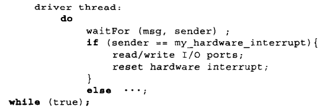

------------------------------------------------------------------------

# 后记

本篇已完结

（如有修改或补充欢迎评论）
