# 操作系统学习笔记-虚拟内存

> 📌 转载自 **花猪のBlog（作者 CNhuazhu）** —— 原文：https://cnhuazhu.top/butterfly/2021/05/24/%E6%93%8D%E4%BD%9C%E7%B3%BB%E7%BB%9F/%E6%93%8D%E4%BD%9C%E7%B3%BB%E7%BB%9F%E5%AD%A6%E4%B9%A0%E7%AC%94%E8%AE%B0-%E8%99%9A%E6%8B%9F%E5%86%85%E5%AD%98/
> 学习笔记，版权归原作者所有，仅供学弟学妹学习参考；如有侵权请联系删除。

---

# 前言

*正在学习操作系统，记录笔记。*

> 参考资料：
>
> 《操作系统（精髓与设计原理 第8版） 》

------------------------------------------------------------------------

# 第八章：虚拟内存

在正式开始前先介绍一下本章要用到的术语：

| 术语 | 解释 |
|----|----|
| 虚拟内存（Virtual memory） | 一种存储器分配方案，在这种分配方案中，辅助存储器可以被寻址，就好像它是主存储器的一部分一样。程序可用于引用内存的地址与内存系统用于标识物理存储站点的地址相区别，程序生成的地址自动转换为相应的机器地址。虚拟存储器的大小受到计算机系统寻址方案和可用辅助存储器数量的限制，而不受主存储器位置的实际数量的限制 |
| 虚拟地址（Virtual address） | 在虚拟内存中分配给某一位置的地址，它使得该位置可被访问，就好像是主存的一部分那样 |
| 虚拟地址空间（Virtual address space） | 分配给进程的虚拟存储 |
| 地址空间（Address space） | 用于某进程的内存地址范围 |
| 实地址（Real address） | 内存中存储位置的地址 |

## 硬件和控制结构

由上一章我们可以了解到分页和分段机制在内存管理中取得的根本性突破：

- 进程中的所有内存访问都是逻辑地址，这些逻辑地址会在运行时动态地转换为物理地址。这意味着一个进程可被换入或换出内存，因此进程可在执行过程的不同时刻占据内存中的不同区域。
- 一个进程可划分为许多块（页和段），在执行过程中，这些块不需要连续地位于内存中。

那么我们由此可以思考：如果保有上述这两个特点，在程序执行中，不需要进程的所有部分（页或段）都被加载到内存中，如果内存中保存有待取的下一条指令的所在块（页或段）以及待访问的下一个数据单元所在的块，那么进程可以持续运行下去。

接着就来描述一下程序如何以这样的方式在内存中运行：

- 一个新进程被载入内存，操作系统在最初只是载入新程序最开处的一个或几个块（页或段），而非全部。

- \*\*常驻集：\*\*进程执行的任何时候都在内存的部分称为进程的常驻集。

  只要所有内存访问都是访问常驻集中的单元，执行就可以顺利进行。

- 当处理器需要访问一个不在内存中的逻辑地址时：

  - 会产生一个中断（缺页中断），即出现了内存访问故障。
  - 操作系统会将此进程置于阻塞态。

- 操作系统会把包含引发访问故障的逻辑地址的进程块读入内存，具体流程如下：

  - 操作系统产生一个磁盘I/O读请求。
  - 在执行磁盘I/O期间，操作系统可以调度另一个进程运行。
  - 当需要的块读入内存后，再产生一个中断，操作系统把之前由于缺少进程块而被阻塞的进程置位就绪态。

- 进程继续执行。

这种执行进程的策略有以下优点（暂且不考虑由于中断、载入新块所带来的效率影响）：

- 在内存中保留多个进程：
  - 对于任何特定进程，都只载入某些部分到内存中，这样内存会有足够的空间运行多个进程。
  - 由于内存中存在的进程数量增加，那么在任意时刻总会有至少一个进程处于就绪态，进而使得处理器没有闲置状态，提高了效率。
- 支持运行大于主存的程序：
  - 大程序可以分成小块，通过某种覆盖策略分别加载。（基于分段或分页的虚拟内存）

**实存储器**（简称：实存，real memory）：就是主存（main memory），进程只能在此运行。

**虚拟内存**（简称：虚存，virtual memory）：

- 通常分配在磁盘上
- 支持更有效的系统并发度
- 可以解除用户与内存之间没有必要的紧密约束

> 下表总结了使用和不使用虚存情况下分页和分段的特点：
>
> | 简单分页 | 虚存分页 | 简单分段 | 虚存分段 |
> |----|----|----|----|
> | 内存划分为大小固定的小块，称为页框 | 内存划分为大小固定的小块，称为页框 | 内存未划分 | 内存未划分 |
> | 程序被编译器或内存管理系统划分为页 | 程序被编译器或内存管理系统划分为页 | 由程序员给编译器指定程序段（即由程序员决定） | 由程序员给编译器指定程序段（即由程序员决定） |
> | 页框中有内部碎片 | 页框中有内部碎片 | 无内部碎片 | 无内部碎片 |
> | 无外部碎片 | 无外部碎片 | 有外部碎片 | 有外部碎片 |
> | 操作系统须为每个进程维护一个页表，以说明每页对应的页框 | 操作系统须为每个进程维护一个页表，以说明每页对应的页框 | 操作系统须为每个进程维护一个段表，以说明每段中的加载地址和长度 | 操作系统须为每个进程维护一个段表，以说明每段中的加载地址和长度 |
> | 操作系统须维护一个空闲页框列表 | 操作系统须维护一个空闲页框列表 | 操作系统须维护一个内存中的空闲空洞列表 | 操作系统须维护一个内存中的空闲空洞列表 |
> | 处理器使用页号和偏移量来计算绝对地址 | 处理器使用页号和偏移量来计算绝对地址 | 处理器使用段号和偏移量来计算绝对地址 | 处理器使用段号和偏移量来计算绝对地址 |
> | 进程运行时，它的所有页必须都在内存中，除非使用了覆盖技术 | 进程运行时，并非所有页都须在内存页框中。仅在需要时才读入页 | 进程运行时，其所有段都须在内存中，除非使用了覆盖技术 | 进程运行时，并非其所有段都须在内存中。仅在需要时才读入段 |
> |  | 把一页读入内存可能需要把另一页写出到磁盘 |  | 把一段读入内存可能需要把另外一段或几段写出到磁盘 |

**系统抖动/系统颠簸（Thrashing）**：当操作系统读入一个块时，必须将另一个块换出，如果被换出的块在不远的将来会用到，那么该块又会被重新换入。如果这种情况经常发生，导致处理器的大部分时间都用来处理交换块而非执行指令。这样的现象被称为系统抖动。

### 局部性和虚拟内存

虚存的优势确实很有吸引力，但是曾经对于虚存的方案有过争论，其关键点就在于进程块的切换：如何有效地加载部分块到内存中，以及避免系统抖动。但是局部性原理表明虚拟内存的方案是切实可行的。

局部性原理：

- 一个进程中的程序和数据引用存在集簇倾向。
- 在一个很短的时间内仅需要进程的一部分块是合理的。
- 可以对未来可能会访问的块进行预测，从而避免系统抖动。

事实上在众多操作系统的经验也已经证实了虚拟内存的可行性，但是要使虚存比较实用且有效，还需要两方面的因素：

- 必须有对所采用分页或分段方案的硬件支持
- 操作系统必须能够管理页或段在内存和辅助存储器（简称：辅存）之间的移动

### 分页

#### 页表

- 每个进程都有自己的页表

- \*\*页表项（Page Table Entry，PTE）\*\*包含有与内存中的页框相对应的页框号

- 每个页表项需要有一个P位来表示它所对应的页当前是否在内存中

  > 一个进程可能只有一部分页在内存中

- 每个页表项需要有一个M位来表示相应页的内容从上次装入内存到现在是否已改变

  - 若未改变，则在需要把该页换出时，无须用页框中的内容更新该页（无需写入磁盘）

  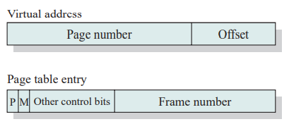

地址转换系统：

从内存中读取一个字需要页表从虚拟地址（逻辑地址）到物理地址的转换

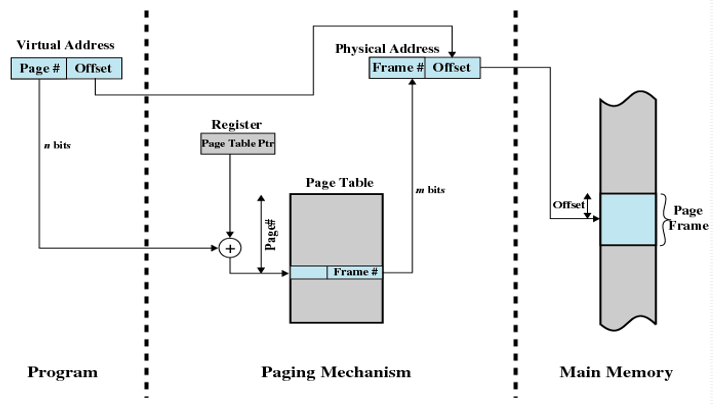

> 说明：
>
> - 虚拟地址/逻辑地址由页号和偏移量组成；物理地址由页框号和偏移量组成
>
> - 当进程运行时，一个寄存器保存该进程页表的起始地址
>
> - 虚拟地址的页号（Page \#，n位）用于检索页表，以查找相应的页框号（Frame，m位）
>
> - 查找到的页框号作为物理地址的页号，再与虚拟地址的偏移量结合起来形成最终的物理地址。（页框号\|偏移量）
>
>   > - 一般情况下，页号域长于页框号域（n \> m）
>   > - 由于页表长度是变化的，因而不能期望在寄存器保存它。寄存器只能保存一个指向页表起始地址的页表指针（Page Table Rtr）

考虑这样一个情景：如果每个进程的虚存空间可达 231 = 2GB，如果页大小为 29 = 512字节，那么则每个进程需要 231 / 29 = 222 个页表项。这反映出整个页表的大小与虚拟地址空间的大小成正比，而导致的后果就是：将耗费大量的内存空间去放置页表。

#### 两级层次页表

为了解决这个问题，思考一下是否可以将页表也存储于虚拟内存中。于是有了两级层次页表的结构：

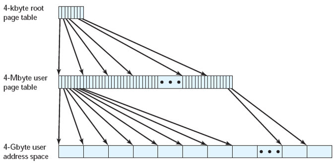

> 说明：
>
> - 当一个进程正在运行时，它的页表至少有一部分须在内存中，这一部分包括正在运行的页的页表项
>
> - 页目录：其中的每项指向一个页表
>
>   - 如果页目录的长度为X，且一个页表的最大长度为Y，则一个进程可以有XY页
>
>   > 分析上图实例（用于32位地址的两级方案）：
>   >
>   > - 页大小为：4KB（212）；虚拟地址空间大小为：4GB（232）
>   > - 则该虚拟地址空间由 232 / 212 = 220 个页组成
>   > - 规定每个页都由一个4字节的页表项映射，则可以创建一个由220页组成的一个页表，这时需要220 × 22 = 222 = 4MB 的内存空间
>   >   - 我们可以将这部分内容保留到虚存中，那么该部分虚拟内存空间又由222 / 212 = 210 个页组成
>   >   - 这210 个页又可以组成一个新的根页表，其占据的内存为：210 × 22 = 212 = 4KB
>   > - 如此一来，我们便可仅在内存中存放一个4KB大小的根页表，去访问一个4GB大小的虚拟内存中的数据

两级层次页表方案所对应的虚拟地址到物理地址的转换流程如下：

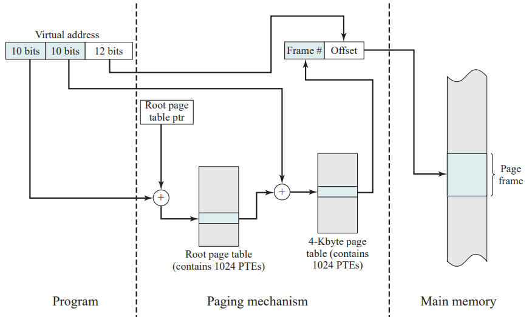

> 说明：
>
> - 虚拟地址的前10位用于检索根页表，查找关于用户页表的页的页表项
>   - 若该页不在内存中，则发生一次缺页中断
> - 若该页在内存中，则用虚拟地址中接下来的10位检索用户页表项页，查找该虚拟地址引用的页的页表项
> - 最终查找到的页框号作为物理地址的页号，再与虚拟地址的偏移量结合起来形成最终的物理地址。（页框号\|偏移量）\[同之前的方案一致\]

#### 反向页表/倒排页表

替代一级或多级页表的一种方法是，使用一个反向页表结构（Inverted Page Table）。

- 虚拟地址的页号部分被映射成一个hash值 （散列函数映射），hash映射值构成一个散列表

- hash值指向反向页表

  > 散列表包含指向反向表的指针，反向表中含有页表项

- 得益于散列技术，多个虚拟地址可能映射到同一个散列表项中，可以减少表的容量

  > 多对一的映射关系可能导致数据访问冲突，但是也有相应的解决访问冲突的算法，这里先不考虑

  > 页表结构称为“倒排/反向”的原因是，它使用页框号而非虚拟页号来索引页表项

反向页表的每项都包含如下内容：

- 页号（Page number）：虚拟地址的页号部分

- 进程标识符（Process identifier）：使用该页的进程

  > 页号和进程标志符共同标志一个特定进程的虚拟地址空间的一页

- 控制位（Control bits）：该域包含一些标记，比如有效、访问和修改，以及保护和锁定信息

- 链指针（Chain pointer）：

  - 若某项没有链项，则该域为空（或用一个单独的位来表示）
  - 否则，该域包含链中下一项的索引值（0 ~ 页框数量-1 之间的数字）

> 实例：
>
> 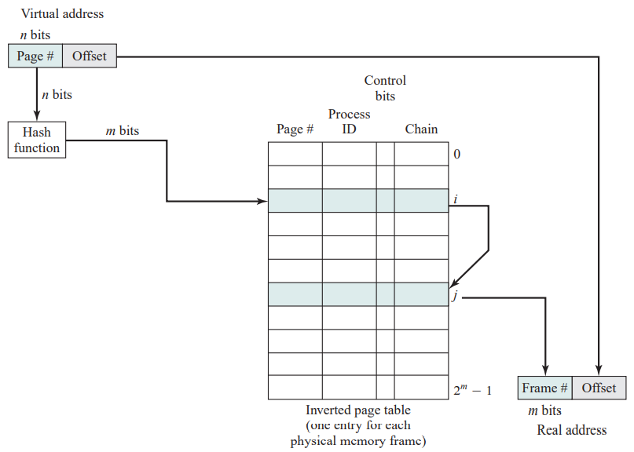
>
> 分析：
>
> - 物理内存中有2m个页框，反向页表包含2m项
> - 虚拟地址前n位表示页号，且 n \> m
> - 散列函数映射n位页号到m位数，用这m位数去索引反向页表
> - 由此得页框号作为物理地址的页号，再与虚拟地址的偏移量结合起来形成最终的物理地址

#### 转移后备缓冲器/旁视缓冲器

原则上，每次虚存访问都可能会引起两次物理内存访问：

- 一次取相应的页表项
- 另一次取需要的数据

因此，简单的虚拟内存方案会导致内存访问时间加倍。为了解决这个问题，引入转移后备缓冲器。

**转移后备缓冲器/旁视缓冲器（Translation Lookaside Buffer，TLB**）：大多数虚拟内存方案都为页表项使用了一个特殊的高速缓存，它包含有最近用过的页表项。

具体虚拟地址转换为物理地址的流程如下：

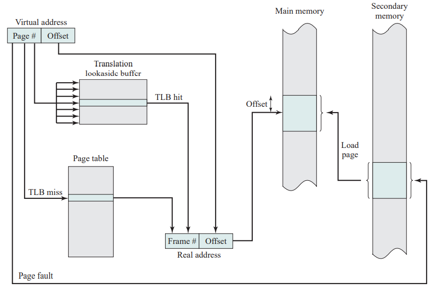

> 说明：
>
> - 给定一个虚拟地址，处理器首先检查TLB
>
>   - 若需要的页表项在其中（TLB命中），则检索页框号并形成实地址
>   - 若未找到需要的页表项（TLB未命中），则处理器用页号检索进程页表，并检查相应的页表项
>     - 若“存在位”已置位（表示该页在内存中），处理器从页表项中检索页框号以形成实地址。同时更新TLB，使其包含这个新页表项。
>     - 若“存在位”未置位（表示该页不在内存中），这时会产生缺页故障中断，会去磁盘寻找数据。最后更新页表和TLB
>
>   详细流程见下图（包括关于缺页处理的细节）：
>
>   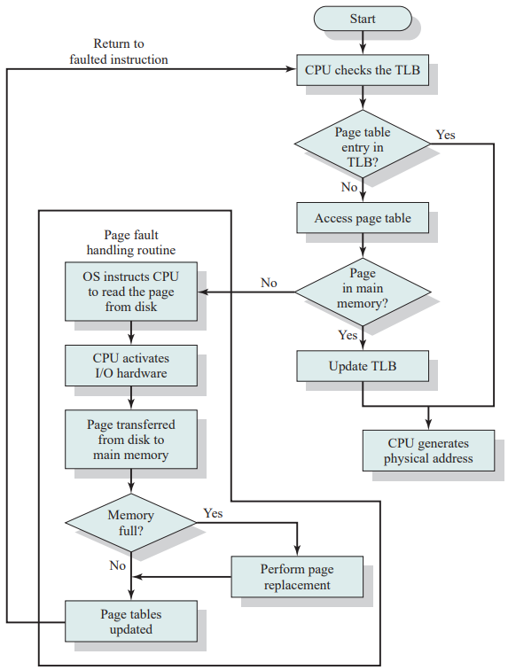

最后，虚拟存储机制需要与内存中的高速缓存进行交互（如下图）：

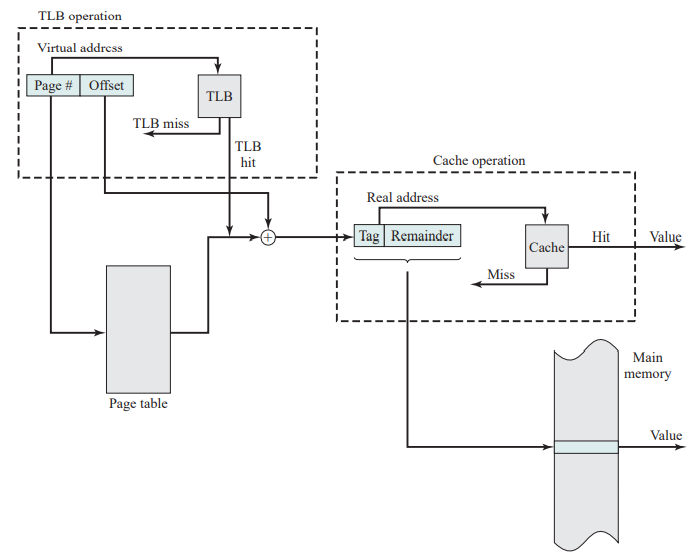

> 说明：
>
> - 内存系统查看TLB中是否存在匹配的页表项
>   - 若存在，就组合页框号和偏移量，形成物理地址
>   - 若不存在，则从页表中读取页表项。产生由一个标记（tag）和其余部分组成的实地址后，查看高速缓存中是否存在包含这个字的块
>     - 若有，则把它返回给CPU
>     - 若没有，则从内存中检索这个字

先来一个小梳理：

虚拟地址转换为实地址时，需要访问页表项，而页表项可能在TLB中，也可能在内存中或磁盘中，且被访问的字可能在高速缓存中、内存中或磁盘中。若被访问的字只在磁盘中，则包含该字的页必须装入内存，且它所在的块须装入高速缓存。此外，包含该字的页所对应的页表项必须更新。

#### 页尺寸

页尺寸是一个重要的硬件设计决策，它需要考虑多方面的因素：

- 页越小，内部碎片的总量越少
- 页越小，每个进程需要的页的数量就越多，这就意味着更大的页表
- 对于大程序，活动进程有一部分页表在虚存而非内存中，从而导致一次内存访问可能产生两次缺页中断：
  - 第一次读取所需的页表部分
  - 第二次读取进程页
- 又基于大多数辅存设备的物理特性，为了实现更为有效的数据块传送，它们更希望页尺寸比较大

页尺寸对缺页中断发生概率的影响使得这些问题变得更为复杂：

- 如果页尺寸非常小，那么每个进程在内存中就有较多数量的页

  一段时间后，内存中的页都包含有最近访问的部分，因此缺页率较低

- 当页尺寸增加时，每页包含的单元和任何一个最近访问过的单元越来越远（削弱局部性原理）

  这会导致缺页率增长

  但是，当页尺寸接近整个进程的大小时，缺页率开始下降。当一页包含整个进程时，不会发生缺页中断（如下图(a)，这很好理解）

  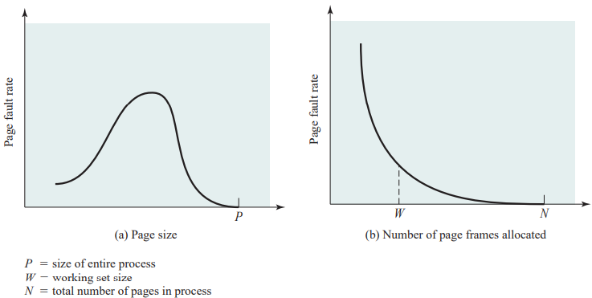

更为复杂的是，缺页率还取决于分配给一个进程的页框的数量（如上图(b)），该图表明：对固定的页尺寸，当内存中的页数量增加时，缺页率会下降（这也不难理解）

### 分段

- 段的大小不等，并且是动态的

- 简化了对不断增长的数据结构的处理

  > 特定的数据结构（程序员并不知晓最后会变得多大）可以分配到它自己的段，需要时操作系统可以扩大或缩小这个段。
  >
  > 若扩大的段需要在内存中，且内存中已无足够的空间，操作系统则把这个段移到内存中的一个更大区域（如果可以得到），或把它换出。对于后一种情况，扩大的段会在下次有机会时换回。

- 允许程序独立地改变或重新编译，而不要求整个程序集重新链接和重新加载

- 有助于进程间的共享

  > 程序员可以在段中放置一个实用工具程序或一个有用的数据表，供其他进程访问

- 有助于保护

  > 由于一个段可被构造成包含一个明确定义的程序或数据集，因而程序员或系统管理员可以更方便地指定访问权限

每个进程都有自己的段表，每个段表项包含：

- 相应段在内存中的起始地址（段基址）

- 段的长度

- 有一个P位来表示它所对应的段当前是否在内存中

- 有一个M位来表示相应段的内容从上次装入内存到现在是否已改变

  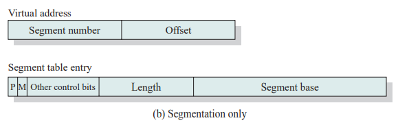

虚拟地址到物理地址的转换：

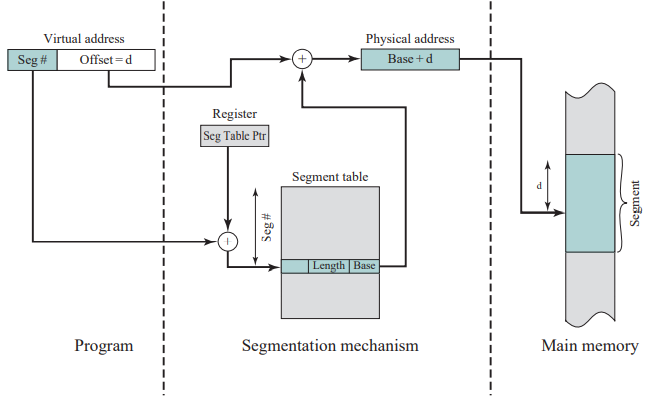

> 说明：
>
> - 当一个进程正在运行时，有一个寄存器为该进程保存段表的起始地址
> - 虚拟地址中的段号（Seg \#）用于检索段表，查找得到该段起始点的相应的内存地址（Base）
> - 将得到的基地址与虚拟地址中的偏移量（offset）相加，得到最终的物理地址

### 段页式

分页和分段各有优势：

- 分页对程序员是透明的，它消除了外部碎片，因而能更有效地使用内存
- 分段对程序员是可见的，它具有处理不断增长的数据结构的能力，及支持共享和保护的能力

结合这二者的优点，引出了段页式结构。

先来介绍段表项以及页表项的结构：

- 段表项：

  - 包含段的长度
  - 包含一个指向一个页表的基域
  - 无存在位和修改位

- 页表项：

  - 与纯粹的分页系统中的页表项相同

  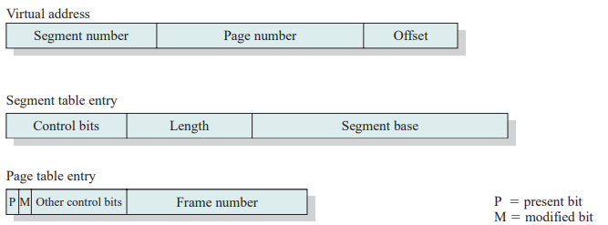

虚拟地址到物理地址的转化：

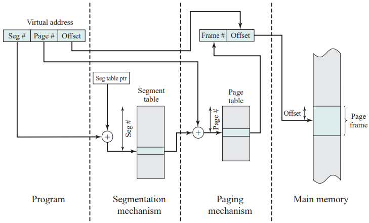

> 说明：
>
> - 当一个进程正在运行时，使用一个寄存器记录该进程段表的起始地址
> - 处理器利用虚拟地址中的段号（Seg \#）来检索进程段表以寻找该段的页表
> - 虚拟地址中的页号（page \#）用于检索页表并查找相应的页框号
> - 最后得到的页框号就是物理地址的页号，结合虚拟地址的偏移量，得到最终的物理地址

### 保护和共享

> 分段有助于实现保护与共享机制。由于每个段表项包括一个长度和一个基地址，因而程序不会不经意地访问超出该段的内存单元。为实现共享，一个段可能会在多个进程的段表中引用。当然，在分页系统中也可得到同样的机制。但是，这种情况下由于程序的页结构和数据对程序员不可见，因此更难说明共享和保护需求。（下图说明了这类系统中可以实施的保护关系的类型）
>
> *（⚠️ 原图已失效）*

## 操作系统软件

在实现内存管理的时候，需要考虑三方面的因素：

- 是否支持虚拟存储
- 虚拟存储的具体实现方式（分页、分段、段页式）
- 操作系统在内存分配时的具体算法

前两个因素取决于硬件部分，而第三个因素属于操作系统软件领域的问题，以下将会介绍虚拟存储考虑的六种策略。

### 读取策略

读取策略（Fetch Policy）决定一个页何时被取入内存，常用到的有以下两种方法：

- 请求分页式（Demand paging）：只有当访问到某页中的一个单元时才将该页取入内存。

  - 当一个进程首次启动时，会在一段时间出现大量的缺页中断

    > 取入越来越多的页后，局部性原理表明大多数将来访问的页都是最近读取的页。因此，在一段时间后错误会逐渐减少，缺页中断的数量会降到很低。

- 预约分页式（Prepaging）：启动进程时一次读取页的数量要比实际需要访问的多。

  - 更为有效的做法是一次读取辅存设备（如磁盘）中连续的页

    > 由于该策略本身的原因，可能会导致大部分读取的页执行进程不会访问，在这种情况下该策略其实是低效的。

为了有效地提高效率，可以采用两种策略相结合的方式：在进程首次启动时以及发生缺页中断时采用预约分页式策略，在正常执行时采用请求分页式策略。

### 放置策略

放置策略（Placement Policy）决定一个进程块驻留在实存中的什么位置。

- 在分段系统以及非一致存储访问（NonUniform Memory Access，NUMA）系统中很重要

- 对于分页和段页式系统，放置策略通常无关紧要

  > 地址转换硬件和内存访问硬件能以相同的效率为任何页框组合执行相应的功能，因此分页和段页式系统对于放置不敏感

### 置换策略

当内存已满，在进程必须读取一个新页时，不得不置换出内存中的一页，关于如何置换页，置换策略（Replacement Policy）给出了一些方法。

首先我们要考虑置换页时，我们应该选择哪些页被换出：

- 置换的目标应该聚焦在那些在未来一段时间内不会被进程访问到或是访问次数很少的页（这不难理解）

  > 这里需要声明一点（包括在以后的章节中也有此类问题）：关于未来进程的执行需要哪些访问，程序员以及操作系统都是无法预测的。
  >
  > （很多设计之初是这样的，在最开始有一个理想的目标或定位。但是在实现起来却发现在实际操作中会遇到致命的问题。要么采用一些手段去想办法解决，要么退而求其次，修改一下目标实现）

- 大多数策略都基于过去的行为来预测将来的行为

  > 好在智慧的人们总结出来这么一条规律：以历史去推测未来。
  >
  > 局部性原理告诉我们：最近的访问历史和最近将要访问的模式间有很大的相关性。
  >
  > （既然我们无法站在现在去预测未来，那我们就站在历史的角度去观测现在）

- 值得注意的是，置换策略设计得越精致、越复杂，实现它的软硬件开销就越大

### 页框锁定

在置换页时需要注意的是，置换策略有一个约束条件——页框锁定（Frame Locking）。

内存中的某些页框可能是被锁定的，当一个页框被锁定时，当前保存在该页框中的页就不能被置换。例如以下内容：

- 操作系统的内核
- 重要的控制结构
- I/O缓冲区以及一些其他对时间要求严格的区域

锁定是通过给每个页框关联一个“锁定”位实现的，这一位可以包含在页框表和当前的页表中。

基本算法：不论采用哪种驻留集管理策略，都有一些用于选择置换页的基本算法。包括以下四种：

- 最佳（Optimal policy，OPT）
- 最近最少使用（Least Recently Used ，LRU）
- 先进先出（First In First Out，FIFO）
- 时钟（Clock）

#### 最佳（OPT）

OPT策略选择置换下次访问距当前时间最长的那些页。

- 这种算法导致的缺页中断最少
- 但是要求操作系统需要预测未来访问

#### 最近最少使用（LRU）

LRU策略选择置换内存中最长时间未被引用的页。

> 如何理解“最近最少使用”：即在短时间的未来最少被进程访问的页。
>
> 同样根据局部性原理，在内存中最长时间未被引用的页，也是短时间内未来最不可能访问到的页。

实现方法是：

1.  给每页添加一个最后一次访问的时间戳，并在每次访问内存时更新这个时间戳。
    - 这种方案需要硬件的支持，会造成大量的开销
2.  维护一个关于访问页的栈
    - 依然会造成大量的开销

#### 先进先出（FIFO）

将分配给进程的一个页框视为一个循环缓冲区，以顺次循环的方式替换页。

- 只需要一个指针，该指针在进程的页框中循环
- 这是最简单的一种算法
- 该方法会将驻留在内存中最久的页替换出去，但是有可能该页会在未来的不久被访问到

#### 时钟策略（Clock）

给每一个页框关联一个称为`使用位`的附加位，整个缓冲区（也是循环的）有一个指针：

- 当一个页首次被加入到内存中时，使用位被置为1（首次加载当然会被访问）

  - 随后被访问到（在访问产生缺页中断后）时也会置为1。（简单讲：只要被进程访问，使用位就置位1）

- 当一个页面被置换时，指针指向缓冲区的下一个页框

- 考虑如何置换（进程的页框已被占满）：

  - 需要置换一页时，操作系统从指针指向的页框顺次扫描整个缓冲区，如果找到第一个使用位为0的页框，就将该页置换出去，并将使用位置为1，指针指向下一个页框
  - 在指针扫描过程中，如果遇到使用位为1的页框，将其置为0，继续扫描，直到找到使用位为0的页框，进行替换
  - 缓冲区是循环的，用图像具象化展示该种策略也不难理解为什么称之为时钟策略

  > 具体实例如下图：
  >
  > 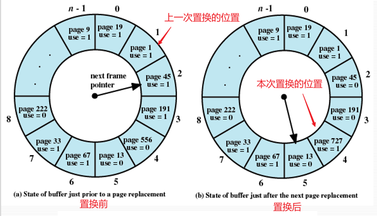

下图给出了四种策略的例子：

- 假设该程序所需要的页地址顺序为：2、3、2、1、5、2、4、5、3、2、5、2
- 假设为该进程分配了3个页框（驻留集大小固定）

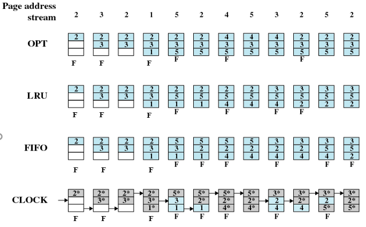

> 说明：
>
> - **F** 表示产生缺页中断
> - 始终策略中：有符号`*`表示该页框的使用位被置位1，没有标记则表示0

针对上述四种算法的相关实验结果如下图：

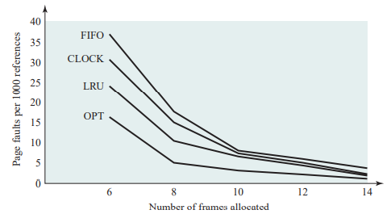

> 说明：假设分配给一个进程的页框数量是固定的。该实验结果基于在一个FORTRAN程序中执行 0.25 × 106次访问，页尺寸为256个字
>
> - 纵轴表示每1000次访问的缺页；横轴表示分配的页框数
> - 当分配的页框比较少时，四种策略的差别非常显著
> - 结果表明，为了更高效的执行，我们希望：
>   - 能处于拐点的右侧（即缺页率小）
>   - 同时又希望处于拐点左侧（即保证小页框的分配）
>   - 因此表明需要的操作模式应位于曲线的拐点处

#### 增强型时钟

之前讨论的算法中，只考虑到了如何置换，而当页被修改时，并未讨论。

基于时钟策略，考虑到页修改的情况，于是有了增强型时钟策略：在原有使用位的基础上，新增添了一个修改位。

> 修改位是必须的，若某页被修改，则在它被写回外存前不会被置换出。

考虑以下四种情形（使用位用`u`表示，修改位用`m`表示）：

1.  最近未被访问，也未被修改（u=0；m=0）
2.  最近被访问，但未被修改（u=1；m=0）
3.  最近未被访问，但被修改（u=0；m=1）
4.  最近被访问，且被修改（u=1；m=1）

根据以上分类，时钟算法对于使用位的策略不变，具体流程如下：

- 先扫描`u=0；m=0`的页，如果遇到，则置换该页
- 若上一步失败，则扫描`u=1；m=0`的页，如果遇到，则置换该页
- 若上一步失败，则返回第一步（指针回到其最初的位置），此时便有u=0的页了

#### 页缓冲

考虑开销的问题，无疑FIFO的策略是最简单的，但是很明显它可能造成抖动，这是不被接受的。于是在考虑能否以FIFO策略为基础提出一种改进算法，这便有了页缓冲（Page Buffering）。

- 提供了两个表，当页发生置换时：

  - 若页未被修改，则分配到空闲页表（Free page list）中
  - 若已被修改，则分配到修改页表（Modified page list）中

  > - 这些操作的一个重要特点是，被置换的页仍然留在内存中。因此，若进程访问该页，则可迅速返回该进程的驻留集，且代价很小。
  > - 实际上，空闲页链表和修改页链表充当着页的高速缓存的角色。
  > - 修改页表还有另外一种很有用的功能：已修改的页按簇写回，而不是一次只写一页，因此大大减少了I/O操作的数量，进而减少了磁盘访问时间。

#### 高速缓存

置换策略和高速缓存大小如前所述，随着内存越来越大，应用的局部性特性逐渐降低。作为补偿，高速缓存的大小也相应增加。较大的高速缓存，甚至是几兆字节的高速缓存，现在也是合理的设计选择。

### 驻留集管理

#### 驻留集大小

驻留集（Resident Set）大小对于分页式虚拟内存，在准备执行时，不需要也不可能把一个进程的所有页都读入内存。因此，操作系统必须决定读取多少页，即决定给特定的进程分配多大的内存空间。这需要考虑以下几个因素：

- 分配给一个进程的内存越少，在任何时候驻留在内存中的进程数就越多。

  > 这增加了操作系统至少找到一个就绪进程的可能性，减少了由于交换而消耗的处理器时间。

- 若一个进程在内存中的页数较少，尽管有局部性原理，缺页率仍相对较高。

- 给特定进程分配的内存空间超过一定大小后，由于局部性原理，该进程的缺页率没有明显的变化。

基于以上因素，当代操作系统通常采取以下两种策略：

- 固定分配策略（Fixed-allocation）：

  - 在进程执行时，为其在内存中分配固定数量的页框（这一数量在进程创建时就被确定）
  - 一旦在进程的执行过程中发生缺页中断，该进程的一页就必须被它所需要的页面置换

- 可变分配策略（Variable-allocation）：

  - 允许分配给一个进程的页框在该进程的生命周期中不断地发生变化。

    > 理论上：
    >
    > - 若一个进程的缺页率一直比较高，则表明在该进程中局部性原理表现较弱，应给它多分配一些页框以减小缺页率；
    > - 若一个进程的缺页率特别低，则表明从局部性的角度看该进程的表现非常好，可在不明显增大缺页率的前提下减少分配给它的页框。

    > 看起来的优势策略必然会导致开销：可变分配策略要求操作系统对活动进程进行评估；除此之外还包括硬件上的开销。

#### 置换范围

置换策略的范围分为以下两类：

- 局部置换策略（Local Replace Policy）：在替换页时，仅在产生这次缺页的进程的驻留页中选择。
- 全局置换策略（Global Replace Policy）：把内存中所有未被锁定的页都作为置换的候选页，而不管它们属于哪个进程。

置换范围和驻留集大小之间存在一定的联系（如下表）：

<table>
<colgroup>
<col style="width: 33%" />
<col style="width: 33%" />
<col style="width: 33%" />
</colgroup>
<thead>
<tr>
<th></th>
<th>局部置换</th>
<th>全局置换</th>
</tr>
</thead>
<tbody>
<tr>
<td><strong>固定分配</strong></td>
<td>分配给一个进程的页框数是固定的 
从分配给该进程的页框中选择被置换的页</td>
<td>无此方案</td>
</tr>
<tr>
<td><strong>可变分配</strong></td>
<td>分配给一个进程的页框数不时变化，用于保存该进程的工作集 
从分配给该进程的页框中选择被置换的页</td>
<td>从内存中的所有可用页框中选择被置换的页；这将导致进程驻留集的大小不断变化</td>
</tr>
</tbody>
</table>

下面来一一详细介绍：

#### 固定分配、局部置换

分配给在内存中运行的进程的页框数固定

- 总页数分配得过少时，会产生很高的缺页率
- 总页数分配得过多时，内存中只能有很少的几个程序，处理器会有很多空闲时间，并把大量时间花费在交换上

#### 可变分配、全局置换

- 该种组合方式最容易实现，并被许多操作系统使用
- 操作系统除了为每个进程分配了一定数量的页框，还维护有一个空闲页框列表，发生一次缺页中断时，一个空闲页框会被添加到进程的驻留集，并读入该页。因此发生缺页中断的进程的大小会逐渐增大
  - 如果没有空闲页框可用时，操作系统必须选择一个当前位于内存中的页框进行置换（不包括被锁定的页框）

> 问题：选择的置换页可以属于任何一个驻留进程，而没有任何原则用于确定哪个进程应从其驻留集中失去一页。因此，驻留集大小减小的那个进程可能并不是最适合被置换的。
>
> 解决此问题的一种方法是使用页缓冲：按照这种方法，选择置换哪一页并不重要，因为如果在下次重写这些页之前访问到了这一页，则这一页仍可回收。

#### 可变分配、局部置换

为了解决可变分配、全局置换的潜在问题，引入了另一种组合：可变分配、局部置换。

- 当一个新进程被装入内存时，根据应用类型、程序要求或其他原则，给它分配一定数量的页框作为其驻留集
  - 使用预先分页或请求分页填满这些页框
- 发生一次缺页中断时，从产生缺页中断的进程的驻留集中选择一页用于置换
- 不时地重新评估进程的页框分配情况，增加或减少分配给它的页框，以提高整体性能

### 清除策略

与读取策略相反，清除策略（Clearing Policy）用于确定何时将已修改的一页写回辅存，通常有以下两种选择：

- 请求式清除（Demand cleaning）：只有当页被选择用于置换时才被写回辅存。

- 预约式清除（Precleaning）：将这些已修改的多页在需要使用它们所占据的页框之前成批写回辅存。

  > 分析：
  >
  > 完全使用任何一种策略都存在问题：
  >
  > - 对于请求式清除：写回已修改的页和读入新页是成对出现的，且写回在读入之前。这就意味着当发生缺页中断的进程在解除阻塞之前必须等待两次页传送，可能降低处理器效率。
  > - 对于预约式清除：需要被写回辅存的页可能仍然留在内存中，直到页面置换算法指示它被移出。预约式清除允许成批地写回页，但是这样意义不大，因为这些页中地大部分通常在置换前又被修改。

由于单纯使用某一种策略都会有潜在的问题，一种比较好的方式就是结合页缓冲技术。具体策略：只清除可用于置换的页，但去除了清除和置换操作间的成对关系。

- 被置换的页会放在如下两个页表中：
  - 修改表：修改表中的页可以周期性地成批写出，并移入未修改表中。
  - 未修改表：未修改表中的一页要么因为被重新访问而被回收，要么在其页框分配给另一页时被淘汰。

### 加载控制

加载控制（Load Control）会影响到驻留在内存中的进程数量，这称为系统并发度。

如何控制系统并发度是一个值得思考的问题，因为有以下两种情况影响着处理器利用率：

- 如果驻留进程太少，那么所有进程都处于阻塞态的概率就较大。

- 如果驻留进程太多，那么平均每个进程的驻留集大小将会不够用，此时会频繁发生缺页中断，导致系统抖动。

  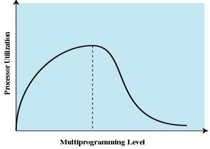

  > 最好能够保证并发度达到图中虚线位置，使处理器效率达到最大
  >
  > > 工作集或PFF算法都隐含了加载控制。
  > >
  > > - 只允许执行那些驻留集足够大的进程。
  > > - 在为每个活动进程提供需要的驻留集大小时，该策略会自动并动态地确定活动程序的数量。

#### 进程挂起

系统并发度减小时，一个或多个当前驻留进程须被挂起（换出）。具体为以下六种情况：

- 最低优先级进程：实现调度策略决策，与性能问题无关。

- 缺页中断进程：原因在于很有可能是缺页中断任务的工作集还未驻留，因而挂起它对性能的影响最小。

  > 此外，由于它阻塞了一个一定会被阻塞的进程，并且消除了页面置换和I/O操作的开销，因而该选择可以立即收到成效。

- 最后一个被激活的进程：这个进程的工作集最有可能还未驻留。

- 驻留集最小的进程：在将来再次装入时的代价最小，但不利于局部性较小的程序。

- 最大空间的进程：可在过量使用的内存中得到最多的空闲页框，使它不会很快又处于去活（deactivation）状态。

- 具有最大剩余执行窗口的进程：在大多数进程调度方案中，一个进程在被中断或放置在就绪队列末尾之前，只运行一定的时间。这近似于最短处理时间优先的调度原则。

------------------------------------------------------------------------

# 后记

本篇已完结

*通过本章细细品味一下操作系统为何在计算机学课中是具有那么一些哲学味道的学课*🤔🤔🤔🤔

（如有修改或补充欢迎评论）
