# 操作系统学习笔记-计算机系统概述

> 📌 转载自 **花猪のBlog（作者 CNhuazhu）** —— 原文：https://cnhuazhu.top/butterfly/2021/03/14/%E6%93%8D%E4%BD%9C%E7%B3%BB%E7%BB%9F/%E6%93%8D%E4%BD%9C%E7%B3%BB%E7%BB%9F%E5%AD%A6%E4%B9%A0%E7%AC%94%E8%AE%B0-%E8%AE%A1%E7%AE%97%E6%9C%BA%E7%B3%BB%E7%BB%9F%E6%A6%82%E8%BF%B0/
> 学习笔记，版权归原作者所有，仅供学弟学妹学习参考；如有侵权请联系删除。

---

# 前言

*正在学习操作系统，记录笔记。*

> 参考资料：
>
> 《操作系统（精髓与设计原理 第6版） 》

------------------------------------------------------------------------

# 第一章：计算机系统概述

## 基本构成

从最顶层看，一台计算机由处理器（CPU，包含运算器、控制器）、存储器以及输入/输出部件组成。

> 按照冯·诺依曼的结构表述：计算机组成为五个部分，即运算器、控制器、存储器、输入设备、输出设备。
>
> 冯·诺伊曼结构特点：
>
> - 五大组成
> - 指令、数据存储于存储器中
> - 数据以二进制方式存储
> - 存储包括操作码以及操作数地址
> - 指令按照存储器中的顺序执行
> - 计算机以CPU为中心。I/O设备、存储器设备之间的通信必须经过CPU

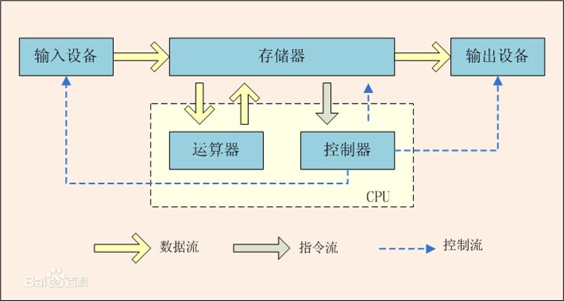

- **Processor（处理器）**：控制计算机的操作，执行数据处理功能。当只有一个处理器时，它通常指中央处理单元（CPU）。

- **Main memory（内存）**：存储数据和程序。具有`易失性（Volatile）`，即掉电数据丢失。通常也称为**实存储器（real memory）**或**主存储器（primary memory）**。

- **I/O modules （输入/输出模块）**：在计算机和外部环境之间移动数据。外部环境由各种外部设备组成，包括辅助存储器设备（如硬盘）、通信设备和终端（terminals）。

- **System bus（系统总线）**：为处理器、内存和输入/输出模块间提供通信的设施。

  > 注意：系统总线的概念是在冯·诺依曼结构定义之外的部分。有两种划分方式：
  >
  > - 第一种划分：数据总线、地址总线、控制总线、状态总线
  >
  > - 第二种划分：串行总线、并行总线

## 寄存器（Processor Registers）

寄存器可以理解为处理器中的一种内存（Memory inside CPU）。它的作用是为了使程序员能够尽量减少主内存引用。（Enable programmer to minimize main-memory references）

> 寄存器最初诞生的原因：是为了解决CPU和内存速度不匹配的问题。
>
> 举例说明：假如我现在要做一道西红柿炒鸡蛋。点起炉灶就开始干活，等把油锅烧热了之后准备下鸡蛋，此时却发现我没有鸡蛋🥚，于是我就去菜市场买来鸡蛋，回家下到油锅里。等鸡蛋炒的差不多了之后我要开始下西红柿，但是我却发现没有西红柿🍅，于是我又去菜市场买来西红柿，回家继续做饭。这样的做饭过程实在是过于繁琐，于是乎出于方便考虑，我决定买一台冰箱。下次在做饭之前会提前从菜市场买来材料存放在冰箱里，等到做饭时就不会显得如此愚蠢了。
>
> 这个例子中菜市场就相当于内存，它可以从外地引进各种各样的蔬菜（我们可以理解为外存），油锅就相当于CPU，它在不停地做饭（处理数据），冰箱我们就可以理解为寄存器，它可以把从菜市场（内存）买来的蔬菜暂时存储起来，等到做饭时就可以快速取用。
>
> 所以数据、指令的传输流程如下：
>
> 内存数据 --\> 寄存器 --\> 处理器（CPU）

寄存器可以分为两类：User-visible registers（用户可见寄存器）、Control and status registers（控制和状态寄存器）

- 用户可见寄存器

  可以被机器/汇编语言引用。（允许所有的程序访问，包括应用程序和系统程序）

  > 优先使用这些寄存器，可以减少使用机器语言或汇编语言的程序员对内存的访问次数。对高级语言而言，由优化编译器负责决定哪些变量应该分配给寄存器，哪些变量应该分配给内存。一些高级语言（如C语言）允许程序员建议编译器把哪些变量保存在寄存器中。

  该寄存器又可以分为两类：Data register（数据寄存器）、Address register（地址寄存器）

  - 数据寄存器：可以被程序员分配给各种函数。

  - 地址寄存器：存放数据和指令的内存地址，或者存放用于计算完整地址或有效地址的部分地址。

    地址寄存器又可以被划分为三个部分：

    - Segment pointer（段指针）：当内存被分成若干段时，内存由一个段和一个偏移量来引用。
    - Index register（索引寄存器）：需要在一个基础值上添加一个索引，以获得一个地址。
    - Stack pointer（栈指针）：指向堆栈顶部。

- 控制和状态寄存器

  用以控制处理器的操作，且主要被具有特权的操作系统例程使用，以控制程序的执行。（对用户不可见，可通过机器指令进行访问）

  以下的寄存器是指令执行所必需的：

  - Program Counter（PC）程序计数器：包含要获取的指令的地址。
  - Instruction Register（IR）指令寄存器：包含最近获取的指令。
  - Program Status Word（PSW）程序状态字：通常包含条件码和其他状态信息（如Interrupt enable/disable，Supervisor/user mode）。

## 指令执行（Instruction Execution ）

处理器执行的程序是由一组保存在存储器中的指令组成的。CPU是按照顺序执行一条条的指令。

> Program Execution = Instruction Execution （程序执行 = 指令执行）

指令周期：一个单一的指令需要的处理称为一个指令周期。具体分为两个阶段：取指令阶段（指令加载到寄存器），执行阶段（解析指令）。

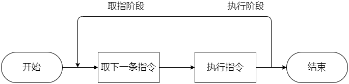

在每个指令周期开始时，处理器从存储器中取一条指令。在典型的处理器中，程序计数器（Program Counter，PC）保存下一次要取的指令地址。除非有其他情况，否则处理器在每次取指令后总是递增PC，使得它能够按顺序取得下一条指令（即位于下一个存储器地址的指令）。

> 例如，考虑一个简化的计算机，每条指令占据存储器中一个16位的字，假设程序计数器PC被设置为地址300，处理器下一次将在地址为300的存储单元处取指令，在随后的指令周期中，它将从地址为301、302、303等的存储单元处取指令。（事实上这个顺序实可以改变的）

取到的指令被放置在处理器的一个寄存器中，这个寄存器称做指令寄存器（Instruction Register，IR）。指令中包含确定处理器将要执行的操作的位，处理器解释指令并执行对应的操作。

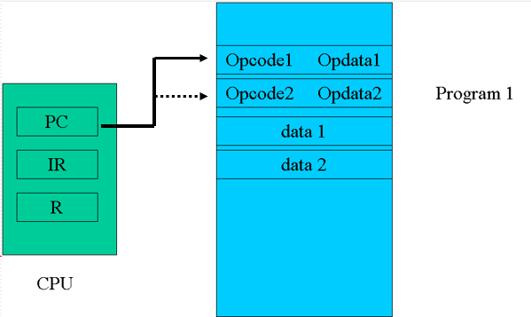

> 注意：指令的组成包括两部分：Opcode（操作码），Opdata（操作数/操作数的地址）

处理器收到指令后就会解释指令并执行对应操作，这些操作可分为4类：

- Processor-memory（处理器-存储器）：数据在处理器和存储器之间传输。

- Processor-I/O（处理器-I/O）：数据可以传入或传出外部设备。

- Data processing（数据处理）：处理器可以执行很多与数据相关的算术操作或逻辑操作。

- Control（控制）：某些指令可以改变执行顺序。

  > 指令的执行可能涉及这些行为的组合。

如图是一个“计算3+2”程序的指令执行流程：

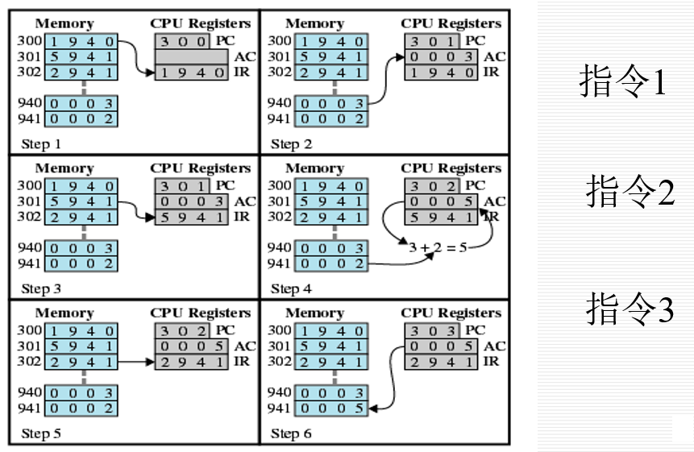

> 解释：
>
> - PC中包含第一条指令的地址为300，该指令内容（值为十六进制数1940）被送入指令寄存器IR中，PC增1。注意，此处理过程使用了存储器地址寄存器（MAR）和存储器缓冲寄存器（MBR）。为简单起见，这些中间寄存器没有显示。
> - IR中最初的4位（第一个十六进制数）表示需要加载AC，剩下的12位（后三个十六进制数）表示地址为940。
> - 从地址为301的存储单元中取下一条指令（5941），PC增1。
> - AC中以前的内容和地址为941的存储单元中的内容相加，结果保存在AC中。
> - 从地址为302的存储单元中取下一条指令（2941），PC增1。
> - AC中的内容被存储在地址为941的存储单元中。

## 中断（Interrupt）

其他模块（I/O、内存）可能中断处理器正常排序的机制。（例：一个I/O设备可以停止CPU正在进行的工作，以提供一些必要的服务。）（如下图是无中断机制下，调用外部I/O设备的情况）

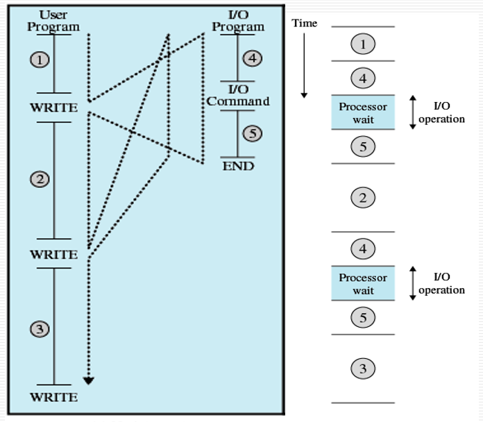

中断机制的引进最初是为了提高计算机系统的运行效率，但是实际使用中发现这种中断机制并不能从根本上解决问题（因为I/O设备的速度远远比处理器慢，这不是依靠中断就可以解决的，实际情况仍然符合上图），但是这带来一个新的思路：程序可以不必再顺序执行，可以利用中断机制实现多道程序的同时执行（Concurrent 并发）。

> 大多数I/O设备比处理器慢得多，假设处理器使用一个指令周期方案给一台打印机传送数据，在每一次写操作后，处理器必须暂停并保持空闲，直到打印机完成工作。暂停的时间长度可能相当于成百上千个不涉及存储器的指令周期。显然，这对于处理器的使用来说是非常浪费的。

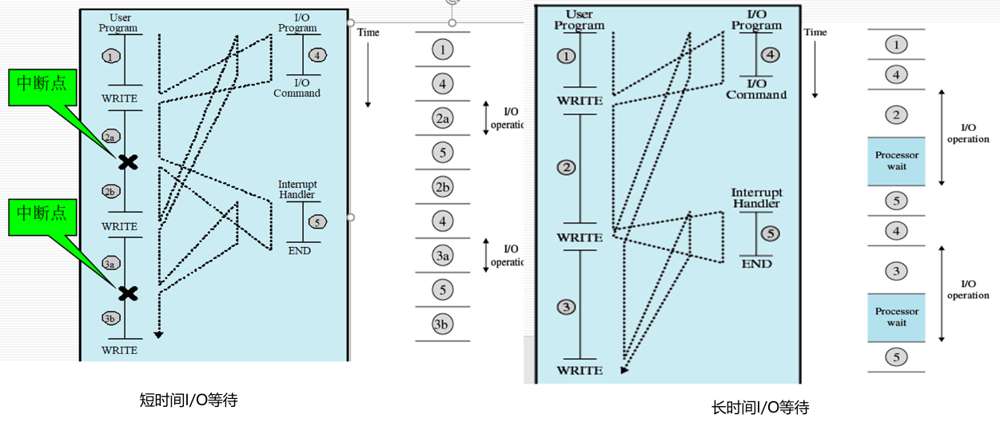

中断的三大特点：

- Unpredictable（不可预测性/随机性）
- can be disable（可屏蔽性）
- Can be nested（可嵌套性）

中断的分类：

- Program（程序中断）
- Timer（时钟中断）
- I/O（I/O中断）
- Hardware failure（硬件故障中断）

有中断情况的指令周期：为了适应中断产生的情况，在指令周期中需要增加一个中断阶段。

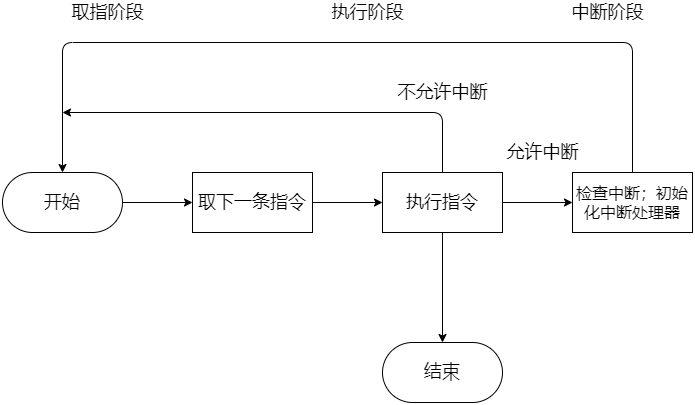

> - 如果没有中断，则获取当前程序的下一条指令。
> - 如果一个中断正在等待，则暂停当前程序的执行，并执行中断处理程序.

多重中断（Multiple Interrupts）：当正在处理一个中断时，可以发生一个或多个中断。

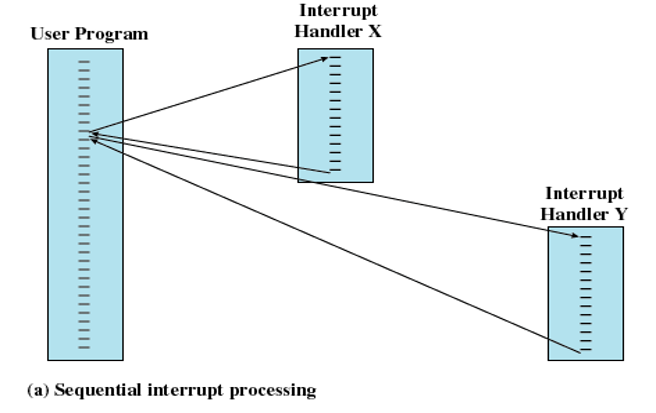

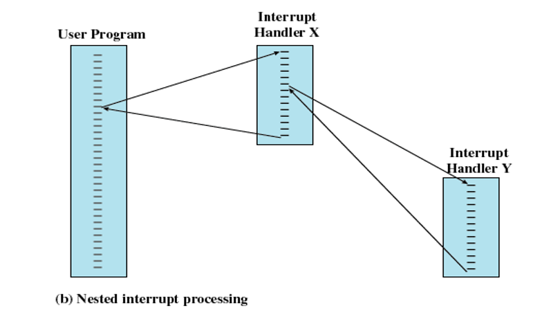

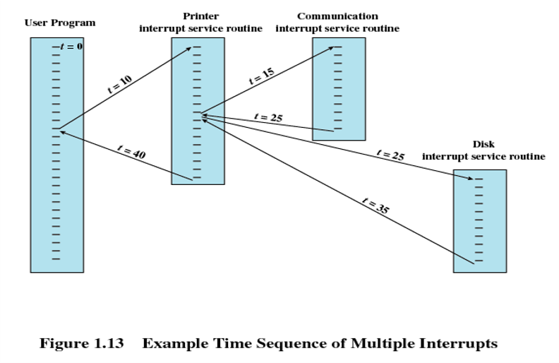

Multiprogramming（多道程序）：处理器有多个程序要执行。

即使有了中断机制，处理器也有可能未得到有效利用（如上图中展示的长时间I/O等待）。如果遇到长时间I/O设备等待的情况，处理器仍是空闲的。为了解决这种情况，可以允许多道用户程序同时处于活动状态。

> - 程序的执行顺序取决于它们的相对优先级和是否在等待I/O
> - 当程序被中断时，控制权转移给中断处理程序
> - 中断处理程序完成，控制权有可能不返回到之前被中断的应用程序，而是转移到其他等待运行的具有更高优先级的程序
> - 中断的处理方式：1.屏蔽中断 2.按优先级处理中断

## 存储器的层次结构（The Memory Hierarchy）

计算机存储器的设计目标可以归纳成三个问题：多大的容量（Capacity）？多快的速度（Speed）？多贵的价格（Price）？而这三者是不可兼得的。

> 各种技术间存在以下关系：
>
> - 存取时间越快，每一个“位”的价格越高。
> - 容量越大，每一个“位”的价格越低。
> - 容量越大，存取速度越慢。

解决不兼得的问题，需要不依赖于单一的存储组件或技术，而采用存储器的层次结构：具体可分为三层（Three Levels ）。

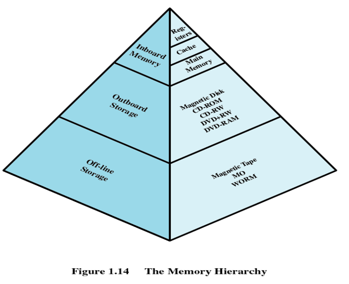

- 第一层（Inboard Memory板上存储器）：Registers（寄存器）+Cache（高速缓存）+Main Memory（主存）

  特点：semiconductor（半导体技术）、Volatile（数据易失）、Bytes/words（表现形式为处理器可直接存取字节，容量小）

- 第二层（Outboard Storage板外存储体）：Magnetic Disk（磁盘）+ CD-ROM + CD-RW + DVD-RW + DVD-RAM

  特点：Auxiliary memory（辅助存储）、Nonvolatile（数据非易失）、Files（表现形式为文件和记录）

- 第三层（Off-line Storage离线存储体）：Magnetic Tape（磁带）、MO、WORM

> 从上往下看会发现：
>
> - 每一个“位”的价格递减
> - 容量递增
> - 存取时间递增
> - 处理器访问存储器的频率递减

## 局部性原理

在CPU访问寄存器时，无论是存取数据或存取指令，都趋于聚集在这一片连续的区域中，这就是局部性原理。

- Temporal locality（时间局部性）：被引用过一次的存储器位置在未来会被多次引用（通常在循环中）
- Spatial locality（空间局部性）：如果一个存储器的位置被引用，那么将来他引用附近的位置也会被引用。

## I/O通讯技术（I/O Communication Techniques）

对I/O操作有三种可能的技术：Programmed I/O（可编程I/O）、Interrupt-Driven I/O（中断驱动I/O）、Direct Memory Access / DMA（直接内存存取）

- Programmed I/O（可编程I/O）

  - I/O模块执行动作，而不是处理器。
  - 设置I/O状态寄存器的相应位
  - 不发生中断
  - 处理器执行I/O指令后定期检查状态，以确定I/O操作是否完成

  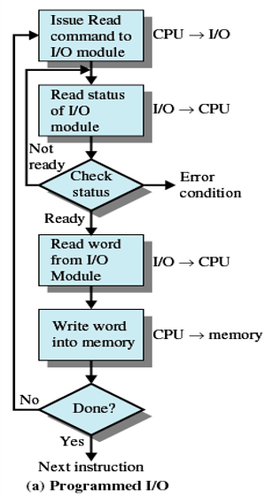

- Interrupt-Driven I/O（中断驱动I/O）

  - 当I/O模块准备交换数据时，处理器被中断

  - 处理器保存程序执行的上下文，并开始执行中断处理程序。

  - 不需要等待

  - 消耗大量的处理器时间，因为每读或写一个字都要经过处理器。（缺点）

    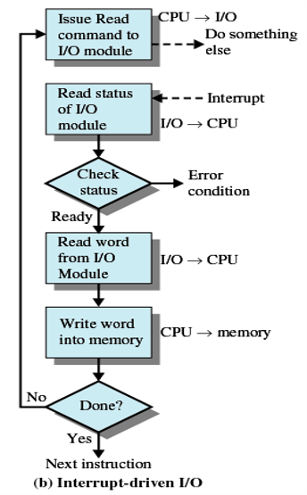

- Direct Memory Access / DMA（直接内存存取）

  - I/O与内存直接进行数据交换（缓解处理器的压力，DMA模块直接与存储器交互，传送数据块）。

  - 流程：

    处理器授予I/O模块读取或写入内存的权限。

    当传输完成时，会发送一个中断。

    处理器继续进行其他工作

    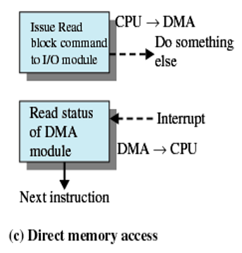

> 为了更好的理解以上三种I/O通讯，这里再举一个例子：
>
> 假设现在在上一门名为“操作系统”的课程，但是同学们的教材都没有领到，为了让同学们拿到教材更有效地听讲，任课教师采取了以下三种方式：
>
> - 方式一：老师不断地打电话给教材发行处，询问教材有没有到位，如果没有到位就一直打电话确认，直到教材到位。然后派人到指定地点将书领回来，分发给同学们，开始上课。
> - 方式二：老师给教材发行处打电话，并通知一旦教材到位就联系他，在这期间老师就开始给同学们上课。等到教材到位了发行处就会给老师打电话，通知老师领书，于是老师就暂停讲课，派人到指定地点领书，回来分发给同学们，继续上课。
> - 方式三：老师给教材发行处打电话，并通知一旦教材到位就联系班长，在这期间老师开始给同学们上课。等到教材到位了发行处就会联系班长取书，于是班长就到指定地点领书，回来分发给同学们。这期间老师一直在给同学们上课，等到班长将教材全部发放完毕后，就向老师汇报“教材发放完毕”。老师收到汇报后继续给同学们讲课。
>
> 方式一就可以类比为可编程I/O通讯；方式二则对应中断驱动I/O通讯；方式三对应直接内存存取通讯（其中班长担任了“DMA模块”的角色）

------------------------------------------------------------------------

# 结尾

本篇结束（如有修改或补充欢迎评论）
