# 操作系统学习笔记-进程描述和控制

> 📌 转载自 **花猪のBlog（作者 CNhuazhu）** —— 原文：https://cnhuazhu.top/butterfly/2021/03/30/%E6%93%8D%E4%BD%9C%E7%B3%BB%E7%BB%9F/%E6%93%8D%E4%BD%9C%E7%B3%BB%E7%BB%9F%E5%AD%A6%E4%B9%A0%E7%AC%94%E8%AE%B0-%E8%BF%9B%E7%A8%8B%E6%8F%8F%E8%BF%B0%E5%92%8C%E6%8E%A7%E5%88%B6/
> 学习笔记，版权归原作者所有，仅供学弟学妹学习参考；如有侵权请联系删除。

---

# 前言

*正在学习操作系统，记录笔记。*

> 参考资料：
>
> 《操作系统（精髓与设计原理 第6版） 》

------------------------------------------------------------------------

# 第三章：进程描述和控制

## 什么是进程

在给进程下定义之前，我们先回顾总结一下第一章和第二章的概念。

- 计算机平台包括一组硬件资源。（如处理器、内存、I/O模块、定时器和磁盘驱动器等）

- 计算机程序是为执行某些任务而开发的。

- 直接根据给定的硬件平台写应用程序效率是低下的。

  > 原因如下：
  >
  > - 针对相同的平台可以开发出很多应用程序，所以开发出这些应用程序访问计算机资源的通用例程是很有意义的。
  > - 处理器本身只能对多道程序设计提供有限的支持，需要用软件去管理处理器和其他资源同时被多个程序共享。
  > - 如果多个程序在同一时间都是活跃的，那么需要保护每个程序的数据、I/O使用和其他资源不被其他程序占用。

- 开发操作系统是为了给应用程序提供一个方便、安全和一致的接口。

- 可以把操作系统想象为资源的统一抽象表示，可以被应用程序请求和访问。

操作系统需要以一个有序的方式管理应用程序的执行，以达到以下目的：

- 资源对多个应用程序是可用的。
- 物理处理器在多个应用程序间切换以保证所有程序都在执行中。
- 处理器和I/O设备能得到充分的利用。

## 进程和进程控制块

下面给出进程（process）的4个定义：

1.  正在执行的程序。
2.  正在计算机上执行的程序实例。
3.  能分配给处理器并由处理器执行的实体。
4.  具有以下特征的活动单元：
    - 一组指令序列的执行。
    - 一个当前状态。
    - 相关的系统资源集。

> 进程的两个基本元素是**程序代码**（可能被执行相同程序的其他进程共享）和代码相关联的**数据集**。

进程控制块（Process Control Block）

进程控制块是一种数据结构，该控制块由操作系统创建和管理。其中包含了以下信息：

- 标识信息（Process Identification）/基本信息

  系统给每个进程定义了一个唯一标识该进程的非负整数，称作**进程标识符**(PID:Process Identifier)

- 状态信息（Processor State Information）

  其中包括以下内容：

  - 用户可见寄存器（User-Visible Registers）
  - 控制和状态寄存器（Control and Status Registers）
  - 堆栈指针（Stack Pointers）

- 控制信息（Process Control information）

  控制信息可以分为以下两类：

  1.  调度信息（Scheduling Information）：其中包括
      - 状态（state）/进程
      - 优先级（Priority）
      - 审计信息（ Accounting information）
  2.  控制信息（Control Information）：其中包括
      - 数据结构（Data Structuring）
      - 内存管理（Memory Management）
      - 进程间通讯（Interprocess Communication）
      - 资源所有权和利用（Resource Ownership and Utilization）

  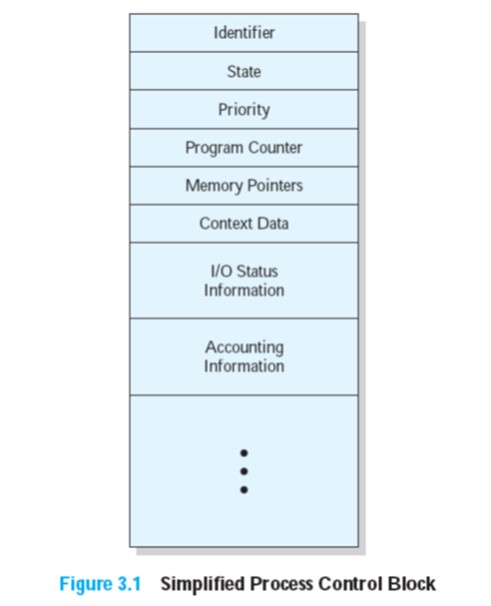

> 关于进程控制块的几点说明：
>
> - 包含了进程元素
> - 由操作系统创建和管理
> - 允许支持多个进程
>
> 进程控制块包含了充分的信息，这样就可以中断一个进程的执行，并且在后来恢复执行进程时就好像进程未被中断过。进程控制块是操作系统能够支持多进程和提供多处理的关键工具。当进程被中断时，操作系统会把程序计数器和处理器寄存器（上下文数据）保存到进程控制块中的相应位置，进程状态也被改变为其他的值（例如阻塞状态或就绪状态）。

> 关于进程和程序的差异：
>
> - 进程是动态的，它的存在只是暂时的。
> - 程序是静态的，它可以持久化存在。

> 关于并行和并发：
>
> - 并发：同一个时间段有多个进程在执行。
> - 并行：同一个时间点有多个进程在执行。

## 进程状态（Process States）

进程轨迹（Trace of Process）

进程轨迹就是：进程执行的指令序列。

调度器（Dispatcher）/分派器可以使处理器从一个进程切换到另一个进程。

> 对一个被执行的程序，操作系统会为该程序创建一个进程或任务。从处理器的角度看，它在指令序列中按某种顺序执行指令，这个顺序根据程序计数器寄存器中不断变化的值来指示，程序计数器可能指向不同进程中不同部分的程序代码；从程序自身的角度看，它的执行涉及程序中的一系列指令。
>
> 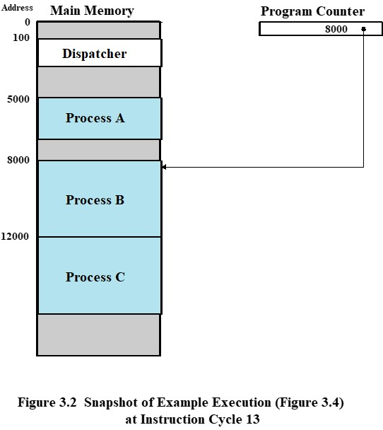
>
> 上图给出了三个进程在内存中的布局，其中进程A和C执行12条指令，进程B执行4条指令（如下图）
>
> 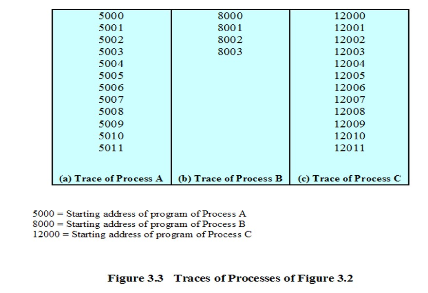
>
> 现在假设编号为8003的指令执行 后进程必须等待I/O操作，且操作系统仅允许一个进程最多连续执行6个指令周期。下图给出了最初的52个指令周期中交替的轨迹。
>
> 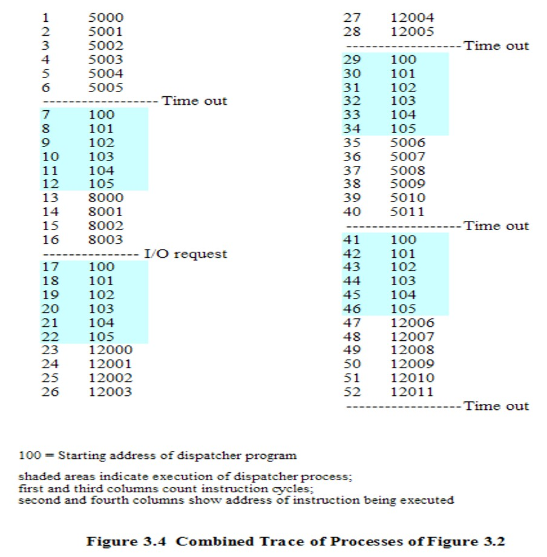
>
> （阴影部分表示调度器程序的执行）

指令执行图并不实用，看起来过于繁杂，于是引入了进程模型。下面将会分别介绍两状态进程模型、五状态进程模型以及七状态进程模型。

### 两状态进程模型（Two-State Process Model）

该模型下的进程有两种状态：运行态（Running）以及非运行态（Not-running）

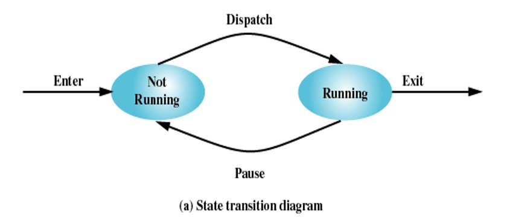

> 四种状态：
>
> 1.  操作系统创建一个新进程（Enter）。
> 2.  新进程被调度器转换为运行态（Dispatch）。
> 3.  被中断的进程被调整为非运行态（Pause）。
> 4.  进程结束运行（Exit）。

从上面这个简单的模型中进而可以分析道，必须通过某种方式来表示进程，从而使操作系统可以跟踪它们。未运行的进程必须保持在某种类型的队列中，并等待它们的执行时机。下图给出了一个队列结构，队列中的每一项都指向某个特定进程的指针。（队列也可以由数据块构成的链表组成，每个数据块表示一个进程）。

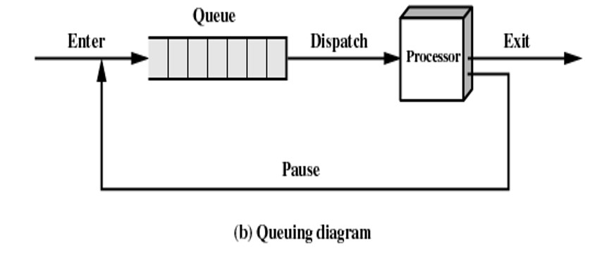

> 可以用该排队图描述分派器的行为。被中断的进程转移到等待进程队列中，或者，如果进程已经结束或取消，则被销毁（离开系统）。在任何一种情况下，分派器均从队列中选择一个进程来执行。

### 进程的创建和终止

导致进程创建的原因（4类）：

| 事件 | 说明 |
|----|----|
| 新的批处理作业 | 通常位于磁带或磁盘中的批处理作业控制流被提供给操作系统。当操作系统准备接纳新工作时，它将读取下一个作业控制命令 |
| 交互登录 | 终端用户登录到系统 |
| 操作系统因为提供一项服务而创建 | 操作系统可以创建一个进程，代表用户程序执行一个功能，使用户无需等待（如控制打印的进程） |
| 由现有的进程派生 | 基于模块化的考虑，或者为了开发并行性，用户程序可以指示创建多个进程 |

> 当操作系统位另一个进程的显示请求创建一个进程时，这个动作被称为**进程派生**。当一个进程派生另一个进程时，前一个称作**父进程**，被派生的叫做**子进程**。

导致进程终止的事件（我们大致可以分为三类）：

1.  自然死亡：程序正常运行完毕。
2.  异常死亡：由于程序在运行过程中本身出现问题，从而触发操作系统的保护机制，杀死进程。
3.  他杀：又可以分为两种情况
    - CPU占用率达到100%，此时操作系统需要杀死一些进程保证计算机系统的运行效率。
    - 用户进程可以杀死它创建的子进程。

还有一些具体导致进程终止的原因可见下表：

| 事件 | 说明 |
|----|----|
| 正常完成 | 进程自行执行一个操作系统服务调用，表示它已经结束运行 |
| 超过时限 | 进程运行时间超过规定的时限。可以测量很多种类型的时间，包括总的运行时间（“挂钟时间”）、花费在执行上的时间以及对于交互进程从上一次用户输入到当前时刻的时间总量 |
| 无可用内存 | 系统无法满足进程需要的内存空间 |
| 越界 | 进程试图访问不允许访问的内存单元 |
| 保护错误 | 进程试图使用不允许使用的资源或文件，或者试图以一种不正确的方式使用，如往只读文件中写 |
| 算数错误 | 进程试图进行被禁止的计算，如除以零或者存储大于硬件可以接纳的数字 |
| 时间超出 | 进程等待某一事件发生的时间超过了规定的最大值 |
| I/O失败 | 在输入或输出期间发生错误，如找不到文件、在超过规定的最多努力次数后仍然读/写失败（例如当遇到了磁带上的一个坏区时）或者无效操作（如从行式打印机中读） |
| 无效指令 | 进程试图执行一个不存在的指令（通常是由于转移到了数据区并企图执行数据） |
| 特权指令 | 进程试图使用为操作系统保留的指令 |
| 数据误用 | 错误类型或未初始化的一块数据 |
| 操作员或操作系统干涉 | 由于某些原因，操作员或操作系统终止进程（例如，如果存在死锁） |
| 父进程终止 | 当一个父进程终止时，操作系统可能会自动终止该进程的所有后代进程 |
| 父进程请求 | 父进程通常具有终止其任何后代进程的权力 |

### 五状态模型

引入五状态模型的原因：

对于之前介绍的两状态模型，处理器会对可运行的进程以一种轮转（round-robin）的方式操作（依次给队列中的每一个进程一定的执行时间，然后进程返回队列，阻塞情况除外）。但是这种方式存在两类问题：

1.  处于非运行状态的进程：
    - 进程已经准备就绪，可以运行，但是由于CPU正在被其他占用，从而导致处于非运行态。
    - 存在一些处于阻塞状态（blocked）等待I/O操作结束的进程。
2.  调度器不能只考虑选择队列中等待时间最长的进程，因为这些进程很有可能被阻塞。应该查找那些未被阻塞且在队列中时间最长的进程。

解决上述问题的方法就是将非运行状态再细分为两种状态：就绪态（Ready）和阻塞态（Blocked）。因此就出现了如下图所示的五状态模型。

它分别有：

- 运行态（Running）:该程序正在执行。

- 就绪态（Ready）:进程做好了准备，只要有机会就开始运行。

- 阻塞态（Blocked）:进程在某些事件发生前不能执行（如I/O操作完成）。

- 新建态（New）:新创建的进程，操作系统还未将其加入到可执行进程组中。（进程控制块已经创建但是还未被加载到内存中）

- 退出态（Exit）:操作系统从可执行进程组中释放出的进程（或者是因为它自身停止了，或者是因为某种原因被取消）。

  > 注意：
  >
  > 新建态：当进程处于新建态时，操作系统所需要的关于该进程的信息保存在内存中的进程表中，但进程自身还未进入内存（存在于外存中，通常是磁盘）。
  >
  > 退出态：指令和数据已经被释放，但是PCB还在内存中。

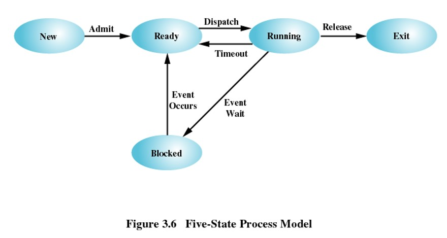

五状态模型中的9种事件类型：

- 空→新建：创建执行一个程序的新进程。

- 新建→就绪（Admit）：操作系统准备好再接纳一个进程时，把一个进程从新建态转换到就绪态。

- 就绪→运行（Dispatch）：需要选择一个新进程运行时，调度器会选择一个处于就绪态的进程。

- 运行→退出（Release）：如果当前正在运行的进程表示自己已经完成或取消，则它将被操作系统终止。

- 运行→就绪（Timeout）：主要有以下几种情况：

  - 正在运行的进程达到了“最大运行时长”。（所有多道程序操作系统都有时长限定）
  - 进程优先级导致的进程中断。
  - 进程本身自愿释放对处理器的控制。（例如一个周期性地进行记账和维护的后台进程）

- 运行→阻塞（Event Wait）：如果进程请求它必须等待的某些事件，则会进入阻塞态。（如等待I/O）

- 阻塞→就绪（Event Occurs）：当所等待的事件发生时，处于阻塞态的进程会转为就绪态。

- 就绪→退出：在某些系统中，父进程可以在任何时刻终止一个子进程。如果一个父进程终止，则与该父进程有关的所有子进程都将被终止。

- 阻塞→退出：原因同上一条。

  > 僵尸进程：父进程先于其子进程结束，这时子进程还在内存中，被称为僵尸进程。（如果僵尸进程数量过多会影响计算机系统的运行效率）

下图给出了进程在不同状态间转换时可能实现的排队规则：

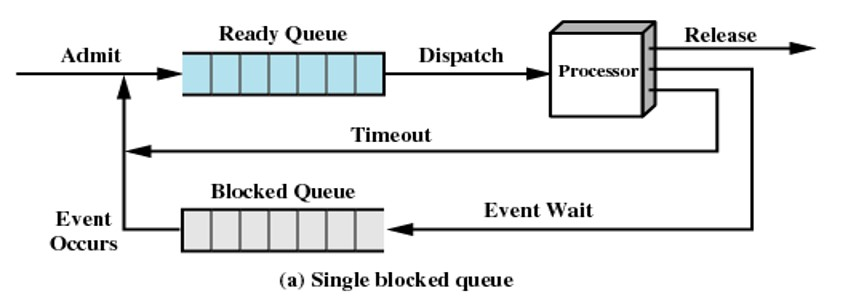

> 有两个队列：就绪队列和阻塞队列。进入系统的每个进程被放置在就绪队列中，当操作系统选择另一个进程运行时，将从就绪队列中选择。当一个正在运行的进程被移出处理器时，它根据情况或者被终止，或者被放置在就绪或阻塞队列中。最后，当一个事件发生时，所有位于阻塞队列中等待这个事件的进程都被转换到就绪队列中。

上述方案意味着当一个事件发生时，操作系统必须扫描整个阻塞队列，搜所那些等待该事件的进程。但是在大型操作系统中，队列中可能存在几百甚至上千个进程，所以拥有多个队列将会更有效，一个事件可以对应一个队列，这样在某事件发生时，相应队列中的所有进程都将转换到就绪态。

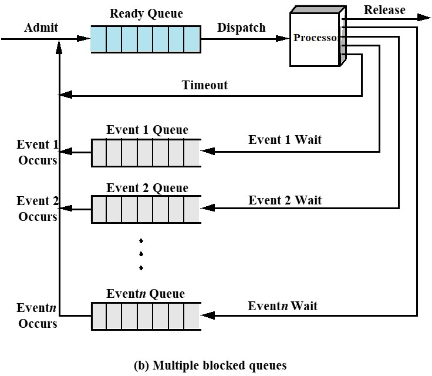

最后还有一种改进：按照优先级方案分配进程，维护多个就绪队列（每个优先级一个队列）将会带来更多便利。操作系统就可以很容易地确定哪个就绪进程具有最高地优先级且等待事件最长。

### 被挂起的进程（Suspended Processes）

实际上，由于I/O活动比计算机速度慢得多，内存中可以保有多个进程，当一个进程在等待时（比如I/O），处理器可以转移到另一个进程。即便如此，上述方案可能导致的一种常见的情况是：内存中有很多进程都在等待I/O。多道程序设计并不能从根本解决问题，大多数时候处理器仍可能处于空闲状态。

一种解决办法就是扩大内存，使其能够载入更多的进程。但是这种办法有两个严重的问题：一是内存价格的问题，从第一章的内容可以看出，扩大内存需要付出很大经济代价。第二个问题是，内存的扩大更可能导致带来更大的进程，而非更多的进程。

所以就出现了第二种解决办法：**交换（swapping）**

**交换：把内存中某个进程的一部分或者全部转移到外存（磁盘）中。**

> 交换概念就带来了\*\*挂起（suspend）\*\*状态：当内存中没有处于就绪状态的进程时，操作系统就把被阻塞的进程换出到磁盘的“挂起队列”（suspend queue）中。此后，操作系统可以从挂起队列中取出另一个进程，或者接受一个新进程的请求，将其纳入内存运行。

> 交换是一个I/O操作，但是由于磁盘I/O一般是系统中最快的I/O（相对于磁带或打印机），所以交换通常会提高性能。

由于交换的出现，又引入了**七状态模型**。

在原有五状态模型的基础上又新增了两个状态：

- 阻塞/挂起态（Blocked/Suspend）：进程在外存中并等待一个事件。
- 就绪/挂起态（Ready/Suspend）：进程在外存中，但是只要被载入内存就可以执行。

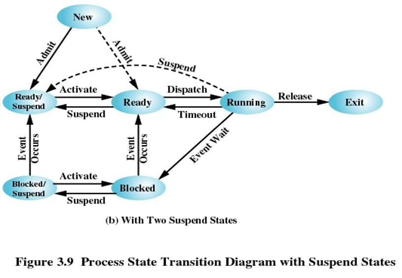

同样的，在五状态模型的9种事件类型的基础上又新增了7种事件类型：

- 阻塞→阻塞/挂起（Suspend）：如果没有就绪进程，则至少一个阻塞进程被换出，为另一个没有阻塞的进程让出空间。

- 阻塞/挂起→就绪/挂起（Event Suspend）：如果等待的事件发生了，则处于阻塞/挂起状态的进程可以转换到就绪/挂起状态。（注意，这要求操作系统必须能够得到挂起进程的状态信息。）

- 就绪/挂起→就绪（Activate）：如果内存中没有就绪态进程，操作系统需要调入一个进程继续执行。（此外，当处于就绪/挂起态的进程比处于就绪态的任何进程的优先级都要高时，也可以进行这种转换。）

- 就绪→就绪/挂起（Suspend）：通常，操作系统更倾向于挂起阻塞态进程而不是就绪态进程，因为就绪态进程可以立即执行，而阻塞态进程占用了内存空间但不能执行。但如果释放内存以得到足够空间的唯一方法是挂起一个就绪态进程，那么这种转换也是必需的。并且，如果操作系统确信高优先级的阻塞态进程很快将会就绪，那么它可能选择挂起一个低优先级的就绪态进程，而不是一个高优先级的阻塞态进程。

- 新建→就绪/挂起（Admit）：当创建一个新进程时，该进程或者加入到就绪队列，或者加入到就绪/挂起队列中。不论哪种情况，操作系统都必须建立一些表以管理进程，并为进程分配地址空间。（当内存中没有足够的空间分配给新建进程，就会采用此种策略）

- 阻塞/挂起→阻塞（Activate）：一个进程终止，释放了一些内存空间，阻塞/挂起队列中有一个进程比就绪/挂起队列中的任何进程的优先级都要高，并且操作系统有理由相信阻塞进程的事件很快就会发生，这时，把阻塞进程而不是就绪进程调入内存是合理的。

- 运行→就绪/挂起（Suspend）：通常当分配给一个运行进程的时间期满时，它将转换到就绪态。但是，如果由于位于阻塞/挂起队列的具有较高优先级的进程变得不再被阻塞，操作系统抢占这个进程，也可以直接把这个运行进程转换到就绪/挂起队形中，并释放一些内存空间。（这是可能但不是必须的转换）

  > 在某些操作系统中，允许一个进程可以被创建它的进程终止，所以在这样的情况下，进程在任何状态都可以转换到退出状态。

挂起的特点（重新理解并定义）：

- 进程不能立即执行。
- 进程可能是或不是正在等待一个事件。如果是，阻塞条件不依赖于挂起条件，阻塞事件的发生不会使进程立即被执行。
- 为阻止进程执行，可以通过代理把这个进程置于挂起状态，代理可以是进程自己，也可以是父进程或操作系统。
- 除非代理显式地命令系统进行状态转换，否则进程无法从这个状态中转移。

下表展示了导致进程挂起的原因：

| 事件 | 说明 |
|----|----|
| 交换 | 操作系统需要释放足够的内存空间，以调入并执行处于就绪状态的进程 |
| 其他OS原因 | 操作系统可能挂起后台进程或工具程序进程，或者被怀疑导致问题的进程 |
| 交互式用户请求 | 用户可能希望挂起一个程序的执行，目的是为了调试或者与一个资源的使用进行连接 |
| 定时 | 一个进程可能会周期性地执行（例如记账或系统监视进程），而且可能在等待下一个时间间隔时被挂起 |
| 父进程请求 | 父进程可能会希望挂起后代进程的执行，以检查或修改挂起的进程，或者协调不同后代进程之间的行为 |

## 进程描述（Process Description）

进程和资源（Processes and Resources）

在多道程序设计环境中，在虚拟内存中有许多已经创建了的进程（P1，…，Pn），每个进程在执行期间，需要访问某些系统资源，包括处理器、I/O设备和内存。在图中，进程P1正在运行，该进程至少有一部分在内存中，并且还控制着两个I/O设备；进程P2也在内存中，但由于正在等待分配给P1的I/O设备而被阻塞；进程Pn已经被换出，因此是挂起的。

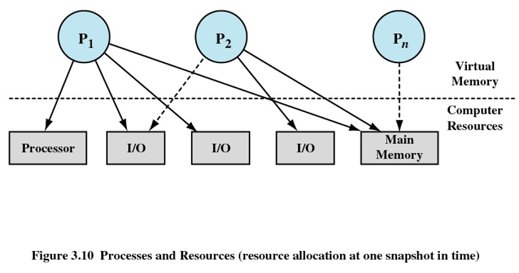

操作系统的控制结构（Operating System Control Structures）

操作系统为了管理进程和资源，必须掌握关于每个进程和资源当前状态的信息。普遍使用的方法是：操作系统构造并维护它所管理的每个实体的信息表。在一般情况下，操作系统维护着4种不同类型的表：内存表（Memory Tables）、I/O表（I/O Tables）、文件表（File Tables）、进程表（Process Table）。

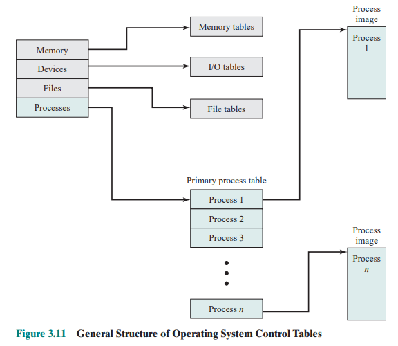

- 内存表：用于跟踪内（实）存和外存（虚拟内存）。

  - 分配给进程的主存（内存）
  - 分配给进程的辅存（外存）
  - 内存块或虚拟内存块的任何保护属性，如哪些进程可以访问某些共享内存区域。
  - 管理虚拟内存所需要的任何信息

- I/O表：管理计算机系统中的I/O设备和通道。

  - I/O设备或是可用的，或是已分配给某个特定的进程。
  - I/O操作的状态。
  - 如果正在进行I/O操作，则操作系统需要知道I/O操作的状态和作为I/O传送的源和目标的内存单元。

- 文件表：

  - 文件是否存在。
  - 文件在外存中的位置。
  - 当前状态。
  - 其他属性。

- 进程表：每个条目描述一个进程映像。

  > 进程表主要有四种类型（见下表）：用户数据、用户程序、系统栈以及进程控制块。这些表必须以某种方式链接起来或交叉引用。内存、I/O和文件是代表进程而被管理的，因此进程表中必须有对这些资源的直接或间接引用。文件表中的文件可以通过I/O设备访问，有时它们也位于内存中或虚拟内存中。这些表自身必须可以被操作系统访问到，因此它们受制于内存管理。

  进程映像（process image）

  | 项目 | 说明 |
  |----|----|
  | 用户数据 | 用户空间中的可修改部分，可以包括程序数据、用户栈区域和可修改的程序 |
  | 用户程序 | 将被执行的程序 |
  | 系统栈 | 每个进程有一个或多个后进先出（LIFO）系统栈。栈用于保存参数、过程调用地址和系统调用地址 |
  | 进程控制块 | 操作系统控制进程所需要的数据 |

> 进程最少必须包括一个或一组被执行的程序，与这些程序相关联的是局部变量、全局变量和任何已定义常量的数据单元。程序的执行通常涉及用于跟踪过程调用和过程间参数传递的栈。与每个进程相关联的还有操作系统用于控制进程的许多属性，通常，属性的集合称为进程控制块（PCB）。

> 进程控制块信息可以分为以下三类：
>
> - 进程标识信息
> - 处理器状态信息
> - 进程控制信息
>
> 进程控制块中的典型元素见下表：
>
> 进程标识信息
>
> <table>
> <colgroup>
> <col style="width: 50%" />
> <col style="width: 50%" />
> </colgroup>
> <thead>
> <tr>
> <th>元素</th>
> <th>说明</th>
> </tr>
> </thead>
> <tbody>
> <tr>
> <td>标识符</td>
> <td>存储在进程控制块中的数字标识符，包括 
> · 此进程的标识符（Process ID，简称进程ID） 
> · 创建这个进程的进程（父进程）标识符 
> · 用户标识符（UserID，简称用户ID）</td>
> </tr>
> </tbody>
> </table>
>
> 处理器状态信息
>
> <table>
> <colgroup>
> <col style="width: 50%" />
> <col style="width: 50%" />
> </colgroup>
> <thead>
> <tr>
> <th>元素</th>
> <th>说明</th>
> </tr>
> </thead>
> <tbody>
> <tr>
> <td>用户可见寄存器</td>
> <td>用户可见寄存器是处于用户态的处理器执行的机器语言可以访问的寄存器。通常有8到32个此类寄存器，而在一些RISC实现中有超过100个此类寄存器</td>
> </tr>
> <tr>
> <td>控制和状态寄存器</td>
> <td>用于控制处理器操作的各种处理器寄存器，包括： 
> · 程序计数器：包含将要取的下一条指令的地址 
> · 条件码：最近的算术或逻辑运算的结果（例如符号、零、进位、等于、溢出） 
> · 状态信息：包括中断允许/禁用标志、异常模式</td>
> </tr>
> <tr>
> <td>栈指针</td>
> <td>每个进程有一个或多个与之相关联的后进先出（LIFO）系统栈。栈用于保存参数和过程调用或系统调用的地址，栈指针指向栈顶</td>
> </tr>
> </tbody>
> </table>
>
> 进程控制信息
>
> <table>
> <colgroup>
> <col style="width: 50%" />
> <col style="width: 50%" />
> </colgroup>
> <thead>
> <tr>
> <th>元素</th>
> <th>说明</th>
> </tr>
> </thead>
> <tbody>
> <tr>
> <td>调度和状态信息</td>
> <td>这是操作系统执行其调度功能所需要的信息，典型的信息项包括： 
> · 进程状态：定义将被调度执行的进程的准备情况（例如运行态、就绪态、等待态、停止态） 
> · 优先级：用于描述进程调度优先级的一个或多个域。在某些系统中，需要多个值（例如默认、当前、最高许可） 
> · 调度相关信息：这取决于所使用的调度算法。例如进程等待的时间总量和进程在上一次运行时执行时间总量 
> · 事件：进程在继续执行前等待的事件标识</td>
> </tr>
> <tr>
> <td>数据结构</td>
> <td>进程可以以队列、环或者别的结构形式与其他进程进行链接。例如，所有具有某一特定优先级且处于等待状态的进程可链接在一个队列中；进程还可以表示出与另一个进程的父子（创建者-被创建者）关系。进程控制块为支持这些结构需要包含指向其他进程的指针</td>
> </tr>
> <tr>
> <td>进程间通信</td>
> <td>与两个独立进程间的通信相关联的各种标记、信号和信息。进程控制块中维护着某些或全部此类信息</td>
> </tr>
> <tr>
> <td>进程特权</td>
> <td>进程根据其可以访问的内存空间以及可以执行的指令类型被赋予各种特权。此外，特权还用于系统实用程序和服务的使用</td>
> </tr>
> <tr>
> <td>存储管理</td>
> <td>这一部分包括指向描述分配给该进程的虚拟内存空间的段表和页表的指针</td>
> </tr>
> <tr>
> <td>资源的所有权和使用情况</td>
> <td>进程控制的资源可以表示成诸如一个打开的文件，还可能包括处理器或其他资源的使用历史；调度器会需要这些信息</td>
> </tr>
> </tbody>
> </table>

> 实际上在所有的操作系统中，对于进程标识符，每个进程都分配了一个唯一的数字标识符。进程标识符可以简单地表示为主进程表中的一个索引；否则，必须有一个映射，使得操作系统可以根据进程标识符定位相应的表。
>
> 除了进程标识符，还给进程分配了一个用户标识符，用于标明拥有该进程的用户。

## 进程控制（Process Control）

执行模式（Modes of Execution）

大多数处理器至少支持两种执行模式：用户模式（User mode）以及内核模式（kernel mode）

用户模式：

- 低权限模式
- 用户程序通常在这种模式下执行

内核模式：

- 高权限模式
- 操作系统的内核

> 使用两种模式的原因是很显然的，它可以保护操作系统和重要的操作系统表（如进程控制块）不受用户程序的干涉。在内核态下，软件具有对处理器以及所有指令、寄存器和内存的控制能力，这一级的控制对用户程序不是必需的，并且为了安全起见也不是用户程序可访问的。

两种模式的切换

程序状态字中有一位表示执行模式，这一位应某些事件的要求而改变。在典型情况下，当用户调用一个操作系统服务或中断触发系统例程的执行时，执行模式被设置成内核态，当从系统服务返回到用户进程时，执行模式被设置为用户态。**处理器状态寄存器（Processor status register ，PSR）**中包含**当前特权级别（Current privileged level，CPL）**。当执行不同的进程时，操作系统会根据需要对CPL进行置位或清零的操作去改变其模式（通常数字越小，级别越大）。

进程创建（Process Creation）

进程创建的步骤按如下5步进行：

1.  给进程分配一个唯一的进程标识符。

    此时，在主进程表中增加了一个新表项，表中的每个新表项对应着一个进程。

2.  给进程分配空间。

    这包括进程映像中的所有元素。

3.  初始化进程控制块。

4.  设置正确的连接。

    例如，如果操作系统把每个调度队列都保存成链表，则新进程必须放置在就绪或就绪/挂起链表中。

5.  创建或扩充其他数据结构。

    例如，操作系统可能为每个进程保存着一个记账文件，可用于编制账单和/或进行性能评估。

进程切换（Process Switching）

引发进程切换的原因：

- 中断：当前指令的外部执行

  - 时钟中断（Clock interrupt）：当前运行的进程超过了最大允许时间段（片），则该进程必须切换到就绪态，调入另一个进程。

  - I/O中断

  - 内存中断（失效，Memory fault）：处理器访问一个虚拟内存地址，且此地址单元不在内存中时，操作系统必须从外存中把包含这个引用的内存块（页或段）调入内存中。

    > 在发出调入内存块的I/O请求之后，操作系统可能会执行一个进程切换，以恢复另一个进程的执行，发生内存失效的进程被置为阻塞态，当想要的块调入内存中时，该进程被置为就绪态。

- 陷阱（Trap）：当前指令的执行相关

  一个运行中的程序由于自身错误的原因引发操作系统的保护机制。可能导致进程被转为退出态。

- 系统调用（System Call）

  例如打开文件操作。通常，使用系统调用会导致把用户进程置位阻塞态。

模式切换VS进程切换

模式切换：

（当中断发生时）

1.  把程序计数器置成中断处理程序的开始地址。
2.  从用户态切换到内核态，使得中断处理代码可以包含有特权的指令。

进程切换：

1.  保存处理器上下文环境。包括程序计数器和其他寄存器。
2.  更新当前处于运行态进程的进程控制块。包括将进程的状态改变到另一状态（就绪态、阻塞态、就绪/挂起态或退出态）。还必须更新其他相关域，包括离开运行态的原因和记账信息。
3.  将进程的进程控制块移到相应的队列（就绪、在事件i处阻塞、就绪/挂起）。
4.  选择另一个进程执行。
5.  更新所选择进程的进程控制块。包括将进程的状态变为运行态。
6.  更新内存管理的数据结构。
7.  恢复处理器在被选择的进程最近一次切换出运行状态时的上下文环境。这可以通过载入程序计数器和其他寄存器以前的值来实现。

> 模式切换较进程切换的代价要小。
>
> 进程切换一定包含模式切换；但是模式切换不一定包含进程切换。

操作系统的执行（Execution of the Operating System）

操作系统与普通计算机软件一样由处理器执行，同样的，操作系统也是一个进程。下面介绍关于如何控制这种进程。

无进程的内核（Non-process Kernel）

- 在许多老操作系统中，非常传统和通用的一种方式就是在所有进程之外执行操作系统内核。

- 操作系统有自己的内存区域和系统栈，用于控制过程调用和返回。

- 操作系统代码作为一个在特权模式下工作的独立实体被执行。

  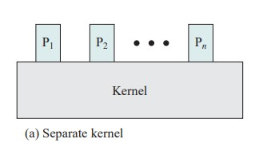

在用户进程中执行（Execution Within User Processes）

- 在用户进程的上下文中执行几乎所有操作系统软件。（操作系统从根本上说时用户调用的一组例程，在用户环境中执行，用于实现各种功能）

- 执行操作系统代码时，进程在特权模式下执行。

- 在用户进程中执行的代码是共享操作系统代码而不是用户代码。基于用户态和内核态的概念，即使操作系统例程在用户进程环境中执行，用户也不能篡改或干涉操作系统的历程。（这也进一步说明了进程和程序的概念是不同的）

  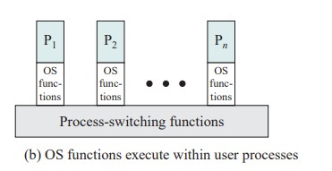

基于进程的操作系统（Process-Based Operating System）

- 把操作系统作为一组系统进程来实现。

- 使用模块化操作系统，并且模块之间具有最小的、简明的接口。

- 一些非关键的操作系统函数可简单地用独立的进程实现。

- 这在多处理器或多机环境中都是十分有用的。

  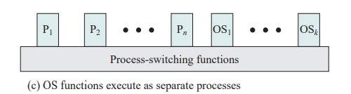

------------------------------------------------------------------------

# 后记

本篇已完结

（如有修改或补充欢迎评论）
