# 计算机网络学习笔记-408复习笔记

> 📌 转载自 **花猪のBlog（作者 CNhuazhu）** —— 原文：https://cnhuazhu.top/butterfly/2022/09/17/%E8%AE%A1%E7%AE%97%E6%9C%BA%E7%BD%91%E7%BB%9C/%E8%AE%A1%E7%AE%97%E6%9C%BA%E7%BD%91%E7%BB%9C%E5%AD%A6%E4%B9%A0%E7%AC%94%E8%AE%B0-408%E5%A4%8D%E4%B9%A0%E7%AC%94%E8%AE%B0/
> 学习笔记，版权归原作者所有，仅供学弟学妹学习参考；如有侵权请联系删除。

---

# 前言

2023年408计算机网络考点总结

（笔者把两本参考书的习题都过了一遍（内容主要基于天勤），针对自己的一些错题和补充考点都总结在每一章的末尾）

> 参考资料：
>
> - 天勤计算机网络高分笔记（2023版）
> - 王道计算机网络考研复习指导（2023版）
> - 《计算机网络（第七版）》，谢希仁，北京：电子工业出版社

------------------------------------------------------------------------

# 第一章：计算机网络体系结构

------------------------------------------------------------------------

## 大纲要求

- 计算机网络概述
  1.  计算机网络的概念、组成、功能
  2.  计算机网络的分类
  3.  计算机网络的标准化工作以及相关组织
- 计算机网络体系结构与参考模型
  1.  计算机网络分层结构
  2.  计算机网络协议、接口、服务等概念
  3.  ISO/OSI参考模型和TCP/IP模型

## 核心考点

- （※※※※）OSI参考模型与TCP/IP模型
- （※※※）掌握计算机网络协议、接口、服务等概念
- （※※）掌握网络体系结构的概念，分层的必要性（包括5层和7层结构）
- （※）无连接服务和面向连接服务的联系与区别

------------------------------------------------------------------------

## 知识点

1.  ***计算机网络的概念***

    计算机网络就是一些互联的、自治的计算机系统的集合。【最简洁定义】

    > 自治计算机：能够进行自我管理、配置和维护的计算机。

2.  ***计算机网络的组成***

    - 物理组成：硬件、软件、协议

    - 工作方式组成：网络边缘（主机）、网络核心（大量网络以及连接他们的路由器）

    - 功能组成：通信子网（传输介质、通信设备、网络协议）、资源子网（主机、终端、软件资源、信息资源）

      > 通信子网包含：物理层、数据链路层、网络层

3.  ***计算机网络的功能***

    - 数据通信【**最基本、最重要**的功能】

      包括子功能：连接控制、传输控制、差错控制、流量控制、路由选择、多路复用

      > 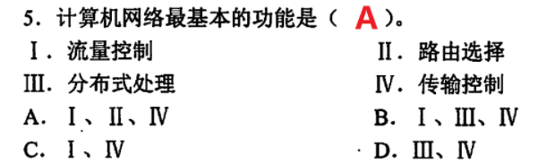

      > 注：
      >
      > - 提供流量控制的层：数据链路层、网络层、传输层（理论上存在于数据链路层之上的所有层）
      > - 提供拥塞控制的层：网络层、传输层

    - 资源共享

    - 分布式处理

    - 信息综合处理

    - 负载均衡

    - 提高可靠性

4.  ***计算机网络的分类***

    - 按分布范围分类：广域网（WAN）、城域网（MAN）、局域网（LAN）、个人区域网（PAN）

      > - 区分局域网与广域网的关键在于所采用的协议，而非覆盖范围。
      > - 局域网最初采用广播技术
      > - 广域网最初采用交换技术

    - 按拓扑结构分类：星形网络、总线型网络、环形网络、网状形网络

    - 按传输技术分类：广播式网络、点对点网络

    - 按使用者分类：公用网、专用网

    - 按数据交换技术分类：电路交换网络、报文交换网络、分组交换网络

5.  ***计算机网络的标准化工作***

    ① 互联网草案

    ② 建议标准（RFC文档）

    ③ 草案标准

    ④ 互联网标准

6.  ***计算机网络的相关组织***

    - 国际标准化组织（ISO）
    - 国际电信联盟（ITU）
    - 美国电气和电子工程师协会（IEEE）

7.  ***计算机网络协议***

    协议是一种是**控制两个对等实体**进行通信的规则，是**水平**的。

    > 协议由语法、语义和时序（同步）三部分组成。
    >
    > - 语法规定了传输数据的格式
    > - 语义规定了所要完成的功能
    > - 时序规定了信息交流的次序

    > 协议和服务的关系：
    >
    > 一个协议包括两个方面：对上层提供服务和对协议本身的实现。

8.  ***计算机网络服务***

    服务指下层为**相邻上层**提供的功能调用，是**垂直**的。

    - 面向连接的服务：通信时，需要事先建立一条通信线路。

    - 面向无连接的服务：通信双方不需要事先建立一条通信线路。

      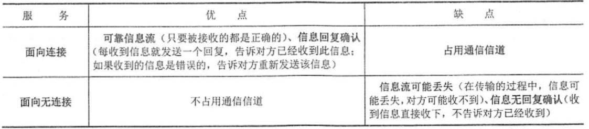

    > 关于服务
    >
    > - 并非在一个层内完成的全部功能都成为服务，只有那些**能够被高一层实体“看得见”的功能**才成为服务。
    > - 第n层实体不仅要使用第n-1层实体的服务，还要向第n+1层提供本层服务（本层服务是指第n层以及以下各层所提供的**服务总和**）。
    > - 最高层向用户提供服务。
    > - 上一层只能通过相邻层的接口使用下一层的服务，不能调用其他层的服务。

9.  ***计算机网络接口***

    接口 == 服务访问点

    从物理层开始，每一层都向上层提供服务访问点（接口），没有接口就不能提供服务。

    > 专业术语：
    >
    > - 服务数据单元（SDU）
    >
    > - 协议控制信息（PCI）
    >
    > - 接口控制信息（ICI）
    >
    > - 协议数据单元（PDU）
    >
    >   > SDU + PCI = PDU （表示**同等层对等实体间**传送的数据单元）
    >
    > - 接口数据单元（IDU）
    >
    >   > SDU + ICI = IDU（表示在**相邻层接口间**传送的数据单元）

10. ***OSI参考模型（7层结构）***

    开放系统互连基本参考模型OSI/RM

    - 应用层

    - 表示层

      > 负责处理在两个内部数据表示结构不同的通信系统间交换信息的表示格式（**数据格式转换**），为**数据加密和解密**以及为提高传输效率提供必需的**数据压缩及解压**等功能。

    - 会话层

      > 在两个节点间**建立、维护和释放面向用户的连接**，并对会话进行**管理和控制（同步）**，保证会话数据**可靠传送**。

    - 传输层

    - 网络层

    - 链路层

    - 物理层

11. ***Internet协议栈（5层结构）***

    <table>
    <colgroup>
    <col style="width: 20%" />
    <col style="width: 20%" />
    <col style="width: 20%" />
    <col style="width: 20%" />
    <col style="width: 20%" />
    </colgroup>
    <thead>
    <tr>
    <th style="text-align: center;">结构</th>
    <th style="text-align: center;">PDU（协议数据单元）</th>
    <th style="text-align: center;">协议</th>
    <th style="text-align: center;">通信</th>
    <th>设备</th>
    </tr>
    </thead>
    <tbody>
    <tr>
    <td style="text-align: center;">应用层</td>
    <td style="text-align: center;"><strong>报文（message）</strong></td>
    <td style="text-align: center;">DNS、FTP、SMTP、POP3、HTTP、DHCP、RIP、BGP</td>
    <td style="text-align: center;">用户对用户</td>
    <td></td>
    </tr>
    <tr>
    <td style="text-align: center;">传输层</td>
    <td style="text-align: center;"><strong>报文段（segment）</strong>【TCP，面向连接】、 
    用户数据报UDP【UDP无连接】</td>
    <td style="text-align: center;">TCP、UDP、ARQ</td>
    <td style="text-align: center;">进程到进程之间的通信（端到端）</td>
    <td></td>
    </tr>
    <tr>
    <td style="text-align: center;">网络层</td>
    <td style="text-align: center;">分组（packet）【有连接】、 
    <strong>数据报（datagram）</strong>【无连接】</td>
    <td style="text-align: center;">ICMP、ARP、RARP、IP、IGMP、OSPF</td>
    <td style="text-align: center;">主机对主机</td>
    <td>路由器</td>
    </tr>
    <tr>
    <td style="text-align: center;">链路层</td>
    <td style="text-align: center;"><strong>帧（frame）</strong></td>
    <td style="text-align: center;">PPP、HDLC</td>
    <td style="text-align: center;">相邻网络节点</td>
    <td>网桥、以太网交换机</td>
    </tr>
    <tr>
    <td style="text-align: center;">物理层</td>
    <td style="text-align: center;"><strong>比特（bit）</strong></td>
    <td style="text-align: center;"></td>
    <td style="text-align: center;"></td>
    <td>集线器、中继器、转发器</td>
    </tr>
    </tbody>
    </table>

    > 不要混淆：传输层的**用户数据报UDP**、网络层的**IP数据报**（简称数据报）

12. ***TCP/IP模型（4层结构）***

    - 应用层
    - 传输层
    - 网络层
    - 网络接口层（包含5层模型中的链路层和物理层）

13. ***OSI参考模型和TCP/IP参考模型的对比***

    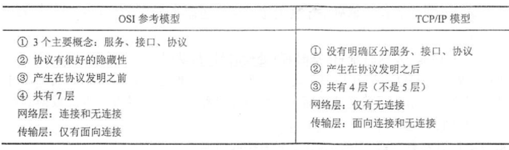

    > 注：教材中所讲的5层模型是综合两种模型优点的产物。

14. 节点时延

    - 传输时延/发送时延（dtrans）
    - 传播时延（dprop）
    - 处理时延（dproc）
    - 排队时延（dquene）

15. 时延带宽积

    时延带宽积 == 以比特为单位的链路长度

    **时延带宽积 = 传播时延 × 带宽**

    > 带宽：在数据链路上每秒传输的比特数（单位：bit/s、Mbit/s）
    >
    > “带宽越宽”：指发送每一个比特的速度变快（理解为“传输时延”），而非每一个比特在数据链路的传播速度变快（理解为“传播时延”）。

16. 往返时间RTT

    从发送方发送数据开始，到发送方接收到来自接收方的确认消息（接收方收到数据立即确认）所经历的时长。

    > 将RTT作为“延迟”，则“延迟 × 带宽”表示：收到接收方响应之前所能发送的数据量

17. 利用率

    - 信道利用率：指某信道有百分之几的时间是被利用的。
    - 网络利用率：全网络的信道利用率的加权平均值

    > 注：不是利用率越高越好。利用率越高，说明数据在路由器中的转发时延过长。

18. 进制问题

    二进制（k = 210）：描述磁盘容量

    十进制（k = 103）：描述数据传输率

19. 分层的好处：

    - 各层之间独立（层间接口 == 界面）
    - 灵活性好
    - 结构上可分隔开
    - 易于实现和维护
    - 能促进标准化工作

20. 知识点

    世界上第一个计算机网络是**ARPAnet**

    Internet最早起源于**ARPAnet**

21. 时间进制

    1ms = 10-3s

    1μs = 10-3ms

    1nm = 10-3μs

22. 知识点

    广播式网络不涉及路由选择问题，只包含物理层和数据链路层

23. 报文流和字节流的区别

    网络保持对报文边界的跟踪与否（报文流：√；字节流：×）

24. 服务访问点（SAP）

    服务访问点是在一个层次系统的上下层之间进行通信的接口。

    - 物理层的服务访问点：网卡接口
    - 数据链路层的服务访问点：MAC地址（网卡地址）
    - 网络层的服务访问点：IP地址（网络地址）
    - 传输层的服务访问点：端口号
    - 应用层的服务访问点：用户界面

------------------------------------------------------------------------

------------------------------------------------------------------------

------------------------------------------------------------------------

# 第二章 物理层

------------------------------------------------------------------------

## 大纲要求

- 通信基础
  1.  信道、信号、带宽、码元、波特、速率、信源、信宿等基本概念
  2.  奈奎斯特定理、香农定理
  3.  编码与调制
  4.  电路交换、报文交换与分组交换
  5.  数据报与虚电路
- 传输介质
  1.  双绞线、同轴电缆、光纤与无线传输介质
  2.  物理层接口的特性
- 物理层设备
  1.  中继器
  2.  集线器

## 核心考点

- （※※※）掌握奈奎斯特定理和香农定理
- （※※※）掌握电路交换、报文交换与分组交换的工作方式与特点
- （※※）理解中继器和集线器的功能以及实现原理
- （※※）理解通信基础的基本概念

------------------------------------------------------------------------

## 知识点

1.  ***信号***

    信号：数据的电气或电磁的表现（就是将数据用另外一种形态表现出来）

    数据：传送信息的实体

    > 信号或数据，既可以是**模拟的**，也可以是**数字的**
    >
    > - 模拟的：连续变化
    > - 数字的：离散值

    > 信道上传送的信号分为：**基带信号**和**宽带信号**
    >
    > - 基带信号：将数字信号0和1直接用两种不同的电压表示，然后传送到**数字信道**上去传输。【**基带传输**】
    > - 宽带信号：将信号进行调制后形成模拟信号，传送到**模拟信道**上去传输。【**宽带传输** == **频带传输**】
    >
    > > 记忆：**基带对应数字信号；宽带/频带对应模拟信号。**

2.  ***信源***

    信源：信息的源泉，也就是通信过程中产生和发送信息的设备或计算机

3.  ***信道***

    信道：信息传送的道路，也就是信号的传输介质。

    分为有线信道和无线信道

4.  ***信宿***

    信宿：信息的归宿地，也就是通信过程中接收和处理信息的设备或计算机

5.  ***速率***

    速率：指数据的传输速率，即单位时间内传输的数据量

6.  ***波特率、比特率***

    波特率 == 码元传输速率：单位时间内数字通信系统所传输的**码元个数**

    比特率 == 信息传输速率：单位时间内数字通信系统所传输的**二进制码元个数**（即**比特数**）

    > 比特率在数值上和波特率的关系：**波特率 = 比特率/每个符号所含的比特数**

    > 现实中，每个比特只能表示两种信号变化（如0或1），因此可以视为二进制
    >
    > - 当二进制码元的情况下：波特率 = 比特率
    >
    > - 多进制（大于2）码元的情况下：波特率 \< 比特率 （意味着一个码元可以携带更多的比特）
    >
    >   > 

    > 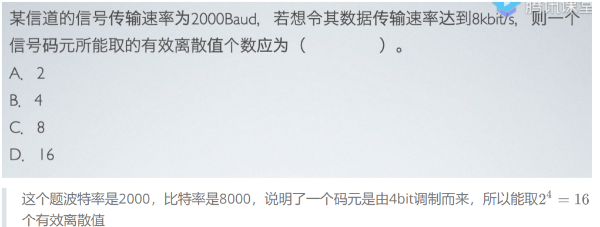

7.  ***码元***

    码元：在使用时间域的波形表示数字信号时，代表不同离散数值的基本波形就称为码元

8.  ***带宽***

    带宽：在计算机网络中，表示网络的通信线路所能传送数据的能力

    单位时间内从网络中的某一点到另一点所能通过的“最高数据率”。单位：bit/s

9.  ***奈奎斯特定理（无噪声） == 采样定理***

    采样定理：将模拟信号转换成数字信号时，假设原始信号中的最大频率为 f，那么采样频率 f采样 必须大于或等于最大频率 f 的两倍，才能保证采样后的数字信号完整保留原始模拟信号的信息。

    **奈奎斯特定理公式**：

    

    > Cmax：最大数据传输率
    >
    > f：理想低通信道的带宽
    >
    > N：每个码元的离散电平的数目 = 有多少种不同的码元 = 码元的有效值 = 一个码元包含的信息量
    >
    > > 低通信道：信号的频率只要不超过某个上限值，都可以不失真的通过信道，而频率超过该上限值则不能通过（没有下限，只有上限）

    > 注：使得一个码元携带无穷个比特，那么最大数据传输速率 Cmax 可以无穷大
    >
    > 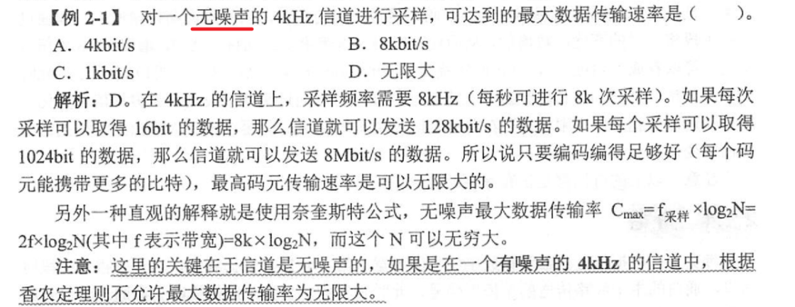
    >
    > > 一个无噪声的信道可以发送任意数量的信息，而与它如何被采样无关

10. ***香农定理（有噪声）***

    信噪比：信号的平均功率和噪声的平均功率之比（记为： S/N）

    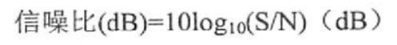

    **香农公式**：

    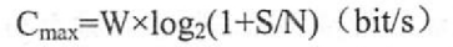

    > W：信道的带宽

    > 由香农公式可以得出：
    >
    > - 要想提高最大数据传输速率 Cmax，应设法提高信道的带宽 W，或信道中的信噪比 S/N
    > - 只要信息的的传输速率低于信道的极限传输速率，就一定能找到某种方法来实现无差错的传输
    > - 实际信道的传输速率要比极限速率低不少

    > 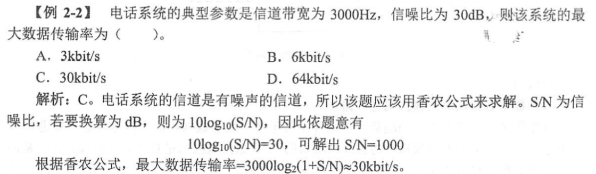

11. 奈奎斯特定理与香农定理的区别

    奈奎斯特定理公式指出：码元的传输速率是受限的，不能任意提高（否则在接收端无法正确判别码元是0或1）

    香浓定理公式给出：信息传输速率的极限（对于一定的带宽和信噪比，信息传输速率的上限就确定了）

12. ***调制***

    调制：将数据（模拟数据或数字数据）转换为**模拟信号**的过程

13. ***编码***

    编码：将数据（模拟数据或数字数据）转换为**数字信号**的过程

14. 知识点

    - 数字数据调制为模拟信号【用到**调制解调技术**】

      数字数据调制技术，在发送端将数字信号转换为模拟信号（**调制**）（带通调制、基带调制），在接收端将模拟信号还原为数字信号（**解调**）

    - 模拟数据调制为模拟信号

    - 数字数据编码为数字信号

      1.  非归零码

          - **NRZ**：用低电平表示0，用高电平表示1（或反过来）
          - **NRZ-I**：使用电平的一次翻转来表示0，与前一个电平相同的电平表示1

      2.  **曼彻斯特编码**：将每个码元分成两个相等的间隔，前一个间隔为高电平而后一个间隔为低电平表示1，0则相反

          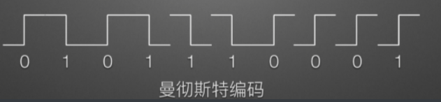

          > 曼彻斯特编码将每个码元的中间跳变作为收发双方的同步信号 == 时钟信号 ==时钟编码
          >
          > **以太网使用曼彻斯特编码**

      3.  **差分曼彻斯特编码**：将每个码元分成两个相等的间隔，前半个码元的电平与上一个码元的后半个电平一样表示1，0则相反

          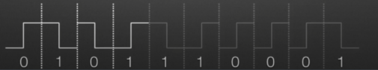

          > 曼彻斯特编码和差分曼彻斯特编码都含有同步信息

    - 模拟数据编码为数字信号

      典型例子：脉冲编码调制

      步骤：采样 → 量化 → 编码

15. ***数据传输方式***

    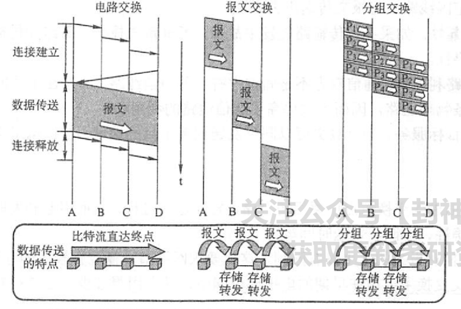

    - **电路交换**

      在通信前要在通信双方之间建立一条被双方独占的**物理通路**

      - 优点：
        1.  通信时延小
        2.  实时性强
        3.  有序传输
        4.  适用范围广：既适用于传输模拟信号，也适用于传输数字信号
        5.  控制简单
        6.  避免冲突
      - 缺点：
        1.  建立连接时间长
        2.  信道利用率低
        3.  缺乏统一标准
        4.  灵活性差

      > 注：电路交换**不具备差错控制能力**

    - **报文交换**

      交换的单位：报文。报文携带目的地址、源地址等信息。报文交换在交换节点采用**存储转发**的传输方式

      - 优点
        1.  无需建立连接
        2.  动态分配线路
        3.  提高可靠性
        4.  提高线路利用率
        5.  提供多服务目标
      - 缺点
        1.  有转发时延（包括接收报文、检验正确性、排队、发送时延）
        2.  对报文的大小没有限制，因此要求网络节点有较大的存储空间

      > 早期用于电报通信网中

    - **分组交换**

      将一个长报文先分割为若干个较短的分组（含目的地址、源地址等信息），在交换节点采用**存储转发**的传输方式。

      - 优点（较报文交换）
        1.  加速传输
        2.  简化存储管理：分组的长度是固定的，节点缓冲区的大小也相应固定
        3.  减少了出错的概率和重发数据量
      - 缺点
        1.  存在传输时延（比报文交换传输时延小）
        2.  采用数据报服务，可能失序、丢失、重复；采用虚电路服务，存在呼叫建立、数据传输、虚电路释放过程。

    > 注意：
    >
    > - 传送的数据量很大，且传送时间远远大于呼叫时间——采用电路交换
    >
    > - 端到端的通路由很多段链路组成——采用分组交换
    >
    > - 分组/报文交换：适用于计算机网络中的\*\*“突发式”数据通信\*\*
    >
    > - 电路交换一定是面向连接的；分组交换存在面向连接和无连接两种情况
    >
    > - 电路交换和分组交换的比较：
    >
    >   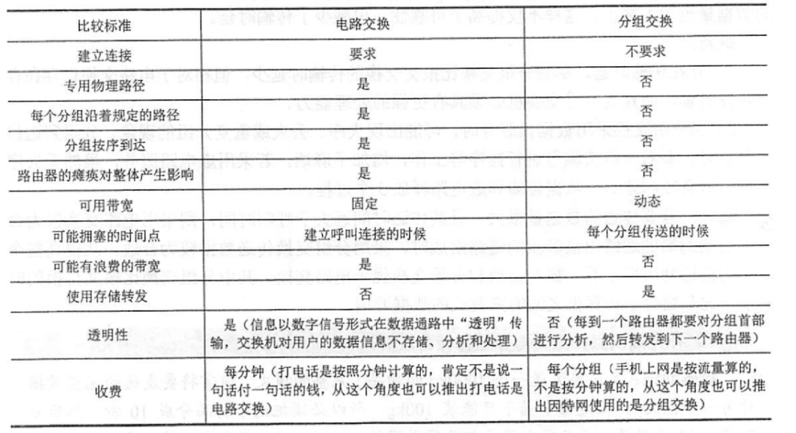

16. ***数据报与虚电路【分组交换方式，被包含关系】***

    - **数据报**

      1.  发送分组前无需建立连接
      2.  每个分组都被“尽最大努力”独立处理传输（路线可能不同）
      3.  减小延迟，提高吞吐量
      4.  对故障适应性强
      5.  发送方和接收方不独占某一链路，资源利用率高

      > 在出错率很高的传输系统中，用数据报方式更合适（相比与虚电路方式、报文交换、电路交换）

    - **虚电路**

      要求在发送数据前，在源主机和目的主机之间建立一条**虚连接**，分组会沿虚连接传送，传送完成后会清除虚连接。

      三个阶段：虚电路建立 → 数据传输 → 虚电路释放

      1.  相对数据报方式时延较小（分组在传输过程中不需要另外寻找路径）
      2.  分组按序到达
      3.  分组首部不包含目的地址，而是包含**虚电路标识符**。相对数据报方式开销小
      4.  某个交换机或链路故障，所有经过此的虚电路会被破坏

    - 数据报与虚电路的比较：

      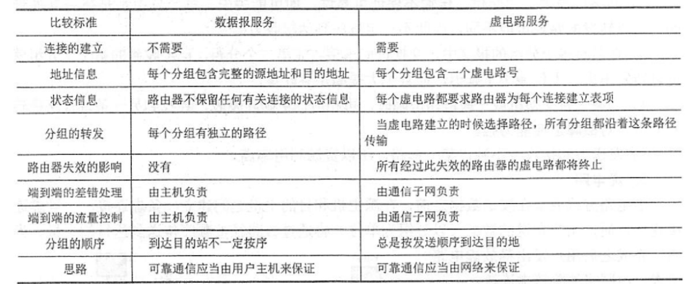

17. ***传输介质***

    - 导向性传输介质

      1.  双绞线：把两根相互绝缘的铜导线绞合起来。（可以传输模拟信号和数字信号）（最大传输距离：100m）

          - 无屏蔽双绞线
          - 屏蔽双绞线

      2.  同轴电缆：由内导体铜质芯线、绝缘层、网状编织的外导体屏蔽层以及保护塑料外层组成。（最大传输距离：500m）

          比双绞线的抗干扰能力强，传输距离更远

      3.  光纤：光导纤维

          - 单模光纤：适合远距离传输（直径只有一个光的波长）
          - 多模光纤：适合近距离传输（利用光的全反射）

          > 光纤系统的实际速率主要受限于光电转换的速率

    - 非导向性传输介质

18. ***物理接口特性***

    > 明确：传输介质并不是物理层，传输介质在物理层下面。
    >
    > 传输介质只能传输信号，但不知道信号是什么；物理层由于规定了功能特性，因此可以识别所传送的比特流

    物理层的主要功能就是确定与传输介质的接口有关的一些特性：

    - 机械特性：指明接口的形状、尺寸、引线数目和排序等。
    - 电气特性：电压的范围（何种信号表示电压0和1）
    - 功能特性：接口部件的信号线（数据线、控制线、定时线）的用途
    - 规程特性 == 过程特性：物理线路上对不同功能的各种可能事件的出现顺序，即**时序关系**

19. ***物理层设备***

    - **中继器**

      放大器和中继器都是起放大信号的作用：

      - 放大器：放大模拟信号
      - 中继器：放大**数字信号**

      > 注：虽然是放大信号作用，但是中继器的原理是将衰减的信号再生，而不是放大。

    - **集线器（Hub）**

      实际就是一种多端口的中继器。（含4、8、16、24、32等数量的**RJ45接口**）

      > 注意：
      >
      > - 通过**广播**的方式（除了输入端口）转发数据（目标主机识别到信息，接收；其他主机识别到信息，不予理睬）
      >
      > - **集线器不能隔离冲突域**（冲突域：某网络中两台计算机同时通信会发生冲突）
      >
      > - 集线器在一个时钟周期内只能传输一组信息。（意味着如果一台集线器连接的机器数量过大，并且多台机器经常同时通信（冲突），将导致集线器工作效率很差）
      >
      > - 集线器每个端口的速度与带宽和同时工作的设备数量有关：
      >
      >   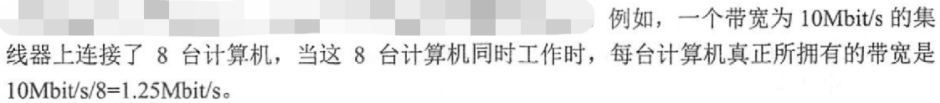

    > 知识点：
    >
    > - 通过中继器或集线器连接起来的几个网段仍是一个局域网
    > - 使用集线器的以太网在逻辑上仍是一个总线网，各工作站使用的还是**CSMA/CD协议**，并共享逻辑上的总线
    > - 集线器连接的网络在拓扑结构上属于星形
    > - 用集线器连接的工作站同属一个冲突域，也同属一个广播域

20. 通信方式

    - 同步传输：通信双方事先约定一个统一的时钟，在规定好的特定时刻做对应的事情，通信过程中双方无需直接交流

      以\*\*数据块（帧）\*\*为传输单位

    - 异步传输：通过定界符来区分一条消息的开始和结束

      以**字节**为传输单位

21. 数据传输方式

    - 串行传输：
    - 并行传输：

22. 知识点

    - QAM：是一种用模拟信号传输数字数据的编码方式
    - 曼彻斯特编码/差分曼彻斯特编码：用数字信号传输数字数据的编码方式
    - 脉冲编码调制（PCM）：使用数字信号编码模拟数据（例：音频信号）

23. 知识点：

    - 两个网段在**物理层**进行互联时要求：数据传输速率要相同，而数据链路层协议可以不同
    - 要达到在**数据链路层**互联互通的目的，则要求：数据传输速率和数据链路层协议都相同

------------------------------------------------------------------------

## 例题

> 例题：
>
> 1.  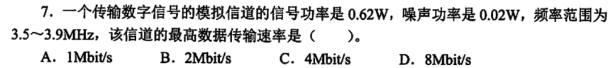
>
>     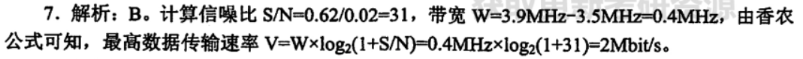
>
> 2.  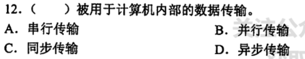
>
>     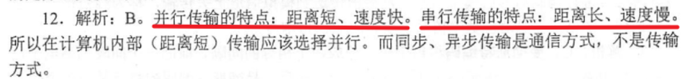
>
> 3.  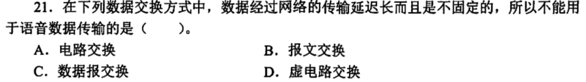
>
>     【B】
>
>     这里主要考察报文交换的传输单位（报文）大小不确定，因此传输延时不确定。
>
>     不考虑失序与否的问题
>
>     数据报交换有可能失序
>
> 4.  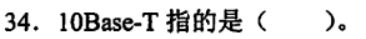
>
>     10Mbit/s，使用数字信号，使用双绞线
>
>     Base表示采用基带传输（数字信号）；Broad表示采用宽带/频带传输（模拟信号）
>
>     T表示使用双绞线（Twisted-pair）；F表示使用光纤
>
> 5.  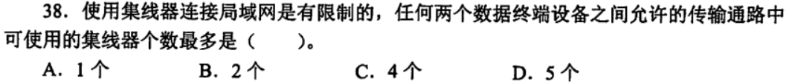
>
>     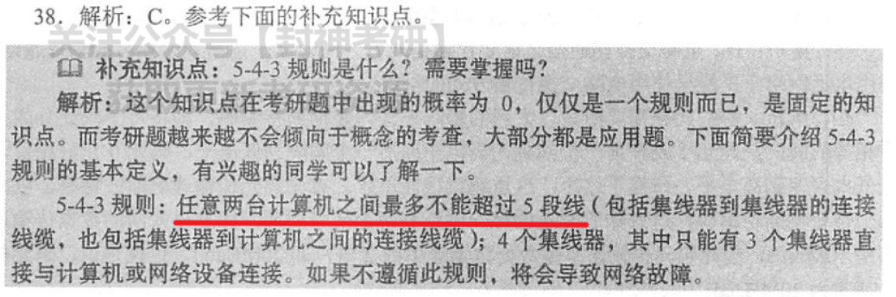
>
> 6.  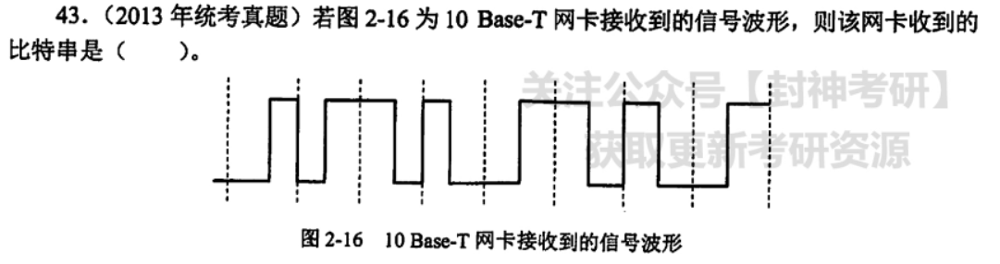
>
>     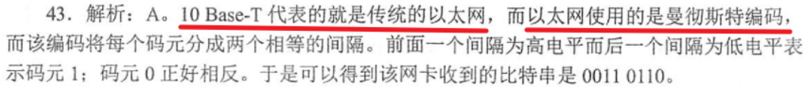
>
>     记忆：**以太网中，波特率在数值上等于比特率的一半**
>
> 7.  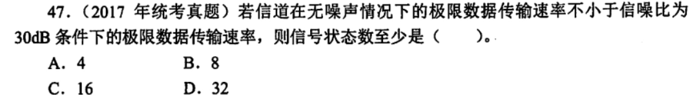
>
>     【D】
>
> 8.  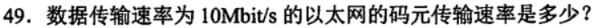
>
>     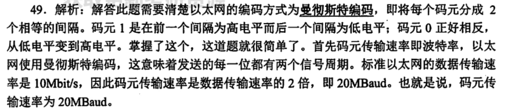
>
>     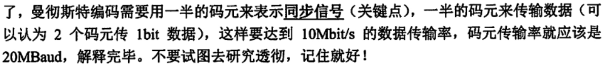
>
> 9.  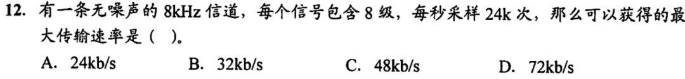
>
>     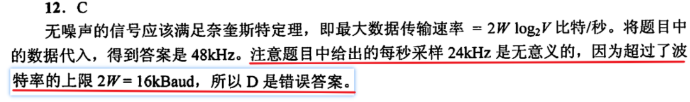
>
> 10. 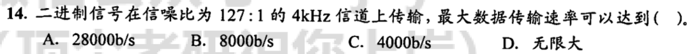
>
>     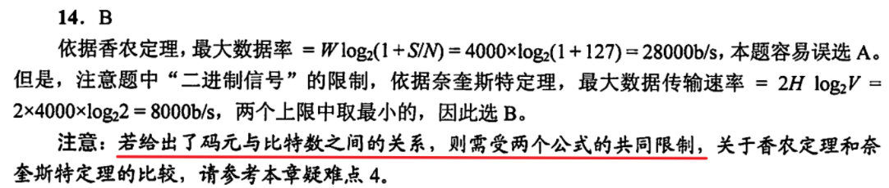
>
> 11. 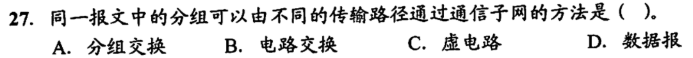
>
>     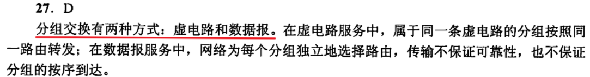
>
> 12. 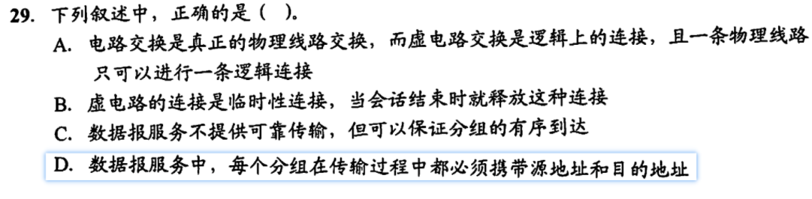
>
>     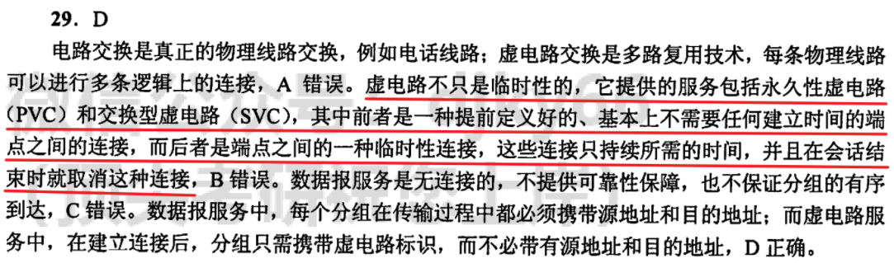
>
> 13. 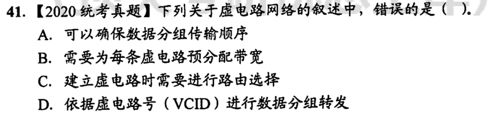
>
>     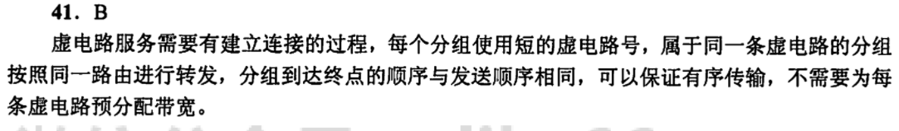
>
> 14. 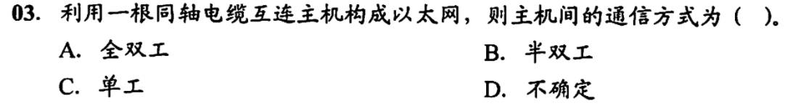
>
>     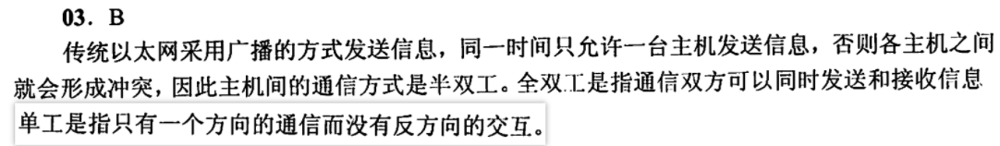

------------------------------------------------------------------------

------------------------------------------------------------------------

------------------------------------------------------------------------

# 第三章 数据链路层

## 大纲要求

- 数据链路层的功能

- 组帧

- 差错控制

  1.  检错编码
  2.  纠错编码

- 流量控制与可靠传输机制

  1.  流量控制、可靠传输与滑动窗口机制
  2.  停止-等待协议
  3.  后退N帧（GBN）协议
  4.  选择重传（SR）协议

- 介质访问控制

  1.  信道划分介质访问控制

      频分多路复用、时分多路复用、波分多路复用、码分多路复用的概念和基本原理

  2.  随机访问介质访问控制

      ALOHA协议、CSMA协议、CSMA/CD协议、CSMA/CA协议

  3.  轮询访问介质访问控制：令牌传递协议

- 局域网

  1.  局域网的基本概念与体系结构
  2.  以太网与IEEE 802.3
  3.  IEEE 802.11
  4.  令牌环网的基本原理

- 广域网

  1.  广域网的基本概念
  2.  PPP
  3.  HDLC协议

- 数据链路层设备

  1.  网桥的概念和基本原理
  2.  局域网交换机及其工作原理

## 核心考点

- （※※※※※）流量控制与可靠传输机制、CSMA/CD原理，特别是争用期和截断二进制指数退避算法
- （※※※※）网桥的概念和基本原理
- （※※）组帧机制和差错控制机制，特别是循环冗余码的海明码需重点掌握
- （※※※※）以太网的MAC帧格式

------------------------------------------------------------------------

## 知识点

1.  ***数据链路层的功能***

    提供三种基本服务：

    - 无确认的无连接服务
    - 有确认的无连接服务
    - 有确认的有连接服务

    > 不存在无确认的有连接服务

    链路层的主要功能：

    - 链路管理
    - 帧同步
    - 差错控制：用于使接收方确定收到的数据就是由发送方发送的数据
    - 透明传输：不管数据是什么样的比特组合，都应当能在链路上传送

    > 注：
    >
    > - 在OSI体系结构中，数据链路层是有流量控制的
    > - 在TCP/IP体系结构中，数据链路层的流量控制被移到了传输层，因此没必要在数据链路层设置流量控制，以及差错控制

2.  ***组帧***

    组帧的优点（相比直接传输比特流）：如果传输出错了，只需要重传出错的帧。

    四种组帧方法：

    1.  字符计数法

        每一帧用一个特殊的字符来表示一帧的开始，然后用一个计数字段来表明该帧包含的字节数。

        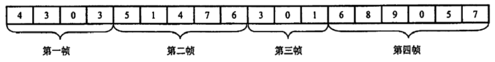

        > - 计数字段提供的字节数包含自身所占的一个字节
        > - 如果计数字段在传输中出现差错，接收方就无法判断结束位，从而无法帧同步了

    2.  字节填充的首尾界符法

        > 首尾界符法：
        >
        > - SOH：帧开始符（Start of Header），十六进制编码为：01
        > - EOT：帧结束符（End of Transmisson），十六进制编码为：04

        字节填充的首尾界符法：

        - 将传输数据中的“SOH”转换为：“ESC” “x”
        - 将传输数据中的“EOT”转换为：“ESC” “y”
        - 将传输数据中的“ESC”转换为：“ESC” “z”

        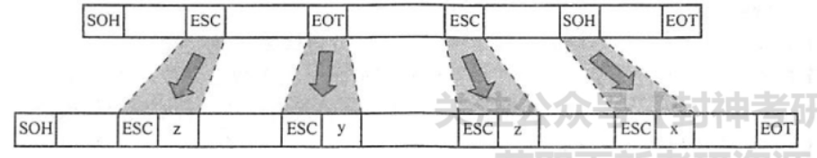

        > “ESC”是转义符，十六进制为1B

        > 注意：
        >
        > - 并不是所有形式的帧都需要帧开始符和帧结束符（如：**MAC帧不需要帧结束符**）在以太网传送帧时，各帧之间还必须有一定的间隙（以太网规定为：**9.6μm == 96比特时间**），故接收端只要找到帧开始定界符就好（不需要使用字节插入来保证透明传输）
        > - PPP帧用来进行帧定界的字段为**0x7E**

    3.  比特填充的首尾标志法

        使用 “**0111 1110**” 作为帧的**开始**和**结束**标志。

        在传输数据中，只要检测到数据帧中有5个连续的“1”，马上在其后插入“0”；接收方做逆操作，恢复数据。

        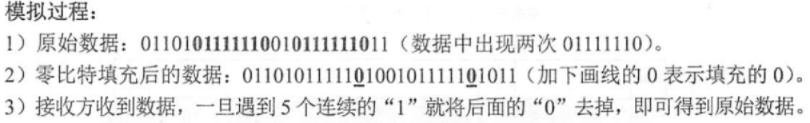

    4.  物理编码违例法

        利用物理介质上编码的违法标志来区分帧的开始与结束。

3.  ***检错编码***

    检错编码：通过一定的编码和解码，能够在接收端解码时检查出传输的错误，**但不能纠正错误**

    - 奇偶校验码：在信息码后面加一位校验码

      - 奇校验：添加一位校验码后，使得整个码字里面 1 的个数是奇数
      - 偶校验：添加一位校验码后，使得整个码字里面 1 的个数是偶数

      > 只能校验出一位数据出错的情况，且无法判断是哪一位出错

    - **循环冗余码（CRC）**

      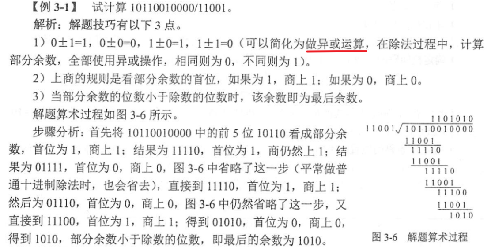

      - 具有 r 检测位的多项式能够检测出所有**小于或等于r**的突发错误

        > 

      - 长度大于 r+1 的错误逃脱的概率是 1/2r

      > 注意：
      >
      > - 循环冗余校验仅能做到**无差错接收**（注意区分可靠传输）
      > - 实际上循环冗余码（CRC）是具有纠错功能的，但是计算机网络一般不使用CRC的纠错，而是选择重传
      > - CRC校验可以使用硬件来完成

4.  ***纠错编码***

    纠错编码：在接收端不但能检查错误，而且能纠正检查出来的错误

    - **海明码** == 汉明码：在信息字段中插入若干位数据，用于监督码字里的哪一位数据发生了变化，**具有一位纠错能力**

      步骤：

      1.  确定校验码的位数 r

          > 2r ≥ k + r +1
          >
          > > - r：校验位数
          > > - k：信息位数

      2.  确定校验码的位置

      3.  确定数据的位置

      4.  求出校验位的值

      > 实战：
      >
      > 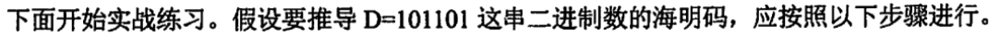
      >
      > 步骤：
      >
      > 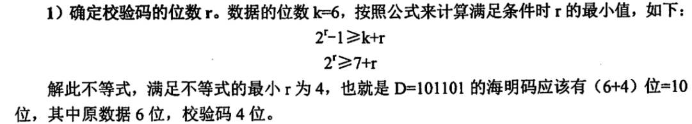
      >
      > 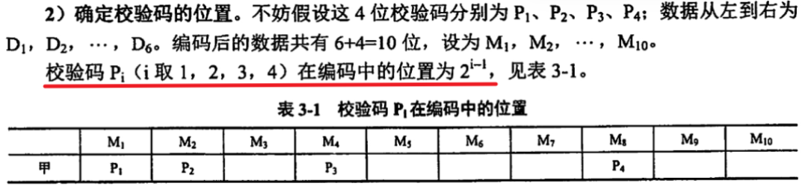
      >
      > 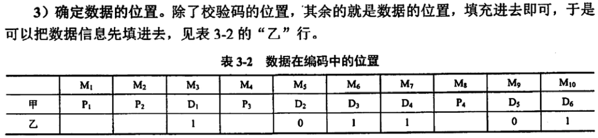
      >
      > > 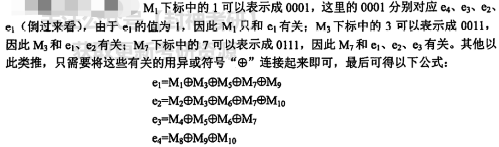
      >
      > 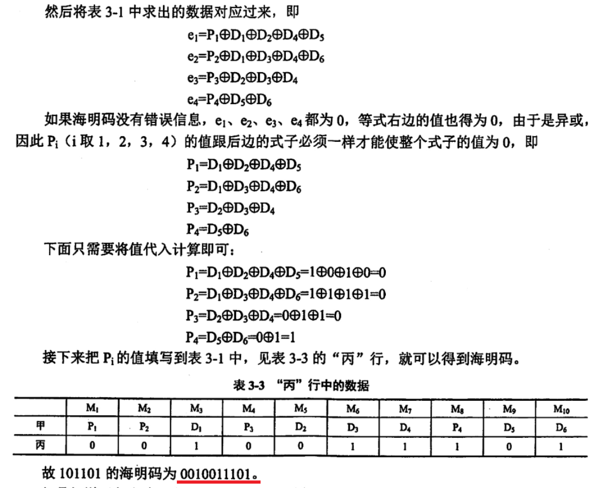
      >
      > 校验：
      >
      > 

    > 码距 == 海明距：反映两个码字不一样的程度。就是把两个码字对齐之后，有几位不相同。
    >
    > 补充：
    >
    > - 海明码如果要**检测**出 d 位错误，需要一个海明距为 **d+1** 的编码方案
    > - 海明码如果要**纠正**出 d 位错误，需要一个海明距为 **2d+1** 的编码方案
    > - 海明码的纠错能力恒小于或等于检错能力

5.  ***流量控制***

    流量控制：控制发送方发送数据的速率，使接收方来得及接收。有两种方式：

    - 停止-等待流量控制

      发送方发出一帧，然后等待应答信号到达再发送下一帧。如果接收方不返回应答信号，则发送方必须一直等待。

    - 滑动窗口流量控制

      - 发送方：维持发送窗口（包含：①已经被发送但还没有被确认的帧；②可以被发送的帧）

        

      - 接收方：维持接收窗口（维持一组连续的允许接收的帧的序号）

        

      > - 发送窗口与接受窗口的序号上下界可以不同；窗口大小也可以不同
      > - 发送端每收到一个帧的确认，发送窗口就向前滑动一个帧的位置
      > - 接收端只有当收到的数据帧的发送序号落入接收窗口，该帧才会被收下，并将窗口向前移动一个帧的位置；若接收到的数据帧落在窗口外，则丢弃。

6.  ***可靠传输机制***

    可靠传输是指发送方发送什么，接收方就接收什么。

    区分可靠传输与无差错接收的区别：

    这里数据链路层只能检测帧中的“**比特差错**”【无差错接收】，而对于**帧丢失**、**帧重复**、**帧失序**则无法检测【可靠传输】。

    > 前提补充：
    >
    > - **自动请求重发（ARQ）**：使用**确认**和**超时重传**两种机制实现可靠传输的策略。
    >
    > - ARQ协议规定：**发送窗口的大小 ≤ 窗口总数 - 1**
    >
    >   > 
    >   >
    >   > 
    >
    > - 发送缓存和接收缓存（注意区别发送窗口与接收窗口）
    >
    >   

    - **停止-等待协议**

      > 基于【停止-等待流量控制技术】

      发送方传输一个帧后，必须等待对方的确认才能发送下一帧；若在规定时间内没有收到确认，则发送方超时，并重传原始帧

      > 注意区分**停止-等待流量控制技术**和**停止-等待协议**：
      >
      > - 停止-等待流量控制**技术**如果没有收到请求会一直等待
      > - **协议**是在技术之上考虑到了不利状况，考虑长时间没有收到确认判定为出现意外，因此会重传数据帧

      停止-等待协议主要有两类错误：

      - 数据帧被破坏或丢失：

        接收方进行差错检验时会检测出来，丢弃。利用重传计时器可以解决问题（发送方超时重传）

      - 确认帧被破坏或丢失：

        造成的结果是，发送方不断地重复发该帧，导致接收方不断地重复接收该帧。解决方法是在每一个帧的头部加上序号。

        > 原则上讲：确认帧也是需要序号的。

    - **后退N帧协议（GBN）**【具有累计确认】

      > 基于【滑动窗口流量控制技术】

      若采用 n 个比特对帧进行编号，其发送窗口尺寸 WT 必须满足：**1 \< WT ≤ 2n-1** ；接收窗口尺寸为 1

      基本思想：如果某个帧出错了，接收方只能丢弃该帧以及其后的所有帧；导致发送方超时后需要重发该帧以及其后的所有帧。

      > 
      >
      > 
      >
      > > 由此可以看出，在后退N帧协议中，发送方没有收到某个帧的确认，但不一定要重发此帧。

    - **选择重传协议（SR）**【不具有累计确认】

      > 基于【滑动窗口流量控制技术】

      发送窗口的最大尺寸应该不超过序列号范围的一半：**WT ≤ 2n-1**

      发送窗口和接收窗口通常都取最大值（可达到最大效率）： **WT = WR = 2n-1**

      > 

      基本思想：若一帧出错，则其后续帧先存入接收方的缓冲区中，同时要求发送方重传出错帧，一旦收到重传帧后，就和原先存在缓冲区的其余帧一起按正确顺序送至主机。

      > 
      >
      > 
      >
      > 说几号帧确认超时，就重发几号帧，其他不考虑。

7.  ***滑动窗口机制***

    从滑动窗口的层次上看三种传输协议，只是在发送窗口和接收窗口的大小上有所差别：

    - 停止-等待协议：发送窗口大小 = 1；接收窗口大小 = 1
    - 后退N帧协议（GBN）：发送窗口大小 \> 1；接收窗口大小 = 1
    - 选择重传协议（SR）：发送窗口大小 \> 1；接收窗口大小 \> 1

    > 当接收窗口大小为1时，一定可以保证按序接收。

8.  ***信道划分介质访问控制***

    【属于静态分配信道的方法：只要用户分配到了信道就不会和其他用户发生冲突】

    - **频分多路复用访问（FDMA）**

      将一条信道分割成多条不同频率的信道

      适合传输**模拟信号**

      > - 每个子信道分配的带宽可以不相同，它们的总和一定不能超过信道的总带宽
      > - 实际应用中，为防止子信道之间的干扰，相邻信道间还要加入“保护频带”

    - **时分多路复用访问（TDMA）== 同步时分复用**

      分成不同的时隙（slot）

      适合传输**数字信号**

      > **统计时分复用（STDM）== 异步时分复用**：根据用户实际需要动态分配线路资源的时分复用方法。只有当用户有数据要传输时才给他分配线路资源，当用户暂停发送数据时，不给他分配线路资源。
      >
      > - 动态的时间分配
      > - 异步的：每个用户使用的时间周期是不固定的

    - **波分多路复用访问（WDMA）**

      就是“光的频分多路复用”，在一根光纤中传输多种不同频率（波长）的光信号，各路光信号互不干扰。

      

    - **码分多路复用访问（CDMA）== 码分多址**

      既共享信道的频率，又共享时间（是一种真正的动态复用技术）

      优点：抗干扰能力强、保密性强、语音质量好等

      > 码片向量：
      >
      > 
      >
      > - 任意两个不同站的码片向量正交，即任意两个站点的码片向量的规格化内积一定为0
      > - 任意站点的码片向量与该码片向量自身的规格化内积一定为1；任何站点的码片向量和该码片的反码向量的规格化内积一定为0
      >
      > > 例：
      > >
      > > 
      > >
      > > 

9.  ***随机访问介质访问控制***

    【属于动态分配信道的方法】

    - ALOHA协议

      当网络中的任何一个节点需要发送数据时，可以**不进行任何检测**就发送数据。如果在一段时间内没有收到确认，该节点就认为传输过程中发生了冲突。发生冲突的节点需要**等待一段随机时间**后再发送数据。

      > 时分ALOHA：所有节点的时间被划分为间隔相同的时隙，并规定每个节点只有等到下一个时隙到来时才可以发送数据

    - CSMA协议（载波侦听多路访问）

      每个节点发送数据之前都使用载波侦听技术来判定通信信道是否空闲，有三种策略：

      - 1-坚持CSMA：当发送节点监听到信道空闲时，**立即发送数据**，否则**继续监听**
      - p-坚持CSMA：当发送节点监听到信道空闲时，**以概率p发送数据**，以**概率p-1延迟一段时间**并重新监听
      - 非坚持CSMA：当发送节点一旦监听到信道空闲时，**立即发送数据**，否则**延迟一段随机时间**再重新监听

    - **CSMA/CD协议（载波侦听多路访问/冲突检测协议）**

      > 在**局域网**中被广泛应用。在CSMA基础上增加**冲突检测**功能。

      每个站在发送数据之前要先检测总线上是否有其他计算机在发送数据，若有，则暂时不发送数据；若没有，则发送数据。

      计算机在**发送数据的同时检测信道上是否有冲突发生**，若有，则采用**截断二进制指数类型退避算法**来等待一段随机时间后重发

      > - **争用期 == 冲突窗口 == 碰撞窗口**：
      >
      >   **以太网端到端的往返延时**（用 **2τ** 表示）。只有经过争用期这段时间还没有检测出冲突，则肯定此次发送不会发生冲突
      >
      >   > 以太网规定取 **51.2μs** 为争用期长度（**2τ = 51.2μs**），对于 10Mbit/s 的以太网，在争用期可发送 **64B** 数据
      >   >
      >   > - 规定，以太网的最短帧长为：**64B**（不足帧长MAC子层会在数据字段后面加入一个整数字节的填充字段）
      >   >
      >   >   在以太网发送数据时，如果前64B没有发生冲突，那么后续数据也不会发生冲突（已成功抢占信道）
      >   >
      >   > - 最短有效帧长和**最远两个站间距离**以及**传输速率**有关，并且**呈正比**
      >   >
      >   >   
      >   >
      >   >   
      >   >
      >   >   
      >   >
      >   >   
      >
      > - **截断二进制指数类型退避算法**
      >
      >   
      >
      >   > 
      >   >
      >   > 
      >   >
      >   > 随机数取值不会超过 1023，因此B、C选项直接排除

    - CSMA/CA协议（载波侦听多路访问/冲突避免协议）

      > 主要用于**无线局域网**中。在CSMA基础上增加**冲突避免**功能。

      要求每个节点在发送数据前监听信道。如果信道空闲，则直接发送数据。发送节点在发送完一个帧后，必须等待一段时间（帧间间隔），**检查接收方是否发回帧的确认**：若收到确认，则表明无冲突发生；若在规定时间内没有收到确认，则出现冲突，重发。

      > CSMA/CA协议是会对正确接收到的数据帧**进行确认**

    > CSMA/CD与CSMA/CA基本思想的区别：
    >
    > - CSMA/CD协议的基本思想是发送前侦听，边发送边侦听，一旦出现碰撞马上停止发送
    > - CSMA/CA协议的基本思想是在发送数据时先广播告知其他节点，让其他节点在某段时间内不要发送数据，以免出现碰撞

10. ***轮询访问介质访问控制***

    【属于动态分配信道的方法】

    > 主要用于**令牌环局域网**中

    用户不能随机地发信息，而是通过一个集中控制的**监控站**经过轮询过程后再决定信道的分配。

    > - 令牌环局域网把多个设备安排成一个**物理或逻辑连接环**
    > - 令牌（唯一；是一个特殊格式的帧）沿着环形总线在计算机之间依次传递
    > - 需要发送数据的计算机只有拿到令牌才可以发送数据【受控接入】
    >
    > 
    >
    > > 注：令牌传送一圈只能发送一次数据

11. ***局域网（LAN）***

    主要优点：

    - 具有广播功能

      > - 局域网上的主机可共享连接在局域网上的各种硬件和软件资源
      > - 局域网的广播并不是该局域网的每个站点都要接收该数据（网卡会对每个帧的目的MAC地址进行比对）

    - 便于系统的扩展和演变

    - 提高了系统的可靠性、可用性

    - 各站为平等关系而非主从关系

    主要技术要素：

    - 介质访问控制方法【最重要】
      - CSMA/CD（总线型网）
      - 令牌总线（总线型网）
      - 令牌环（环形网）
    - 网络拓朴结构
      - 星形网
      - 环形网
      - 总线型网
      - 树形网（星形网和总线型网的结合）
    - 传输介质
      - 双绞线【主流】
      - 铜缆
      - 光纤

    > IEEE的802标准定义的局域网参考模型将数据链路层拆分为两个子层：
    >
    > - 媒体接入控制（MAC）子层：与介入媒体有关的内容
    > - 逻辑链路控制（LLC）子层：与传输媒体无关

12. ***以太网***

    - 采用**总线型**拓扑结构
    - 信息以**广播方式**发送
    - 使用**CSMA/CD**技术对总线进行访问控制
    - 采用**无连接**的工作方式
    - **不对发送的数据帧进行编号，不要求对方发送确认**

13. 以太网的***MAC帧***

    MAC地址 == 物理地址 == 硬件地址

    - 每台计算机**唯一**
    - 被固化在**网卡的ROM中**
    - 共**48bit（6B）**（高24bit为厂商代码；低24bit为厂商自行分配的网卡序列号）

    **MAC帧**：

    

    - 前导码：使接收端与发送端进行时钟同步（分为前同步码和帧开始定界符）

    - **源地址**字段中**前8位的最后一位**恒为：**0**（为了区分单播、组播和广播）

      - 单站地址：目的地址前8位的最后一位为 0
      - 组播地址：目的地址前8位的最后一位为 1，且其余不全为 1
      - 广播地址：目的地址前8位的最后一位为 1，且其余全为 1 （FF-FF-FF-FF-FF-FF）

    - 数据部分的最小长度为：**46B**（规定的MAC帧最小帧长64B - MAC帧首部尾部长度18B）

      > 因此受限于CSMA/CD协议，数据长度不得小于46B（而非64B），否则填充（填充范围：0 ~ 46B）。
      >
      > 
      >
      > 

    - 数据部分的最大长度为：**1500B**

    - 校验码（FCS）：采用**循环冗余码**。

      > 需要校验：数据部分、目的地址、源地址、类型字段。不校验前导码。

14. ***广域网***

    广域网由一些**节点交换机**以及连接这些交换机的**链路**组成。

    > 节点交换机：完成分组**存储转发**功能

    > 广域网与互联网的区别：
    >
    > - 互联网本质是“网络的网络”，由多个网络（可以为局域网，也可以为广域网）互联而成。**使用路由器连接各网络**。
    > - 广域网只是一个**单一的网络**，**使用节点交换机连接各主机**。

    > 广域网与局域网的区别：
    >
    > 
    >
    > > 通俗理解广域网就是通过节点交换机将多个局域网连接而成的一个更大的局域网。
    >
    > 从层次上考虑广域网和局域网的区别很大：
    >
    > - 局域网使用的协议主要在数据链路层（少量物理层）
    > - 广域网使用的协议主要在网络层

15. ***PPP（点对点协议）***

    PPP主要由以下三个部分组成：

    - 一个将IP数据报封装到串行链路的方法
    - 一个链路控制协议（LCP）：用于建立、配置和测试数据链路连接，并在不需要时将它们释放
    - 一套网络控制协议（NCP）：每个协议支持不同的网络层协议，用来建立和配置不同的网络层协议

    PPP的帧格式：

    

    - 标志字段（F）：规定为0x7E（首尾部均有）

      > 使用字节填充的首尾标志法

    - 地址字段（A）：规定为0xFF

    - 控制字段（C）：规定为0x03

    - 信息部分长度：0 ~ 1500B

      > 因为PPP协议是点对点的，而非总线型，所以不用CSMA/CD协议，不存在最短帧

    - 校验码（FCS）：采用**循环冗余码**。

      > 需要校验：地址字段（A）、控制字段（C）、协议字段、信息部分

    PPP协议特点：

    - **面向字节**的协议
    - 只支持**全双工**
    - 只检错，不纠错
    - 无序号
    - 点对点
    - 无流量控制（靠TCP实现）

16. ***HDLC协议（高级数据链路控制协议）***

    该协议可适用于链路的两种基本配置：

    - 非平衡模式：由一个**主站**控制整个链路的工作
    - 平衡模式：链路两端的两个站都是**复合站**，每个复合站都可以平等地发起数据传输，而不需要得到对方复合站的允许

    HDLC帧格式：

    

    - 标志字段（F）：规定为“0111 1110”（首尾部均有）

      > 使用比特填充的首尾标志法

    - 地址字段（A）：全“1”为广播方式，全“0”为无效地址

    - 控制字段（C）：根据最前面两位的取值，可以将HDLC帧划分为三类：

      - **信息帧（I帧）**：用来传输数据信息，或使用捎带技术对数据进行确认和应答
      - **监督帧（S帧）**：用于流量控制和差错控制，执行对信息帧的确认、请求重发和请求暂停发送等功能
      - **无编号帧（U帧）**：提供对链路的建立、拆除以及多种控制等功能

      > 记忆：“无监信” == “无奸细”

    HDLC协议特点：

    - **面向比特**的协议
    - 有编号
    - 有流量控制

17. ***网桥***

    数据链路层扩展局域网使用网桥（物理层扩展局域网使用中继器和集线器）

    > ps：个人认为\*“扩展”\*局域网的表述非常好，它可以将多个局域网连接在一起，但本质上还是一个网络。（这对隔离广播域与否很重要）

    优点：

    - 具有**过滤帧**的功能（过滤通信量）

      > 网桥至少有两个端口，每一个端口连接不同网段，从一个端口接收帧，暂存到缓存中，比对其目的MAC地址以及转发表：
      >
      > 若该帧未出现差错，且目的MAC属于另一个不同网段，则从对应端口转发；若属于同一网段，则丢弃。（即仅在同一个网段中通信的帧，不会被转发到其他网段上）

    - 扩大了物理范围

    - 提高可靠性

    - 可互联**不同的物理层**、**不同的MAC子层**、**不同速率的以太网**

    缺点：

    - 存储转发增加时延
    - 在MAC子层没有流量控制
    - 具有不同MAC子层的网段桥接在一起时的延时更大
    - 只适合用户数量不多且通信量不大的局域网
    - 会因为传播过多的广播信息而产生网络拥塞（**广播风暴**）

    网桥的分类：

    - 透明网桥（选择的**不是最佳路由**）：

      > “透明”指局域网的站点并不知道发送的帧经过哪几个网桥

      工作原理：

      

      > 透明网桥使用一种**生成树算法**：避免转发的帧在网络中不停地转圈。

    - 源选径网桥（选择的**是最佳路由**）：

      路由选择由发送数据帧的源站负责，网桥只负责接收转发。

      > “最佳路由”：并不一定是经过路由器最少的路由，还可能是往返时间最短。

    > 在不同网络中传送时，MAC帧首部中的源地址和目的地址要发生变化，但是**网桥在转发帧时，不改变帧的源地址！！！**

18. ***局域网交换机***

    > 交换机 == 交换式集线器

    实质上就是多端口的网桥，工作在数据链路层。

    - 每个端口都直接与**主机**或\*\*集线器（Hub）\*\*相连

    - 一般为**全双工方式**（也有半双工）

    - **以太网交换机**独占传输媒体的带宽

      > 交换机总容量计算方式：
      >
      > - 半双工：**端口数 × 每个端口的带宽**
      > - 全双工：**端口数 × 每个端口的带宽 × 2**
      >
      > > 
      > >
      > > 

    交换机的两种交换模式：

    - 直通式交换：只检查帧的目的地址，接收后马上转发。（无法支持不同速率的端口的交换）
    - 存储转发式交换：接收帧先缓存，检查数据正确性，查找转发表，转发。（支持不同速率的端口的交换）

19. 交换机和网桥的区别

    - 交换机实质是一个**硬件实现**的**多端口**网桥；网桥常用**软件实现**且一般只有**两个端口**
    - 交换机的每个端口直接与**主机**或**集线器（Hub）**相连；网桥的端口一般连接到局域网的**网段**里
    - 交换机允许**多对计算机同时通信**；网桥最多允许**每个网段上的一对计算机同时通信**
    - 交换机有**直通式**和**存储转发式**两种交换模式；网桥只有**存储转发式**交换模式
    - 交换机转发速度比网桥快

20. 冲突域和广播域

    冲突域：当一块网卡发送信息时，只要有可能和另一块网卡冲突，则这些可能冲突的网卡就构成冲突域

    广播域：一块网卡发出一个广播，能收到这个广播的所有网卡集合称为广播域

    

------------------------------------------------------------------------

## 例题

> 例题：
>
> 1.  
>
>     
>
> 2.  
>
>     
>
> 3.  
>
>     
>
> 4.  
>
>     
>
> 5.  
>
>     
>
> 6.  
>
>     
>
>     > 
>     >
>     > 看着答案去解释生成树算法的问题：生成树算法在逻辑上形成树结构，在逻辑上没有环路。而此题已经形成了环路，因此帧会兜圈子
>
> 7.  
>
>     
>
> 8.  
>
>     
>
> 9.  
>
>     
>
>     > **链路利用率 = n × 发送时延 / RTT + 发送时延**
>
> 10. 
>
>     
>
> 11. 
>
>     
>
> 12. 
>
>     
>
>     不解？？？？
>
> 13. 
>
>     
>
> 14. 
>
>     
>
>     
>
> 15. 
>
>     
>
> 16. 
>
>     
>
> 17. 
>
>     
>
> 18. 
>
>     
>
> 19. 
>
>     
>
> 20. 
>
>     注意题干信息中“接收方总是以与数据帧等长的帧进行确认”。（很多题目中会说用忽略不计的短帧确认，注意区别）
>
>     
>
> 21. 
>
>     
>
>     计算一个发送周期内可以发送多少数据，进而求出帧数。（注意计算上的区别）
>
> 22. 
>
>     
>
>     > 注意：在选择重传协议中：
>     >
>     > - 发送窗口的最大尺寸应该不超过序列号范围的一半：**WT ≤ 2n-1**
>     > - 发送窗口和接收窗口通常都取最大值（可达到最大效率）： **WT = WR = 2n-1**
>     > - 发送窗口大小 + 接收窗口大小 ≤ 2n ：**WT + WR ≤ 2n**
>
> 23. 
>
>     
>
> 24. 
>
>     
>
> 25. 
>
>     
>
>     > 注意CSMA/CA协议的通信过程：
>     >
>     > - **请求发送帧（RTS）**
>     > - **清除发送帧（CTS）**
>
> 26. 
>
>     
>
> 27. 
>
>     
>
> 28. 
>
>     
>
> 29. 
>
>     
>
> 30. 
>
>     
>
> 31. 
>
>     
>
> 32. 
>
>     
>
> 33. 
>
>     
>
> 34. 
>
>     
>
> 35. 
>
>     
>
> 36. 
>
>     
>
> 37. 
>
>     
>
> 38. 
>
>     
>
> 39. 
>
>     
>
> 40. 
>
>     
>
> 41. 
>
>     
>
> 42. 
>
>     
>
> 43. 
>
>     
>
>     > 这里交换机的半双工方式计算和《天勤》有出入。

------------------------------------------------------------------------

------------------------------------------------------------------------

------------------------------------------------------------------------

# 第四章 网络层

## 大纲要求

- 网络层的功能
  1.  异构网络互联
  2.  路由与转发
  3.  拥塞控制
- 路由算法
  1.  静态路由与动态路由
  2.  距离-向量路由算法
  3.  链路状态路由算法
  4.  层次路由
- IPv4
  1.  IPv4分组
  2.  IPv4地址与NAT
  3.  子网划分与子网掩码、CIDR
  4.  ARP、DHCP与ICMP
- IPv6
  1.  IPv6的主要特点
  2.  IPv6地址
- 路由协议
  1.  自治系统
  2.  域内路由与域间路由
  3.  RIP路由协议
  4.  OSPF路由协议
  5.  BGP路由协议
- IP组播
  1.  组播的概念
  2.  IP组播地址
- 移动IP
  1.  移动IP的概念
  2.  移动IP的通信过程
- 网络层设备
  1.  路由器的组成和功能
  2.  路由表与路由转发

## 核心考点

- （※※※※※）子网划分和无分类编址CIDR
- （※※※※※）路由与转发、即各种路由算法
- （※※※※）IP地址的分类、IP数据报格式、NAT
- （※※※）ARP、DHCP和ICMP
- （※※※）3种常用路由选择协议：RIP、OSPF、BGP
- （※※）IP组播、移动IP的基本概念
- （※※）路由器的组成和功能

------------------------------------------------------------------------

## 知识点

1.  中继系统 == 中间系统

    将网络（**异构的网络**，区别于链路层设备）互联起来需要中继系统，根据层次划分为4类：

    - 物理层：中继器、集线器

    - 数据链路层：网桥或交换机

    - 网络层：路由器

      > 如果互连的网络是异构的，则必须使用路由器连接

    - 网络层以上：网关

    > 注：
    >
    > - 物理层和数据链路层的中继系统，一般并不称之为网络互连（这仅仅是把一个网络扩大了，本质仍是一个网络）
    > - 互联网都是指用**路由器**进行互连的网络

2.  ***路由与转发***

    路由器的主要功能就是：

    - **路由选择**：根据路由算法确定一个进来的分组应该被传送到哪一条输出线路上。如果子网内部使用：

      - **数据报**：对每一个进来的分组都要重新选择路径
      - **虚电路**：只有当创建一个新的虚电路时，才需要确定路由选择

    - **分组转发**：路由器根据转发表将用户的IP数据报从合适的端口转发出去

      > 注意：
      >
      > - **路由表**：是根据**路由选择算法**得出的。路由表需要对网络拓扑变化的计算最优化
      > - **转发表**：是从**路由表**得出的。转发表的结构应当使查找过程最优化

3.  SDN

    SDN是一种支持动态、弹性管理的新型网络体系结构，是实现高带宽、动态网络的理想架构。

    主要特征：

    - 网络可编程
    - 控制平面与数据平面的分离
    - 逻辑上集中管理：主要是对分布式网络状态的集中统一管理

    SDN网络体系结构，主要包括：

    - SDN网络应用
    - 北向接口
    - SDN控制器
    - 南向接口
    - SDN数据平面

    

4.  ***拥塞控制***

    拥塞控制可分为两大类：

    - **开环控制**：在网络系统设计时，事先就要考虑到有关发生拥塞的各种因素，力求在系统工作时不会出现拥塞。**一旦整个系统启动并运行起来，就不再需要中途进行修改。**
    - **闭环控制**：事先不考虑有关发生拥塞的各种因素，采用监视系统去监视，**即时检测到哪里发生拥塞，然后将拥塞信息传到合适的地方以便调整系统运行。**

    > 拥塞控制与流量控制的区别：
    >
    > - **拥塞控制**必须确保通信子网能够传送待传送的数据，是一个**全局性**的问题（涉及所有主机、路由器以及导致网络传输能力下降的所有因素）
    > - **流量控制**只与给定的发送端和接收端之间的**点对点通信量**有关，其任务是使发送端发送数据速率不能快得让接收端来不及接收

5.  静态路由与动态路由

    划分依据：路由算法能否随网络的通信量或拓扑自适应地进行调整变化来划分

    - **静态路由 == 非自适应路由选择**：简单、开销小，不能及时适应网络状态的变化，适用于很小的网络。（需要手动配置路由信息）

    - **动态路由 == 自适应路由选择**：复杂、开销大，能较好地适应网络的变化，适用于复杂网络。（通过路由协议自动发现并维护路由信息）

      > 动态路由选择实现的一个直观表现：路由器中的路由表只给出下一跳路由器的IP地址，而非直接指明传输总路线。

      动态路由算法又可分为两类：

      - **距离-向量路由算法**

        【代表：RIP算法（“距离”即“跳数”）】

        所有的节点都定期地将它们整个路由选择表传送给所有与之直接相邻的节点

        其中路由选择表包含：**每条路径的目的地（另一个节点）**、**路径的代价（距离）**

        > 所有节点都监听从其他节点传来的路由选择更新信息，参与距离-向量交换，以保证路由的有效性和一致性。
        >
        > 
        >
        > 更新路由表的情况：
        >
        > 1.  被通告一条新的路由（该路由在本节点的路由表中不存在，此时本地节点加入这条新的路由）。
        > 2.  通过发送路由信息的节点有一条到达某个目的地的路由，该路由比当前使用的路由有较短的距离。

      - **链路状态路由算法**

        【代表：OSPF算法（“度量”代表“费用、距离、时延、带宽等”）】

        要求参与该算法的节点都有完全的网络拓扑信息。执行下述两项任务：

        - 主动测试所有邻接节点的状态
        - 定期地将链路状态传播给所有其他节点（并非只有直接相连的直连节点）

        > 一旦链路状态发生变化，就采用Dijkstra最短路径算法重新计算路由：从单一节点出发到所有目的节点的最短路径

        三大特征：

        - 向本**自治系统**中的所有路由器发送信息

          > 采用**洪泛法**：路由器通过所有输出端口向所有相邻的路由器发送信息，而每一个相邻的路由器又将此信息发往其所有相邻路由器（**但不再发送给刚刚发来信息的那个路由器**）

        - 发送的信息就是**与本路由器相邻的所有路由器的链路状态**，但这只是路由器所知道的部分信息

        - **只有当链路状态发生变化时**，路由器才用洪泛法向所有路由器发送信息

6.  ***层次路由***

    **自治系统**：因特网将整个互联网划分为许多较小的**自治系统**

    - 自治系统不是一个局域网，里面包含很多局域网

    - 每个自治系统有权自主地决定本系统内应采用何种路由选择协议

      **路由选择协议**被划分为两大类：

      1.  **内部网关协议（IGP）**：一个自治系统内所使用的路由选择协议

          - **RIP协议**【**使用传输层UDP**】

            只选择途径**路由器数量最少的路径**（途径路由器多但是总时延小的路径都不选择）

            > 注意：在RIP的知识点介绍中，“节点”全部表示路由器，而不包括主机

            > “距离” == “跳数”：
            >
            > - 从一个路由器到**直接连接的网络**的距离定义为**1**
            >
            > - 从一个路由器到**非直接连接**的距离定义为**所经过的路由器数量+1**
            >
            >   > 每经过一个路由器，跳数加1

            RIP允许一条路径最多只能包含15个路由器（**距离的最大值为16 == “不可达”**）

            > 当网络出现故障时，“坏消息传播的慢”（收敛速度慢）

            RIP三要点：

            - 仅和相邻路由器交换信息
            - 交换的信息是当前本路由器所知道的全部信息，即自己的路由表
            - 按固定的时间间隔（如间隔30s）交换路由信息

          - **OSPF协议**【使用IP数据报】

            仅仅当网络拓扑发生变化时，才向本自治系统的所有路由器发送消息（洪泛法）

            > 结果就是：所有的路由器都会维持本自治系统内的一个链路状态数据库
            >
            > 虽然Dijkstra算法可以算出完整的最优路径，但是路由表中不会存储完整的路径，而只存储“下一跳”

            > 结果收敛的更快

            OSPF如果到同一个目的网络有多条相同代价的路径，可以将通信量分配给这几条链路（负载均衡）；RIP只能选择一条

            OSPF使用组播；RIP使用广播

      2.  **外部网关协议（EGP）**：不同自治系统之间使用的路由选择协议

          - **BGP协议**【TCP传送】

            基本原理

            

            BGP特点：

            - BGP交换路由信息的节点数量级是自治系统的数量级
            - 每一个自治系统当中BGP发言人（边界路由器）的数目很少，使得自治系统之间路由选择不复杂
            - BGP支持CIDR
            - BGP刚运行时，BGP的邻站是交换整个的BGP路由表，但以后只需要在发生变化时更新有变化的部分
            - BGP交换网络可达性的信息是**一条完整的路径信息**

            BGP的四种报文：

            - 打开报文（Open）：用来与相邻的另一个BGP发言人建立关系
            - 更新报文（Update）：用来发送某一路由的信息以及列出要撤销的多条路由
            - 保活报文（Keepalive）：用来确认打开报文和周期性地证实邻站关系
            - 通知报文（Notificaton）：用来发送检测到的差错

      3.  小结：

          

      > 1.  **域内路由选择**：自治系统内部的路由选择
      > 2.  **域间路由选择**：自治系统之间的路由选择

    **区域**：OSPF协议将一个自治系统再划分为若干个更小的范围，叫作区域。

    > - 划分区域的好处就是把利用洪泛法交换链路信息的范围局限于每一个区域而不是整个自治系统，减少网络通信量
    > - 在一个区域内部的路由器只知道本区域的完整网络拓扑情况，而不知道其他区域的网络拓扑情况

    **区域边界路由器**：从其他区域来的信息都要由区域边界路由器进行概括（**每个区域都至少有一个区域边界路由器**）

    区域又层次划分为：

    - **骨干区域**（标识符：**0.0.0.0**）

      骨干区域的作用是用来连接其他在下层的区域

      - **骨干路由器**：在骨干区域的路由器。

        > 一个骨干区域路由器可以同时是一个区域边界路由器

      - **自治系统边界路由器**：在骨干区域中，专门与本自治系统之外的**其他自治系统**交换路由信息。

    - 其他区域

    

7.  ***IPv4***

    

    > IP数据报首部分为**固定部分（20B）**和**可变部分**（40B），宏观上最大可达60B
    >
    > - IP数据报首部大小必须为**4B的倍数**（如果使用某功能后首部变为了非4B的倍数，则会使用自动填充功能增加到4B的倍数）
    > - 考试中不指明，**均默认IP数据报首部为20B**
    > - IP数据报在传输时，首部长度不会发生变化，但首部中的某些字段会改变

    - 版本：指明IPv4 或 IPv6

    - 首部长度：**基本单位长度是：4B**

    - 总长度：包括首部和数据部分。**基本单位长度是：1B**

    - 标识：一个计数器，用来产生IP数据报的标识

    - 标志：只有前两位有意义，即：

      - MF（More Fragment）：MF=1表示“后面还有分片”；MF=0表示“这是最后一个分片”。用于合并被分割的数据报

      - DF（Don’t Fragment）：DF=1表示“不能分片”；DF=0表示“可以分片”

        > 如果途径某一节点需要分片（数据报太大），但是DF=1（不允许分片），则丢弃该数据报（不可达）

    - 片偏移：**基本单位长度是：8B**

      > 
      >
      > 

    - 生存时间（TTL，Time To Live）：数据报在网络中可通过的路由器的最大值

    - 协议：指明交给传输层使用的协议

    - 首部校验和：**只检验数据报的首部**，不检验数据部分

    - 源地址：发送端主机IP

    - 目的地址：接收端主机IP

    > 记忆点：
    >
    > 首部长度、总长度、片偏移的基本单位是：4B、1B、8B
    >
    > “你不要**总**是拿**1**条假首饰（**首4**）来骗（**偏**）我吧（**8**）” → “**总1 、首4、偏8**”

8.  ***IPv4地址（32位）***

    分类：

    - A类地址

      

      - 网络号：**前8位**。规定**第一位为0**
        - **本网络（保留地址）**：网络地址全0（**0000 0000**）
        - **环回地址**：网络地址为： **127（0111 1111）**
      - A类地址可指派的网络数：**27-2**
      - 主机号：后24位
        - **该网络**：主机号全为0（00000000 00000000 00000000）
        - **广播地址**：主机号全为1（11111111 11111111 11111111）
      - 每个A类地址可指派的最大主机数：**224-2**

    - B类地址

      

      - 网络号：**前16位**。规定**前两位为10**

      - B类地址可指派的网络数：**214-1**

        > - 不存在网络号全0或全1的情况
        > - 但是**128.0.0.0**（10000000.00000000.00000000.00000000）**是不指派的**
        > - 可指派的最小网络地址：**128.1.0.0**（10000000.00000001.00000000.00000000）

      - 主机号：后16位

      - 每个B类地址可指派的最大主机数：**216-2**

    - C类地址

      

      - 网络号：**前24位**。规定**前三位为110**

      - C类地址可指派的网络数：**221-1**

        > - 不存在网络号全0或全1的情况
        > - 但是**192.0.0.0**（11000000.00000000.00000000.00000000）**是不指派的**
        > - 可指派的最小网络地址：**192.0.1.0**（10000000.00000000.00000001.00000000）

      - 主机号：后8位

      - 每个C类地址可指派的最大主机数：**28-2**

    > 小结：关于A、B、C类地址的最小和最大网络地址
    >
    > - A类网络地址范围：
    >
    >   **1~126**（00000001.00000000.00000000.00000000 ~ 01111110.00000000.00000000.00000000）
    >
    >   > 127：供本地软件环回测试使用
    >
    > - B类网络地址范围：
    >
    >   **128.1~191.255**（10000000.00000001.00000000.00000000 ~ 10111111.11111111.00000000.00000000）
    >
    > - C类网络地址范围：
    >
    >   **192.0.1~223.255.255**（11000000.00000000.00000001.00000000 ~ 11011111.11111111.11111111.00000000）

    - D类地址：组播地址。规定**前四位为1110**
    - E类地址

    6种特殊地址：

    

    > 路由器会把网络号为**全0**或**全1**的分组拦在本网络，不将其发送出去。
    >
    > 因此**受限广播地址**（**255.255.255.255**，属于E类地址）只能用于当前网络上的广播（而非整个因特网）

    > 补充：
    >
    > - IP地址是标志一个主机（或路由器）和一条链路的接口。当一个主机同时连接到两个网络时，意味着该主机必须应该同时拥有两个相应的IP地址（其网络号必须是不同的），称其为：**多接口主机**。
    >
    > - 链路层广播和IP广播的区别：
    >
    >   链路层广播是用数据链路层协议在**一个以太网**上实现对该局域网上的所有主机的**MAC帧**进行广播
    >
    >   IP广播使用IP可以向**特定目的网络**上的所有主机的**IP数据报**进行广播

9.  ***NAT（网络地址转换）***

    > **专用IP地址 == 可重用IP地址 == 私有地址**：路由器不会转发，仅供一个网络（**专用互联网 == 本地互联网 == 专用网**）内部使用
    >
    > - **10**.0.0.0 ~ **10**.255.255.255，即 **10.0.0.0/8**（相当于1个A类网络）
    > - **172.16**.0.0 ~ **172.31**.255.255，即 **172.16.0.0/12**（相当于16个连续的B类网络）
    > - **192.168.0**.0 ~ **192.168.255**.255，即 **192.168.0.0/16**（相当于256个连续的C类网络）

    **NAT**：将专用网内部使用的本地IP地址转换成有效的外部全球IP地址，使得整个专用网只需要一个全球IP地址就可以与因特网连通

    NAT路由器：装有NAT软件的路由器。它至少有一个有效的外部全球IP地址。

    > 注：专用网的主机不联系因特网的主机，那么因特网的主机就一定不会联系专用网的主机。
    >
    > 

10. ***子网划分与子网掩码***

    **子网划分**：使得两级的IP地址变为三级的IP地址

    划分思路：借用主机号的若干比特作为子网号（主机号相应减少），网络号不变。

    

    > - 划分子网属于一个单位内部的事情，单位对外仍表现为没有划分子网的网络
    > - 凡是从其他网络发送给本单位某个主机的IP分组，仍然根据IP分组的目的网络号先找到连接在本单位网络上的路由器，然后此路由器在收到IP分组之后，再按目的网络号和子网号找到目的子网，最后将该IP分组直接交付给目的主机

    > 注意：
    >
    > - IPv4地址进行子网划分，子网号不能出现“全0”或“全1”
    > - CIDR划分子块则可以使用“全0”或“全1”
    >
    > 

    > 

    **子网掩码**：将子网掩码和IP地址进行逐位的“与”运算，就一定能立即得出网络地址

    

    > 如果一个网络没有划分子网，则采用默认子网掩码：
    >
    > A类地址默认子网掩码：255.0.0.0
    >
    > B类地址默认子网掩码：255.255.0.0
    >
    > C类地址默认子网掩码：255.255.255.0

    路由转发分组算法：

    

11. ***CIDR（无类域间路由）***

    是一种将网络归并的技术。（把小的网络汇聚成大的超网）

    CIDR：两级编址

    

    CIDR记法 == “斜线记法”：**IP地址 / 网络前缀所占的位数**

    **路由聚合 == 构成超网**：将网络前缀都相同的连续的IP地址组成“CIDR地址块”。（一个CIDR地址块可以表示很多地址）

    > 

    > **最长前缀匹配原则**：路由器查找路由表匹配时，可能有多个匹配结果。**应选择具有最长网络前缀的路由**

12. ***ARP（地址解析协议）***

    解决**同一个局域网**上的主机或路由器的IP地址和硬件地址的映射问题（通过IP地址查询硬件地址）

    > 每个主机中都有一个**ARP高速缓存**，里面存放**所在局域网**上的各主机和路由器的IP地址到硬件地址的映射表。
    >
    > 查询流程：
    >
    > 
    >
    > 如果所找的目的主机跟源主机不在同一个局域网上，那么就要通过ARP找到一个位于本局域网上的某个路由器的硬件地址，然后把分组发送给这个路由器，让路由器把分组传到下一个网络。剩下的工作交由下一个网络去做。
    >
    > - **APR请求分组是广播发送**
    > - **ARP响应分组是单播发送**

13. RARP（逆地址解析协议）

    可以将物理地址转换为IP地址

    > 现在已被淘汰，这一功能被集成到了DHCP

14. ***DHCP（动态主机配置协议）***

    提供“即插即用”连网机制，用于给主机动态分配IP地址。

    > 注：DHCP是**应用层协议**，**使用UDP传输**

    过程：主机发送**源地址为 0.0.0.0**，**目的地址为 255.255.255.255**的广播分组。只有DHCP服务器会响应请求，分配给请求主机一个IP

    

    租用期：DHCP服务器分给DHCP客户的IP地址是临时的

15. ***ICMP（Internet控制报文协议）***【利用**IP数据报**】

    > ICMP控制消息并不传输用户数据，但对于用户数据的传输起着重要作用

    分类：

    - **ICMP差错报告报文**

      1.  终点不可达：当主机或路由器不能交付数据报时
      2.  源站抑制：当主机或路由器由于拥塞而丢弃数据报时（令源点把数据报的发送速率降低）
      3.  时间超过：当分组TTL减为后。①丢弃该分组；②向源主机发送时间超过报文
      4.  参数问题：数据报首部字段出错
      5.  改变路由（重定向）

      > 不应发送ICMP差错报告报文的情况：
      >
      > - 对**ICMP差错报告报文**不再发送ICMP差错报告报文
      > - 对第一个分片的数据报片的**所有后续数据报片**都不发送ICMP差错报告报文
      > - 对**具有组播地址的数据报**都不发送ICMP差错报告报文
      > - 对**具有特殊地址**（如 127.0.0.0 或 0.0.0.0）的数据报不发送ICMP差错报告报文

    - **ICMP询问报文**

      1.  回送请求和回答报文【**ping的应用**：测试两个主机的连通性】
      2.  时间戳请求和回答报文【**tracert的应用**：用来追踪分组经过的路由】
      3.  掩码地址请求和回答报文
      4.  路由器询问和通告报文

16. ***IPv6地址（128位）***

    主要特点：

    - 扩展地址层次结构
    - 首部格式灵活（**首部长度固定**）
    - 改进的选项
    - 允许协议继续扩充
    - 支持即插即用（自动配置）
    - **首部长度必须是8B的整数倍**（对比IPv4）
    - **不允许分片**
    - **取消首部校验和**

    首部格式：

    

    - 版本
    - 通信量类：为了区分不同的IPv6数据报的类别或优先级（0~15共16个优先级，数字越大优先级越高）
    - 流标号：所有属于同一个流的数据报都具有相同的流标号
    - 有效载荷长度：除基本首部以外的字节数（**最大值64KB**）（所有扩展首部都算有效载荷）
    - 跳数限制
    - 源地址
    - 目的地址

    IPv6定义了以下3种地址类型：

    - 单播：传统的点对点通信
    - 组播：数据报交付到一组计算机中的每一个广播可看作是组播的一个特例
    - 任播：其目的站是**一组主机**，但数据报在交付时**只交付给其中一个**（通常是距离最近的）

    > 注意IPv6地址的简写方法（**冒号十六进制记法**）：
    >
    > 
    >
    > 
    >
    > 

17. ***IP组播***

    **组播一定仅用于UDP**

    基本思想：源主机只需把单个分组发送给一个组播地址（该组播地址标识一组主机），分组在传输路径分岔时才将分组复制并继续转发。

    - 只有组播内的主机可以接收到数据，网络中的其他主机不可以接收
    - 主机可以选择加入或离开一个组
    - 一台主机可以同时属于多个组

    组播路由器：能够运行组播协议的路由器

    **IP组播地址**：使用D类IP地址支持组播

    > D类IP地址前缀：“**1110**”（224.0.0.0 ~ 239.255.255.255）

    - 组播地址仅能用于目的地址，不能用于源地址
    - 组播数据报“尽最大努力交付”，不提供可靠交付
    - 对组播数据报不产生ICMP差错报文
    - 并非所有D类地址都可以作为组播地址

    组播地址与MAC地址的换算：

    

18. ***移动IP***

    移动IP技术可以使移动节点以固定的网络IP地址，实现跨越不同网段的漫游功能，并保证了基于网络IP的网络权限在漫游过程中不发生任何改变。

    实现移动IP需要的功能实体：

    - 移动节点：具有永久IP地址的移动节点
    - 本地代理 == 归属代理：有一个端口与移动节点本地链路相连的路由器，它根据移动用户的转交地址，采用隧道技术转交移动节点的数据报
    - 外部代理：移动节点的漫游链路上的路由器，它通知本地用户代理自己的转交地址，是移动节点漫游链路的默认路由器

    实现移动IP需要的四大技术：

    - 代理搜索
    - 申请地址转交
    - 登录
    - 隧道

    移动IP的通信过程：

    

    

19. ***路由器***

    路由器实质上是一种多个输入端口和多个输出端口的专用计算机，其任务是连接不同的网络转发分组。

    路由器的结构可分为两大类：

    - **路由选择部分**：根据所选定的路由协议构造出路由表，同时经常或定期地和相邻路由器交换路由信息而不断更新和维护路由表，其核心部件是**路由选择处理器**

    - **分组转发部分**：由三部分组成：一组输入端口、**交换结构**（关键部件）、一组输出端口

      交换结构从输入端口接收到分组后，根据转发表对分组进行处理，然后从一个合适的输出端口转发出去。

    > 有三种常用的交换方法：通过存储器进行交换、通过总线进行交换、通过互联网进行交换

    

    工作流程：

    

    > 例题：
    >
    > 

------------------------------------------------------------------------

## 例题

> 例题：
>
> 1.  
>
>     
>
> 2.  
>
>     
>
> 3.  
>
>     
>
> 4.  
>
>     
>
> 5.  
>
>     
>
>     > 路由选择协议的功能：
>     >
>     > - 获取网络拓朴结构的信息
>     > - 构建路由表
>     > - 在网络中更新路由信息
>     > - 选择到达每个目的网络的最优路径
>     > - 识别一个通过网络的无环通路
>
> 6.  
>
>     
>
> 7.  
>
>     
>
> 8.  
>
>     
>
> 9.  
>
>     
>
>     > 注意类似题的陷阱选项
>
> 10. 
>
>     
>
> 11. 
>
>     
>
> 12. 
>
>     
>
> 13. 
>
>     
>
> 14. 
>
>     
>
> 15. 
>
>     
>
> 16. 
>
>     
>
> 17. 
>
>     
>
> 18. 
>
>     
>
>     > 注：一个子网掩码可以代表不同意义
>
> 19. 
>
>     
>
>     > 注：IPv4子网数目要“减2”（不能“全0”或“全1”）。不同于CIDR
>
> 20. 
>
>     
>
> 21. 
>
>     
>
> 22. 
>
>     
>
> 23. 
>
>     
>
> 24. 
>
> 25. 
>
>     
>
>     > **IGMP（Internet 组管理协议）**：
>     >
>     > - **进行组播**
>     > - 分为**询问分组**和**响应分组**
>     > - 使用**IP数据报**
>
> 26. 
>
>     
>
> 27. 
>
>     
>
> 28. 
>
>     
>
> 29. 
>
>     
>
> 30. 
>
>     
>
>     > 注意：协议字段和版本字段
>
> 31. 
>
>     
>
> 32. 
>
>     
>
> 33. 
>
>     
>
> 34. 
>
>     
>
> 35. 
>
>     
>
>     > 注意考察的点：H3是内网地址，最后发送到Internet的IP数据报源地址应该为NAT（R2）的IP地址
>
> 36. 
>
>     
>
> 37. 
>
>     > 仔细思考（提示：哈夫曼编码）
>
> 38. 
>
>     
>
>     > 注意陷阱：最大分片的数据部分要考虑是否是8B的整数倍
>
> 39. 
>
>     
>
> 40. 
>
>     
>
> 41. 
>
>     
>
>     > - RIP：应用层协议
>     > - OSPF：网络层协议
>     > - BGP：应用层协议
>
> 42. 
>
>     
>
> 43. 
>
>     
>
> 44. 
>
>     
>
> 45. 
>
>     

------------------------------------------------------------------------

------------------------------------------------------------------------

------------------------------------------------------------------------

# 第五章 传输层

## 大纲要求

- 传输层提供的服务
  1.  传输层的功能
  2.  传输层寻址与端口
  3.  无连接服务与面向连接服务
- UDP
  1.  UDP数据报
  2.  UDP校验
- TCP
  1.  TCP报文段
  2.  TCP连接管理
  3.  TCP可靠传输
  4.  TCP流量控制与拥塞控制

## 核心考点

- （※※※※※）TCP的流量控制和拥塞控制机制
- （※※※※）TCP的连接和释放
- （※※※）TCP的报文格式、UDP数据报格式

------------------------------------------------------------------------

## 知识点

1.  ***传输层的功能***

    传输层属于**面向通信部分的最高层**，同时也是**用户功能中的最底层**

    传输层为两台主机提供了**应用进程之间的通信**（**端到端通信**）

    > 传输层的可靠与否与传输层使用的协议有关（但一般默认传输层是可靠的）

    传输层的功能：

    - 提供**应用进程间的逻辑通信**

      > 对比网络层：提供**主机之间的逻辑通信**

    - 差错检测：对收到报文的**首部**和**数据部分**都进行差错检测

      > 对比网络层：只检查IP数据报的首部，不检查数据部分

    - 提供无连接和面向连接的服务

      - **面向连接的TCP**
      - **无连接的UDP**

      > 传输层应根据上层应用程序的性质来区分，以确定使用面向连接或无连接的服务

    - 复用和分用

      - **复用**：指**发送方**不同的应用进程都可以使用同一个传输层协议传送数据（↓）
      - **分用**：指**接收方**的传输层在剥去报文的首部后能够把这些数据正确交付到目的应用进程（↑）

    - 对于**面向连接的服务**还有两个功能：

      - 连接管理：**握手**（连接的定义和建立的过程）
      - 流量控制与拥塞控制

2.  端口

    端口就是**传输层服务访问点**。端口能够让应用层的各种应用进程将其数据通过端口向下（↓）交付给传输层，以及让传输层知道应当将其报文段中的数据向上（↑）通过端口交付给应用层的相应进程。

    **传输层按照端口号寻址**（端口就是用来**标识应用层的进程**）

    > - 数据链路层按照MAC地址寻址
    > - 网络层按照IP地址寻址

3.  端口号（16位，共允许有 **216 = 65536**个）

    端口号只具有**本地意义**（只是为了标识本计算机应用层中的进程）

    端口的分类：

    - **熟知端口 == 保留端口**：**0~1023**

      | 应用程序 | 熟知端口 |
      |:--------:|:--------:|
      |   FTP    |  21，20  |
      |  TELNET  |    23    |
      |   SMTP   |    25    |
      |   DNS    |    53    |
      |   TFTP   |    69    |
      |   HTTP   |    80    |
      |   SNMP   |   161    |

    - **登记端口**：**1024~49151**

      是为没有熟知端口号的应用程序使用的，使用这类端口号必须在IANA（互联网数字分配机构）登记，以防重复

      > 熟知端口 和 登记端口又叫**服务端端口**

    - **客户端端口 == 短暂端口 == 临时端口**：**49152~65535**

      仅在客户进程运行时才**动态选择**。通信结束后，此端口就自动空闲出来，供其他进程使用

4.  套接字

    **套接字 = （主机IP地址 + 端口号）**

    套接字用来**唯一标识网络中某主机上的某个应用进程**

5.  ***无连接服务与面向连接服务***

    - 无连接服务

      实现：用户数据报（UDP）协议

      **UDP的主要特点**：

      - 传输数据前无需建立连接，数据到达后无需确认
      - 不可靠交付
      - 报文头部短，传输开销小，时延较短

      > 采用UDP时，传输层向上提供的是一条**不可靠的**逻辑信道

      > UDP数据报与IP分组的区别：
      >
      > - IP分组要经过互联网中许多路由器的存储转发
      > - UDP数据报只是IP数据报的数据部分，对路由器不可见

    - 面向连接服务

      实现：传输控制（TCP）协议

      **TCP的主要特点**：

      - 面向连接，不提供广播或多播服务
      - 可靠交付
      - 报文段头部长，传销开销大

      > 采用TCP时，传输层向上提供的是一条**全双工**的**可靠的**逻辑信道
      >
      > 注意：TCP使用的网络可以是面向连接的（如：X.25，已经淘汰），也可以是无连接的（如：IP网络）

      > TCP与IP的比较：
      >
      > 
      >
      > - TCP是一个端到端的协议
      > - IP是点到点的协议

6.  TCB（传输控制块）

    在传输层，TCP模块中有一个TCB。用于记录TCP运行过程中的变量。对于有多个连接的TCP，每一个连接都有一个TCB。

    TCB包括：源端口、目的端口、目的IP、序号、应答序号、对方窗口大小、自己窗口大小、TCP状态等。

7.  ***UDP***

    UDP其实只在IP的数据报服务之上增加了**端口**和**差错检测**的功能。

    UDP的优点：

    - 发送数据前不需要建立连接
    - UDP的主机不需要维持复杂的连接状态表
    - UDP用户数据报只有**8个字节的首部**开销
    - 没有拥塞控制（网络出现的拥塞不会使源主机发送速率降低）。这对于某些实时应用是很重要的（如：IP电话、实时视频会议）
    - UDP支持一对一、一对多、多对一和多对多的交互通信

    **UDP数据报**：

    

    **首部字段长度：8B**

    - 源端口

    - 目的端口

    - 长度：UDP数据报的长度（通常UDP限制其应用程序数据**小于等于512B**）

    - 校验和：既检验首部（包括伪首部），又检验数据部分。如果校验有错，直接丢弃。

      > - 在计算校验和时生成**伪首部（12B）**
      > - 伪首部只用于计算校验和，既不向下传送，也不向上递交
      > - 伪首部还包括源IP、目的IP地址字段
      > - 若该字段为可选字段：当源主机不想校验时，则令该字段为全0

      > 校验和计算：
      >
      > 
      >
      > 1.  首先校验和部分设为全零
      >
      > 2.  伪首部 + 首部 + 数据部分 **按16bit为一组相加**，最高位产生进位的数据加回低位
      >
      >     > 如果不够16bit，在末尾填充0。（填充字段也仅用于计算校验和）
      >
      > 3.  所求结果取反，即得校验和字段
      >
      > 4.  验证：所有数据相加，得全1，即验证通过

8.  ***TCP报文段***

    

    **首部固定长度：20B**（可扩展为：60B）

    - 源端口

    - 目的端口

    - 序号 == 报文段序号（seq）：TCP是面向字节流的，所以传送的字节需要编号

    - 确认号（ACK）：若确认号等于N，则表示到序号N-1为止的所有数据都正确接收

    - **数据偏移 == 首部长度**：**基本单位是：4B**

      > 与IP数据报首部中的偏移不一样

    - 保留字段

    - 紧急URG：当URG=1时，表明紧急指针字段有效（应尽快传送，高优先级处理）

      > 被紧急指针所指定的数据，**不经过缓存区直接向上交付**

    - 确认比特ACK：**只有当ACK=1时，确认号字段才有效**（ACK=0，确认号字段无效）

      > TCP规定，一旦连接建立，所有传送的报文都必须把ACK置为1

    - 推送比特PSH：TCP收到PSH=1的报文段，就应该尽快交付给接收应用的进程（而不再等到缓存填满后交付）

      > 不同于URG，这里虽然尽快交付，但还是从缓存区中交付

    - 同步比特SYN：SYN=1，标识这是一个**连接请求**或**连接接收**报文

      > 规定：SYN报文段不能携带数据

    - 终止比特FIN：释放一个连接。当FIN=1时，表明此报文段的发送端的数据已发送完毕，并要求释放传输连接

    - 窗口字段：窗口字段明确指出了现在还允许对方发送的数据量

    - 校验和字段：校验包括**首部**（以及伪首部）和**数据**（同UDP）

    - 紧急指针字段

    - 选项字段

    - 填充字段：使整个首部长度为4B的整数倍

    > TCP报文段首部不含IP地址，因此，TCP必须告诉IP层此报文段要发送给哪一个目的主机（给出其IP地址）

9.  ***TCP连接管理***

    TCP传输连接分三个阶段：

    - 连接建立
    - 数据传送
    - 连接释放

    TCP连接的两个端点是**套接字**（不是应用进程）

    > 每一条TCP连接唯一地被通信两端的套接字所确定

    TCP的连接和建立都是**客户/服务器（C/S）模式**

    **TCP传输连接建立（三次握手）**：

    

    > 小结：
    >
    > 
    >
    > 注：如果把三次握手改成“两次”，有可能造成**死锁**

    **TCP传输连接释放（四次挥手）**：

    > 数据传输结束后，双方都可以释放连接

    

    

    

    

    > **TCP连接必须经过时间2MSL（最长报文寿命）后才真正释放**
    >
    > 如果A不等待2MSL，A返回的最后确认报文段丢失，则B不能进入正常关闭状态，而此时A已关闭，不可能再重传
    >
    > 

    > 小结：
    >
    > 

10. ***TCP可靠传输***

    > **TCP是面向字节的**。TCP将所要传送的报文看成是字节组成的数据流，并使**每一个字节对应于一个序号**

    **TCP的重传机制**：

    TCP每发送给一个报文，就对这个报文段设置一次计时器。（只要计时器设置的重传时间到了规定时间还未收到确认，则重传）

    \*\*平均往返时延（RTT）\*\*的计算：

    

    > 0 ≤ α ＜ 1 一般推荐 **α = 0.125**

    \*\*超时重传时间（RTO）\*\*的计算：

    

    > 计时器RTO应略大于RTT

    Karn计算**RTO的修正算法**：

    

    > 思想：在计算加权RTT时，只要报文段重传了，就不采用其作为往返时间样本。
    >
    > 改进后就是：报文段每重传一次，就把RTO增大一些
    >
    > 系数 **γ=2**

11. ***TCP流量控制***

    流量控制就是让发送方的发送速率不要太快，既要让接收方来得及接收，也不要使网络发生拥塞

    

    持续计时器：

    TCP为每一个连接设有一个持续计时器（为防止含rwnd的报文段丢失，造成死锁）。只要TCP连接的一方收到对方窗口的零窗口通知，就启动持续计时器。若持续计时器设置的时间到期，就发送一个**零窗口探测报文**（仅携带1B数据），而对方就在确认这个探测报文段时给出现在的窗口值。若窗口仍然是零，则收到这个报文段的一方就重新设置持续计时器；若窗口不是零，则打破死锁的局面。

    利用不同的机制控制TCP报文段的发送时机：

    - 第一种机制：TCP维持一个变量，它等于最大报文段长度（MSS）。只要缓存中存放的数据达到MSS字节时，就组装成一个TCP报文段发送出去。
    - 第二种机制：由发送方的应用进程指明要求发送报文段，即TCP支持的推送（push）操作。
    - 第三种机制：发送方的一个计时器期限到了，这时就把当前已有的缓存数据装入报文段（长度不能超过MSS）发送出去。

12. ***TCP拥塞控制***

    > 分组丢失是网络发生拥塞的征兆而非原因
    >
    > 网路拥塞的根本原因是：用户产生的网络负载大于网络资源容量的处理能力

    拥塞控制的四种算法：

    > 前提补充：
    >
    > - 接收端口rwnd：反映了接收端的容量
    > - 拥塞窗口cwnd：反映了网络的当前容量（发送端根据自己估计的网路拥塞程度而设置的窗口值）
    >
    > **发送窗口的上限值 = Min \[rwnd，cwnd\]**
    >
    > 讲解以下算法的前提假设：
    >
    > 认为接收方总是有足够大的缓存空间，因而发送窗口的大小由网络的拥塞程度来决定。即：**发送窗口 = 拥塞窗口（cwnd）**

    1.  **慢开始算法**

        

        > - 一个传输轮次所经历的时间其实就是往返时间RTT
        > - 慢开始算法表现为随着传输轮次的增加，拥塞窗口大小从1开始**呈指数形式增长**

    2.  **拥塞避免算法**

        发送端的拥塞窗口cwnd每经过一个往返时延RTT（传输轮次）就只增加一个MSS的大小。表现为**按线性规律增长**

        > **慢开始门限ssthresh**：
        >
        > - **当 cwnd \< ssthresh 时，使用慢开始算法**
        > - **当 cwnd \> ssthresh 时，改用拥塞避免算法**
        > - 当 cwnd = ssthresh 时，既可以使用慢开始算法，也可以使用拥塞避免算法

        无论在慢开始阶段，还是在拥塞避免阶段，只要发送方判断网络出现拥塞（其根据是未能按时收到确认）：

        - 就要把慢开始门限ssthresh设置为出现拥塞时的发送窗口值的一半（**但不能小于2**）
        - 然后把拥塞窗口cwnd重新设置为1
        - 重新开始执行慢开始算法

        

        > 拥塞避免并非指完全能够避免拥塞，而是使网络比较不容易出现拥塞。

        > 
        >
        > 

    3.  **快重传算法**

        要求接收方每**收到一个失序的报文段**后就立即发出重复确认。发送方只要**连续收到3个重复确认**就应当立即重传对方尚未收到的报文段。

        

    4.  **快恢复算法**

        

        > 区别：发生网络拥塞和收到3个重复确认所采取的不同策略

------------------------------------------------------------------------

## 例题

> 例题
>
> 1.  
>
>     
>
>     > 端到端与点到点的区别：
>     >
>     > 
>
> 2.  
>
>     
>
> 3.  
>
>     
>
>     > 注意干扰A选项
>
> 4.  
>
>     
>
> 5.  
>
>     
>
> 6.  
>
>     
>
> 7.  
>
>     
>
> 8.  
>
>     > - UDP面向报文
>     > - TCP面向字节流
>     >
>     > 
>
> 9.  
>
>     
>
> 10. 
>
>     
>
>     > TCP报文段的数据部分最多为：**65495B（216 - 1 - 20 - 20）**
>
> 11. 
>
>     
>
> 12. 
>
>     
>
> 13. 
>
>     
>
> 14. 
>
>     
>
> 15. 
>
>     
>
>     > 好好分析此题
>
> 16. 
>
>     
>
> 17. 
>
>     
>
> 18. 
>
>     
>
> 19. 
>
>     
>
> 20. 
>
>     
>
> 21. 
>
>     
>
> 22. 
>
>     
>
> 23. 
>
>     
>
> 24. 
>
>     

------------------------------------------------------------------------

------------------------------------------------------------------------

------------------------------------------------------------------------

# 第六章 应用层

## 大纲要求

- 网络应用模型
  1.  客户/服务器模型
  2.  P2P模型
- DNS系统
  1.  层次域名空间
  2.  域名服务器
  3.  域名解析过程
- FTP
  1.  FTP的工作原理
  2.  控制连接与数据连接
- 电子邮件
  1.  电子邮件系统的组成结构
  2.  电子邮件格式与MIME
  3.  SMTP与POP3
- WWW
  1.  WWW的概念与组成结构
  2.  HTTP

## 核心考点

- （※※）域名解析过程
- （※※）FTP的工作原理
- （※※）HTTP

------------------------------------------------------------------------

## 知识点

1.  ***客户/服务器模型（C/S模型）***

    客户和服务器都是指通信中所涉及的两个**应用进程**

    - **客户**是服务的**请求方**（客户程序必须知道服务器程序的地址）
    - **服务器**是服务的**提供方**（服务器程序不需要知道客户程序的地址）

    客户/服务器模型（C/S模型）的特点：

    - 网络中各计算机地位不平等。服务器可以通过对**用户权限**的限制来达到管理客户机的目的。
    - 整个网络的管理工作由少数服务器承担，所以网络的管理非常集中和方便。
    - 可扩展性不佳

2.  ***P2P模型***

    只要两个主机都运行了P2P软件，它们就可以进行平等的**对等连接通信**

    > P2P的本质仍是客户/服务器方式，只不过任何一台主机都可以成为服务器。由此还可以解决专用服务器的性能瓶颈问题

    P2P模型的特点：

    - 繁重的计算机任务可以被分配到各个节点上
    - 系统可扩展性好
    - 网络更加健壮，不存在中心节点失效的问题

3.  ***DNS系统***

    域名：利用**层次树状结构**命名法。任何一个连接在因特网上的主机或路由都有一个唯一的层次结构名字。

    > 
    >
    > - 域名级别最低的写在左边，级别最高的写在右边
    > - 域名无大小写之分

    \*\*顶级域名（Top Level Domain，TLD）\*\*分类：

    1.  国家顶级域名（nTLD）

    2.  通用顶级域名（gTLD）

        > - .com（公司和企业）
        > - .net（网络服务机构）
        > - .org（非营利性组织）
        > - .edu（美国专用的教育机构）
        > - .gov（美国专用的政府部门）
        > - .mil（美国专用的军事部门）
        > - .int（国际组织）

    3.  基础结构域名（Infrastructure Domain）

        这种顶级域名只有一个，即 **arpa**，用于反向域名解析，又称**反向域名**

    域名空间：

    

4.  ***域名服务器***

    因特网的域名系统（DNS）被设计成一个**联机式分布的数据库系统**，并采用**客户/服务器**模式。

    按域名层次分类的4种域名服务器：

    - **根域名服务器**（最高层次的域名服务器）

      所有的根域名服务器都知道所有的顶级域名服务器和IP地址

      > - 无论是哪一个本地域名服务器，若要对因特网上任何一个域名进行解析，只要自己无法解析，就首先求助于根域名服务器
      > - 根域名服务器用来管辖顶级域名服务器，它并不直接把待查询的域名转换成IP地址，而是告诉本地域名服务器下一步应当找哪一个顶级域名服务器进行查询

    - **顶级域名服务器**

      负责管理在该顶级域名服务器注册的所有二级域名

    - **权限域名服务器 == 授权域名服务器**

      用来保存一个**区**中所有主机的域名到IP地址的映射

      > 区 ≤ 域
      >
      > 

    - **本地域名服务器 == 默认域名服务器**

      当主机发出一个DNS查询请求时，这个查询请求报文就发送给本地域名服务器

    DNS服务器的树状结构：

    

    > 补充：主域名服务器和辅助域名服务器
    >
    > DNS服务器把数据复制到几个域名服务器来保存，其中一个是主域名服务器，其他的是辅助域名服务器。
    >
    > 当主域名服务器出现故障时，辅助域名服务器可以保证DNS的查询工作不会中断。
    >
    > 主域名服务器定期把数据复制到辅助域名服务器中，而**更改数据只能在主域名服务器中进行**，从而保证数据一致性

5.  ***域名解析过程***

    - **主机向本地域名服务器**的查询都采用**递归查询**

      > 如果主机所询问的本地域名服务器不知道被查询域名的IP地址，那么本地域名服务器就以DNS

    - **本地域名服务器向根域名服务器**的查询通常采用**迭代查询**，也可以使用递归查询

    查询方式：

    - 迭代查询：

      

    - 递归查询：

      

6.  补充：

    - 主机名分为两种：**全名**和**本地名字**
      - 全名在因特网上必须唯一
      - 本地名字只需要在本级域名下唯一
    - 一个主机名可以对应多个IP地址（实现负载均衡）
    - 每个域名服务器都有一个**高速缓存**，存放最近用过的名字以及从何处获得名字映射信息的记录（大大减轻根域名服务器的负荷）

7.  ***FTP（文件传输协议）***

    FTP特点：

    - 提供**交互式**的访问，允许客户指明文件的**类型**与**格式**，并允许文件具有**存取权限**。

    - 屏蔽了计算机系统的细节，因而适合于**在异构网络中**任意计算机之间传送文件

      > FTP协议并不适合用在两台计算机之间共享读写文件

    - 使用**TCP**可靠地传输服务

    - 使用**客户/服务器**模型

    - 一个FTP服务器进程可以同时为多个客户进程提供服务

    - 服务器进程由两部分组成：

      - **主进程**：负责**接收新的请求**

      - **从属进程**：负责**处理单个请求**

      - 工作流程：

        1.  打开熟知端口（21），使客户端进程能够连接上

        2.  等待客户进程发出连接请求

            > 服务器端的控制进程在接收到FTP客户机发来的文件传输请求后就创建**数据传送进程**和**数据连接**

        3.  启动从属进程来处理客户进程发来的请求。

            > **从属进程对客户进程的请求处理完毕后即终止**，但从属进程在运行期间还可能会根据需要创建一些其他子进程

        4.  返回等待状态，继续接收其他客户进程发来的请求

        > 主进程与从属进程是并发进行的

    连接控制与数据连接：

    FTP的客户机与服务器之间要建立**两个TCP连接**

    - 控制连接（**21号端口**）：用于传输控制命令和响应
    - 数据连接（**20号端口**）：用于实际的文件内容传输

    

8.  ***电子邮件***

    电子邮件把邮件发送到因特网服务提供商（ISP）的邮件服务器，并放在其中的收信人邮箱中，收信人可随时上网到ISP的邮件服务器进行读取。

    电子邮件系统的三个主要构件：

    - 用户代理：用户与电子邮件系统的接口。其基本功能是撰写、显示和处理
    - 邮件服务器：因特网上所有的ISP都有邮件服务器。功能是发送和接收邮件，同时还要向发信人报告邮件传送的情况（已交付、被拒绝、丢失等）
    - 电子邮件使用的协议：**简单邮件传送协议（SMTP）**、**邮局协议版本3（POP3）**

    电子邮件的发送和接收过程：

    

    

9.  ***电子邮件格式***

    电子邮件由**信封**和**内容**两部分组成。

    > - 一般只规定了邮件内容中的首部格式，而邮件的主体部分由用户自由撰写
    > - 用户写好首部后，邮件系统自动地将信封所需要的信息提取出来并写在信封上
    > - 电子邮件地址的格式：**收件人邮箱名@邮箱所在主机的域名**

10. ***MIME（通用因特网邮件扩充）***

    **SMTP**只限于传送一定长度的**7位ASCII码**邮件

    **MIME**增加了邮件主体的结构，并定义了**传送非ASCII码**的编码规则

    编码方式：

    - **quoted-printable编码**

      用一个等号“=”后面加两个数字字符来表示一个非ASCII码字符

      - 这两个数字就是该字符的十六进制
      - “=”的二进制代码为：0011 1101（二进制） = 3D（十六进制）。因此“=”本身的quoted-printable编码为：“=3D”

      > 适合所传数据中只有少量的非ASCII码

      > 
      >
      > 

    - **base64编码**

      

      

      > 对于任意的二进制文件，可用base64编码
      >
      > 
      >
      > 
      >
      > 
      >
      > 
      >
      > > 关于base64：不管是否是ASCII码字符，每3个字符用另4个ASCII字符表示

11. ***SMTP（简单邮件传送协议）***

    SMTP所规定的就是在两个相互通信的SMTP进程之间应如何交换信息。

    - 运行在**TCP**基础之上
    - 使用**25号端口**
    - 使用**客户/服务器**模型

    SMTP通信流程：

    

12. ***POP3（邮局协议版本3）***

    POP是一个非常简单，功能有限的**邮件读取协议**。

    - 使用**客户/服务器**模型

    - 只要用户从POP服务器中读取了邮件，POP服务器就将该邮件删除

      > 事实上可以由客户端选择接收后是否将邮件保存在服务器上

    - 协议是基于ASCII码的，不能发送二进制数据

    - 一个账号在服务器上只能有一个文件目录

13. 小结

    POP与SMTP的区别：

    - SMTP的使用：发信人的用户代理 → 源邮件服务器；源邮件服务器 → 目的邮件服务器
    - POP的使用：目的邮件服务器 → 收信人用户代理

    邮件收发过程：

    - 发送过程：

      

      > 垃圾邮件泛滥：任何客户端都可以通过SMTP向邮件服务器发送邮件，而且邮件发送者的地址可伪造

    - 接收过程：

      

      > 事实上，POP3是由客户端决定是否将已收取的邮件保留在服务器上的（副本）
      >
      > POP3采用明文传送用户邮箱密码，有安全隐患

14. ***WWW（万维网，3W）***

    万维网是一个大规模的、联机式的信息储藏所。

    特点：用**链接**的方法能非常方便地从因特网上的一个站点访问另一个站点，从而主动地按需获取丰富的信息

    万维网以**客户/服务器**方式工作（客户程序：**浏览器**）

    通信流程：

    

    **统一资源定位符（URL）**：

    

    > - 常见协议：HTTP、FTP
    > - 主机：存储该文档的计算机。可以是域名也可以是IP地址
    > - 端口：一般可省略
    > - 路径：一般省略
    >
    > URL中对字符大小写无要求

    > 注意：WWW仅仅是Internet上的一种**服务**，而不是协议。

15. ***HTTP（超文本传输协议）***

    超文本传输协议（HTTP）是在客户程序（浏览器）与WWW服务器程序之间进行交互所使用的协议

    - 面向事务的**应用层协议**
    - 使用**TCP**进行可靠传输
    - 服务器默认端口：**80**

16. 应用层协议与传输层协议关系

    |    应用层     | 应用层协议 | 传输层协议 |
    |:-------------:|:----------:|:----------:|
    |   域名转换    |    DNS     |  UDP/TCP   |
    |   文件传送    |    TFTP    |    UDP     |
    | 路由选择协议  |    RIP     |    UDP     |
    |   网络管理    |    SNMP    |    UDP     |
    |  IP地址配置   |    DHCP    |    UDP     |
    |   电子邮件    |    SMTP    |    TCP     |
    | 万维网（WWW） |    HTTP    |    TCP     |
    |   文件传送    |    FTP     |    TCP     |

17. HTTP报文

    - 请求报文：

      

      > HTTP请求报文中常用的几个方法：
      >
      > - GET：请求读取由URL所标志的信息
      > - HEAD：请求读取由URL所标志的信息的首部
      > - POST：给服务器添加信息
      > - CONNECT：用于代理服务器

    - 响应报文：

      

18. ***HTTP工作方式***

    - **非持久连接**：

      每一个网页元素对象的传输都需要单独建立一个TCP连接（“三次握手”）

      > 在非持久HTTP连接下请求一个文件（对象）的时间 = **2RTT + 传输时间**
      >
      > HTTP/1.0 仅支持使用非持久连接

    - **持久连接**：

      万维网服务器在发送响应后仍然保持该连接，同一个客户和服务器可以继续在这条连接上传送后续的HTTP请求和响应式报文

      - **非流水线方式**：客户只能在接收到前一个请求的响应后才能发送新的请求
      - **流水线方式**：客户可以一个接一个连续地发出各个引用对象的请求

      > HTTP/1.1 默认使用持久连接（流水线方式）

    > 详情见：[https://cnhuazhu.top/butterfly/2021/04/05/计算机网络/计算机网络学习笔记-应用层/#HTTP（hypertext-transfer-protocol）：超文本传输协议](https://cnhuazhu.top/butterfly/2021/04/05/%E8%AE%A1%E7%AE%97%E6%9C%BA%E7%BD%91%E7%BB%9C/%E8%AE%A1%E7%AE%97%E6%9C%BA%E7%BD%91%E7%BB%9C%E5%AD%A6%E4%B9%A0%E7%AC%94%E8%AE%B0-%E5%BA%94%E7%94%A8%E5%B1%82/#HTTP%EF%BC%88hypertext-transfer-protocol%EF%BC%89%EF%BC%9A%E8%B6%85%E6%96%87%E6%9C%AC%E4%BC%A0%E8%BE%93%E5%8D%8F%E8%AE%AE)

------------------------------------------------------------------------

## 例题

> 例题
>
> 1.  
>
>     
>
> 2.  
>
>     
>
> 3.  
>
>     
>
> 4.  
>
>     
>
> 5.  
>
>     
>
> 6.  
>
>     
>
> 7.  
>
>     
>
> 8.  
>
>     
>
> 9.  
>
>     
>
> 10. 
>
>     
>
> 11. 
>
>     
>
> 12. 
>
>     
>
> 13. 
>
>     
>
>     > 对于第二小问的解答同研友交流后有一些看法：
>     >
>     > 我的理解是一级相当于html文件，二级内容相当于三个图片。但是在没有请求到文本之前是不知道该文件中包含多少内容（原题目也说明“返回的HTML文件中又链接了3个非常小的对象”）。
>     >
>     > 所以解释应该是（按照时间顺序）：
>     >
>     > 1.  首先消耗一个RTTw用于建立HTTP连接
>     > 2.  然后消耗一个RTTw用于请求HTML文件
>     > 3.  接着再消耗一个RTTw用于建立HTTP连接
>     > 4.  最后并发三个请求消耗一个HTTP连接
>
> 14. 
>
>     
>
> 15. 
>
>     
>
> 16. 
>
>     
>
> 17. 
>
>     
>
> 18. 
>
>     
>
> 19. 
>
>     
>
> 20. 
>
>     
>
> 21. 
>
>     

------------------------------------------------------------------------

------------------------------------------------------------------------

------------------------------------------------------------------------

# 后记

（也算是给“未结束”的计网学习收个尾）

加油上岸！！！
