# 计算机网络学习笔记-传输层

> 📌 转载自 **花猪のBlog（作者 CNhuazhu）** —— 原文：https://cnhuazhu.top/butterfly/2021/05/10/%E8%AE%A1%E7%AE%97%E6%9C%BA%E7%BD%91%E7%BB%9C/%E8%AE%A1%E7%AE%97%E6%9C%BA%E7%BD%91%E7%BB%9C%E5%AD%A6%E4%B9%A0%E7%AC%94%E8%AE%B0-%E4%BC%A0%E8%BE%93%E5%B1%82/
> 学习笔记，版权归原作者所有，仅供学弟学妹学习参考；如有侵权请联系删除。

---

# 前言

*正在学习计算机网络这门课程，顺便做个笔记，记录一下知识点。*

> 参考资料：
>
> 中科大郑烇老师全套《计算机网络（自顶向下方法 第7版，James F.Kurose，Keith W.Ross）》课程：<a href="https://www.bilibili.com/video/BV1JV411t7ow?p=1" target="_blank" rel="noopener external nofollow noreferrer">https://www.bilibili.com/video/BV1JV411t7ow?p=1</a>
>
> 《计算机网络（自顶向下方法 第7版，James F.Kurose，Keith W.Ross）》

------------------------------------------------------------------------

# 第三章：传输层

## 概述和传输层服务

传输层为运行在不同主机上的应用进程提供**逻辑通信**服务（以报文为单位）。

> 提供进程-进程之间的通信

传输协议运行在端系统中：

- 发送方：将应用层的报文分成报文段（添加段头，形成本层数据单元），然后传递给网络层。
- 接收方：将报文段重组成报文（去掉段的头部信息，取出段的内容），然后以字节流的形式传递给应用层

传输层向上层提供多种协议：

- Internet: TCP和UDP

> 传输层VS网络层
>
> 网络层服务：主机之间的逻辑通信。
>
> 传输层服务：进程间的逻辑通信。（主机之间服务的细分）
>
> - 依赖于网络层的服务：延时、带宽。
>
> - 对网络层的服务进行增强：数据丢失、顺序混乱、加密。
>
> - 有些服务是不可以加强的：带宽、延迟。
>
> - 传输层向上层提供的服务其中很重要的一个功能就是**复用**（源端）以及**解复用**（目标端）。（后文详细介绍）
>
>   > 下面举个例子来说明传输层的服务：
>   >
>   > 假设Ann家与Bill家各有12个小孩，定期，各家的12个小孩会向对方家的12个小孩进行书信往来。那么一次单向通信就需要12×12=144封信件。现在假定是Ann家的孩子们向Bill家的孩子们发送信件。但是一封一封的发送过于繁琐，孩子们会这样解决问题：由Ann家的老大将信件全部收集起来，打包一起发送到Bill家。Bill家的老大收到信件后就会分发给不同的孩子。
>   >
>   > 在这个例子中：
>   >
>   > - 两个家庭 = 于两个主机
>   > - 每个小孩 = 不同的进程
>   > - 信封中的信件 = 应用层报文
>   > - Ann和Bill = 传输协议：
>   >   - Ann将信件打包的过程（聚合） = 复用
>   >   - Bill将打包的信件分发（拆分） = 解复用
>   > - 送信的邮件服务 = 网络层协议

Internet传输层协议：

- TCP：可靠的、保序的传输（提供字节流的服务）

  - 多路复用、解复用
  - 拥塞控制
  - 流量控制
  - 建立连接

- UDP：不可靠、不保序的传输（提供数据报的服务）

  - 多路复用、解复用
  - 没有为尽力而为的IP服务添加更多的其它额外服务

  > 二者都是在IP提供的服务的基础之上提供服务（IP提供的服务：best effort）
  >
  > 二者都不能提供的服务：
  >
  > - 延时保证
  > - 带宽保证

## 多路复用与解复用

我们已经知道，IP向传输层提供的提供的服务是主机-主机的，而传输层提供的服务是进程-进程的，如何在传输层实现这一细分的服务的实现，所依靠的就是端口号。

此外：引入Socket的目的就是使层间传递的数据尽可能少。

> TCP和UDP都分别有各自的端口号，但二者使用端口的方式并不一样。

先来描述述一下多路复用/解复用的概念：

- 在发送方主机多路复用：

  从多个套接字接收来自多个进程的报文，根据套接字对应的IP地址和端口号等信息对报文段用头部加以封装 (该头部信息用于以后的解复用)

- 在接收方主机多路解复用：

  根据报文段的头部信息中的IP地址和端口号将接收到的报文段发给正确的套接字(和对应的应用进程)

### TCP的多路复用/解复用

之前我们介绍过，TCP的Socket和四元组相捆绑，代表两个进程之间的会话关系。

> 四元组包含：源端IP，源端进程端口；目标端IP，目标端进程端口。

发送方复用：

1.  应用层将进程的信息向传输层传递，其中包含两个部分：`Socket`和`Message`。
2.  Socket包含源端进程端口以及目标端进程端口，这时就会将这两个端口封装在报文段（Segment）中（这里还会封装一些其他信息，我们先不考虑）。段以及源端IP和目标端IP再向下层网络层传输。
3.  网络层接收来自上层的段以及IP信息，并进行封装。由此便可以借助下层提供的服务将其传输道目标主机。

接收方解复用：

1.  网络层接收到传输来的分组，把头部信息去掉，剩下的段的部分交给传输层。
2.  传输层得到段可以通过头部信息知道源端IP、源端进程端口、目标端IP以及目标端进程端口。并可以将信息继续向应用层传递，交给对应的进程。

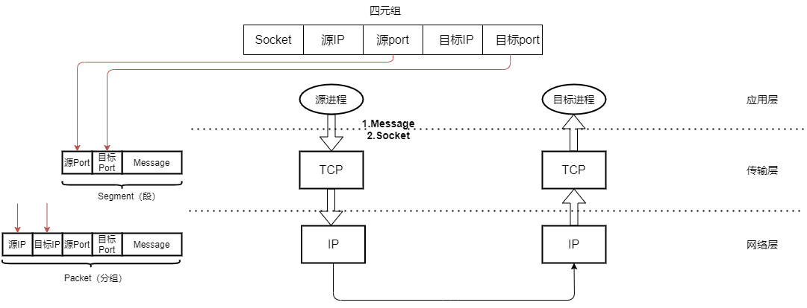

> 补充：
>
> 服务器能够在一个TCP端口上同时支持多个TCP套接字。
>
> Web服务器对每个连接客户端有不同的套接字。

### UDP的多路复用/解复用

UDP的Socket和二元组相捆绑。

> 二元组包含：本地IP，本地进程端口。

发送方复用：

1.  应用层将Message、Socket与目标IP和目标进程端口向传输层传递（注意UDP Socket同TCP不同，不包含目标IP与目标进程端口）。
2.  传输层将源进程端口以及目标进程端口封装在头部，形成报文段，向网络层传递。
3.  网络层继续将源IP和目标IP封装起来形成数据报（datagram），并借助下层提供的服务将其传输道目标主机。

接收方解复用：

1.  网络层接收到传来的数据报，把头部信息去掉，将报文段以及目标IP和目标进程端口向传输层传递。
2.  传输层接收下层传来的信息，继续解封装，将数据向应用层传递，交给对应的进程。

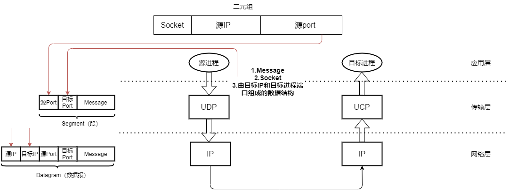

> 补充：
>
> 传输层TCP/UDP报文段格式：
>
> *（⚠️ 原图已失效）*
>
> 对于UDP的多路解复用：如果两个不同源IP地址/源端口号的数据报，但是有相同的目标IP地址和端口号，则被定位到相同的UDP套接字，发给同一个应用进程。（这点同TCP不一样）
>
> 因此可以这样记忆：不管是TCP四元组还是UDP二元组，必须元组内信息全部一致，才会对应同一个Socket，发送给同一个进程。

## 无连接传输：UDP

UDP在IP提供的服务之上并没有增加过多的额外的服务，仅增加了多路复用/解复用。因此UDP也是“尽力而为”的服务。并可能发生如下问题：

- 数据丢失
- 送到应用进程的报文段乱序

UDP的另一个特征就是**无连接**：

- UDP发送端和接收端之间没有握手
- 每个UDP报文段都被独立地处理

UDP被用于：

- 流媒体（丢失不敏感，速率敏感、应用可控制传输速率）
- 事务性的应用（仅一次通信）
- DNS
- SNMP（简单的网络管理协议）

如果想使用UDP协议，同时又希望具有可靠性，那么这种可靠性服务只能由进程本身（应用层）提供。可以应用特定的差错恢复。

UDP报文段格式：

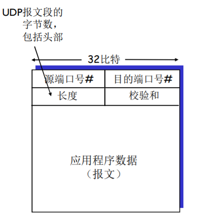

头部为8Byte，包括：源端口号、目标端口号、长度（包括头部在内的整个报文段的长度）、校验和(checksum)。（均为2Byte）

> UDP存在的必要性：
>
> - 不建立连接 （会增加延时）。
> - 简单：在发送端和接收端没有连接状态（服务器无需维护客户端状态，客户端也无需维护与源端某一进程的通讯状态）。
> - 报文段的头部很小(开销小)。因此一个报文段的载荷（应用程序数据）就比较大。
> - 无拥塞控制和流量控制：UDP可以尽可能快的发送报文段。

### UDP校验和

校验和的目的：检测在被传输报文段中的差错 (如比特反转)。

发送方：

- 将报文段的内容视为16bit的整数
- 校验和：报文段的加法和（1的补运算）
- 发送方将校验和放在UDP的校验和字段

接受方：

- 计算接收到的报文段的校验和
- 检查计算出的校验和与校验和字段的内容是否相等：
  - 不相等——检测到差错（一定错）
  - 相等——一种情况是没有差错；另一种情况也许会出现**残存错误**。

校验和的具体实现：

将报文段的数据（包含一些头部信息），拆分成16bit一组（不足的补零）。将这些16bit的整数相加。

- 进位回滚：

  16bit整数相加可能会有进位，这是就把进位加到计算结果的最后一位。最后求得的校验和是处理进位的结果的反码。

  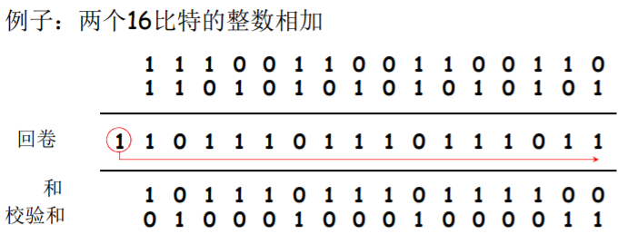

  目标端重复发送方一样的操作，但是没有最后的取反码的步骤，将其计算出的结果同发送方的检验和相加，如果没有差错，应该是16位“1”（=1111111111111111），否则没有通过校验。

## 可靠数据传输的原理

可靠数据传输（Reliable data transfer，rdt）在应用层、传输层和数据链路层都很重要。（是网络Top 10问题之一）

### 可靠数据传输的原理

`rdt`需要提供的是可靠的服务（在上层），可是它却要依赖与下层不可靠的`udt`服务（可能会丢失、可能会乱序），所以下层信道的不可靠特点决定了可靠数据传输协议（ rdt ）的复杂性。

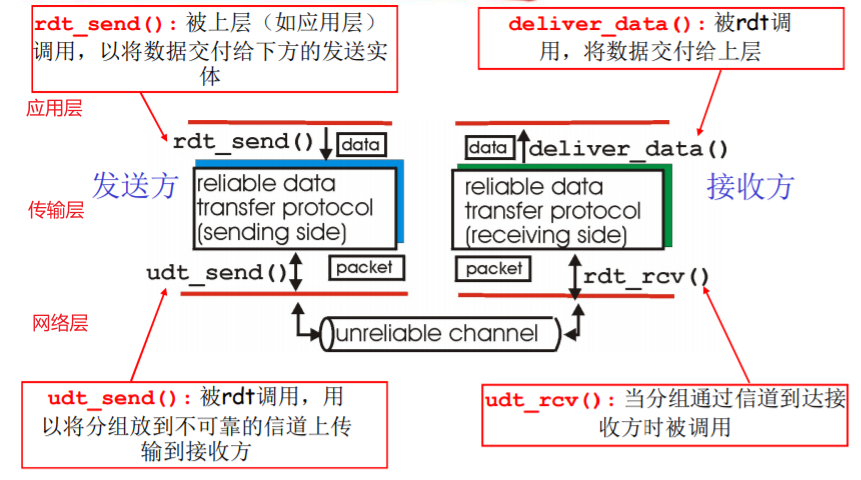

> - `rdt_send()`和`deliver_data()`是传输层与应用层的层间接口；
> - `udt_send()`和`rdt_rcv()`是传输层与网络层的层间接口。

下面我们来具体讲述传输层是如何实现可靠传输机制的。

> 在展开讲述之前先提前做个铺垫，如何渐进式地描述这一问题：
>
> - 先假设底层信道传输是可靠的（实际上并非如此），那么上层就不需要任何机制就可以保证可靠传输，于是我们会将下层的可靠性一点一点剥落，同样的上层就会相应地增加可靠传输机制。这便是接下来的讲解思路。
>
> - 虽然信息传输是双向流动的，但是我们可以只考虑单向数据传输。（双向的数据传输问题实际上是2个单向数据传输问题的综合）
>
> - 使用有限状态机 (FSM) 来描述发送方和接收方：
>
>   - FSM（有限状态机）：实际上就是描述协议工作机制的形式化的描述方案。
>
>     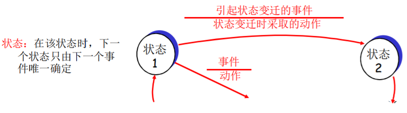
>
>     节点代表状态；边代表节点状态之间的迁移；边上的标记（label）：分母代表事件、分子代表采取的动作。

#### rdt1.0：在可靠信道上的可靠数据传输

首先假设信道传输：

- 没有比特出错
- 没有分组丢失

发送方：

1.  应用层将数据传送下来
2.  传输层只做两件事情：
    - 添加头部信息，封装为包（packet）
    - 借助于下层的服务将数据发送出去

接收方：

1.  等待下层传来的数据
2.  传输层依旧只做两件事：
    - 解封装
    - 将数据向上层传递

rdt1.0的FSM描述：

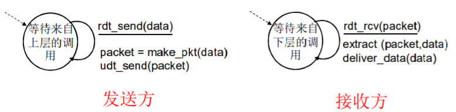

#### rdt2.0：具有比特差错的信道

假设下层信道传输可能出现比特翻转（比特差错）

解决方案就是采用上文提到过的**校验和**。

发送方在向接收方发送数据时，会采用校验和来判断数据传输有无差错，并且接收方会有一个反馈机制：

- 确认(ACK)：如果通过了校验和，接收方会发送ACK信息，显式地告诉发送方分组已被正确接收。
- 否定确认( NAK)：如果未通过校验和，接收方会发送NAK信息，显式地告诉发送方分组发生了差错。接着发送方会重新发送分组。

> 发送方会有一个缓存，以便发送分组失败后可以重新将分组发送给接收方。

发送方：

1.  接收来自上层的数据
2.  计算校验和并封装为packet；借助下层的服务将数据发送出去
3.  转变为等待ACK/NAK的状态：
    - 如果接收到NAK信息，重新发送packet，并继续维持等待状态
    - 如果接收到ACK信息，转为接收上层信息并发送数据的状态

接收方：

1.  接收下层传来的packet，并计算校验和：
    - 如果通过（未腐败的(notcorrupt)）校验和，解封装，将数据向上层传递，向并发送方发送ACK确认信息
    - 如果为通过（腐败的(corrupt)）校验和，则向发送方发送NAK信息

rdt2.0的FSM描述：

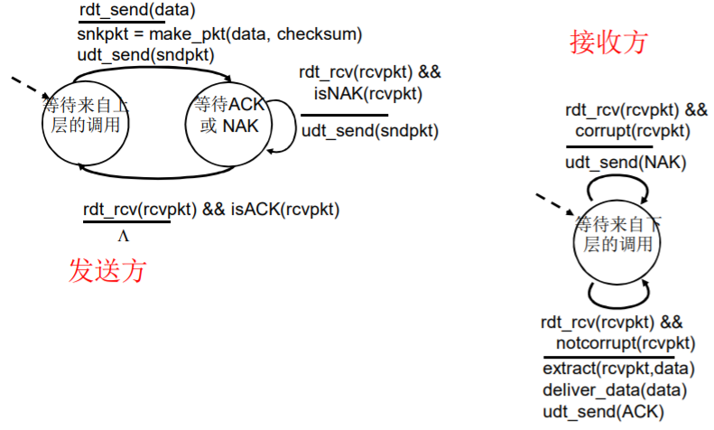

#### rdt2.1：停止等待协议

> 停等协议：发送方发送一个分组，然后等待接收方的应答。（一次只发送一个等待确认信息）

我们仔细思考就会察觉，rdt2.0有一个致命的错误：如果接收方的反馈信息（ACK/NAK）发生了差错该如何处理？

> 理想很丰满，现实很骨感。接受方说：“正确收到”，那么发送方继续传送下一个包；接收方说：“发生错误”，则发送方重新传包。就怕接收方来了一句：“歪比巴卜”，这就容易给发送方整懵了。
>
> 所以说rdt2.0的协议机制并不完备。

为此引入新的机制：序号（sequence number）

> 停等协议由于一次只发送一个等待确认的信息，因此只需要一位就可以识别（0、1）排序。

发送方：

1.  会在每一个分组中添加序号（P<sub>0</sub>、P<sub>1</sub>）
2.  如果发送方接收到的反馈信息出错（无法识别），无论是ACK还是NAK，发送方都会重新发送旧的分组。

接收方：

1.  如果是NAK出错，那么正好接收来重新传送的分组，如果通过校验，发送ACK确认信息；否则发送NAK。
2.  如果是ACK出错，那么这时接收方就会收到重复的分组，由于分组增添了序号，那么接收方会将该分组丢掉，不再向上层传递。接着会向发送方发送ACK确认信息，以请求发送后续分组。

rdt2.1的FSM描述：

- 发送方处理出错的ACK/NAK

  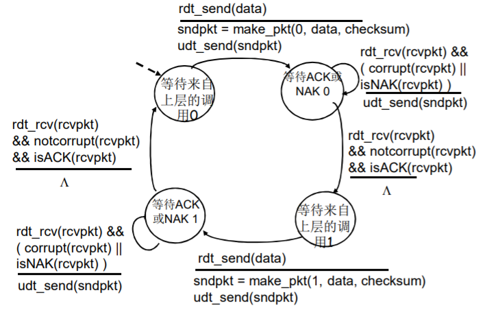

- 接收方处理出错的ACK/NAK

  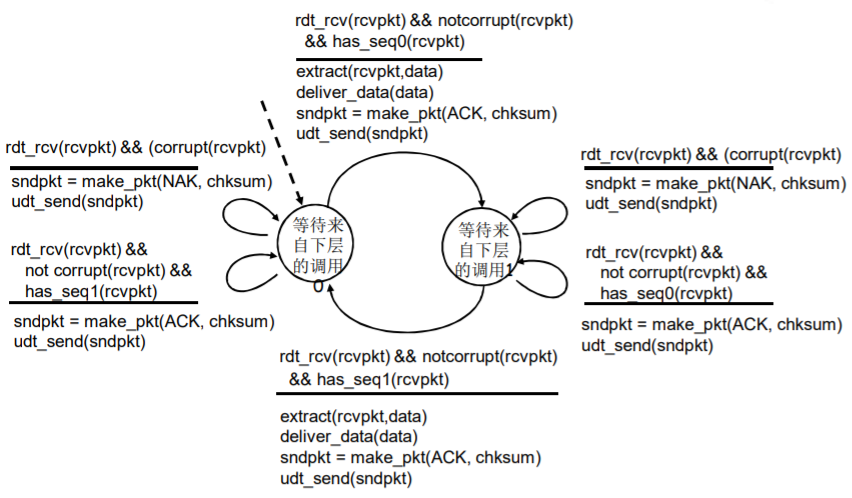

> 注意：
>
> rdt2.1中，接收方并不知道发送方是否正确收到了其ACK/NAK信息（没有安排确认的确认）。
>
> 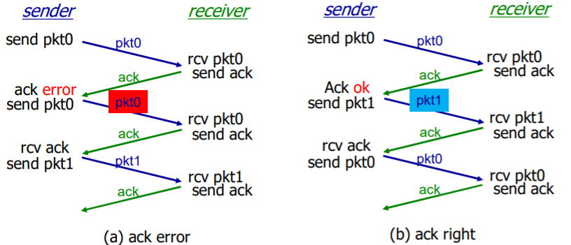
>
> 那考虑是否在发送方安排确认的确认机制呢？那么如此我们如何判断确认的确认是否正确。所以事实上这样的“套娃”设计意义并不大，并不能完美的解决问题。

#### rdt2.2：无NAK的协议

- 功能同rdt2.1，但只使用ACK(ack需要编号）

  

- 接收方对最后正确接收的分组发ACK，以替代NAK。

  > 接收方必须显式地包含被正确接收分组的序号。
  >
  > 用情商课堂的方式理解很简单：当发送方发送了编号为1的分组（这时它应该等待ACK1）
  >
  > - 低情商：接收方发来了NAK信息→1号分组出错了
  > - 高情商：接收方发来了ACK0→1号分组出错了
  >
  > 因此对ACK的编号可以替代NAK。

- 这就为之后的流水线协议做好了基础（一次发送多个数据单位）。

  - 使用对前一个数据单位的ACK，代替本数据单位的NAK
  - 这样可以使确认信息减少一半，协议处理简单

> 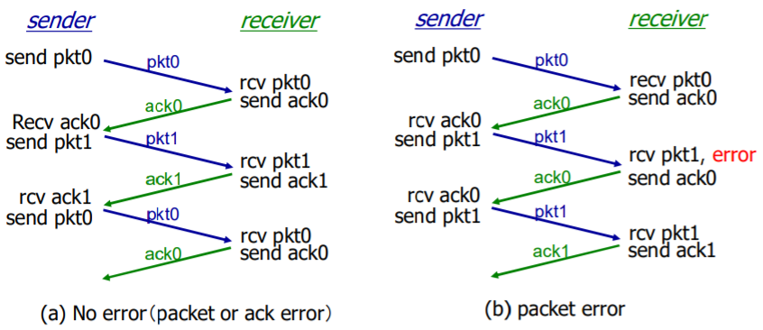
>
> 当然如果ACK信息发送错误依然有可能导致接收方接收分组重复，解决方案仍和rdt2.1是一样的：
>
> *（⚠️ 原图已失效）*

rdt2.2的FSM描述（部分）：

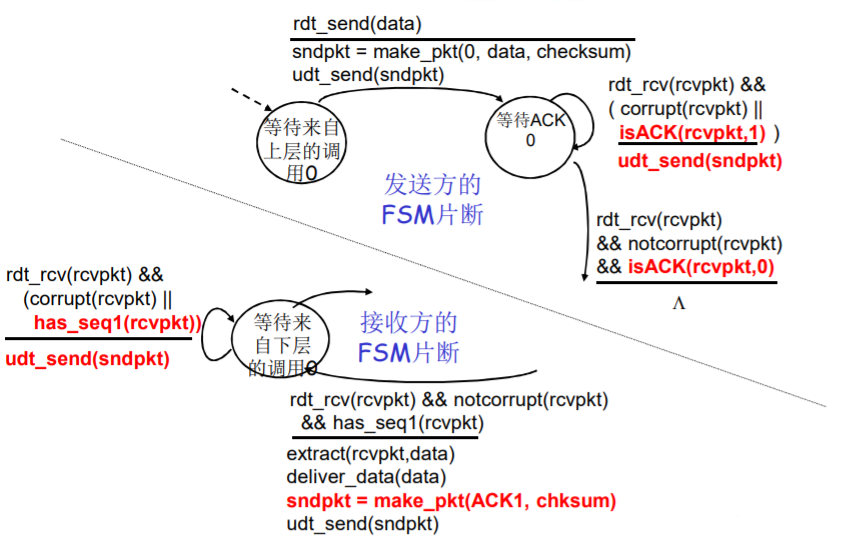

#### rdt3.0：具有比特差错和分组丢失的信道

假设下层的传输信道除了比特差错之外还可能丢失分组。

> 如果出现了分组丢失的情况：一方面接收方在等待分组，另一方面发送方在等待确认信息。所以会出现**死锁**的情况。（rdt2.2还无法处理这种情况）

所以会引入新的机制：超时重传

- 需要`countdown timer`（倒计时定时器）

发送方会等待ACK信息一段合理的时间，如果在这段时间内没有收到ACK信息，就会重新传输分组（一旦超时，发送方就会认为分组已经丢失）。

> 合理的时间：
>
> - 传输层timeout时间是适应式的
> - 链路层的timeout时间确定的

接下来会有新的问题：如果只是发送方的ACK信息丢失，或者只是分组（或ACK信息）被延时，那么就会导致接收方收到的分组重复。这个问题在rdt2.1中就已经解决。

rdt3.0的FSM描述（发送方）：

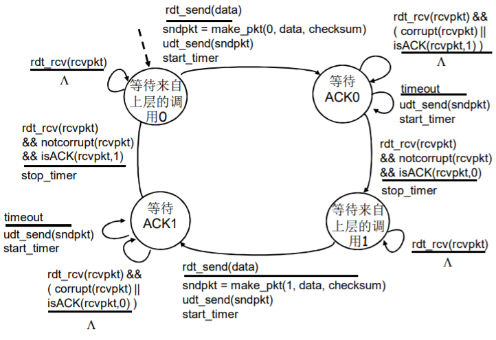

> rdt3.0的运行：
>
> 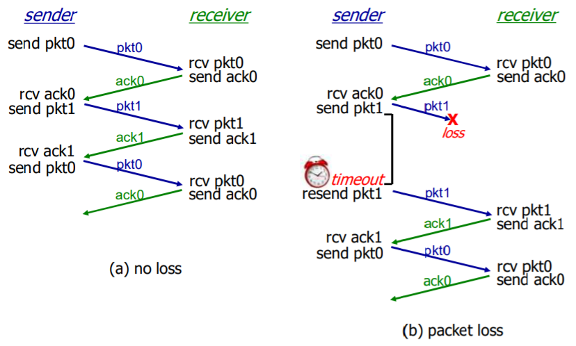
>
> 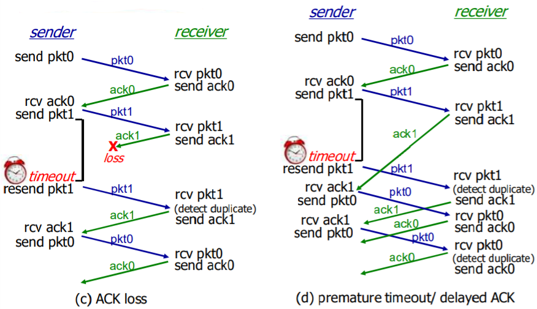
>
> - 过早超时（延迟的ACK）也能够正常工作；但是效率较低，一半的分组和确认是重复的（超时之后的分组和ACK都是发送两次的）；
> - 因此设置一个合理的超时时间也是比较重要的。

rdt3.0的性能：

rdt3.0可以工作（功能比较完备），但链路容量比较大的情况下，性能很差。

> 链路容量比较大，一次发一个PDU 的不能够充分利用链路的传输能力。
>
> 举个例子：A地到B地相距甚远，驱车从A地到B地需要很长的时间，但是停等协议只允许高速公路上一次跑一辆汽车（实际上高速公路可以容纳很多车辆）。所以链路越大，停等协议对链路的利用率就越低。
>
> 即：网络协议限制了物理资源的利用。
>
> 具体可以举例计算（如下图）：
>
> 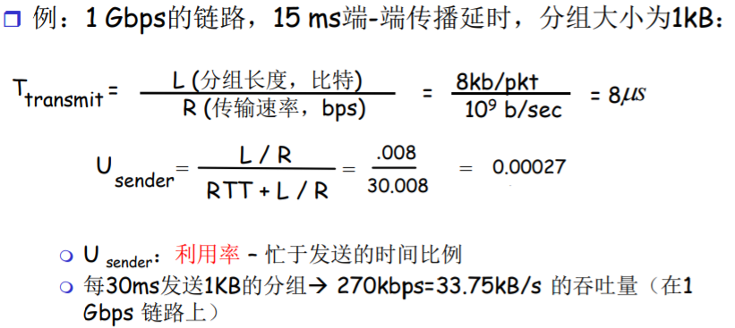
>
> 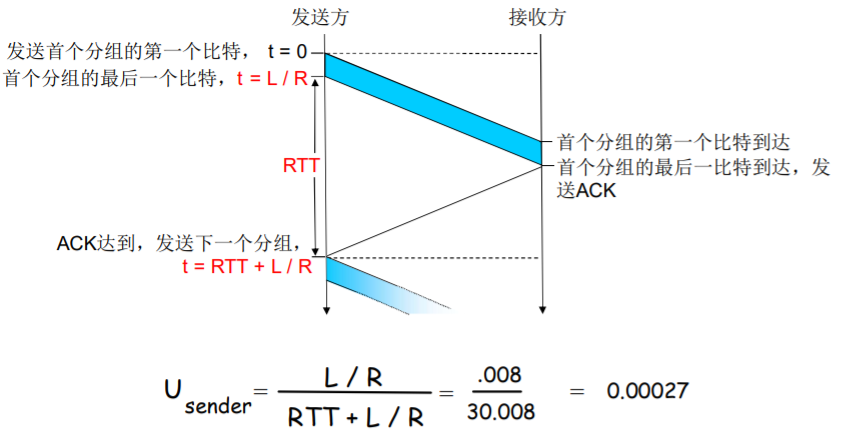

### 流水线协议（Pipelined protocols）

为了提高链路利用率，接下来就引入了流水线的方式。

> 上文提到造成链路利用率低下的原因是停等协议每次只允许发送一个分组，那么我们就可以考虑一次发送多个分组以提高利用率，但是这个值并不会增加到100%，随着能够同时发送分组的数量的增加，到了后期瓶颈就由停等协议转移到了链路带宽。

流水线协议：允许发送方在未得到对方确认的情况下一次发送多个分组。

- 必须增加序号的范围：用多个bit表示分组的序号
- 在发送方/接收方要有缓冲区：
  - 发送方缓存：未得到确认，可能需要重传；
  - 接收方缓存：上层用户取用数据的速率 ≠ 接收到的数据速率；接收到的数据可能乱序，排序交付（可靠）

有两种通用的流水线协议：

- **Go-back-N：回退N（GBN）**
- **Selective Repeat：选择重传（SR）**

在介绍以上两种协议时我们先做一些铺垫，先来介绍一个通用协议：**滑动窗口(slide window)协议**

该协议根据发送方以及接收方窗口大小的不同可以分为：

- 停止等待协议：send_window = 1, receive_window = 1

- 回退N协议：send_window ＞ 1，receive_window = 1

- 选择重传协议：send_window ＞ 1，receive_window ＞ 1

  > 发送方窗口（send_window）大于1的协议我们就称之为流水线协议。

发送缓冲区：

- 形式：内存中的一个区域，落入缓冲区的分组可以发送
- 功能：用于存放已发送，但是没有得到确认的分组
- 必要性：需要重发时可用
- 发送缓冲区的大小：一次最多可以发送多少个未经确认的分组
  - 停止等待协议 = 1
  - 流水线协议 \> 1，合理的值，不能很大，链路利用率不能够超100%
- 发送缓冲区中的分组：
  - 未发送的：落入发送缓冲区的分组，可以连续发送出去；
  - 已经发送出去的、等待对方确认的分组：发送缓冲区的分组只有得到确认才能删除

发送窗口：

- 指的是发送缓冲区的一个范围（是发送缓冲区的一个子集）。

- 存放已发送但是未确认的分组。（实际上发送传窗口是那些已发送但是未经确认分组的序号构成的空间）

- 发送窗口的最大值 ≤ 发送缓冲区的值

- 发送窗口的滑动过程：

  1.  一开始：没有发送任何一个分组

      - 后沿 = 前沿

      - 之间为发送窗口的尺寸 = 0

        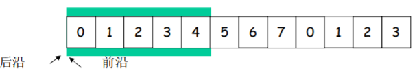

  2.  发送窗口的移动：前沿移动

      - 每发送一个分组，前沿前移一个单位

      - 发送窗口前沿移动的极限：不能够超过发送缓冲区

        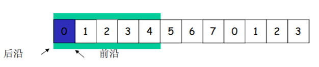

        > 注意：绿色部分为发送缓冲区

  3.  发送窗口的移动：后沿移动

      - 后沿移动的条件：收到老分组（后沿）的确认

      - 结果：发送缓冲区罩住新的分组，来了分组可以发送

      - 后沿移动的极限：不能够超过前沿

        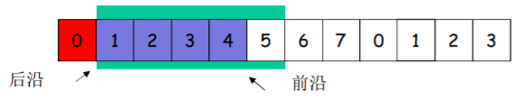

接收窗口：

- 接收窗口 (receiving window) = 接收缓冲区

- 接收窗口用于控制哪些分组可以接收：

  - 只有收到的分组序号落入接收窗口内才允许接收
  - 若序号在接收窗口之外，则丢弃

- 接收窗口尺寸 Wr = 1，则只能顺序接收

  > 举例：
  >
  > - Wr＝1，在0的位置；只有0号分组可以接收
  >
  > - 向前滑动一个，罩在1的位置，如果来了第2号分组，则丢弃
  >
  >   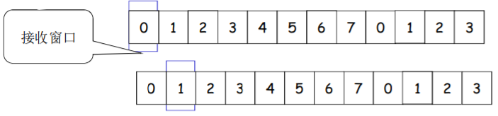

- 接收窗口尺寸 Wr \> 1 ，则可以乱序接收（但提交给上层的分组，要按序提交）

  > - 滑动：
  >
  >   - 低序号的分组到来（按序），接收窗口移动；
  >   - 高序号分组乱序到，缓存但不交付（因为要实现rdt，不允许失序），不滑动
  >
  > - 发送确认：
  >
  >   - 接收窗口尺寸 = 1 ； 发送连续收到的最大的分组确认（累计确认）
  >   - 接收窗口尺寸 \> 1 ； 收到哪个分组，就发送那个分组的确认（非累计确认）
  >
  >   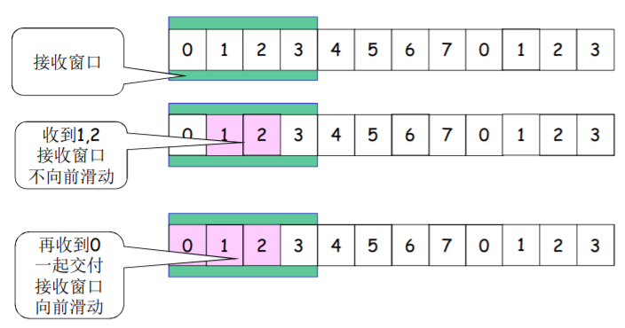
  >
  >   绿色区域表示可接收的分组。

正常情况下两个窗口的互动：

- 发送窗口：

  - 有新的分组落入发送缓冲区范围，发送 → 前沿滑动
  - 来了老的低序号分组的确认 → 后沿向前滑动 → 新的分组可以落入发送缓冲区的范围

- 接收窗口：

  - 收到分组，落入到接收窗口范围内，接收
  - 发送确认给发送方
    - 如果低序号分组确认收到，向前滑动接收窗口
    - 否则不滑动

  

异常情况下GBN的两窗口互动：

- 发送窗口：
  - 新分组落入发送缓冲区范围，发送 → 前沿滑动
  - 超时重发机制让发送端将发送窗口中的所有分组发送出去（低序号开始的连续的已发送但未确认的分组全部重新发送）
  - 来了老分组的重复确认 → 后沿不向前滑动 → 新的分组无法落入发送缓冲区的范围（此时如果发送缓冲区有新的分组可以发送）
- 接收窗口：
  - 收到乱序分组，没有落入到接收窗口范围内，抛弃
  - （重复）发送老分组的确认，累计确认

异常情况下SR的两窗口互动：

- 发送窗口：
  - 新分组落入发送缓冲区范围，发送 → 前沿滑动
  - 超时重发机制让发送端将超时的分组重新发送出去
  - 来了乱序分组的确认 → 后沿不向前滑动 → 新的分组无法落入发送缓冲区的范围（此时如果发送缓冲区有新的分组可以发送）
- 接收窗口：
  - 收到乱序分组，落入到接收窗口范围内，接收
  - 发送该分组的确认，单独确认

由此我们小结一下GBN协议和SR协议的异同：

- 相同点：
  - 发送窗口 \> 1
  - 一次能够可发送多个未经确认的分组
- 不同点：
  - GBN :接收窗口尺寸 = 1
    - 接收端：只能顺序接收
    - 发送端：从表现来看，一旦一个分组没有发成功，如：0、1、2、3、4; 假如1未成功，2、3、4都发送出去 了，要返回1再发送1、2、3、4。
    - 累计确认：cumulative ack
    - 发送端拥有对最老的未确认分组的定时器：
      - 只需设置一个定时器
      - 当定时器到时时，重传所有未确认分组
    - 发送窗口的最大值（序号大小为n）：2<sup>n</sup>-1
  - SR: 接收窗口尺寸 \> 1
    - 接收端：可以乱序接收
    - 发送端：发送0、1、2、3、4，一旦1未成功，2、3、4,已发送，无需重发，只选择性发送1。
    - 非累计确认/独立确认：individual ack
    - 发送方为每个未确认的分组保持一个定时器：
      - 当超时定时器到时，只是重发到时的未确认分组
    - 发送窗口的最大值（序号大小为n）：2<sup>n-1</sup>

列出下表对比一下GBN协议和SR协议：

|  | GBN | SR |
|----|----|----|
| 优点 | 简单，所需资源少（接收方一个缓存单元） | 出错时，重传一个代价小 |
| 缺点 | 一旦出错，回退N步代价大 | 复杂，所需要资源多（接收方多个缓存单元） |

适用范围：

- 出错率低：比较适合GBN，出错非常罕见，没有必要用复杂的SR，为罕见的事件做日常的准备和复杂处理
- 链路容量大（延迟大、带宽大）：比较适合SR而不是GBN，一旦出错代价太大

## 面向连接的传输：TCP

### TCP概述

- 点对点：一个发送方，一个接收方

- 可靠的、按顺序的字节流：没有报文边界

  > TCP不提供报文界限：发送方可能发送两个报文，接收方可能会收到一个大的报文，也可能收到四个小的报文。应用进程之间报文的界限需要应用进程自己去维护。

- 提供管道化（流水线）的协议：

  - TCP拥塞控制和流量控制设置窗口大小

- 发送和接收有缓存

- 全双工数据：

  - 在同一连接中数据流双向流动（一方进程可同时发送数据和接收数据）

- 面向连接：在数据交换之前，通过握手（交换控制报文） 初始化发送方、接收方的状态变量

- 有流量控制：发送方不会淹没接收方

> MSS：最大报文段大小
>
> MTU：最大传输单元

### TCP报文段结构

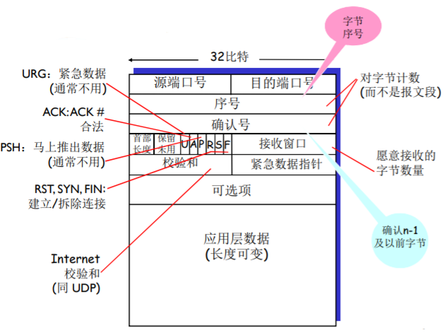

> 说明：
>
> - 源端口号、目标端口号：16bit
>
> - 序号并不是报文段的序号，而是报文段的数据载荷（body）部分的第一个字节在整个字节流中的偏移量。（对字节计数）
>
>   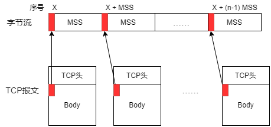
>
>   一般情况下序号并不是从0或1这样固定的序号开始：为了避免长时间滞留在网络中的分组所包括的段对新的连接造成影响。
>
> - 确认号：依然是字节计数
>
>   - 如果接收方传来的ACK为555，则表示接收方已经接收到了554及之前所有的字节，并希望发送方下一个传来555字节的数据。（累计确认）
>   - 接收方处理乱序的报文段：可以缓存，也可以丢弃。
>
> - 首部长度：4个字节为单位，表示该TCP段的首部数据大小。
>
> - RSF（RST、SYN、FIN）标志位：主要是用于两个应用进程进行TCP连接的标志位。
>
>   不同标志位的组合代表不同的握手（后面会提到），以及连接释放请求、确认等。
>
> - 接受窗口：用于流量控制。如果接收方的接收窗口为X，则表示接收方可以接收X字节的数据。
>
> - 校验和：同UDP中的校验和作用一致。

TCP确认号和序号实例：

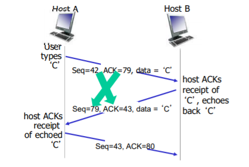

### TCP往返延时（RTT）和超时

分析可能的情况：TCP超时应该设置的比RTT长。如果设置太短，就会发生没必要的重传；如果太长，那么对报文段丢失的反应太慢。但是RTT是在不断变化的，因此我们需要定期测量RTT。

> SampleRTT：测量从报文段发出到收到确认的时间。
>
> 仅用当前的SampleRTT是不合理的，应该对几个最近的测量值求平均。
>
> 具体公式如下：
>
> **EstimatedRTT = (1- α) × EstimatedRTT + α × SampleRTT**
>
> - 指数加权移动平均
> - 过去样本的影响呈指数衰减
> - 推荐值：α = 0.125
>
> 进一步我们需要考虑EstimatedRTT的变化范围：
>
> - EstimtedRTT + 安全边界时间
>   - EstimatedRTT变化大 (方差大) → 较大的安全边界时间
> - SampleRTT会偏离EstimatedRTT多远：
>   - **DevRTT = (1-β) × DevRTT + β × \|SampleRTT-EstimatedRTT\|**
>   - (推荐值：β = 0.25)
>
> 由此我们可以计算超时时间间隔：
>
> **TimeoutInterval = EstimatedRTT + 4 × DevRTT**

### TCP的可靠数据传输（rdt）

- TCP在IP不可靠服务的基础上建立了rdt
  - 管道化的报文段：GBN or SR（TCP是两种的混合）
  - 累积确认（像GBN）
  - 设置单个重传定时器（像GBN）
  - 是否可以接受乱序的，TCP没有规范。可以缓存乱序报文段，也可以丢弃。
- 通过以下事件触发重传：
  - 超时（只重发那个最早的未确认段：SR）
  - 重复的（三次冗余）确认：
    - 例子：收到了ACK50,之后又收到3个ACK50

在分析TCP如何建立rdt，我们依旧采取以上讲可靠数据传输原理的流程，一步一步增加功能。

#### TCP发送方

首先考虑简化的TCP发送方：

- 忽略重复的确认

- 忽略流量控制和拥塞控制

  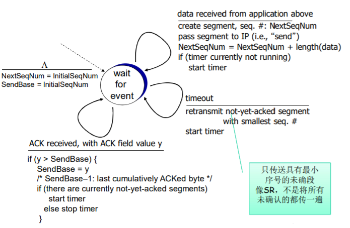

- TCP发送方事件：

  - 从应用层接收数据：
    - 用nextseq创建报文段
    - 序号nextseq为报文段首字节的字节流编号
    - 如果还没有运行，启动定时器
      - 定时器与最早未确认的报文段关联
  - 超时：
    - 重传后沿最老的报文段
    - 重新启动定时器
  - 收到确认：
    - 如果是对尚未确认的报文段确认
      - 更新已被确认的报文序号
      - 如果当前还有未被确认的报文段，重新启动定时器

- TCP重传（左图为ACK丢失，右图为ACK超时）：

  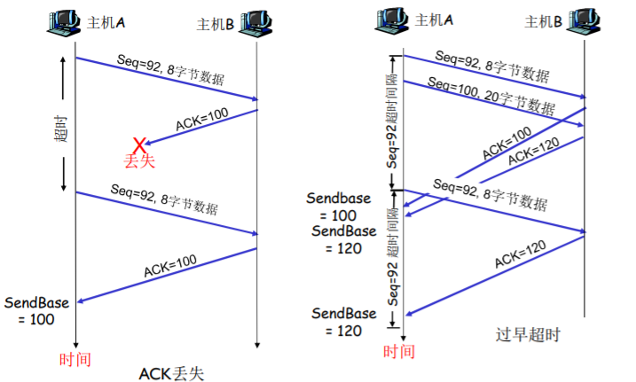

  （下图为累计确认）

  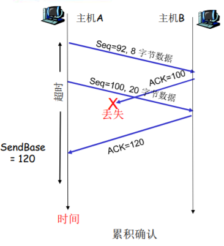

在RFC中对产生TCP ACK的建议（如下表）

| 接收方的事件 | TCP接收方动作 |
|----|----|
| 所期望序号的报文段按序到达。 所有在期望序号之前的数据都已经被确认 | 延迟的ACK。对另一个按序报文段的到达最多等待500ms。如果下一个报文段在这个时间间隔内没有到达，则发送一个ACK。 |
| 有期望序号的报文段到达。另一个按序报文段等待发送ACK（接收到连续的两个段） | 立即发送单个累积ACK，以确认两个按序报文段。 |
| 比期望序号大的报文段乱序到达。检测出数据流中的间隔 | 立即发送重复的ACK，指明下一个期待字节的序号 |
| 能部分或完全填充接收数据间隔的报文段到达。 | 若该报文段起始于间隔（gap）的低端，则立即发送ACK。 |

#### 快速重传

产生快速重传的原因：超时周期往往太长（在重传丢失报文段之前的延时太长）。

快速重传：在定时器过时之前重发报文段

- 由三个冗余ACK触发

  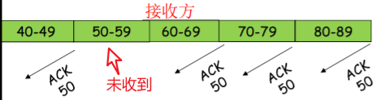

  > 它假设跟在被确认的数据后面的数据丢失了：
  >
  > - 第一个ACK是正常的；
  > - 收到第2个该段的ACK，表示接收方收到一个该段后的乱序段；
  > - 收到第3，4个该段的ack，表示接收方收到该段之后的2个 ，3个乱序段，可能性非常大段丢失了

如果发送方收到同一数据 的3个冗余ACK，重传最小序号的段。

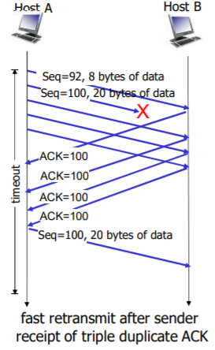

### TCP流量控制

流量控制：接收方控制发送方，不让发送方发送的太多、太快以至于让接收方的缓冲区溢出。

- 接收方在其向发送方的TCP段头部的`rwnd`字段“通告”其`空闲buffer`大小

  - RcvBuffer大小通过socket选项设置 (典型默认大小为4096 字节)
  - 很多操作系统自动调整 RcvBuffer

- 发送方限制未确认(“inflight”)字节的个数 ≤ 接收方发送过来的rwnd值

- 保证接收方不会被淹没

  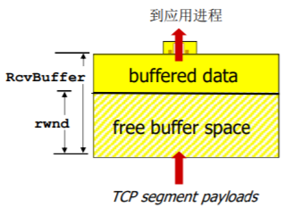

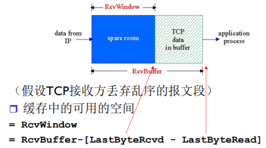

### 连接管理

在正式交换数据之前，发送方和接收方**握手**建立通信关系:

- 同意建立连接（每一方都知道对方愿意建立连接）
- 同意连接参数（准备、初始化资源）

#### 建立连接

首先考虑2次握手总是可行的吗？（仅一方发送连接请求，另一方收到后发送连接确认）

有很多因素会导致2次握手的失败：

- 变化的延迟（连接请求的段没有丢，但可能超时）
- 由于丢失造成的重传 (e.g. req_conn(x))
- 报文乱序
- 相互看不到对方

2次握手的失败场景：

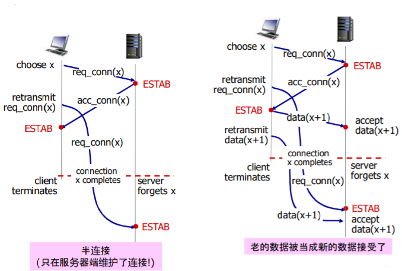

> 说明
>
> 在客户端接收服务器发来的连接确认之前定时器到时，那么客户端就会再发送一条新的连接建立请求，如此服务器会消耗资源去维护许多不必要的“半连接”。
>
> 数据超时会导致服务器将老数据按照新的数据处理。

所以2次握手是不可取的，由此引入了3次握手。

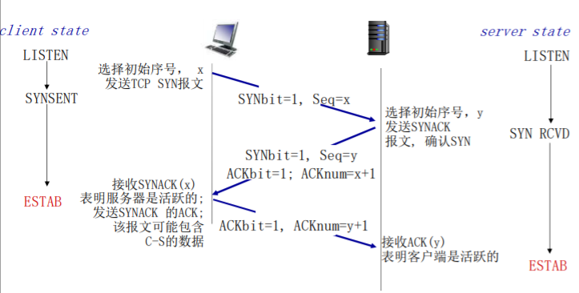

> SYNbit = 1 表示建立连接请求

3次握手可以有效地解决半连接和接收老数据的问题

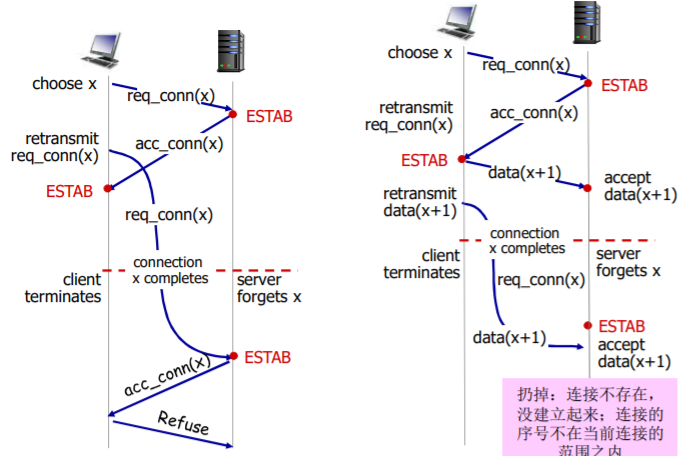

3次握手的FSM表示：

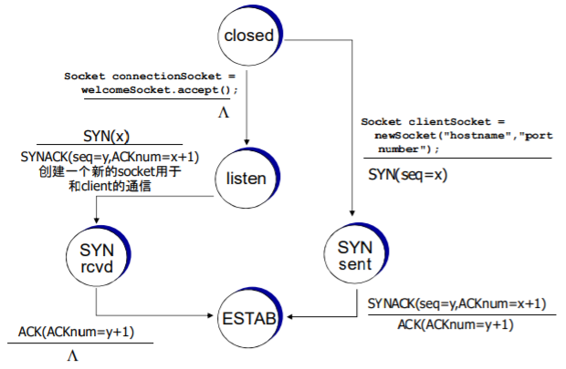

#### 关闭连接

- 客户端，服务器分别关闭它自己这一侧的连接
  - 发送FIN bit = 1的TCP段
- 一旦接收到FIN，用ACK回应
  - 接到FIN段，ACK可以和它自己发出的FIN段一起发送
- 可以处理同时的FIN交换

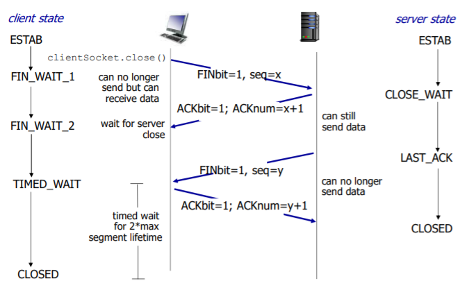

> 这样的连接拆除方式并不完美：
>
> 会存在一方拆除连接，另一方还维持连接的情况。

## 拥塞控制原理

拥塞的非正式定义: “太多的数据需要网络传输，超过了网络的处理能力。”

拥塞控制与流量控制不同：拥塞控制指的是网络的问题，流量控制指的是接收方的问题。

拥塞的表现:

- 分组丢失 (路由器缓冲区溢出)
- 分组经历比较长的延迟(在路由器的队列中排队)

> 拥塞是网络中前10位的问题

#### 产生拥塞的原因/代价

场景一：

- 2个发送端，2个接收端
- 一个路由器，具备无限大的缓冲
- 输出链路带宽：R
- 没有重传

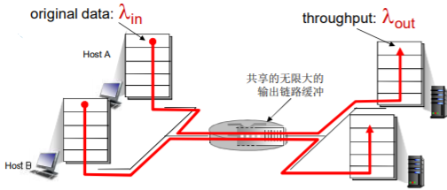

> 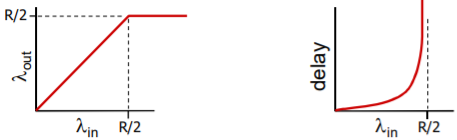
>
> - 如左图：当λ<sub>in</sub>逐渐增加时，λ<sub>out</sub>也在增加，当λ<sub>in</sub>达到R/2时，λ<sub>out</sub>达到最大值，也就是说每个连接的最大吞吐量为R/2。
> - 如右图：从延迟的角度看，当进入的速率λ<sub>in</sub>接近链路链路带宽R时，延迟陡增。

场景二：

- 一个路由器，有限的缓冲
- 分组丢失时，发送端重传
  - 应用层的输入=应用层输出：λ<sub>in</sub> = λ<sub>out</sub>
  - 传输层的输入包括重传：λ<sub>in</sub> ≥ λ<sub>out</sub>

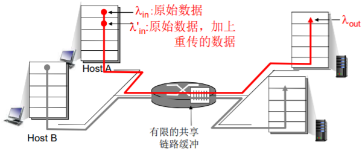

> 理想化场景：发送端有完美的信息，即发送端知道什么时候路由器的缓冲是可用的。
>
> - 只在缓冲可用时发送
>
> - 不会丢失：λ<sup>’</sup><sub>in</sub> = λ<sub>in</sub>
>
> - 这样情况依然同上：
>
>   
>
> - 但是这样的代价很大：每个路由器都需要告知发送方自己的空闲缓冲区有多大，不好实现。
>
> 理想化场景二：掌握丢失信息。即分组可以丢失，在路由器由于缓冲器满而被丢弃。
>
> - 如果知道分组丢失了，发 送方重传分组
>
> - 会丢失：λ<sup>’</sup><sub>in</sub> \> λ<sub>in</sub>
>
>   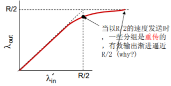
>
>   分析：这样一来，为了让λ<sub>out</sub>逼近于R/2，就需要让λ<sup>’</sup><sub>in</sub>比既定的输出要大（因为存在分组丢失）。
>
>   - 重传的丢失分组
>   - 没有必要重传的重复分组
>
>   代价：
>
>   - 为了达到一个有效输出，网络需要做更多的工作（重传）
>   - 没有必要的重传，链路中包括了多个分组的拷贝（超时）
>     - 是那些没有丢失，经历的时间比较长（拥塞状态）但是超时的分组
>
> 因为网络拥塞而导致接收效率降低，而为了提高接收效率，就会增加发送量，如此一来会加剧网络拥塞，如果不加以控制，那么网络最终会瘫痪。这也是拥塞的特性。

场景三：

- 4个发送端

- 多重路径

- 超时／重传

  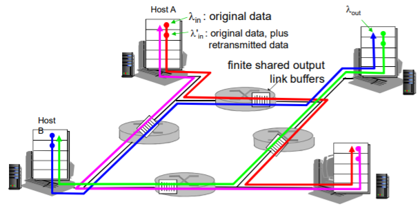

> 从宏观上来看，各方都不停地向网络中发送数据，就会发生网络拥塞的一个极致：整个网络出现死锁的情况
>
> 代价：当分组丢失时，任何“关于这个分组的上游传输能力” 都被浪费了。

#### 拥塞控制方法

- 端到端拥塞控制：
  - 没有来自网络的显式反馈
  - 端系统根据延迟和丢失事件推断是否有拥塞
  - TCP采用此方法
- 网络辅助的拥塞控制：
  - 路由器提供给端系统以反馈信息
    - 单个bit置位，显示有拥塞 (SNA, DECbit,TCP/IP ECN, ATM)
    - 显式提供发送端可以采用的速率

首先来了解网络辅助的拥塞控制，以 ATM ABR 拥塞控制为例

ABR: available bit rate: ATM网络的其中一个模式

- “弹性服务”
- 如果发送端的路径“轻载 ”
  - 发送方尽可能使用可用带宽
- 如果发送方的路径拥塞了：
  - 发送方限制其发送的速度到一个最小保障速率上

RM (资源管理) 信元:

- 由发送端发送,在数据信元中间隔插入
- RM信元中的比特被交换机设置 (“网络辅助”)
  - NI bit: no increase in rate (轻微拥塞)速率不要增加了
  - CI bit: congestion indication 拥塞指示
- 发送端发送的RM 信元被接收端返回, 接收端不做任何改变

> 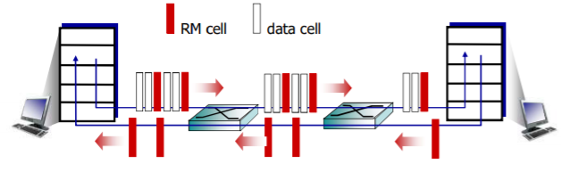
>
> - 在RM信元中的2个字节 ER (explicit rate)字段
>   - 拥塞的交换机可能会降低信元中ER的值
>   - 发送端发送速度因此是最低的可支持速率
> - 数据信元中的EFCI bit: 被拥塞的交换机设置成1
>   - 如果在管理信元RM前面的数据信元EFCI被设置成了1, 接收端在返回的RM信元中设置CI bit

### TCP拥塞控制

TCP采用端到端的拥塞控制。

端到端的拥塞控制机制：

- 路由器不向主机有关拥塞的反馈信息
  - 路由器的负担较轻
  - 符合网络核心简单的TCP/IP架构原则（复杂性放在网络边缘，传输层及以上）
- 端系统根据自身得到的信息，判断是否发生拥塞，从而采取动作

拥塞控制的几个问题：

- 如何检测拥塞：
  - 轻微拥塞
  - 拥塞
- 控制策略：
  - 在拥塞发送时如何动作，降低速率
    - 轻微拥塞，如何降低
    - 拥塞时，如何降低
  - 在拥塞缓解时如何动作，增加速率

#### 拥塞感知

- 某个段超时了（丢失事件 ）：拥塞

  - 超时时间到，某个段的确认没有来
  - 原因1：网络拥塞（某个路由器缓冲区没空间了，被丢弃），概率大
  - 原因2：出错被丢弃了（各级错误，没有通过校验，被丢弃），概率小
  - 一旦超时，就认为拥塞了，有一定误判，但是总体控制方向是对的

- 有关某个段的3次重复ACK：轻微拥塞（如下图）

  - 段的第1个ack，正常，确认绿段，期待红段

  - 段的第2个重复ack，意味着红段的后一段收到了，蓝段乱序到达

  - 段的第2、3、4个ack重复，意味着红段的后第2、3、4个段收到了，橙段乱序到达，同时红段丢失的可能性很大（后面3个段都到了，红段都没到）

  - 网络这时还能够进行一定程度的传输，拥塞但情况要比第一种好

    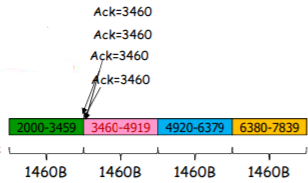

#### 速率控制方法

- 维持一个拥塞窗口的值：`CongWin`

- 发送端限制已发送但是未确认的数据量（的上限）:

  LastByteSent - LastByteAcked ≤ CongWin

- 从而粗略地控制发送方的往网络中注入的速率（如下公式）：

  ``` math
  rate ≈ \frac{ConWin}{RTT} bytes/sec
  ```

- CongWin是动态的，是感知到的网络拥塞程度的函数：

  - 超时或者3个重复ack，CongWin会下降：
    - 超时时：CongWin降为1MSS,进入SS阶段然后再倍增到CongWin/2（每个RTT），从而进入CA阶段
    - 3个重复ack ：CongWin降为CongWin/2，CA阶段
  - 如果没有超时：CongWin会上升
    - SS（慢启动）阶段：加倍增加(每个RTT)
    - CA（拥塞避免）阶段：线性增加(每个RTT)

> 联合控制的方法：
>
> TCP拥塞控制和流量控制的联合动作。
>
> 发送端控制发送但是未确认的量同时也不能够超过接收窗口，满足流量控制要求：
>
> - SendWin = min {CongWin, RecvWin}
> - 同时满足拥塞控制和流量控制要求

#### TCP拥塞控制策略

- 慢启动
- AIMD：线性增、乘性减少
- 超时事件后的保守策略

TCP慢启动：

- 连接刚建立, CongWin = 1 MSS

  > 例如： MSS = 1460bytes & RTT = 200 msec，则初始速率 = 58.4kbps

- 但是可用带宽可能远大于MSS/RTT，所以应该尽快加速，到达希望的速率

- 当连接开始时，指数性增加（每个RTT）发送速率直到发生丢失事件

  - 每一个RTT， CongWin加倍
  - 每收到一个ACK时，CongWin加1
  - 慢启动阶段：只要不超时或3个重复ack，一个RTT，CongWin加倍

- 初始速率很慢，但是加速却是指数性的

  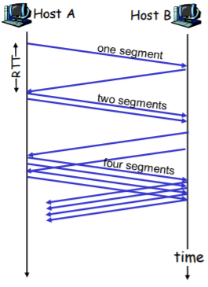

AIMD：

- 乘性减：

  丢失事件后将CongWin降为1，将CongWin/2作为阈值，进入慢启动阶段（倍增直到 CongWin/2）

- 加性增：

  当CongWin \> 阈值时，一个RTT如没有发生丢失事件 ,将CongWin加1MSS: 探测

策略不同：

- 当收到3个重复的ACKs：
  - CongWin 减半
  - 窗口（缓冲区大小）之后线性增长
- 当超时事件发生时：
  - CongWin被设置成 1 MSS，进入SS阶段
  - 之后窗口指数增长
  - 增长到一个阈值（上次发生拥塞的窗口的一半）时 ，再线性增加

> 再次强调一下何时候应该将指数性增长变成线性增长：
>
> 在超时之前，当 CongWin变成上次发生超时的窗口的一半时
>
> 具体实现：
>
> - 变量：Threshold
>
> - 出现丢失，Threshold设置成 CongWin的1/2
>
>   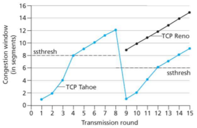

小结

<table>
<colgroup>
<col style="width: 25%" />
<col style="width: 25%" />
<col style="width: 25%" />
<col style="width: 25%" />
</colgroup>
<thead>
<tr>
<th>事件</th>
<th>状态</th>
<th>TCP 发送端行为</th>
<th>解释</th>
</tr>
</thead>
<tbody>
<tr>
<td>以前没有收到ACK的data被ACKed</td>
<td>慢启动 (SS)</td>
<td>CongWin = CongWin + MSS<br />
If (CongWin &gt; Threshold) ,状态变成 “CA”</td>
<td>每一个RTT CongWin 加倍</td>
</tr>
<tr>
<td>以前没有收到ACK的data 被ACKed</td>
<td>拥塞避免 (CA)</td>
<td>CongWin = CongWin+MSS × (MSS/CongWin)</td>
<td>加性增加, 每一个RTT对 CongWin 加一个 1 MSS</td>
</tr>
<tr>
<td>通过收到3个重复的ACK，发现丢失的事件</td>
<td>SS or CA</td>
<td>Threshold = CongWin/2，<br />
CongWin = Threshold+3，<br />
状态变成“CA”，</td>
<td>快速重传, 实现乘性的减，CongWin 没有变成1 MSS.</td>
</tr>
<tr>
<td>超时</td>
<td>SS or CA</td>
<td>Threshold = CongWin/2,<br />
CongWin = 1 MSS,<br />
状态变成“SS”</td>
<td>进入slow start</td>
</tr>
<tr>
<td>重复的 ACK</td>
<td>SS or CA</td>
<td>对被ACKed 的segment， 增加重复ACK的计数</td>
<td>CongWin and Threshold 不变</td>
</tr>
</tbody>
</table>

### TCP吞吐量

使用窗口window尺寸W和RTT来描述TCP的平均吞吐量（忽略慢启动阶段，假设发送端总有数据传输）：

- W：发生丢失事件时的窗口尺寸（单位：字节）

  - 平均窗口尺寸：3/4W

  - 平均吞吐量：RTT时间吞吐3/4W

    ``` math
    avg TCPthtuput = \frac{3}{4}\frac{W}{RTT} bytes/sec
    ```

    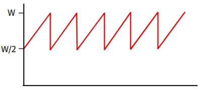

### TCP公平性

公平性目标: 如果 K个TCP会话分享一个链路带宽为R的瓶颈，每一个会话的有效带宽为 R/K

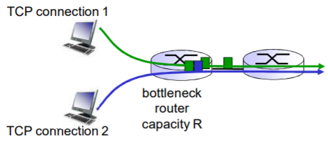

> 分析为什么TCP是公平的（2个竞争的TCP会话为例，假设两个会话的RTT相等）：
>
> - 加性增加，斜率为1, 吞吐量增加
>
> - 乘性减，吞吐量比例减少
>
>   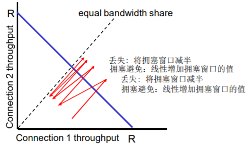
>
>   （具体省略详细解释，但是这个平衡的过程真的很神奇）
>
> 考虑并行TCP连接：
>
> - 如果带宽为R的链路支持了 9个TCP连接
>   - 如果新的应用要求建1个TCP连接,获得带宽R/10
>   - 如果新的应用要求建11个TCP 连接,获得带宽R/2

------------------------------------------------------------------------

# 后记

本篇已完结

（如有补充或错误，欢迎评论区留言）
