# 计算机网络学习笔记-应用层

> 📌 转载自 **花猪のBlog（作者 CNhuazhu）** —— 原文：https://cnhuazhu.top/butterfly/2021/04/05/%E8%AE%A1%E7%AE%97%E6%9C%BA%E7%BD%91%E7%BB%9C/%E8%AE%A1%E7%AE%97%E6%9C%BA%E7%BD%91%E7%BB%9C%E5%AD%A6%E4%B9%A0%E7%AC%94%E8%AE%B0-%E5%BA%94%E7%94%A8%E5%B1%82/
> 学习笔记，版权归原作者所有，仅供学弟学妹学习参考；如有侵权请联系删除。

---

# 前言

*正在学习计算机网络这门课程，顺便做个笔记，记录一下知识点。*

> 参考资料：
>
> 中科大郑烇老师全套《计算机网络（自顶向下方法 第7版，James F.Kurose，Keith W.Ross）》课程：<a href="https://www.bilibili.com/video/BV1JV411t7ow?p=1" target="_blank" rel="noopener external nofollow noreferrer">https://www.bilibili.com/video/BV1JV411t7ow?p=1</a>
>
> 《计算机网络（自顶向下方法 第7版，James F.Kurose，Keith W.Ross）》

------------------------------------------------------------------------

# 第二章：应用层

> 互联网层次中，应用层的协议是最多的。

网络应用的原理：网络应用协议的概念和实现方面

- 运输层的服务模型（transport-layer service models）
- 客户/服务器模式（client-server paradigm）
- P2P模式（peer-to-peer paradigm）

网络应用的实例：互联网流行的应用层协议

- HTTP
- FTP
- SMTP / POP3 / IMAP
- DNS

编程：网络应用程序创建

- socket API / E-mail / web / instant messaging: (QQ), Wechat (即时消息) / remote login (远程登录) / P2P file sharing (文件共享) / multi-user network games (多用户网络游戏) / streaming stored video clips (流式存储视频) / Social networks (社交网络) / voice over IP (IP电话) / real-time video conferencing (实时视频会议) / grid computing/Cloud computing (网格计算/云计算)

创建一个新的网络应用：

- 编程：
  - 在不同的端系统上运行（run on different end systems）
  - 通过网络基础设施提供的服务，应用进程彼此通信（communicate over network）
  - 例如：Web服务器软件与浏览器软件通信（web server software communicates with browser software）
- 无需为网络核心设备编写程序（no need to write software for networkcore devices）：
  - 网络核心不会运行用户应用（network core devices do not run user applications）
  - 网络应用只在端系统上存在 ，快速网络应用开发和部署（applications on end systems allows for rapid app development, propagation）

## 应用层协议原理（Principles of network applications）

可能的应用架构：

- 客户-服务器模式（C/S:client/server）

- 对等模式（P2P:Peer To Peer）

- 混合体：客户-服务器和对等体系结构

  > 浏览器/服务器模式（B/S：Brower/Server）是C/S架构的一种特例

### 客户-服务器（C/S）体系结构

服务器：

- 一直在运行
- 固定的IP地址和周知的端口号（约定）
- 服务器是数据中心（包括软件资源，硬件资源，数据资源）
- 扩展性差（性能在访问数量达到一定程度时会出现断崖式下跌）

客户端：

- 主动与服务器连接（服务器先运行，客户端后访问）
- 与互联网有间歇性的连接
- 可能是动态IP地址
- 不直接与其他客户端通信

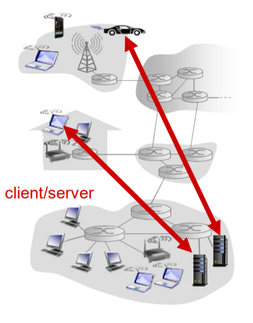

### 对等体（P2P）体系结构

- （几乎）没有一直运行的服务器

- 任意端系统之间可以进行通信

- 每一个节点既是客户端又是服务器

  自扩展性：新peer节点带来新的服务能力，当然也带来新的服务请求

- 参与的主机间歇性连接且可以改变IP地址

  带来的问题就是：难以管理

- 实例：迅雷

### C/S和P2P体系结构的混合体

Skype：

- 文件（目录）查询：集中式

  存在一个中心服务器

- 文件分发（传输）：P2P

  客户端连接可以不通过服务器直接连接

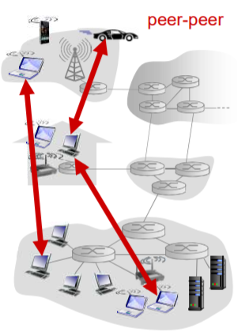

即时通讯（以QQ为例）：

- 两个用户之间的聊天是P2P方式
- 当用户上线时，向中心服务器注册其IP地址
- 用户通过中心服务器找到好友IP地址

### 进程通信（Processes communicating）

进程：在主机上运行的应用程序

进程间的通信：

- 在同一个主机内：使用进程间通信机制通信（ 操作系统定义），无需协议。

- 在不同主机内：通过交换报文（Message）来通信。

  - 使用OS提供的通信服务
  - 借助传输层提供的服务，按照应用协议交换报文

  > 客户端进程：发起通信的进程
  >
  > 服务器进程：等待连接的进程
  >
  > 注意：P2P架构的应用也有客户端进程和服务器进程之分

分布式进程通信需要解决的问题：

- 问题1：进程标识（自身）和寻址（让对方找得到自己）问题。
- 问题2：传输层-应用层是如何提供通信服务。
  - 位置：层间界面的SAP（TCP/IP ：socket）
  - 形式：应用程序接口API（TCP/IP ：socket API）
- 问题3：：如何使用传输层提供的服务，实现应用进程间的报文交换，实现应用。
  - 定义应用层协议：报文格式，解释，时序等
  - 编制程序，使用OS提供的API ，调用网络基础设施提供通信服务传报文，实现应用时序等；

问题1：对进程进行编址：

- 进程为了接收报文，必须有一个标识，即：SAP（当然发送也需要标识）

  - 主机IP：唯一的32位IP地址（仅仅有IP地址不能够唯一标示一个进程；在一台端系统上有很 多应用进程在运行）

  - 所采用的传输层协议：TCP or UDP

  - 端口号（Port Numbers）

    一些知名端口号的例子：HTTP: TCP 80 Mail: TCP 25

    TCP和UDP的端口号是不同的

- 一个进程用IP地址和端口号（port）标识。

- 本质上，两个主机进程之间的通信是由2个端节点（end point）构成

问题2：传输层-应用层提供的服务：

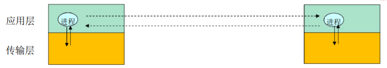

- 层间接口必须要携带的信息（3类）
  - 要传输的报文（对于本层来说就是SDU）
  - 谁传递的信息：本方应用进程的标识，即本方IP+TCP(UDP) 端口
  - 信息要传递给谁：对方应用进程的标识，即对方IP+TCP(UDP) 端口
- 传输层实体（tcp或者udp实体）根据这些信息进行TCP报文段（UDP报文段）的封装
  - 源端口号，目标端口号，数据等
  - 将IP地址往下交IP实体，用于封装IP数据报：源IP,目标IP

### Socket（套接字）

进程通过套接字发送或接受报文。

可以把套接字比作一道门。发送进程将报文推出门户，发送进程依赖于传输层设施在另外一侧的门将报文交付给接收进程，同样的，接收进程从另外一端的门户收到报文（依赖于传输层设施）

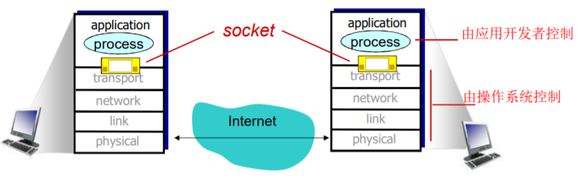

> 传输层提供的服务-层间信息的代表：
>
> 层间建立连接后需要传输大量的信息，如果Socket API 每次传输报文，都携带如此多 的信息，太繁琐易错，不便于管理。为了解决这个问题，出现了Socket（套接字，实际上就是用一个整数表示两个应用实体之间的通信关系 ，是一个本地标识）。

> TCP之上的套接字：
>
> 对于使用面向连接服务（TCP）的应用而言，套接字是4元组的一个具有本地意义的标识。
>
> - 4元组：源IP，源port，目标IP，目标port
> - 唯一的指定了一个会话（2个进程之间的会话关系）
> - 应用使用这个标示，与远程的应用进程通信
> - 不必在每一个报文的发送都要指定这4元组
> - 简单，便于管理
>
> UDP之上的套接字：
>
> （由于UDP服务下的进程通信前不需要连接，前后报文都是独立传输的，且可能传输给不同的分布式进程。所以只能用一个整数表示本应用实体的标识。）
>
> 对于使用无连接服务（UDP）的应用而言，套 接字是2元组的一个具有本地意义的标识。
>
> - 2元组：源IP，源port
> - UDP套接字指定了应用所在的一个端节点（end point）
> - 在发送数据报时，采用创建好的本地套接字（标识 ID），就不必在发送每个报文中指明自己所采用的 ip和port
> - 但是在发送报文时，必须要指定对方的ip和udp port(另外一个端节点)

问题3：如何使用传输层提供的服务实现应用

- 定义应用层协议：报文格式，解释，时序等
- 编制程序，通过API调用网络基础设施提供通信 服务传报文，解析报文，实现应用时序等

应用层协议：

该协议定义了：运行在不同端系统上的应用进程如何相互交换报文。（仅仅规范了两个进程在通信中需要遵守的规则）

- 交换的报文类型：请求和应答报文

- 各种报文类型的语法：报文中的各个字段及其描述

- 字段的语义：即字段取值的含义

- 进程何时、如何发送报文及对报文进行响应的规则

  > 应用协议仅仅是应用的一个组成部分。一个应用还包括用户界面，本地I/O操作，业务逻辑等

- 公开协议：

  - 由RFC文档定义

  - 允许互操作

  - 举例：HTTP、SMTP

- 私有协议（不公开）：例如：SKype、QQ、wechat

应用需要传输层提供的服务：

- 数据丢失率（Data loss）：

  有些应用则要求100%的可靠数据传输（如文件），有些应用（如音频）能容忍 一定比例以下的数据丢失

  > 实际上在看视频时是会有丢帧的情况，我们无法察觉的原因是因为采用了一些掩盖技术：
  >
  > 比如第二帧的画面丢失，可以选择重放第一帧或第三帧，也可以计算并播放第一、三帧求和后取均值。

- 延迟（Timing）：

  一些应用出于有效性考虑，对数据传输有严格的时间限制（如：Internet 电话、交互式游戏）

- 吞吐（Throughput）

  一些应用（如多媒体应用）必须需要最小限度的吞吐，从而使得应用能够有效运转。一些应用能充分利用可供使用的吞吐(“弹性应用”)

- 安全性（Security）

  机密性、数据完整性、可认证性（鉴别）…

下表是一些常见应用对传输服务的要求：

| 应用       | 数据丢失率 | 吞吐                                  | 时间敏感性 |
|------------|------------|---------------------------------------|------------|
| 文件传输   | 不能丢失   | 弹性                                  | 不         |
| E-mail     | 不能丢失   | 弹性                                  | 不         |
| Web 文档   | 不能丢失   | 弹性                                  | 不         |
| 实时音视频 | 容忍丢失   | 音频： 5kbps-1Mbps 视频：10kbps-5Mbps | 是，100ms  |
| 存储音视频 | 容忍丢失   | 音频： 5kbps-1Mbps 视频：10kbps-5Mbps | 是，几秒   |
| 交互式游戏 | 容忍丢失   | 几kbps ~10kbps                        | 是，100ms  |
| 即时讯息   | 不能丢失   | 弹性                                  | 是和不是   |

Internet传输层提供的服务：

- TCP服务：

  - 可靠的传输服务（不出错、不丢失、不乱序）
  - 流量控制：发送方不会淹没接受方
  - 拥塞控制：当网络出现拥塞时，能抑制发送方
  - 不能提供的服务：延时保证、最小吞吐（带宽）保证和安全性
  - 面向连接：要求在客户端进程和服务器进程之间建立连接

- UDP服务：

  - 不可靠数据传输

  - 不提供的服务：可靠， 流量控制、拥塞控制、 延时、带宽保证、不建立连接

    > UDP存在的必要性：
    >
    > - 能够区分不同的进程，而IP服务不能。（在IP提供的主机到主机/端到端功能的基础上，区分了主机的 应用进程）
    > - 无需建立连接：省去了建立连接时间，适合事务性的应用
    > - 不做可靠性的工作：例如检错重发，适合那些对实时性要求比较高而对正确性要求不高的应用。（实现可靠性是必须要付出时间代价的）
    > - 没有拥塞控制和流量控制：应用能够按照设定的速度发送数据。（在TCP上面的应用，应用发送数据的速度和主机向网络发送的实际速度是不一致的，因为有流量控制和拥塞控制）

下表展示了Internet应用及其应用层协议和传输协议

| 应用         | 应用层协议                | 下层的传输协议 |
|--------------|---------------------------|----------------|
| E-mail       | SMTP \[RFC 2821\]         | TCP            |
| 远程终端访问 | Telnet \[RFC 854\]        | TCP            |
| Web          | HTTP \[RFC 2616\]         | TCP            |
| 文件传输     | FTP \[RFC 959\]           | TCP            |
| 流媒体       | 专用协议 (如RealNetworks) | TCP 或 UDP     |
| Internet电话 | 专用协议 (如Net2Phone)    | TCP 或 UDP     |

安全TCP

- TCP&UDP

  - 都没有加密
  - 明文通过互联网传输 ，甚至密码

- SSL

  - 在TCP上面实现，提供加密的TCP连接（https://）
  - 私密性
  - 数据完整性
  - 端到端的鉴别/认证

- SSL在应用层

  - 应用采用SSL库，SSL库使用TCP通信

- SSL socket API

  应用通过API将明文交给socket，SSL将其加密在互联网上传输

## Web and HTTP

一些术语：

- Web页：由一些对象组成。（对象可以是HTML文件、JPEG图像、Java小程序、声 音剪辑文件等）

- Web页含有一个基本的HTML文件，该基本HTML文件又包含若干对象的引用（链接）

- 通过URL对每个对象进行引用

  包含访问协议，用户名，口令字，端口等；（如下图）

  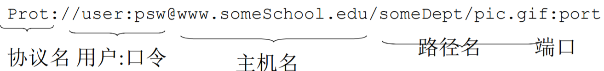

> 一个网页通常是一个baseHTML文件，这个文件是HTML的形式，浏览器可以解析。其中包含各种对象，但是并不包括对象本身，而是这个对象的引用链接。（浏览器需要判断这个链接，并且去再次访问这个对象链接，从而将对象本身访问到并展示在baseHTML页面上）

### HTTP（hypertext transfer protocol）：超文本传输协议

- Web的应用层协议

- 客户/服务器模式（C/S）

  客户: 请求、接收和显示 Web对象的浏览器。

  服务器: 对请求进行响应， 发送对象的Web服务器。

  > - HTTP/1.0 : RFC 1945（1996年）
  > - HTTP/1.1 : RFC 2616（1999年）
  > - HTTP/2 : RFC 7540（2015年）、RFC 8740（2020年）

- 使用TCP：

  - 客户发起一个与服务器的TCP连接 (建立套接字) ，端口号为80。

    > 服务器在最初建立之时会有一个socket（waiting socket）守候在80端口。如果一个浏览器（客户端）向服务器建立连接，此时又会有一个socket（connection socket）产生（代表该服务器与客户端的会话关系）。
    >
    > waiting socket比较特殊，作用就是等待其他浏览器（客户端）并发访问该服务器，而connection socket则表示会话关系，可以有多个。

  - 服务器接受客户的TCP连接

  - 在浏览器(HTTP客户端)与 Web服务器(HTTP服务器server)交换HTTP报文(应用层协议报文)

  - TCP连接关闭

- HTTP是无状态的：服务器并不维护关于客户的任何信息（无状态的好处就是简单，不需要维护一些内容）

  > 无状态：客户端向服务器发送请求，服务器接收请求，并返回响应报文，断开连接，结束。（不知道该客户端之前有没有访问过，未来还会不会接着访问）

- 非持久HTTP（Nonpersistent HTTP）连接

  - 最多只有一个对象在TCP连接上发送

  - 下载多个对象需要多个TCP连接

  - HTTP/1.0使用非持久连接

    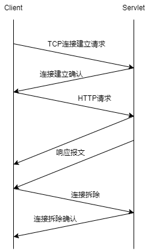

    > 下图为非持久HTTP连接请求index.html以及10个jpeg图片对象的过程
    >
    > （注：以下关于RTT的数量计算均基于此例）
    >
    > 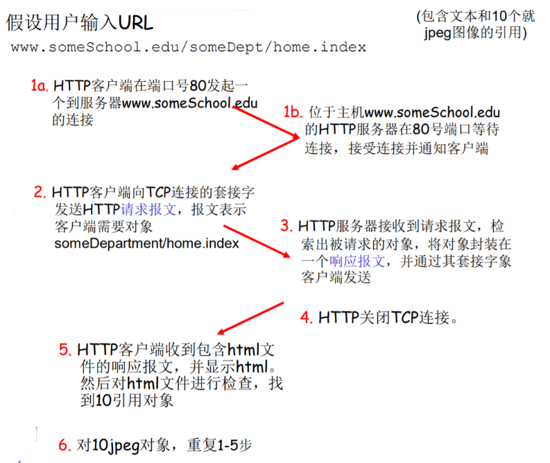

- 持久HTTP（Persistent HTTP）连接

  - 多个对象可以在一个（在客户端和服务器之间的）TCP连接上传输

  - HTTP/1.1 默认使用持久连接

    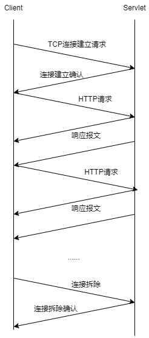

### 响应时间模型：

- **RTT（往返时间，round-trip time）**：一个小的分组从客户端到服务器，再回到客户端的时间（传输时间忽略）

- 响应时间：

  - 一个RTT用来发起TCP连接
  - 一个 RTT用来HTTP请求并等待HTTP响应
  - 文件传输时间

  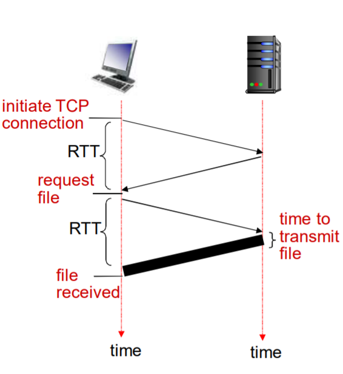

  > 在非持久HTTP连接下请求一个文件（对象）的时间 = 2RTT + 传输时间

非持久HTTP的缺点：

- 请求每个对象需要2个 RTT

- 操作系统必须为每个TCP连接分配资源

- 浏览器通常打开并行TCP连接 ，以获取引用对象

  > 并行连接，即同时开启多个连接请求不同对象。
  >
  > 1index.html + 10jpeg = 2RTT（建立连接） + 2RTT（并行请求对象） = 4RTT

持久HTTP（Persistent HTTP）连接：

- 服务器在发送响应后，仍保持TCP连接

- 在相同客户端和服务器之间的后续请求和响应报文通过相同的连接进行传送

- 客户端在遇到一个引用对象的时候，就可以尽快发送该对象的请求

- 非流水方式的持久HTTP（Persistent without pipelining）：

  - 客户端只能在收到前一个响应后才能发出新的请求

  - 每个引用对象需要一个RTT

    > 1index.html + 10jpeg = 2RTT（建立连接） + 10×1RTT（10jpeg） = 12RTT

- 流水方式的持久HTTP（Persistent with pipelining）：

  - HTTP/1.1的默认模式

  - 客户端遇到一个引用对象就立即产生一个请求

  - 所有引用（小）对象基本上只用一个RTT时间就能满足

    > 1index.html + 10jpeg = 2RTT（建立连接） + 1RTT（10jpeg） = 3RTT

### HTTP报文

有两种类型的HTTP报文：request（请求报文）、response（响应报文）。

- HTTP请求报文：

  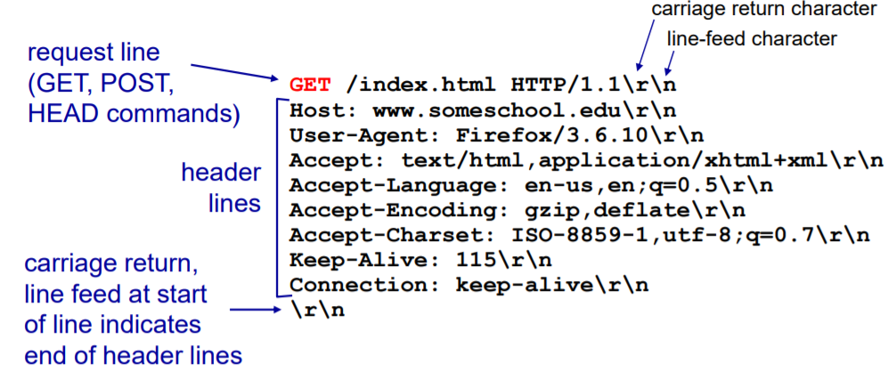

  请求报文的通用格式如下图：

  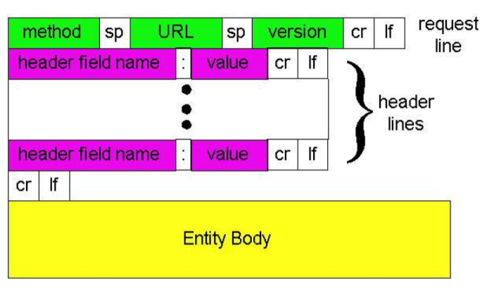

  > 提交表单有两种方式：
  >
  > - Post方式：
  >   - 网页通常包括表单输入
  >   - 输入的数据放在实体(entity body )部分上传到服务器
  > - URL方式：
  >   - 方法：GET方法
  >   - 输入的数据放在URL中上传

  > 方法类型：
  >
  > - HTTP/1.0
  >   - GET
  >   - POST
  >   - HEAD（要求服务器在响应报文中不包含请求对象→维护或者建立索引时引用）
  > - HTTP/1.1
  >   - GET, POST, HEAD
  >   - PUT（将实体中的文件上载到URL字段规定的路径→通常做网页内容的维护）
  >   - DELETE（删除URL字段规定的文件）

- HTTP响应报文：

  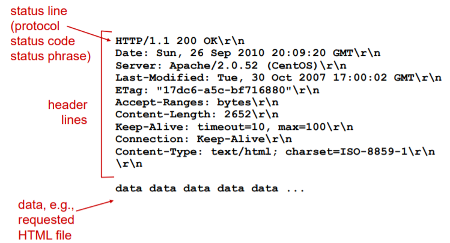

  > HTTP响应状态码：
  >
  > - 200 OK：请求成功，请求对象包含在响应报文的后续部分。
  > - 301 Moved Permanently：请求的对象已经被永久转移了；新的URL在响应报文的Location: 首部行中指定。客户端软件自动用新的URL去获取对象。
  > - 400 Bad Request：一个通用的差错代码，表示该请求不能被服务器解读。
  > - 404 Not Found：请求的文档在该服务上没有找到。
  > - 505 HTTP Version Not Supported

### 用户-服务器状态：cookies

> 大多数主要的门户网站使用 cookies

cookies有4个组成部分：

- 在HTTP响应报文中有一个cookie的首部行

- 在HTTP请求报文含有一个cookie的首部行

- 在用户端系统中保留有一个cookie文件，由用户的浏览器管理

- 在Web站点有一个后端数据库

  > 客户端（浏览器）在第一次向服务器发送请求时不携带cookie，服务器也会判断，这是第一次访问，并会在响应报文中设置一个cookie，客户端收到响应报文后会将服务器发送来的cookie存到本地，下一次再访问该服务器时就会携带上该cookie值，此时服务器就可以凭借cookie值去判断、分析客户端的状态。
  >
  > 通过cookie，可以将HTTP从一个无状态的协议转换为一个有状态的协议。

cookies可以带来以下内容：

- authorization 授权（用户验证）
- shopping carts 购物车
- recommendations 推荐
- user session state (Web e-mail) 用户会话状态

> 如何维护状态：
>
> - 协议端节点：在多个事务上 ，发送端和接收端维持状态（不会保留在中间节点中）
> - http报文携带状态信息

cookies的副作用：

- Cookies允许站点知道许多关于用户的信息（隐私）
- 网站记录用户信息并分析用户行为（可能将它知道的东西卖给第三方）
- 使用重定向和cookie的搜索引擎还能知道用户更多的信息（姓名、电话、邮箱等）

### Web caches（proxy server）缓存（代理服务器）

目标：不访问原始服务器，就可以满足客户的请求。

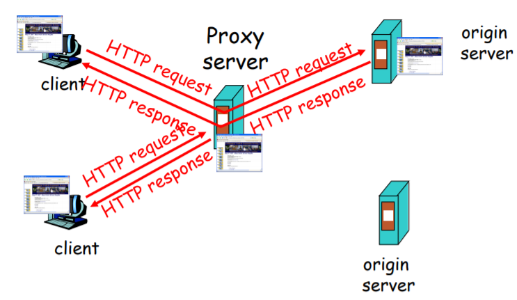

缓存既是客户端又是服务器。

通常缓存是由ISP安装 (大学、公司、居民区ISP)

> 浏览器将所有的HTTP请求发给缓存（代理服务器）
>
> - 在缓存中的对象：缓存直接返回对象
> - 如对象不在缓存，缓存请求原始服务器，然后再将对象返回给客户端
>
> 优势：
>
> - 降低客户端的请求响应时间
> - 可以大大减少一个机构内部网络与Internent接入链路上的流量
> - 互联网大量采用了缓存： 可以使较弱的ICP也能够有效提供内容（快速分发内容）

条件GET方法

> 使用缓存有一个风险：客户端访问到的缓存中的数据，在原始服务器中已修改，结果就是拿到旧数据。
>
> 为此HTTP协议做了一个升级：Conditional GET（条件GET）

目标：如果缓存器中的对象拷贝是最新的，就不要发送对象

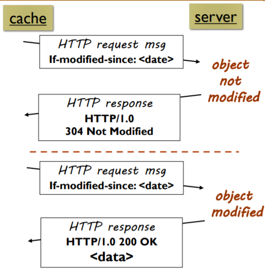

> - 缓存器: 在HTTP请求中指定缓存拷贝的日期
>
>   If-modified-since:\<date’\>
>
> - 服务器:
>
>   - 如果缓存拷贝没有改变，则响应报文不包含对象: HTTP/1.0 304 Not Modified
>   - 如果缓存拷贝改变，则返回数据：HTTP/1.0 200 OK \<data’\>

### Short URL

把普通网址，转换成比较短的网址。（比如：<a href="http://t.cn/RlB2PdD%EF%BC%89" target="_blank" rel="noopener external nofollow noreferrer">http://t.cn/RlB2PdD）</a>

- 微博；这些限制字数的应用里都用到这种技术。
- 百度短网址：<a href="http://dwz.cn/" target="_blank" rel="noopener external nofollow noreferrer">http://dwz.cn/</a>
- google短网址： <a href="https://goo.gl/" target="_blank" rel="noopener external nofollow noreferrer">https://goo.gl/</a>

当我们在浏览器里输入 `http://t.cn/RlB2PdD` 时会经历以下步骤：

- 浏览器解析DNS，获取域名对应的IP；

- 当获取到IP时，会往这个IP地址发送http的get请求以获取到RlB2PdD对应的长链接地址；

- HTTP通过301转到对应的长链接URL；

  > 注意：这里为什么使用301？
  >
  > 301是永久性转移（重定向）。也就是说，这个短地址 一经生成就不会发生变化了。

## FTP（文件传输协议）

- 向远程主机上传输文件或从远程主机接收文件

- 建立在TCP基础之上

- 客户/服务器模式：

  - 客户端：发起传输的一方
  - 服务器：远程主机

- ftp: RFC 959

- ftp服务器：端口号为21

  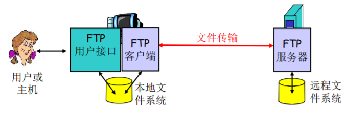

> - FTP客户端与FTP服务器通过`端口21`联系，并使用`TCP`为传输协议
>
> - 客户端通过控制连接获得身份确认（通过TCP）（用户名和口令，全部都为明文）
>
> - 客户端通过控制连接发送命令浏览远程目录（可以上传、下载）
>
> - 收到一个文件传输命令时，服务器打开一个到客户端的TCP数据传输连接（客户端的20号端口，由服务器主动建立），控制信息/指令和数据传输的连接是不一样的。
>
> - 一个文件传输完成后，服务器关闭连接
>
> - 服务器打开第二个TCP数据连接用来传输另一个文件
>
> - 控制连接： 带外（ “out of band” ）传送（只能建立一个）
>
> - 数据连接：带内传送（可以建立多个）
>
> - FTP服务器维护用户的状态信息： 当前路径、用户帐户与控制连接对应（FTP是一个有状态的协议）
>
>   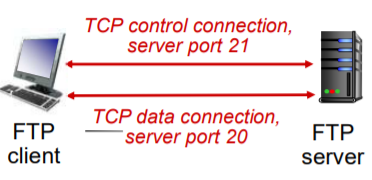

FTP在控制连接上以ASCII文本方式传送：

> 命令样例：
>
> - USER username
> - PASS password
> - LIST：请服务器返回远程主机当前目录的文件列表
> - RETR filename（重复性下载文件）：从远程主机的当前目录检索文件 (gets)
> - STOR filename（上载文件）：向远程主机的当前目录存放文件 (puts)
>
> 返回码样例：（状态码和状态信息 (同HTTP)）
>
> - 331 Username OK, password required
> - 125 data connection already open; transfer starting
> - 425 Can’t open data connection
> - 452 Error writing file

## Electronic mail（Email）

### 电子邮件（Email）的三个主要组成部分

- user agents （用户代理）

  > - 又名 “邮件阅读器”
  > - 撰写、编辑和阅读邮件
  > - 如Outlook、Foxmail
  > - 输出和输入邮件保存在服务器上

- mail servers（邮件服务器）

  > - 邮箱中管理和维护发送给用户的邮件
  > - 输出报文队列保持待发送邮件报文
  > - 邮件服务器之间的SMTP协议：发送email报文
  >   - 客户：发送方邮件服务器
  >   - 服务器：接收端邮件服务器
  >
  > 两个作用：
  >
  > 1.  用户代理配置好邮件服务器的IP地址、端口号，然后用户代理把邮件发送给邮件服务器的队列当中。邮件服务器会把队列中的邮件依次发送到目标邮件服务器中。
  >
  >     **（用户代理发邮件到邮件服务器用的是SMTP协议）**
  >
  > 2.  然后目标邮件服务器接收到邮件后会把邮件放到相应用户的目录（邮箱）当中。收件人运行客户代理，从邮件服务器中相应的自己的邮箱中把信件拉回到本地。
  >
  >     **（邮件服务器发给目标邮件服务器使用的是SMTP协议）**
  >
  >     **（“拉”邮件的协议有三种：POP3、IMAP、HTTP）**
  >
  >     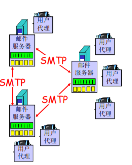

- simple mail transfer protocol: SMTP（简单邮件传输协议）

> - 使用TCP在客户端和服务器之间传送报文，端口号为25
>
> - 直接传输：从发送方服务器到接收方服务器
>
> - 传输的3个阶段：
>
>   - 握手
>   - 传输报文
>   - 关闭
>
> - 命令/响应交互：
>
>   - 命令：ASCII文本
>   - 响应：状态码和状态信息
>
> - 报文必须为7位ASCII码（邮件的内容必须是7位ASCII码的范围，超过是不允许传输的）
>
>   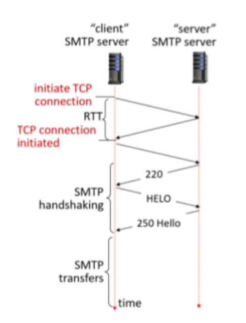

邮件发送举例如下图：

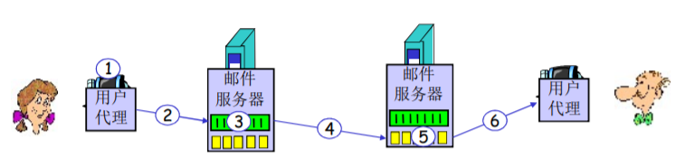

说明：

1.  Alice使用用户代理撰写邮件并发送给bob@someschool.edu

2.  Alice的用户代理将邮件发送到她的邮件服务器；邮件放在报文队列中（SMTP）

3.  SMTP的客户端打开到Bob邮件服务器的TCP连接

4.  SMTP客户端通过TCP连接发送Alice的邮件（SMTP）

5.  Bob的邮件服务器将邮件放到Bob的邮箱

6.  Bob调用他的用户代理阅读邮件（POP3、IMAP、HTTP）

> - 邮件服务器会周期性扫描队列，隔一段时间将收集的邮件全部发出。（如果每时每刻都处于“待命”状态是很耗能的）
> - 可能导致邮件发送失败的原因：
>   - 网络连接有问题
>   - 接收方的邮件服务器地址填写错误
>   - 垃圾邮件过滤
> - 如果邮件发送失败，会将该邮件发送给另外一个失败的队列中，隔一段时间后重新发送，若仍失败，则退回该邮件。

简单的SMTP交互案例：


SMTP vs HTTP

> SMTP
>
> - SMTP：推（push）
> - SMTP使用持久连接
> - SMTP要求报文（首部和主体）为7位ASCII编码
> - SMTP服务器使用 CRLF.CRLF决定报文的尾部
> - SMTP：多个对象包含在一个报文中
>
> HTTP
>
> - HTTP：拉（pull）
> - 二者都是ASCII形式的命令/响应交互、状态码
> - HTTP：每个对象封装在各自的响应报文中

### 邮件报文格式

- SMTP：交换email报文的协议

- RFC 822: 文本报文的标准：

  - 首部行：如
    - To:
    - From:
    - Subject:
    - 与SMTP命令不同 ！
  - 主体：
    - 报文，只能是ASCII码字符

- 问题：如果传输的内容包含中文字符，都不在ASCII范围之内。就要对其进行编码（扩展）：

  - MIME：多媒体邮件扩展（multimedia mail extension）,RFC 2045, 2056

  - 在报文首部用额外的行申明MIME内容类型

  - 内部的编码采用base64编码格式

    > 使用bsae64，将不在ASCII范围之内的内容进行长扩展，使得其在ASCII范围之内。（大小写英文字母，加号，等号）

    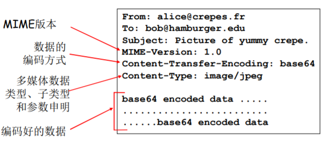

### 邮件访问协议


- SMTP: 传送到接收方的邮件服务器
- 邮件访问协议：从服务器访问邮件（“拉”）
  - POP：邮局访问协议（Post Office Protocol）\[RFC 1939\]
    - 用户身份确认 (代理\<–\>服务器) 并下载
  - IMAP：Internet邮件访问协议（Internet Mail Access Protocol）\[RFC 1730\]
    - 相比POP3更多特性 (更复杂，如：远程目录维护；仅仅只下载邮件正文，附件可选择下载，对手机端友好)
    - 直接在邮件服务器上处理存储的报文
  - HTTP：Hotmail , Yahoo! Mail等
    - 方便

POP3协议

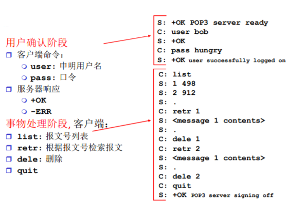

> - 有邮件“download and delete”（下载并删除）模式
> - 有邮件“Download-and-keep”（下载并保留）模式（不同的客户机都可以拷贝邮件）
> - POP3在会话中是无状态的（不支持远程目录维护）

IMAP协议

- IMAP服务器将每个报文与一个文件夹联系起来
- 允许用户用目录来组织报文
- 允许用户读取报文组件
- IMAP在会话过程中保留用户状态：目录名、报文ID与目录名之间映射

## DNS(Domain Name System)

域名解析系统是一个给其他“应用”应用的应用。（提供域名到IP地址的转换）

DNS的必要性：

先明白IP地址的作用：一个是标识，一个是寻址。网络设备都是按照IP地址来工作的，但是这有一个问题，IP地址都是数字（IPv4：4Byte，32bit；IPv6：16Byte，128bit），人很难记忆。人类还是更倾向于使用有意义的字符串来标识Internet上的设备。所以域名解析系统就应运而生：它提供域名到IP地址的转换。

接下来我们要考虑的是DNS如何实现这一功能，即我们需要考虑以下问题：

- 问题一：如何命名设备？

  > - 用有意义的字符串：好记，便于人类用使用
  > - 解决一个平面命名的重名问题：层次化命名

- 问题二：如何完成名字到IP地址的转换？

  > 分布式的数据库维护和响应名字查询（仅由单一设备去维护上亿数量的用户设备的域名解析是不可能的）

- 问题三：如何维护：增加或者删除一个域，需要在域名系统中做哪些工作？

> 历史：
>
> - ARPANET的名字解析解决方案
>   - 主机名：没有层次的一个字符串（一个平面）
>   - 存在着一个（集中）维护站：维护着一张主机名-IP地址的映射文件：`Hosts.txt`
>   - 每台主机定时从维护站取文件
> - ARPANET解决方案的问题，当网络中主机数量很大时
>   - 没有层次的主机名称很难分配
>   - 文件的管理、发布、查找都很麻烦

DNS总体思路和目标

- 主要思路：

  - **分层**的、基于域的命名机制
  - 若干**分布式的数据库**完成名字到IP地址的转换
  - 运行在UDP之上端口号为53的应用服务
  - 核心的Internet功能，但在端系统（边缘）中的应用层实现

- 主要目标：

  - 实现主机名-IP地址的转换(name/IP translate)

  - 其他目的：

    - 主机别名-规范名字的转换：Host aliasing

      > 规范名字便于管理，主机别名便于访问

    - 邮件服务器别名-邮件服务器的正规名字的转换：Mail server aliasing

    - 负载均衡：Load Distribution

### DNS名字空间

DNS域名结构

一个层面命名设备会有很多重名，因而DNS采用层次树状结构的命名方法：

- Internet根被划为几百个顶级域(top lever domains，TLD)

  - 通用的(generic)：

    `.com`; `.edu` ; `.gov` ; `.int` ; `.mil` ; `.net` ; `.org`; `.firm` ; `.hsop` ; `.web` ; `.arts` ; `.rec` ;

  - 国家的(countries)：

    `.cn` ; `.us` ; `.nl` ; `.jp`

- 每个(子)域下面可划分为若干子域(subdomains)

- 树叶是主机

如下图，一共有13个根域名服务器

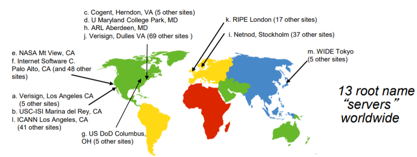

域名（Domain Name）

- 从本域往上，直到树根（根域名）。中间使用“.”间隔不同的级别
  - 域的域名：可以用于表示一个域
  - 主机的域名：一个域上的一个主机

域名的管理

- 一个域管理其下的子域（例如：.cn 被划分为 <a href="http://edu.cn" target="_blank" rel="noopener external nofollow noreferrer">edu.cn</a> ；<a href="http://com.cn" target="_blank" rel="noopener external nofollow noreferrer">com.cn</a> ）
- 创建一个新的域，必须征得它所属域的同意

域与物理网络无关

- 域遵从组织界限，而不是物理网络

  - 一个域的主机可以不在一个网络

  - 一个网络的主机不一定在一个域

    > 例如：我在中国的某间教室运行一台主机，而这台主机域名由欧洲的某个服务器维护。

- 域的划分是逻辑的，而不是物理的

### 域名-IP地址的转换

> 前面提到单一域名服务器存在的问题：
>
> - 可靠性问题：单点故障
> - 扩展性问题：通信容量
> - 维护问题：远距离的集中式数据库

区域(zone)：

- 区域的划分有区域管理者自己决定

- 将DNS名字空间划分为互不相交的区域，每个区域都是树的一部分

- 名字服务器：

  - 每个区域都有一个权威名字服务器：维护着它所管辖区域的权威信息 (authoritative record)
  - 名字服务器允许被放置在区域之外，以保障可靠性

  区域的划分如下图：

  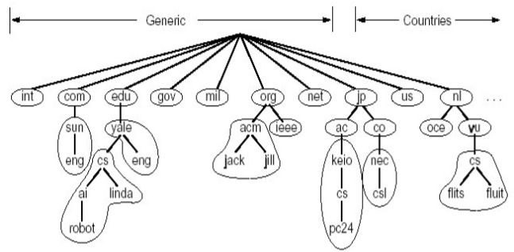

TLD服务器（顶级域服务器）

负责顶级域名（如com, org, net, edu和gov）和所有国家级的顶级域名（如cn, uk, fr, ca, jp）

- Network solutions 公司维护com TLD服务器
- Educause公司维护edu TLD服务器

区域名字服务器维护资源记录

- 资源记录(resource records)

  - 作用：维护域名-IP地址(其它)的映射关系
  - 位置：Name Server的分布式数据库中

- RR格式: (domain_name, ttl, type,class,Value)

  - Domain_name: 域名

  - TTL: time to live : 生存时间(权威，缓冲记录)

    > 决定了资源记录应当从缓存中删除的时间

  - Class 类别 ：对于Internet，值为IN

  - Value 值：可以是数字，域名或ASCII串

  - Type 类别：资源记录的类型

    - Type=A：
      - Name为主机
      - Value为IP地址
    - Type=CNAME：
      - Name为规范名字的别名（如：<a href="http://www.ibm.com" target="_blank" rel="noopener external nofollow noreferrer">www.ibm.com</a> <a href="http://xn--servereast-xx2p927cdlw040g9fvbnuw.backup2.ibm.com" target="_blank" rel="noopener external nofollow noreferrer">的规范名字为servereast.backup2.ibm.com</a>）
      - value 为规范名字
    - Type=NS：
      - Name域名(<a href="http://xn--foo-eo8e.com" target="_blank" rel="noopener external nofollow noreferrer">如foo.com</a>)
      - Value为该域名的权威服务器的域名
    - Type=MX：
      - Value为name对应的邮件服务器的名字

### DNS工作过程

- 应用调用解析器(resolver)

- 解析器作为客户向Local Name Server发出查询报文（封装在UDP段中）

  > 解析器如何知道Local Name Server的IP地址：这是提前配置好的
  >
  > 一台设备上网，必须要具备四个信息：
  >
  > - 主机的IP地址
  > - 所在的子网的子网掩码
  > - Local Name Server
  > - Default Gateway（默认网关）：从当前子网将数据传出其他子网

- Name Server返回响应报文(name/ip)

  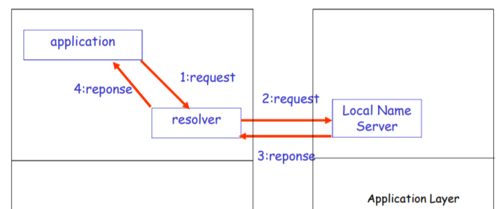

本地名字服务器（Local Name Server）

- 并不严格属于层次结构

- 每个ISP (居民区的ISP、公司、大学）都有一 个本地DNS服务器（也称为“默认名字服务器”）

- 当一个主机发起一个DNS查询时，查询被送到其本地DNS服务器

  > 起着代理的作用，将查询转发到层次结构中

名字解析过程

- 目标名字在Local Name Server中
  - 情况1：查询的名字在该区域内部
  - 情况2：缓存(cashing)

如果Local Name Server的缓存没有信息

- 递归查询

  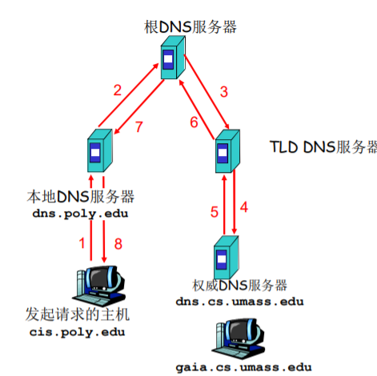

  问题：名字解析负担都放在当前联络的名字服务器上，根服务器的负担太重

  为此出现了迭代查询

- 迭代查询

  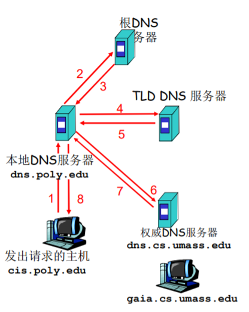

  > <a href="http://xn--cis-g88dt65i.poly.edu" target="_blank" rel="noopener external nofollow noreferrer">主机cis.poly.edu</a> 想知道 主机 <a href="http://gaia.cs.umass.edu" target="_blank" rel="noopener external nofollow noreferrer">gaia.cs.umass.edu</a> 的IP地址
  >
  > - 根（及各级域名）服务器返回的不是查询结果，而是下一个NS的地址
  > - 最后由权威名字服务器给出解析结果
  > - 当前联络的服务器给出可以联系的服务器的名字
  > - “我不知道这个名字，但可以向这个服务器请求”

### DNS协议、报文

如下图所示：

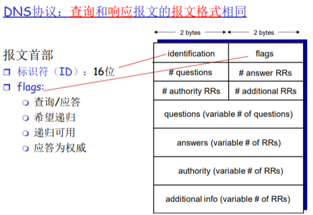

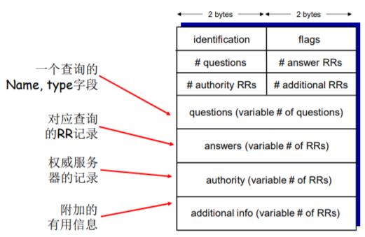

提高性能：缓存

- 一旦名字服务器学到了一个映射，就将该映射缓存起来

- 根服务器通常都在本地服务器中缓存着（使得根服务器不用经常被访问）

- 目的：提高效率

- 可能存在的问题：如果情况变化，缓存结果和权威资源记录不一致

  > 解决方案：TTL（默认2天）

### 新增域

- 在上级域的名字服务器中增加两条记录，指向这个新增的子域的**域名**和**域名服务器**的地址

- 在新增子域的名字服务器上运行名字服务器，负责本域的名字解析： 名字→IP地址

  > 如：在com域中建立一个“Network Utopia”

- <a href="http://xn--networkutopia-he1va63x07l7qs6z2ekhb685dda4847c0m2g.com" target="_blank" rel="noopener external nofollow noreferrer">到注册登记机构注册域名networkutopia.com</a>

  - 需要向该机构提供权威DNS服务器（基本的、和辅助的）的名字和IP地址

  - 登记机构在com TLD服务器中插入两条RR记录:

    > (<a href="http://networkutopia.com" target="_blank" rel="noopener external nofollow noreferrer">networkutopia.com</a>, <a href="http://dns1.networkutopia.com" target="_blank" rel="noopener external nofollow noreferrer">dns1.networkutopia.com</a>, NS)
    >
    > (<a href="http://dns1.networkutopia.com" target="_blank" rel="noopener external nofollow noreferrer">dns1.networkutopia.com</a>, 212.212.212.1, A)

- 在networkutopia.com的权威服务器中确保有：

  - 用于Web服务器的www.networkuptopia.com的类型为A的记录
  - 用于邮件服务器mail.networkutopia.com的类型为MX的记录

### 攻击DNS

DDoS 攻击

- 对根服务器进行流量轰炸攻击：发送大量ping
  - 没有成功
    - 原因１：根目录服务器配置了流量过滤器，防火墙
    - 原因２：Local DNS 服务器缓存了TLD服务器的IP地址, 因此无需查询根服务器
- 向TLD服务器流量轰炸攻击 ：发送大量查询
  - 可能更危险
  - 效果一般，大部分DNS缓存了TLD

重定向攻击

- 中间人攻击
  - 截获查询，伪造回答，从而攻击某个（DNS回答指定的IP）站点
- DNS中毒
  - 发送伪造的应答给DNS服务器，希望它能够缓存这个虚假的结果
- 技术上较困难：分布式截获和伪造利用DNS基础设施进行DDoS
- 伪造某个IP进行查询，攻击这个目标IP
- 查询放大，响应报文比查询报文大
- 效果有限

> 总体来讲：DNS是比较健壮的。

## P2P应用

前面介绍过，任何节点即是服务器，又是客户端。

- 没有（或极少）一直运行的服务器
- 任意端系统都可以直接通信
- 利用peer的服务能力
- Peer节点间歇上网，每次IP地址都有可能变化
- 例子：
  - 文件分发 (BitTorrent)
  - 流媒体(KanKan)
  - VoIP (Skype)

### P2P文件传输

这一部分我们将C/S模式和P2P模式的文件分发对比来看：

- 文件分发时间：C/S模式

  - 服务器传输： 都是由服务器发送给peer，服务器必须顺序传输（上载）N个文件拷贝:
    - 发送一个copy: F/u<sub>s</sub>
    - 发送N个copy： NF/u<sub>s</sub>
  - 客户端: 每个客户端必须下载一个文件拷贝
    - d<sub>min</sub> = 客户端最小的下载速率
    - 下载带宽最小的客户端下载的时间：F/d<sub>min</sub>

  > 采用C/S方法将一个F大小的文件分发给N个客户端耗时：
  >
  > ``` math
  > D_{C/S} \ge \max(NF/u_s,F/d_{min})
  > ```
  >
  > - 当客户端数量很少时，影响传输时间的瓶颈是客户端的下载速率；
  > - 当客户端数量很多时，影响传输时间的瓶颈是服务器端的上载速率。

- 文件分发时间：P2P模式

  - 服务器传输：最少需要上载一份拷贝

    - 发送一个拷贝的时间：F/u<sub>s</sub>

  - 客户端: 每个客户端必须下载一个拷贝

    - 最小下载带宽客户单耗时：: F/d<sub>min</sub>

  - 客户端: 所有客户端总体下载量NF

    - 最大上载带宽是：

      ``` math
      u_s + \sum_{} u_i
      ```

    - 除了服务器可以上载，其他所有的peer节点都可以上载

  > 采用P2P方法 将一个F大小的文件分发给N个客户端耗时:
  >
  > ``` math
  > D_{P2P} \ge \max(F/u_s, F/d_{min}, NF/(u_s + \sum{}u_i))
  > ```
  >
  > 随着客户端的数量增多，P2P模式的优势就体现出来了：客户端数量越多，较C/S模式节约的时间就越多。

下图比较直观的给出二者的对比：

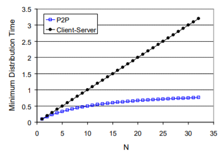

> P2P文件共享的例子：
>
> - Alice在其笔记本电脑上运行P2P客户端程序
> - 间歇性地连接到Internet，每次从其ISP得到新的IP地址
> - 请求“双截棍.MP3”
> - 应用程序显示其他有“ 双截棍.MP3” 拷贝的对等方
> - Alice选择其中一个对等方， 如Bob.
> - 文件从Bob’s PC传送到Alice的笔记本上：HTTP
> - 当Alice下载时，其他用户也可以从Alice处下载
> - Alice的对等方既是一个Web客户端，也是一个瞬时Web服务器

从以上例子我们会思考，P2P文件共享需要解决以下问题：

- 如何定位所需资源

- 如何处理对等方的加入与离开

  > 可能的方案：
  >
  > - 集中式目录
  > - 完全分布式
  > - 混合体

### P2P：集中式目录

最初的“Napster”设计：

- 当对等方连接时，它告知中心服务器：

  - IP地址
  - 内容

- Alice查询 “双截棍 .MP3”

- Alice从Bob处请求文件

  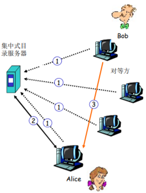

  > 集中式目录存在的问题：
  >
  > - 单点故障
  > - 性能瓶颈
  > - 侵犯版权

### P2P：查询洪泛（Gnutella）

- 全分布式（没有中心服务器）
- 开放文件共享协议
- 许多Gnutella客户端实现了Gnutella协议（类似HTTP有许多的浏览器）
- 覆盖网络：图
  - 如果X和Y之间有一个TCP连接，则二者之间存在一条边
  - 所有活动的对等方和边就是覆盖网络
  - 边并不是物理链路
  - 给定一个对等方，通常所连接的节点少于10个

> Gnutella：协议
>
> - 在已有的TCP连接上发送查询报文
>
> - 对等方转发查询报文
>
> - 以反方向返回查询命中报文
>
> - “泛洪”：
>
>   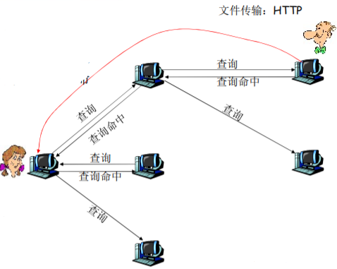
>
> Gnutella：对等方加入
>
> 1.  对等方X必须首先发现某些已经在覆盖网络中的其他对等方：使用可用对等方列表
>     - 自己维持一张对等方列表（经常开机的对等方的IP）
>     - 联系维持列表的Gnutella站点
> 2.  X接着试图与该列表上的对等方建立TCP连接，直到与某个对等方Y建立连接
> 3.  X向Y发送一个Ping报文，Y转发该Ping报文
> 4.  所有收到Ping报文的对等方以Pong报文响应
>     - IP地址、共享文件的数量及总字节数
> 5.  X收到许多Pong报文，然后它能建立其他TCP连接
>
> 当节点离开时，会向“邻居”发送消息：“我走啦”，于是其他的节点会再次以以上的方式添加一个新的节点，维持连接强度。
>
> 但是Gnutella实际效果并不好。

### P2P：利用不匀称性（KaZaA）

- 每个对等方要么是一个 组长，要么隶属于一个组长

  - 对等方与其组长之间有TCP连接
  - 组长对之间有TCP连接

- 组长跟踪其所有的孩子的内容

- 组长与其他组长联系：

  - 转发查询到其他组长
  - 获得其他组长的数据拷贝

  > 组的成员向组长发出一个查询，如果组内有，组长会告知该节点：“咱们组里有，你去向XXX请求吧。”；如果组内没有，那么该组长会向其他组长发出查询。
  >
  > - 在组内的层面是集中式的
  > - 在组长的层面是分布式的

> KaZaA：查询
>
> - 每个文件有一个散列标识码和一个描述符
> - 客户端向其组长发送关键字查询
> - 组长用匹配进行响应：
>   - 对每个匹配：元数据、散列标识码和IP地址
> - 如果组长将查询转发给其他组长，其他组长也以匹配进行响应
> - 客户端选择要下载的文件
>   - 向拥有文件的对等方发送一个带散列标识码的HTTP请求
>
> KaZaA小技巧
>
> - 请求排队
>   - 限制并行上载的数量
>   - 确保每个被传输的文件从上载节点接收一定量的带宽
> - 激励优先权
>   - 鼓励用户上载文件
>   - 加强系统的扩展性
> - 并行下载
>   - HTTP的字节范围首部
>   - 更快地检索一个文件

### 比特洪流（BitTorrent）

> Peer如果想参与到文件传输需要加入到“洪流”（指一些Peer节点的列表和它们之间服务与被服务的关系）当中。
>
> 以学习小组为例会比较形象的描述文件传输的过程：假设一门课程的内容被分为很多小的知识点，这些知识点被分发在学习小组当中，那么节点与节点之间可以相互通信，共享这些知识点，从而使每个节点都学习到所有的知识点，掌握整门课程内容。
>
> 课程内容就是一个大型文件，知识点就是被划分为的一个个块（256KB）。
>
> 那么我们开始思考，各个节点如何知晓其他节点需要哪些块呢？
>
> 这里就会提出一个概念：bit map。
>
> 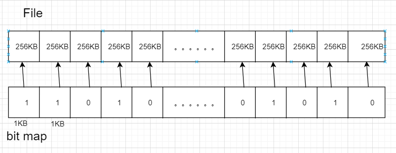
>
> 我们可以用很小的位去标识整个文件中所有块的有无情况：1表示有；0表示无。这样构成一个一一映射的关系。
>
> 洪流中的节点会定期互相交换自己的bit map，从而就知晓了其他节点拥有块的情况。
>
> 一开始新加入的节点没有任何块，它会随机的访问其他节点获取块，当获取到四个块之后，就会改变获取策略：优先请求稀缺的块。
>
> 简单分析一下这种思想：节点优先获取稀缺的块，从而其他节点就会不断访问该节点，该节点从其他节点不断地获取更好的服务，同时也可以向其他节点提供更好的服务。

- 文件被分为一个个块256KB

- 网络中的这些peers发送接收文件块，相互服务

- **tracker**:跟踪torrent中参与节点

- Torrent（洪流）: 节点的组，之间交换文件块

  > 例：Alice加入到网络中，首先需要从从跟踪服务器处获得peer节点列表， 然后开始和torrent中的peer节点交换块。
  >
  > > Peer如何加入torrent：
  > >
  > > - 一开始没有块，但是将会通过其他节点处累积文件块
  > > - 向跟踪服务器注册，获得peer节点列表，和部分peer节点构成邻居关系 (“连接 ”)
  >
  > - 当peer下载时，该peer可以同时向其他节点提供上载服务
  > - Peer可能会变换用于交换块的peer节点
  > - 扰动churn: peer节点可能会上线或者下线
  > - 一旦一个peer拥有整个文件，它会（自私的）离开或者保 留（利他主义）在torrent中

请求块

- 在任何给定时间，不同peer节点拥有一个文件块的子集
- 周期性的，Alice节点向邻居询问他们拥有哪些块的信息
- Alice向peer节点请求它希望的块，稀缺的块

发送块（一报还一报 tit-for-tat）

Alice向4个peer发送块，这些块向它自己提供最大带宽的服务

- 其他peer被Alice阻塞 (将不会从Alice处获得服务)
- 每10秒重新评估一次：前4位

每个30秒：随机选择其他peer节点，向这个节点发送块

- “优化疏通” 这个节点
- 新选择的节点可以加入这个top 4

## CDN（Content Distribution Networks）

视频业务属于互联网“杀手级”应用（占用流量多，而且吸引用户）的一种。据统计，目前视频流量占据着互联网大部分的带宽（七、八成甚至更多）。如何向成千上万的用户提供并行的视频服务是一个比较大的挑战。

我们可以将视频认为是固定速度显示的图像序列。（例：24 images/sec）

网络视频特点：

- 高码率：\>10x于音频,高的网络带宽需求
- 可以被压缩
- 90%以上的网络流量是视频

数字化图像：像素的阵列

- 每个像素被若干bits表示

编码：使用图像内和图像间的冗余来降低编码的比特数

- 空间冗余（图像内）

- 时间冗余（相邻的图像间）

  > 实际上在传输的时候只需要把画面动起来的部分传输就好。

> - CBR: (constant bit rate): 以固定速率编码
> - VBR: (variable bit rate): 视频编码速率随时间的变化而变化

### 存储视频的流化服务：

视频服务可以通过像文件下载一样的方式将所有数据下载到本地，再进行观看，但这样时间成本太大。流化服务指的是，会有一个缓冲区，可以实现一边下载一边播放的效果。可以极大地减少用户的等待时间。

多媒体流化服务：DASH

DASH: Dynamic Adaptive Streaming over HTTP（动态自适应流化）

> 自适应：一个完整的视频被切分成一块一块的小部分（可维持几秒钟的播放），每个部分会处理成不同的解析度（处理成不同的编码标准）。所以在流媒体服务器中会包含一个视频的很多版本。

- 服务器：
  - 将视频文件分割成多个块
  - 每个块独立存储，编码于不同码率（8-10种）
  - 告示文件（manifest file）: 提供不同块的URL
- 客户端：
  - 先获取告示文件
  - 周期性地测量服务器到客户端的带宽
  - 查询告示文件,在一个时刻请求一个块，HTTP头部指定字节范围
    - 如果带宽足够，选择最大码率的视频块
    - 会话中的不同时刻，可以切换请求不同的编码块 (取决于当时的可用带宽)
- “智能”客户端: 客户端自适应决定
  - 什么时候去请求块 ：不至于缓存挨饿，或者溢出
  - 请求什么编码速率的视频块 ：当带宽够用时，请求高质量的视频块)
  - 哪里去请求块 ：可以向离自己近的服务器发送URL，或者向高可用带宽的服务器请求)

> 服务器如何通过网络向上百万用户同时流化视频内容 (上百万视频内容)?
>
> - 选择一：单个的、大的超级服务中心“megaserver”
>   - 服务器到客户端路径上跳数较多，瓶颈链路的带宽小导致停顿
>   - “二八规律”决定了网络同时充斥着同一个视频的多个拷贝，效率低（付费高、带宽浪费、效果差）
>   - 单点故障点，性能瓶颈
>   - 周边网络的拥塞
>   - 评价：相当简单，但是这个方法不可扩展
> - 选择二：通过CDN，全网部署缓存节点，存储服务内容，就近为用户提供服务，提高用户体验
>   - enter deep: 将CDN服务器深入到许多接入网
>     - 更接近用户，数量多，离用户近，管理困难
>     - Akamai, 1700个位置
>   - bring home: 部署在少数(10个左右)关键位置，如将服务器簇安装于POP附近（离若干1stISP POP较近）
>     - 采用租用线路将服务器簇连接起来
>     - Limelight

CDN：在CDN节点中存储内容的多个拷贝

> 工作原理：向提供流媒体服务的运营商提供CDN服务，CDN在全球的网络中部署了很多的缓存节点，把一些内容预先的部署在缓存节点中。用户访问时通过域名解析的重定向，定向到离他最近，提供服务质量最好的缓存节点，由这些缓存节点向他提供服务。

用户从CDN中请求内容：

- 重定向到最近的拷贝，请求内容
- 如果网络路径拥塞，可能选择不同的拷贝

下面看一个具体图例：

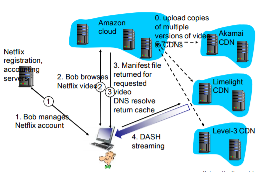

## TCP套接字编程

### Socket编程

Socket: 分布式应用进程之间的门，传输层协议提供的端到端服务接口。

> 套接字：应用进程与端到端传输协议（TCP或UDP）之间的门户。

应用进程使用传输层提供的服务才能够交换报文，实现应用协议，实现应用。

TCP/IP：应用进程使用Socket API访问传输服务

- 地点：界面上的SAP(Socket）
- 方式：Socket API

2种传输层服务的socket类型：

- TCP: 可靠的、字节流的服务
- UDP: 不可靠（数据UDP数据报）服务

### TCP套接字编程

服务器首先运行，等待连接建立：

- 服务器进程必须先处于运行状态
  - 创建欢迎socket
  - 和本地端口捆绑
  - 在欢迎socket上阻塞式等待接收用户的连接
- 服务器接受来自用户端的请求，解除阻塞式等待，返回一个新的socket（与欢迎socket不一样），与客户端通信
  - 允许服务器与多个客户端通信
  - 使用源IP和源端口来区分不同的客户端

客户端主动和服务器建立连接：

- 创建客户端本地套接字（隐式捆绑到本地port）
  - 指定服务器进程的IP地址和端口号，与服务器进程连接
- 连接API调用有效时，客户端P与服务器建立了TCP连接

> 从应用程序的角度：
>
> TCP在客户端和服务器进程之间提供了可靠的、字节流（管道）服务

> C/S模式的应用样例:
>
> 1.  客户端从标准输入装置读取一行字符，发送给服务器
>
> 2.  服务器从socket读取字符
>
> 3.  服务器将字符转换成大写，然后返回给客户端
>
> 4.  客户端从socket中读取一行字符，然后打印出来
>
>     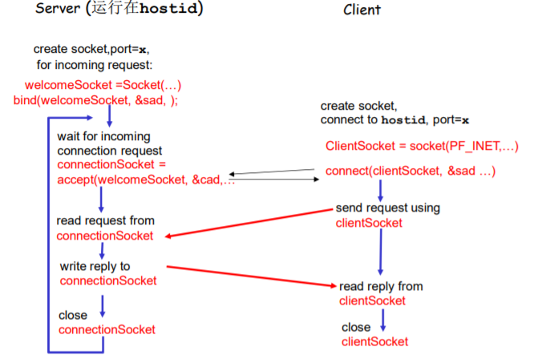

> 这里我们补充两个结构体：
>
> - 数据结构 sockaddr_in
>
>   IP地址和port捆绑关系的数据结构（标示进程的端节点）
>
>   <figure class="highlight c++">
>   <table>
>   <colgroup>
>   <col style="width: 50%" />
>   <col style="width: 50%" />
>   </colgroup>
>   <tbody>
>   <tr>
>   <td class="gutter"><pre><code>1
>   2
>   3
>   4
>   5
>   6
>   7</code></pre></td>
>   <td class="code"><pre><code>struct sockaddr_in 
>   {
>       short sin_familt;    //地址簇
>       u_shout sin_port;    //port端口
>       struct in_addr sin_addr;    //IP地址
>       char sin_zero[8];    //对齐
>   }</code></pre></td>
>   </tr>
>   </tbody>
>   </table>
>   </figure>
>
> - 数据结构 hostent
>
>   域名和IP地址的数据结构
>
>   <figure class="highlight c++">
>   <table>
>   <colgroup>
>   <col style="width: 50%" />
>   <col style="width: 50%" />
>   </colgroup>
>   <tbody>
>   <tr>
>   <td class="gutter"><pre><code>1
>   2
>   3
>   4
>   5
>   6
>   7
>   8</code></pre></td>
>   <td class="code"><pre><code>struct hostent
>   {
>       char *h_name;    //主机域名
>       char **h_aliases;    //域名的别名
>       int h_length;    //地址长度
>       char **h_addr_list;    //IP地址列表
>       #define h_addr h_addr_list[0];
>   }</code></pre></td>
>   </tr>
>   </tbody>
>   </table>
>   </figure>
>
>   > 作为调用域名解析函数时的参数
>   >
>   > 返回后，将IP地址拷贝到 sockaddr_in的IP地址部分

## UDP套接字编程

UDP: 在客户端和服务器之间没有连接。

- 没有握手
- 发送端在每一个报文中明确地指定目标的IP地址和端口号
- 服务器必须从收到的分组中提取出发送端的IP地址和端口号

UDP: 传送的数据可能乱序，也可能丢失。

> 进程视角看UDP服务：
>
> UDP 为客户端和服务器提供不可靠的字节组的传送服务。

### UDP套接字编程

> C/S模式的应用样例:
>
> 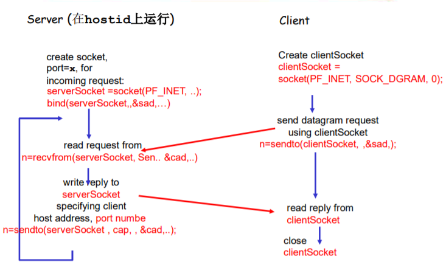

------------------------------------------------------------------------

# 后记

本篇已完结

（如有补充或错误，欢迎评论区留言）
