# 计算机网络学习笔记-网络层

> 📌 转载自 **花猪のBlog（作者 CNhuazhu）** —— 原文：https://cnhuazhu.top/butterfly/2021/06/08/%E8%AE%A1%E7%AE%97%E6%9C%BA%E7%BD%91%E7%BB%9C/%E8%AE%A1%E7%AE%97%E6%9C%BA%E7%BD%91%E7%BB%9C%E5%AD%A6%E4%B9%A0%E7%AC%94%E8%AE%B0-%E7%BD%91%E7%BB%9C%E5%B1%82/
> 学习笔记，版权归原作者所有，仅供学弟学妹学习参考；如有侵权请联系删除。

---

# 前言

*正在学习计算机网络这门课程，顺便做个笔记，记录一下知识点。*

> 参考资料：
>
> 中科大郑烇老师全套《计算机网络（自顶向下方法 第7版，James F.Kurose，Keith W.Ross）》课程：<a href="https://www.bilibili.com/video/BV1JV411t7ow?p=1" target="_blank" rel="noopener external nofollow noreferrer">https://www.bilibili.com/video/BV1JV411t7ow?p=1</a>
>
> 《计算机网络（自顶向下方法 第7版，James F.Kurose，Keith W.Ross）》

------------------------------------------------------------------------

# 第四章：网络层

## 导论

网络层所提供的服务：

- 在发送主机和接收主机对之间传送段（segment）
  - 在发送端将段封装到数据报中
  - 在接收端，将段上交给传输层实体
- 网络层协议存在于每一个主机和路由器
  - 路由器检查每一个经过它的IP数据报的头部

网络层的关键功能：**转发**和**路由**

- 转发：将分组从路由器的输入接口转发到合适的输出接口

  这是一个局部的功能

  是数据平面的功能

  > 路由器从不同的端口接收分组，再通过合适的端口将其分发出去。

- 路由：使用路由算法来决定分组从发送主机到目标接收主机的路径

  这是一个全局的功能

  是控制平面的功能

  - 路由选择算法
  - 路由选择协议

> 举个例子说明转发与路由：
>
> 计算机网络一口气学了好长时间，打算去郊区的公园散散心：
>
> - 转发就好像是在行程中通过每个路口时的决策，从哪里进入路口，又从哪里出去
> - 路由就像是在出发前用手机导航规划全局路径的过程

### 数据平面与控制平面

- 数据平面：

  局部的处理，每个路由的功能：

  - 决定从路由器输入端口到达的分组如何转发到输出端口
  - 转发功能：
    - 传统方式：基于目标地址 + 转发表
    - SDN方式：基于多个字段 + 流表

- 控制平面：

  全局的处理，网络范围内的逻辑：

  - 决定数据报如何在路由器之间路由，决定数据报从源到目标主机之间的端到端路径
  - 两个个控制平面方法：
    - 传统的路由算法: 在路由器中被实现（路由表）
    - SDN（software-defined networking，软件定义网络）：在远程的服务器中实现

传统方式：每一个路由器既实现了数据平面的功能，也实现了控制平面的功能。

- 在每一个路由器中的单独路由器算法元件，在控制平面进行交互

  - 控制平面：路由算法决定端到端路径（分布式操作）
  - 数据平面：IP协议根据转发表决定了IP数据报在此路由器上的局部转发（分布式操作）
  - 二者是紧耦合的，在一个路由实体中

  > 在路由器之上有路由实体，这些路由实体之间要交换路由信息。然后分布式的计算路由表，交给IP协议实体，然后IP协议实体根据路由表进行匹配，最后转发。

  - 带来的问题：分布式的操作使得修改路由器的运行逻辑是一件困难的事情

SDN方式：逻辑集中的控制平面

- 一个不同的（通常是远程的）控制器与本地控制代理（CAs）交互
  - 控制平面的功能集中在一个服务器（远程控制器，Remote Controller）上去实现，计算得到流表，将其交给每一个分组交换设备，分组交换设备对流表进行装载，对接收到的IP实体做多字段的匹配（传统方式只匹配目标主机的IP地址），按照流表对应的动作对IP实体进行操作，包括：转发，阻塞（block），泛洪等
  - 分组交换设备仅按照远端的服务器计算发来的流表进行操作，这样改变其行为逻辑就会简单许多。
  - 由此分析：控制平面是集中式的、远程的，便于修改。

### 网络服务模型

从发送方主机到接收方主机传输数据报的“通道”，网络提供的服务模型：

- 对于单个数据报的服务：
  - 可靠传送
  - 延迟保证，如：少于40ms的延迟
- 对于数据报流的服务：
  - 保序数据报传送
  - 保证流的最小带宽
  - 分组之间的延迟差
- 连接建立：在某些网络架构中是第三个重要的功能
  - 在分组传输之前，在两个主机之间，在通过一些路由器所构成的路径上建立一个网络层连接（涉及到路由器）
  - 网络层和传输层连接服务区别：
    - 网络层: 在两个主机之间，涉及到路径上的一些路由器
    - 传输层: 在两个进程之间，很可能只体现在端系统上(TCP连接)

*（⚠️ 原图已失效）*

## 虚电路和数据报网络

网络层能够在两台主机之间提供无连接的服务或有连接的服务

- 数据报网络（datagram network）仅在网络层提供无连接服务
- 虚电路网络（Virtual-Circuit，VC）仅在网络层提供连接服务

由上一章我们知道运输层也可以实现面向连接的服务，但是这与网络层实现连接服务是不同的：

- 网络层提供的是主机到主机（host-to-host）间的服务

  > 运输层提供进程到进程间的服务

- 网络层连接服务除了在端系统中，也在位于网络核心的路由器中出现

  > 运输层的连接服务只在端系统中实现

### 虚电路网络

虚电路网络从源头到目的地的路径表现得很像电话线路。

一条虚电路的组成如下：

- 源和目的主机之间的路径（即一系列链路和路由器）

- VC号，沿着该路径的每段链路的一个号码

- 沿着该路径的每台路由器中的转发表表项

  > 属于一条虚电路的分组将在它的首部携带一个VC号。因为一条虚电路在每条链路上可能具有不同的VC号，每台中间路由器必须用一个新的VC号替代每个传输分组的VC号，该新的VC号从转发表获得。

下图展示了一个简单的虚电路网络和对应路由器的转发表

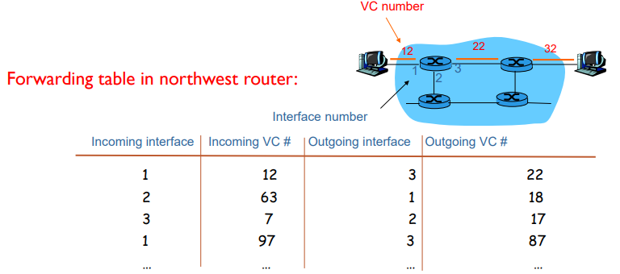

> 虚电路中路由器维持着连接状态信息

*（埋个坑，以后补充）*

## 路由器的组成

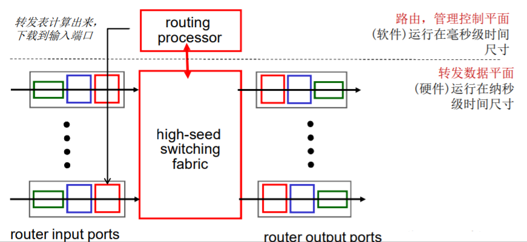

路由：运行路由选择算法／协议 (RIP, OSPF, BGP)-生成路由表

路由器的组成包括：

- 输入端口
- 输出端口
- 交换机（high-seed switching fabric）将输入端口与输出端口连接起来，构成局部的转发（根据路由表）。

### 输入端口

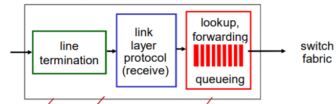

- 物理层：把物理信号转化为数字信号（Bit级接收）

- 数据链路层：链路层协议动作、解封装得到IP协议实体

  > 判断帧头、帧尾，利用CRC检查出错（具体见下一章）

- 网络层：通过路由表将分组进行转发

  分布式交换：

  - 根据数据报头部的信息如：目的地址，在输入端口内存中的转发表中查找合适的输出端口（匹配+行动）
  - 基于目标的转发：仅仅依赖于IP数据报的目标IP地址（传统方法）
  - 通用转发：基于头部字段的任意集合进行转发

- 输入端口缓存：

  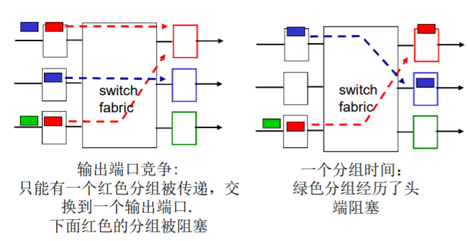

  在输入端口会有一个队列，用于缓解输出、输入的不一致性。

  - 当交换机构的速率小于输入端口的汇聚速率时， 在输入端口可能要排队

    > 排队延迟以及由于输入缓存溢出可能造成丢失

  - 排在队头的数据报阻止了队列中其他数据报向前移动

### 交换结构

交换速率：分组可以按照该速率从输入传输到输出

- 运行速度经常是输入/输出链路速率的若干倍
- 如果是N 个输入端口：交换机构的交换速度是输入线路速度的N倍比较理想，才不会成为瓶颈

下面我们来分析分组如何从输入端口转向输出端口：

三种典型的交换机构

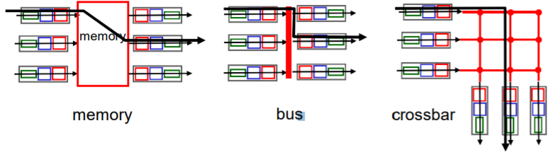

- 基于memory（内存）

  - 第一代路由器

  - 路由器就是一个计算机，通过软件的方式实现路由

  - 输入端口和输出端口分别插入网卡，从输入端口接收来的分组，通过系统总线，交给路由软件，匹配路由表，最后决定从哪一个网口发出。

  - 转发速率被内存的带宽限制 (数据报通过BUS两遍)

  - 一次只能转发一个分组

- 基于bus（总线）

  - 数据报通过共享总线，从输入端口转发到输出端口
  - 总线竞争: 交换速度受限于总线带宽
  - 一次处理一个分组
  - 总线速度能达到：Cisco 1900：1 Gbps；Cisco 5600：32 Gbps。对于接 入或企业级路由器，速度足够（ 但不适合区域或骨干网络）

- 基于crossbar（互联网络）

  - 同时并发转发多个分组，克服总线带宽限制
  - 当分组从端口A到达，转给端口Y；控制器短接相应的两个总线
  - 高级设计：将数据报分片为固定长度的信元，通过交换网络交换（分组长度是不同的）
  - Cisco12000：以60Gbps的交换速率通过互联网络

### 输出端口

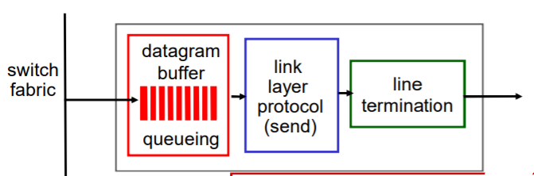

- 网络层：接收fabric传来的分组，将分组排队，将分组交给对应链路层的网卡

  > - 当数据报从交换机构的到达速度比传输速率快 就需要输出端口缓存
  > - 同样，如果队列溢出，分组丢失
  > - 由调度规则选择排队的数据报进行传输（并不一定是先来先服务）

- 链路层：封装成帧（添加帧头、帧尾、目标MAC地址）

- 物理层：将数字信号转化为物理信号，将数据传出去

- 输出端口排队：

  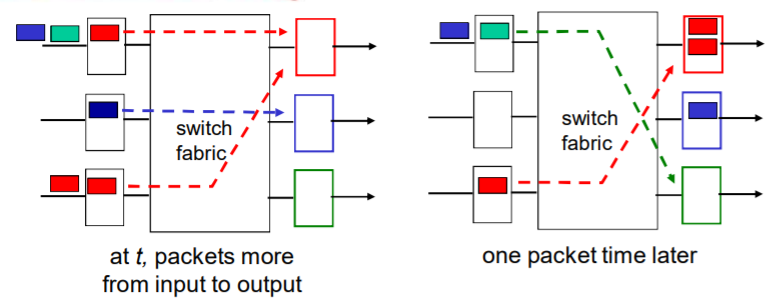

  - 假设交换速率Rswitch是Rline的N倍（N：输入端口的数量）
  - 当多个输入端口同时向输出端口发送时，缓冲该分组（当通过交换网络到达的速率超过输出速率则缓存）
  - 排队带来延迟，由于输出端口缓存溢出则丢弃数据报（不一定丢弃最后进入队列的分组，取决于规则）

### 调度机制

调度: 选择下一个要通过链路传输的分组

- FIFO (first in first out) scheduling: 按照分组到来的次序发送
  - 丢弃策略：
    - tail drop: 丢弃刚到达的分组
    - priority: 根据优先权丢失/移除分组
    - random: 随机地丢弃/移除
- 优先权调度：发送最高优先权的分组
  - 多类，不同类别有不同的优先权
    - 类别可能依赖于标记或者其他的头部字段（如：IP source/dest, port numbers, ds，等）
    - 先传高优先级的队列中的分组，除非没有
    - 高（低）优先权中的分组传输次序：FIFO
- 轮转 （Round Robin (RR) ）调度：
  - 多类
  - 循环扫描不同类型的队列, 发送完一类的一个分组，再发送下一个类的一个分组，循环所有类
- Weighted Fair Queuing (WFQ，加权公平队列)：
  - 一般化的Round Robin
  - 在一段时间内，每个队列得到的服务时间是：Wi / (XIGMA(Wi )) ×t，和权重成正比
  - 每个类在每一个循环中获得不同权重的服务量

## IP协议（Internet Protocol）

IP协议在整个协议栈的位置：

*（⚠️ 原图已失效）*

### IP数据报格式

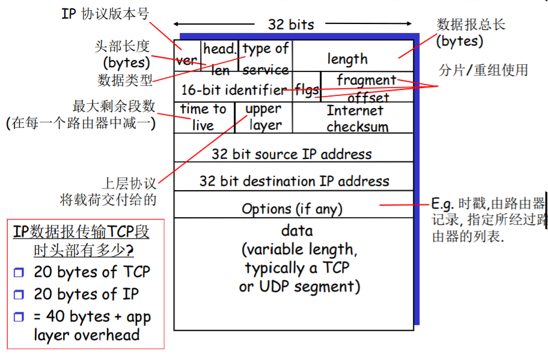

- 固定20字节头部（一行4字节，固定一共5行）
- 除固定20字节头部外有可选项部分
- body部分（数据载荷部分）
  - TCP的段
  - UDP的数据报

> 说明：
>
> - ver（IP 协议版本号，4bit）：4 → IPv4； 6 → IPv6
>
> - head.len（头部长度，4bit）：以字节为单位
>
> - type of service（数据类型，8bit）：标识数据报载荷的类型，为了使分组调度时有依据（由于IP网络运营模式，现在基本不用）
>
> - length（数据报总长，16bit）：标识此IP数据报的总长，以字节为单位
>
> - 分片/重组使用（如果IP数据报超过链路层的最大传输单元MTU，就会分片）
>
>   - 16-bit identifier（16bit）：判断分片是否是同一个IP数据报
>   - flags（4bit）：1 → 后面还有分片；0 → 后面无分片（此分片是最后一个）
>   - fragment offset（12bit）：偏移量
>
> - time to live（TTL，8bit）：最大剩余段数（每经过一个路由器减一）
>
> - upper layer（上层协议，8bit）：决定将载荷部分交给上层哪种类型的协议实体（例：TCP、UDP等）
>
> - Internet checksum（头部校验和，16bit）：数据部分不进行校验，只判断头部是否异常
>
>   > IPv6取消了该字段
>
> - 32 bit source IP address（32位源IP地址）
>
> - 32 bit destination IP address（32位目标IP地址）
>
> - data：数据报的载荷部分
>
> - Options（可选部分）：例如，每经过一个交换节点，该地址会被记录在option中，即形成一个经过的路由器的列表，这样一来，目标端就知道该分组的传输路径。

### IP 分片和重组

IP 分片的原因：

网络链路有MTU (最大传输单元)：链路层帧所携带的最大数据长度。如果IP数据报长度大于MTU，那么就需要将其分片。

> 不同的链路类型有不同的MTU

思考，如果仅仅是将一个IP数据报“粗暴”地直接分片，那么第一片包含头部信息，路由器知道如何处理，那么其他片没有头部信息，路由器便无法识别，显然这样是不行的。那么分片就需要一些“手段”：

假设要传输一个4000字节的数据报：20字节头部 + 3980字节数据

链路层最大传输单元（MTU）为：1500字节

- 第一片：20Bytes头部 + 1480Bytes数据

  - flags = 1
  - fragment offset = 0

- 第二片：20Bytes头部 + 1480Bytes数据

  - flags = 1
  - fragment offset = 1480 / 8 = 185

- 第三片：20Bytes头部 + 1020Bytes数据

  - flags = 0
  - fragment offset = 2960 / 8 = 370

  > 注意：在计算偏移量的时候需要除以8（以8字节为单位）

每一片都到最后的目标主机才进行重组，中间转发节点不重组。

如果到达目标主机的分片有丢失，那么分片全部丢弃。

### IPv4

#### IP编址

IP地址：32位标示，对主机或者路由器的接口编址

- 一个IP地址和一个接口相关联

  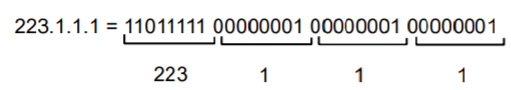

接口: 主机/路由器和物理链路的连接处

- 路由器通常拥有多个接口
- 主机也有可能有多个接口
- IP地址和每一个接口关联

#### 子网（Subnets)）

如下图，是一个包含三个子网的网络

*（⚠️ 原图已失效）*

必备的两个条件：

- IP地址
  - 子网部分（高位bits），也称子网号：每个IP是相同的
  - 主机部分（低位bits）
- 在子网内部分组的收发不需要借助路由器（仅通过交换机），一跳可达。

> 子网的判断：
>
> - 要判断一个子网, 将每一个接口从主机或者路由器上分开,构成了一个个网络的孤岛
>
> - 每一个孤岛（网络）都是一个都可以被称之为subnet
>
> - 如下图，共有6个子网：
>
>   *（⚠️ 原图已失效）*

#### IP地址分类

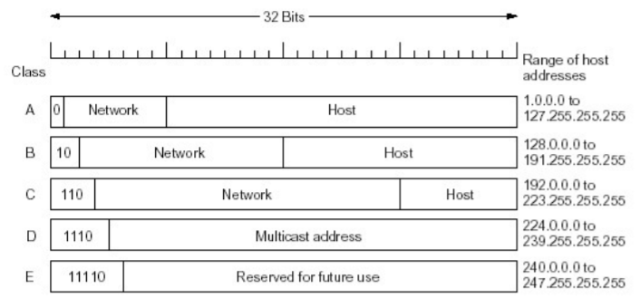

A类地址：地址最高位为0，第一个字节的其它7位为网络号，后面三个字节（24bit）为主机号

- 一共有126个网络（27 - 2，全零和全一的网络号不使用）
- 每个网络有224 - 2个主机

B类地址：地址最高两位为10，前两个字节的其他14位为网络号，后面两个字节（16bit）为主机号

- 一共有214 - 2个网络
- 每个网络有216 - 2个主机

C类地址：地址最高三位为110，前三个字节的其他21位为网络号，后面一个字节（8bit）为主机号

- 一共有221 - 2个网络
- 每个网络有28 - 2个主机

> A、B、C类地址称为：“单播地址”
>
> 通常获取的都是C类地址

D类地址（“组播地址”）：最高4位为1110，其余位为组播地址（Multicast address）

E类地址（预留）：最高5位为11110

> - 互联网是以网络（局域网）为单位进行路由信息的通告，传播和计算。
>   - 每个网络是路由表中的一个表项，而非IP地址
> - 子网信息可以进一步聚集，更高层次可以以广域网为单位。

特殊的IP地址：

- 约定：

  - 子网部分: 全为0 → 本网络

  - 主机部分: 全为0 → 本主机

  - 主机部分: 全为1 → 广播地址，这个网路所有的主机

  - 127.X.X.X：回路地址（测试地址）：即TCP/UDP数据报传到IP层面后返回

    > 类似我们在一个web项目的时候，本地测试模拟网络状态，通常地址为127.0.0.1（实际上访问的是本机）

内网(专用)IP地址：

- 专用地址：地址空间的一部份供专用地址使用
- 永远不会被当做公用地址来分配, 不会与公用地址重复
  - 只在局部网络中有意义，区分不同的设备
- 路由器不对目标地址是专用地址的分组进行转发
- 专用地址范围：
  - Class A： 10.0.0.0 ~ 10.255.255.255 MASK 255.0.0.0
  - Class B： 172.16.0.0 ~ 172.31.255.255 MASK 255.255.0.0
  - Class C： 192.168.0.0 ~ 192.168.255.255 MASK 255.255.255.0

#### 无类域间路由（CIDR）

CIDR: Classless InterDomain Routing （无类域间路由）

> 上述A、B、C类地址存在明确的划分（通过IP号），但这会存在一个问题，A类地址不必说，数量很少，瞬间就被分配完了，B类地址也是一样的道理，但是这类地址可分配的主机数量很多，通常没有企业单位会拥有如此多待分配的主机，为了充分利用资源，所以出现了无类域间路由。

路由器如何区分无类域间路由？仅凭前几位是无法做到的（没有明确的网络号和主机号位数），因此伴随而生的子网掩码出现了：

- 如果位为1：表示该位为网络位（子网部分）

- 如果位为0：表示该位为主机位

- 子网部分可以在任意的位置

- 地址格式: `a.b.c.d/x`, 其中 x 是地址中子网号的长度（另一种表示方式）

  *（⚠️ 原图已失效）*

> 给定一个IP地址，计算网络号：将IP地址与对应的子网掩码进行`与`运算

> 原始的A、B、C类网络的子网掩码分别是：
>
> - A：255.0.0.0 ：11111111 00000000 0000000 00000000
> - B：255.255.0.0：11111111 11111111 0000000 00000000
> - C：255.255.255.0：11111111 11111111 11111111 00000000

路由信息的匹配，分析路由表表项：

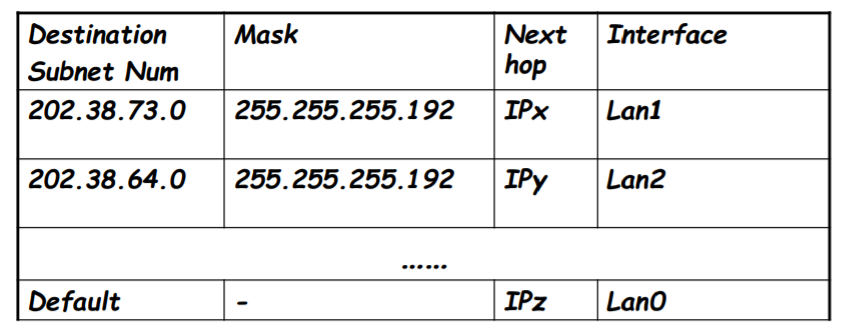

> - 目标子网号
> - 子网掩码
> - 下一跳
> - 端口

- 获得IP数据报的目标地址，将其与子网掩码进行`与`运算，得到网络号
- 对照路由表的目标子网号进行匹配：
  - 如果找到，则按照表项对应的接口转发该数据报
  - 如果都没有找到,则使用默认表项转发数据报

一个主机如何获得IP地址：

- 系统管理员手动分配，每个操作系统不一样

- DHCP（ Dynamic Host Configuration Protocol）:从服务器中动态获得一个IP地址

  - 基于UDP的服务

  - 允许主机在加入网络的时候，动态地从服务器那里获得IP地址：

    - 可以更新对主机在用IP地址的租用期（租期快到了）
    - 重新启动时，允许重新使用以前用过的IP地址
    - 支持移动用户加入到该网络（短期在网）

  - DHCP工作概况：

    - 主机广播“DHCP discover” 报文\[可选\]

    - DHCP 服务器用 “DHCP offer”提供报文响应\[可选\]

    - 主机请求IP地址：发送 “DHCP request” 报文

    - DHCP服务器发送地址：“DHCP ack” 报文

      > 最开始，主机用32位全零的地址作为本机地址，以32位全一的地址进行广播
      >
      > *（⚠️ 原图已失效）*
      >
      > DHCP 返回:
      >
      > - IP 地址
      > - 第一跳路由器的IP地址（默认网关）
      > - DNS服务器的域名和IP地址
      > - 子网掩码 (指示地址部分的网络号和主机号)

一个主机如何获得一个网络的子网部分：

- 一个机构，从ISP获得地址块中分配一个小地址块，该机构可以进行小地址块的分配
- ICANN: Internet Corporation for Assigned Names and Numbers，通过该机构直接申请IP地址
  - 分配地址
  - 管理DNS
  - 分配域名，解决冲突

路由聚集（route aggregation）：是一种层次编址的方式，目的是减少路由信息通告、计算的数量。在路由匹配表项的时候，数量要大大减少。

> 在路由聚集时，如果出现一个IP地址能匹配到多个路由表项（这是可能出现的）：采用最长前缀匹配，因为更精确。

### NAT（Network Address Translation）

NAT：网络地址转换

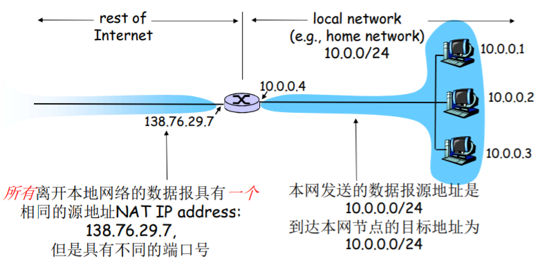

内网主机向外部发送分组时，经过路由，将内网地址转换为外网地址；同样的，外网的分组经路由传向内网时，将外网地址转换为内网地址。（内网节点共用一个IP）

使用NAT的原因：本地网络只有一个有效IP地址（IP地址申请使用需要付费）

- 不需要从ISP分配一块地址，可用一个IP地址用于所有的（局域网）设备 → 省钱
- 可以在局域网改变设备的地址情况下而无须通知外界
- 可以改变ISP（地址变化）而不需要改变内部的设备地址，更换方便
- 局域网内部的设备没有明确的地址，对外是不可见的 → 安全

若要实现NAT，则路由器必须支持NAT：

- 外出数据包：替换源地址和端口号为NAT IP地址和新的端口号，目标IP和端口不变

  > 远端的C/S将会用NAP IP地址，新端口号作为目标地址

- 记住每个转换替换对（在NAT转换表中）

  > 源IP \| 端口 vs NAP IP \| 新端口

- 进入数据包：替换目标IP地址和端口号，采用存储在NAT表中的mapping表项，用（源IP，端口）

  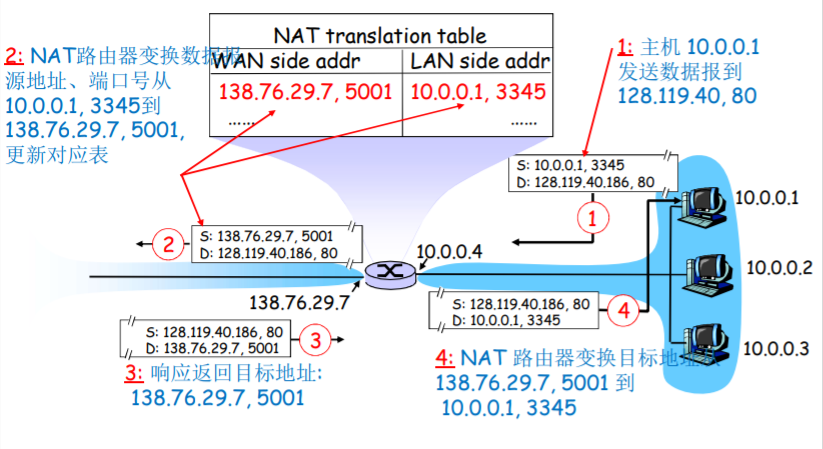

对于NAT是有争议的：

- 路由器只应该对第3层做信息处理（物理层、链路层、网络层），而这里对端口号（4层，传输层）作了处理，显然不符合分层规范。

- 违反了end-to-end 原则：

  - 端到端原则：复杂性放到网络边缘

    无需借助中转和变换，就可以直接传送到目标主机，显然这里路由器也承担了很多工作

  - NAT可能要被一些应用设计者考虑，例如：P2P applications

  - 外网的机器无法主动连接到内网的机器上（NAT穿越）

- NAT出现的原因是为了解决IP地址数量不够分配的情况，现在IP地址短缺的问题可以被IPv6解决

- NAT穿越：

  很明显，内网的设备主动联系外网设备是容易做到的（路由器会在分组发出的时候记录下映射关系），但是如果外网设备主动连接内网中的设备是不可以的，并不知道具体的端口号。

  解决方案：

  - 方案一：把路由表固定写死，映射关系是确定的，这样外部来的分组就可以查路由表，交给内网对应的主机。

  - 方案二： Universal Plug and Play (UPnP) 协议 / Internet Gateway Device (IGD) 协议

    允许内网主机：

    - 获知网络的公共 IP地址

    - 列举存在的端口映射

    - 增/删端口映射 (在租用时间内)

      > 自动化静态NAT端口映射配置：外部分组到来，先查询路由表的映射关系，如果没有找到对应的端口，自动分配一个主机，赋予其端口号。

  - 方案三：中继（used in Skype）

    - NAT后面的服务器主动建立和中继的连接（强调：需要主动连接）
    - 外部的客户端链接到中继
    - 中继在两个连接之间桥接

### ICMP

因特网控制报文协议（ Internet Control Message Protocol，ICMP）

ICMP最典型的用途：差错报告

- 由主机、路由器、网关用于 传达网络层控制信息
  - 错误报告：主机不可到达、 网络、端口、协议
  - Echo 请求和回复（ping）
- ICMP处在网络层，但是是在IP协议的上面
  - ICMP消息由IP数据报承载

ICMP报文：类型（Type）、编码（Code）、引起ICMP报文首次生成的IP数据报首部和前8个字节内容（以便发送方能确定引发该差错的数据报）

| ICMP类型 | 编码 | 描述                     |
|----------|------|--------------------------|
| 0        | 0    | 回显回答（对ping的回答） |
| 3        | 0    | 目的网络不可达           |
| 3        | 1    | 目的主机不可达           |
| 3        | 2    | 目的协议不可达           |
| 3        | 3    | 目的端口不可达           |
| 3        | 6    | 目的网络未知             |
| 3        | 7    | 目的主机未知             |
| 4        | 0    | 源抑制（拥塞控制）       |
| 8        | 0    | 回显请求                 |
| 9        | 0    | 路由器通告               |
| 10       | 0    | 路由器发现               |
| 11       | 0    | TTL过期                  |
| 12       | 0    | IP首部损坏               |

#### Traceroute

- 源主机发送一系列UDP段给目标主机
  - 第一个：TTL =1
  - 第二个： TTL=2
  - 依次递增
  - 一个不可达的端口号
- 当 nth 数据报到达 nth 路由器：
  - 路由器抛弃数据报
  - 然后发送一个给源主机的ICMP报文 (type 11, code 0) → TTL过期
  - 报文包括了路由器的名字和IP地址
- 当 ICMP报文到达，源端计算RTT
- 标准的Traceroute程序实际上用相同的TTL发送3个一组的分组；因此Traceroute输出对每个TTL提供了3个结果
- 停止的判据：
  - UDP 段最终到达目标主机
  - 目标返回给源主机ICMP “端口不可达”报文 (type 3, code 3)
  - 当源主机获得这个报文时，停止

------------------------------------------------------------------------

### IPv6

引入IPv6的动机：IPv4的32-bit地址空间将会被很快用完

其他的原因：使用IPv4时路由器负担太重

> IP数据报在每次经过路由时TTL就会减一，相应的头部长度就会变，首部校验和也会跟着改变，那么每一跳路由都需要进行校验和，此外上述提到的分片，加大了路由转发的负担。

IPv6数据报格式：

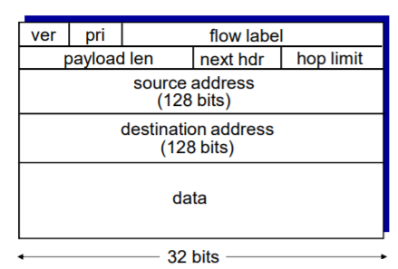

> 说明：
>
> - 固定的40字节头部
>
> - 数据报传输过程中，不允许分片
>
>   > 考虑如果分组太大，超过链路层的最大传输单元MTU，该如何处理？
>   >
>   > 分组会被丢掉，同时向源主机发送一个ICMPv6的错误报告，目的让源主机重新发送更小的分组。
>
> - 长度由32位变为128位
>
> - Priority（pri）: 标示流中数据报的优先级
>
> - Flow Label（流标签）：标示数据报在一个“flow”
>
>   同一个IP发送出去的同一个会话的数据，可以形成一个流，让网络对同一个流的数据做同样的处理
>
> - Next header：标示上层协议（相当于IPv4中的upper layer（上层协议））
>
>   标识传来的数据应该交给上层的哪一个协议实体去处理。
>
> - hop limit：（相当于IPv4中的TTL）
>
> 相比于IPv4的其他变化：
>
> - Checksum: 被移除掉，降低在每一段中的处理速度
> - Options: 允许，但是在头部之外, 被 “Next Header” 字段标示
> - ICMPv6: 新增ICMP的新版本
>   - 附加了报文类型，例如：“Packet Too Big”
>   - 增加多播组管理功能

IPv4到IPv6的过渡：

不是所有的路由器都能够同时升级的，那么在IPv4和IPv6路由器混合时，网络如何运转？

同时升级不可行，因此只能采用平滑升级。

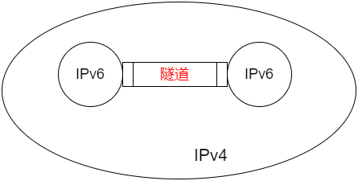

> 分析上图，在目前一段时间内，可能有部分支持IPv6设备，它们在整个IPv4的“网络海洋”中犹如一个个的“孤岛”，支持IPv6与IPv4的设备不能相互通信（当然IPv6内部的网络可以通信，IPv4同样如此），如果一个IPv6的“孤岛”想向另一个IPv6的“孤岛”发送信息，只需要给分组在IPv4的“网络海洋”之中准备一艘“小船”就好，或者是隧道。

隧道: 在IPv4路由器之间传输的IPv4数据报中携带IPv6数据报

> 在IPv6与IPv4的边缘有同时支持两种协议的双栈协议。

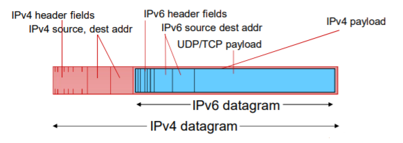

可以将IPv6的数据报封装在IPv4的数据报当中，进行传输。

*（⚠️ 原图已失效）*

> 全面部署IPv6还需要很长一段时间，当慢慢地网络变成IPv6的“海洋”时，IPv4称为“孤岛”，那么则使用IPv6的隧道进行数据报传输，直到最后全面部署IPv6，完成平滑过渡。

## 路由选择算法

### 路由（route）

路由：按照某种指标(传输延迟,所经过的站点数目等)找到一条从源节点到目标节点的较好路径。

> - 较好路径: 按照某种指标较小的路径
>
> - 指标:站数, 延迟,费用,队列长度等, 或者是一些单纯指标的加权平均
>
>   采用什么样的指标,表示网络使用者希望网络在什么方面表现突出,什么指标网络使用者比较重视

路由的计算单位：网络（子网）

> 以IPv4为例，如果仅以精确的IP地址为计算单位，一共有232个，那么这个计算量过于庞大。

- 网络为单位进行路由，路由信息传输、计算和匹配的代价低
- 前提条件是：一个网络所有节点地址前缀相同，且物理上聚集
- 路由就是：计算网络到其他网络如何走的问题（路由信息通告+路由计算）

网络 - 网络的路由 = 路由器 - 路由器间的路由

- 网络对应的路由器到其他网络对应的路由器的路由
- 在一个网络中：路由器 - 主机之间的通信，链路层解决
- 到了这个路由器就是到了这个网络

路由器 - 路由器之间的最优路径 = 主机对之间的最优路径

- 路由器连接子网，子网到路由器之间的跳数就是一跳，必须要走
- 路由器到下一跳路由器（节点到节点）之间的最优路径找到了，也就找到了从源子网向目标子网所有主机对之间的最优路径
- 大大降低了路由计算的规模
- 在路由计算中按照子网到子网的路径计算为目标，而不是主机到主机

路由选择算法(routing algorithm)：网络层软件的一部分,完成路由功能

下图为网络的图抽象

*（⚠️ 原图已失效）*

> 说明：
>
> - 节点：路由器
> - 边：把路由器连接在一起的网络或者是点到点的链路

边的代价（Cost of path）：

- 表示方式：c(x,x‘) → 链路的代价 (x,x’)

> 举例：c(w,z) = 5

- 代价可能总为１
- 或是链路带宽的倒数
- 或是拥塞情况的倒数

路由的输入：拓扑、边的代价、源节点

**最优化原则(optimality principle)**

路由算法的最终目的是找到汇集树（sink tree）

- 此节点到所有其它节点的最优路径形成的树
- 路由选择算法就是为所有路由器找到并使用汇集树

**路由选择算法的原则：**

- 正确性(correctness)：

  算法必须是正确的和完整的,使分组一站一站接力，正确发向目标站；完整：目标所有的站地址，在路由表中都能找到相应的表项；没有处理不了的目标站地址；

- 简单性(simplicity)：

  算法在计算机上应简单：最优但复杂的算法，时间上延迟很大，不实用，不应为了获取路由信息增加很多的通信量；

  > 在一条公路上，为了市民更好的通行而派出大量的警力去维持秩序，结果警力就占用了公路的三分之二，显然是不合理的。

- 健壮性(robustness)：

  算法应能适应**通信量**和**网络拓扑**的变化：通信量变化，网络拓扑的变化算法能很快适应；不向很拥挤的链路发数据，不向断了的链路发送数据；

  > - 两个路由节点之间的通信链路的传输速度有可能会发生改变
  > - 网络拓扑有可能发生改变：可能A、B两个节点原来是有通路的，结果这条通路又断掉了
  >
  > 算法应该要适应这些变化。

- 稳定性(stability)：

  产生的路由不应该摇摆

- 公平性(fairness)：

  对每一个站点都公平

- 最优性(optimality)：

  某一个指标的最优，时间上，费用上，等指标，或综合指标；实际上，获取最优的结果代价较高，可以是次优的

路由算法的分类：

从一个角度来看，可分为全局、分布式

- 全局：
  - 所有的路由器拥有完整的拓扑和边的代价的信息
  - link state 算法
- 分布式：
  - 路由器只知道与它有物理连接关系的邻居路由器，和到相应邻居路由器的代价值
  - 叠代地与邻居交换路由信息、 计算路由信息
  - distance vector 算法

从另一个角度看，可分为静态、动态

- 静态：
  - 路由随时间变化缓慢
  - 非自适应算法(non-adaptive algorithm)：不能适应网络拓扑和通信量的变化,路由表是事先计算好的
- 动态：
  - 路由变化很快
    - 周期性更新
    - 根据链路代价的变化而变化
  - 自适应路由选择(adaptive algorithm)：能适应网络拓扑和通信量的变化

### 链路状态算法（link state，LS）

链路状态算法就是著名的迪杰斯特拉(Dijkstra)算法。

配置LS路由选择算法的路由工作过程：

- 各点通过各种渠道获得整个网络拓扑, 网络中所有链路代价等信息（这部分和算法没关系，属于协议和实现）

- 使用LS路由算法,计算本站点到其它站点的最优路径(汇集树),得到路由表

- 按照此路由表转发分组(datagram方式)【数据平面的工作】

  - 分发到输入端口的网络层（严格意义上说不是路由的一个步骤）

  

#### 基本工作过程

链路状态（LS）路由的基本工作过程：

1.  发现相邻节点,获知对方网络地址

    - 一个路由器上电之后,向所有线路发送`HELLO`分组
    - 其它路由器收到`HELLO`分组,回送应答,在应答分组中,告知自己的名字(全局唯一)
    - 在LAN中,通过广播`HELLO`分组,获得其它路由器的信息,可以认为引入一个人工节点

2.  测量到相邻节点的代价(延迟,开销)

    - 实测法,发送一个分组要求对方立即响应
    - 回送一个`ECHO`分组
    - 通过测量时间可以估算出延迟情况

3.  组装一个链路状态（LS）分组,描述它到相邻节点的代价情况

    - 发送者名称
    - 序号,年龄
    - 列表: 给出它相邻节点,和它到相邻节点的延迟

4.  将分组通过扩散（泛洪）的方法发到所有其它路由器

    - 顺序号:用于控制无穷的扩散,每个路由器都记录(源路由器,顺序号),发现重复的或老的就不扩散（网络是一个环状的，不加以控制可以一直扩散下去，形成”广播风暴“，浪费了大量的资源，）

      > 具体问题：
      >
      > - 具体问题1: 循环使用问题
      > - 具体问题2: 路由器崩溃之后序号从0开始
      > - 具体问题3:序号出现错误
      >
      > 解决方案：年龄字段(age)
      >
      > - 生成一个分组时,年龄字段不为0
      > - 每个一个时间段,AGE字段减1
      > - AGE字段为0的分组将被抛弃

    - 关于扩散分组的数据结构

      - Source ：从哪个节点收到LS分组
      - Seq，Age：序号,年龄
      - Send flags：发送标记,必须向指定的哪些相邻站点转发LS分组
      - ACK flags：本站点必须向哪些相邻站点发送应答
      - DATA：来自source站点的LS分组

    > 以上4步让每个路由器获得拓扑和边代价

5.  通过Dijkstra算法找出最短路径（这才是路由算法）

    - 路由器获得各站点LS分组和整个网络的拓扑
    - 通过Dijkstra算法计算出到其它各路由器的最短 路径(汇集树)
      - 每个节点独立算出来到其他节点（路由器=网络）的最短路径
      - 迭代算法：第k步能够知道本节点到k个其他节点的最短路径
    - 将计算结果安装到路由表中

#### 应用情况

链路状态的应用情况：

- OSPF协议是一种LS协议,被用于Internet上
- IS-IS(intermediate system - intermediate system)：被用于Internet主干中, Netware

#### 算法原理

符号标记：

- c(i,j)：从节点 i 到 j 链路代价（初始状态下非相邻节点之间的链路代价为∞）
- D(v)：从源节点到节点V的当前路径代价（节点的代价）
- P(v)：从源到节点V的路径前序节点
- N’: 当前已经知道最优路径的的节点集合（永久节点的集合）

节点标记：每一个节点使用(D(v),p(v))

> 如： (3,B) 标记

- D(v)从源节点由已知最优路径到达本节点的**距离**
- P(v)**前序节点**来标注

两类节点：

- 临时节点(tentative node)：还没有找到从源节点到此节点的最优路径的节点
- 永久节点(permanent node) **N’**：已经找到了从源节点到此节点的最优路径的节点

流程：

1.  初始化

    - 除了源节点外,所有节点都为临时节点
    - 节点代价除了与源节点代价相邻的节点外,都为∞

2.  从所有临时节点中找到一个节点代价最小的临时节点,将之变成永久节点（假设找到一个节点W）

3.  对此节点的所有在临时节点集合中的邻节点，假设为节点V

    - 如 D(v) \> D(w) + c(w,v), 则重新标注此点, (D(W)+C(W,V), W)

      > 即源节点到V节点的距离又有最小值，则更新

    - 否则，不重新标注

4.  返回第2步，开始一个新的循环

案例：

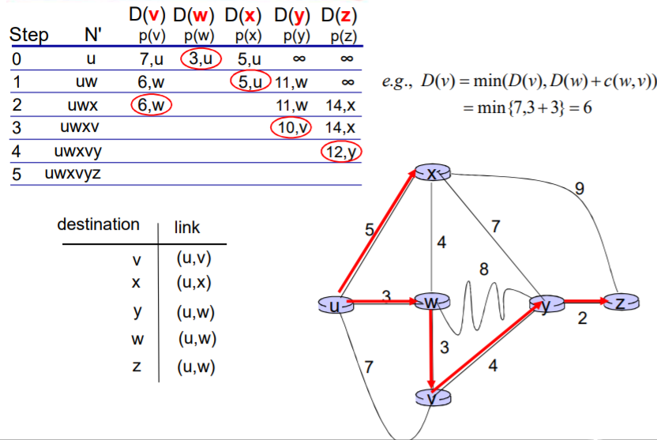

#### Dijkstra算法的讨论

- 算法复杂度: n节点

  - 每一次迭代: 需要检查所有不在永久集合N中节点
  - n(n+1)/2 次比较: O(n2)
  - 有很有效的实现: O(nlogn)

- 可能的震荡：

  举例：如果链路代价 = 链路承载的流量（拥塞程度）：

  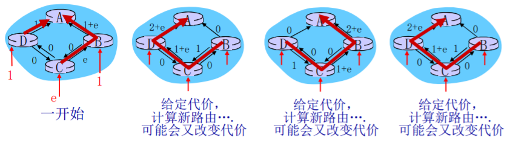

### 距离矢量算法（distance vector，DV）

- 动态路由算法之一
- DV算法历史及应用情况：
  - 1957 Bellman, 1962 Ford Fulkerson
  - 用于ARPANET, Internet(RIP) DECnet , Novell, ApplTalk
- 距离矢量路由选择的基本思想
  - 各路由器维护一张路由表
  - 各路由器与相邻路由器交换路由表
  - 根据获得的路由信息,更新路由表

如下图示例：

*（⚠️ 原图已失效）*

代价及相邻节点间代价的获得：

- 跳数(hops), 延迟(delay),队列长度
- 相邻节点间代价的获得：通过实测

路由信息的更新：

- 根据实测 得到本节点A到相邻站点的代价（如:延迟）
- 根据各相邻站点声称它们到目标站点B的代价
- 计算出本站点A经过各相邻站点到目标站点B的代价
- 找到一个最小的代价，和相应的下一个节点Z，到达节点 B经过此节点Z，并且代价为A-Z-B的代价

> 其它所有的目标节点一个计算法

#### 实例

如下图：

*（⚠️ 原图已失效）*

- 以当前节点J为例,相邻节点 A,I,H,K
- J测得到A,I,H,K的延迟为： 8ms,10ms,12ms,6ms
- 通过交换DV, 从A,I,H,K获得到它们到G的延迟为 18ms,31ms,6ms,31ms
- 因此从J经过A,I,H,K到G的延迟为26ms,41ms,18ms, 37ms
- 将到G的路由表项更新为18ms,下一跳为：H
- 其它目标一样，除了本节点J（分组从J到J当然为0）

#### 贝尔曼-福特（Bellman-Ford ）方程

实际上距离矢量算法是基于**贝尔曼-福特（Bellman-Ford ）方程**（动态规划）。

- 设：dx (y) = 从x到y的最小路径代价（x为源节点，y为目标节点）

- 则 dx (y) = min { c(x,v) + dv (y) }

  > - min：取所有x的邻居取最小的v
  > - c(x,v)：x到邻居v的代价
  > - dv (y)：从邻居v到目标y的代价

案例1：

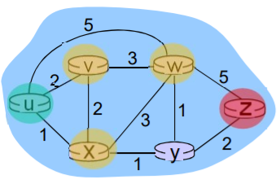

- 明显：dv (z) = 5 , dx (z) = 3 , dw (z) = 3

- 由 B-F 方程得到：

  du (z) = min { c(u,v) + dv (z) , c(u,x) + dx (z) , c(u,w) + dw (z) } = { 2+5 , 1+3 , 5+3 } = 4

核心思路：

- 每个节点都将自己的距离矢量估计值传送给邻居，定时或者DV有变化时，让对方去算

- 当x从邻居收到DV时，自己运算，更新它自己的距离矢量（采用B-F equation）

- Dx (y)估计值最终收敛于实际的最小代价值dx (y)

  > 是迭代算法、分布式算法

异步式,迭代：每次本地迭代被以下事件触发：

- 本地链路代价变化了
- 从邻居来了DV的更新消息

分布式：

- 每个节点只是在自己的DV改变之后向邻居通告
- 然后邻居们在有必要的时候通知他们的邻居

每个节点的动作如下图：

*（⚠️ 原图已失效）*

案例2：

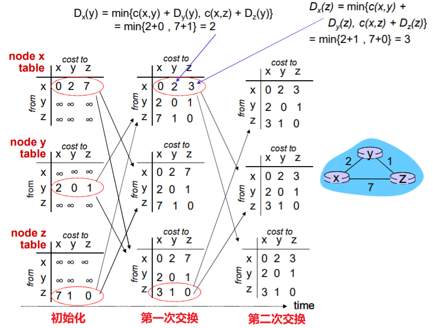

#### DV的特点

特点：

- 好消息传的快

  好消息的传播以每一个交换周期前进一个路由器的速度进行

  举例：假设刚架设的路由节点A，它与B连通了

  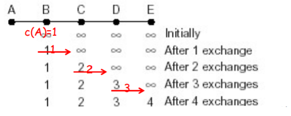

  > - 经过第一个周期，c(A,B) = 1
  > - 经过第二个周期，c(A,C) = 2
  > - 如此下去

- 坏消息传的慢（无穷计算问题）

  举例：路由节点A刚刚撤销了

  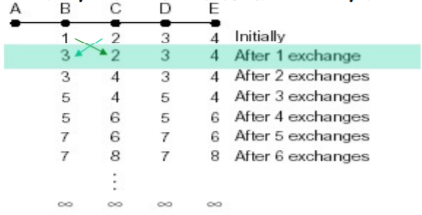

  > - 第一次交换之后, B从C处获得信息,C可以到达A(C-A,但是要经过B本身),但是路径是2,因此B变成3,从C处走
  > - 第二次交换,C从B处获得消息, B可以到达A,路径为3, 因此,C到A从B走,代价为4
  > - 形成了一个环路
  > - 无限次循环下去，到A的距离就变成了∞（不可达）

实际上有一种缓解环路（无穷计算）的情况，即水平分裂(split horizon)算法。

#### 水平分裂(split horizon)算法

> 注：有些教材也解释为“毒性逆转”。

一种对无穷计算问题的解决办法：

- 假设节点B直达A，C到A依赖于B，D到A依赖于B，C

- 现在突然A节点不可达

- C知道要经过B才能到达A，所以C向B报告它到A的距离为∞（虚假信息）；但是C告诉D它到A的真实距离

- 同样的，D告诉C它通向A的距离为∞（虚假信息），但是D告诉E它到A的真实距离

  > “左向虚假，右向真实”

- 这样在第一次交换的时候，B通过测试发现到A的路径为∞，而C也告诉B到A的距离为∞，因此B到A的距离为∞

- 在第二次交换的时候，C从B和D那里获知,到A的距离为∞，因此C到A的距离为∞

- 如此，坏消息也同样以一次交换一个节点的速度传播

值得注意的是，水平分裂算法在某些拓扑形式下会失败（存在环路），分析下图：

*（⚠️ 原图已失效）*

- A,B到D的距离为2, C到D的距离为1
- 现在假设C-D通路销毁
- C获知到D的距离为∞，从A,B获知到D的距离为∞，因此C认为D不可达
- A从C获知D的距离为∞，但从B处获知它到D的距离为2，因此A到B的距离为3，从B走
- B也有类似的问题
- 经过无限次之后，A和B都知道到D的距离为∞

### LS 和 DV 算法的比较

下面我们来分析链路状态算法和距离矢量算法的差别：

- 消息复杂度

  - LS: 有 n 节点, E 条链路,发送 报文O(nE)个
    - 局部的路由信息；全局传播
  - 只和邻居交换信息
    - 全局的路由信息，局部传播
  - 距离矢量算法更优

- 收敛时间

  - LS：O(n2) 算法
    - 有可能震荡
  - DV: 收敛较慢
    - 可能存在路由环路（无限循环问题）
  - 链路状态算法更优

- 健壮性：如果路由器故障会发生什么

  - LS：

    - 节点会通告不正确的链路代价
    - 每个节点只计算自己的路由表
    - 错误信息影响较小，局部，路由较健壮

  - DV：

    - DV 节点可能通告对全网所有节点的不正确路径代价

    - 每一个节点的路由表可能被其它节点使用

      > 假如一个节点出现错误，通告全网到此路由的代价为0，那么全网的所有分组就都会涌向此节点

    - 错误可以扩散到全网

  - 链路状态算法更优

> 两种路由选择算法都有其优缺点，而且在互联网上都有应用。

## 因特网中自治系统（AS）内部的路由选择

### 路由选择信息协议（Routing Information Protocol，RIP）

- 在 1982年发布的BSD-UNIX 中实现

- 基于距离矢量算法：

  - 距离矢量：每条链路cost = 1，

    代价就是跳数 (max = 15 hops，16代表目标不可达)

  - 约定V每隔30秒和邻居交换距离矢量（DV），通告

    - 情况一：定期30秒，而且在改变路由的时候发送通告报文
    - 情况二：在对方的请求下也可以发送通告报文

  - 每个通告包括：最多25个目标子网

    - 内容：目标网络 + 跳数（最大跳数为16，表示不可达）

下图是一个RIP协议的实例：

*（⚠️ 原图已失效）*

如果此时，节点A发送给D新的距离矢量，告知A到Z的跳数为4，那么D的距离矢量就会更新，如下图：

*（⚠️ 原图已失效）*

#### 链路失效和恢复

如果180秒（6个周期）没有收到通告信息，则表示邻居或者链路失效

- 发现经过这个邻居的路由已失效
- 新的通告报文会传递给邻居
- 邻居因此发出新的通告 (如果路由变化的话)
- 使用毒性逆转（poison reverse）/水平分裂算法，阻止ping-pong回路 ( 不可达的距离：跳数无限 = 16 段)

#### RIP 进程处理

- RIP 以应用进程的方式实现：route-d (daemon)

- 通告报文通过UDP报文传送，周期性重复

- 网络层的协议使用了传输层的服务，以应用层实体的方式实现

  > 这一点很有趣，网络层的功能以应用进程的形式来实现，为了实现这个功能，还要借助传输层来传输距离矢量DV
  >
  > 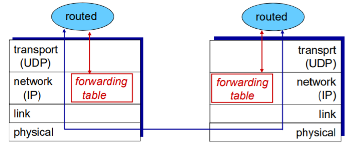

### 开放最短路优先（Open Shortest Path First，OSFP）

- “open”：标准可公开获得

- 使用链路状态算法：

  - LS 分组在网络中（一个AS内部）分发
  - 全局网络拓扑、代价在每一个节点中都保持
  - 路由计算采用Dijkstra算法

- OSPF通告信息中携带：每一个邻居路由器一个表项

  > “我是谁”，传输的链路状态分组是第几个版本，TTL
  >
  > “我有哪些邻居，我到邻居的代价是多少”

- 通告信息会传遍AS全部（通过泛洪）

  - 在IP数据报上直接传送OSPF报文 (而不是通过UDP和TCP)

- IS-IS路由协议：几乎和OSPF一样

#### OSPF高级特性

这些特性是在RIP中所没有的。

- 安全: 所有的OSPF报文都是经过认证的 (防止恶意的攻击)

- 允许有多个代价相同的路径存在 (在RIP协议中只有一个)

  > 可以在代价相同的节点作“负载均衡”。

- 对于每一个链路，对于不同的TOS有多重代价矩阵

  > 例如：卫星链路代价对于尽力而为的服务代价设置比较低，对实时服务代价设置的比较高
  >
  > 支持按照不同的代价计算最优路径，如：按照时间和延迟分别计算最优路径

- 对单播和多播的集成支持：

  - Multicast OSPF (MOSPF) 使用相同的拓扑数据库，就像在OSPF中一样

- 在大型网络中支持`层次性OSPF`

  *（⚠️ 原图已失效）*

  > 如果网络比较大，可以把自治区域划分成：骨干区域（backbone）、区域一、区域二…
  >
  > 不同的小区域之间的分组转发都需要借助区域边界路由器（area border routers），先将其路由至骨干区域。
  >
  > 泛洪仅在小区域内部进行。
  >
  > 分组的传递过程：小区域 →（通过区域边界路由器）→ 骨干区域 →（通过边界路由器）→ 传送到其他子网（依然通过另一个子网的骨干区域到达小区域）

层次性的OSPF路由：

- 两个级别的层次性: 本地, 骨干

  - 链路状态通告仅仅在本地区域Area范围内进行

  - 每一个节点拥有本地区域的拓扑信息

    > 关于其他区域，知道去它的方向，通过区域边界路由器（最短路径）

- 区域边界路由器: “汇总（聚集）”到自己区域内网络的距离, 向其它区域边界路由器通告

  > 同时参与了两个区域的路由计算

- 骨干路由器: 仅仅在骨干区域内，运行OSPF路由

- 边界路由器: 连接其它的自治系统（AS’s）

> 小结一下：
>
> 如果

## ISP之间的路由选择

### 一个平面的路由

- 一个网络中的所有路由器的地位一样
- 通过LS, DV，或者其他路由算法，所有路由器都要知道其他所有路由器（子网）如何走
- 所有路由器在一个平面
- 平面路由的问题：
  - 规模巨大的网络中，路由信息的存储、传输和计算代价巨大：
    - DV: 距离矢量很大，且不能够收敛
    - LS：几百万个节点的LS分组的泛洪传输，存储以及最短路径算法的计算
  - 管理问题：
    - 不同的网络所有者希望按照自己的方式管理网络
    - 一方面希望对外隐藏自己网络的细节
    - 当然，还希望和其它网络互联

一个平面的路由面临计算成本的高昂代价以及管理问题，为此出现了一个解决方案：层次路由。

### 层次路由

> 将互联网中的路由问题分为两个层面（按照物理分布范围）：
>
> - 自治区域内
> - 自治区域间

- 层次路由：将互联网分成一个个自治区域AS(路由器区域)

  - 某个区域内的路由器集合，自治系统（autonomous systems ，AS)
  - 一个AS用 `AS Number（ASN)`唯一标示
  - 一个ISP可能包括一个或者多个AS

- 路由变成了两个层次的路由：

  - AS内部路由：在同一个AS内路由器运行相同的路由协议
    - **intra-AS routing protocol：内部网关协议**
    - 不同的AS可能运行着不同的内部网关协议（如：LS，DV）
    - 能够解决规模和管理问题
    - 如：RIP,OSPF,IGRP
    - 网关路由器：AS边缘路由器，可以连接到其他AS
  - AS间运行AS间路由协议
    - **inter-AS routing protocol：外部网关协议**
    - 解决AS之间的路由问题，完成AS之间的互联互通

- 层次路由的优点：

  - 解决了规模问题：

    - 内部网关协议解决：AS内部数量有限的路由器相互到达的问题, AS内部规模可控

      > 如果AS节点太多，可继续分割AS，使得AS内部的节点数量有限

    - AS之间的路由的规模问题：

      - 增加一个AS，对于AS之间的路由从总体上来说，只是增加了一个节点=子网（每个AS可以用一个点来表示）
      - 对于其他AS来说只是增加了一 个表项，就是这个新增的AS如何走的问题
      - 扩展性强：规模增大，性能不会减得太多

  - 解决了管理问题：

    - 各个AS可以运行不同的内部网关协议
    - 可以使自己网络的细节不向外透露，增加安全性

### 边界网关协议（Border Gateway Protocol，BGP）

- BGP (Border Gateway Protocol): 自治区域间路由协议“事实上的”标准

  > 将互联网各个AS粘在一起的胶水

- BGP 提供给每个AS以以下方法：

  - eBGP: 从相邻的ASes那里获得子网可达信息（外部）

  - iBGP: 将获得的子网可达信息传遍到AS内部的所有路由器（内部）

  - 根据子网可达信息和策略来决定到达子网的“最优”路径

    *（⚠️ 原图已失效）*

- 允许子网向互联网其他网络通告“我在这里”

- 基于距离矢量算法（路径矢量）

  - 这是一种“改进”后的距离矢量
  - 不仅仅是距离矢量，还包括到达各个目标网络的详细路径（AS序号的列表）能够避免简单DV算法的路由环路问题

#### BGP会话

- BGP 会话: 两个BGP路由器(“peers”)在一个半永久的TCP连接上 交换BGP报文（包括子网可达信息）:

  - 通告向不同目标子网前缀的“路径”（BGP是一个“路径矢量”协议）

- 当AS3中新增了X节点（如下图）：

  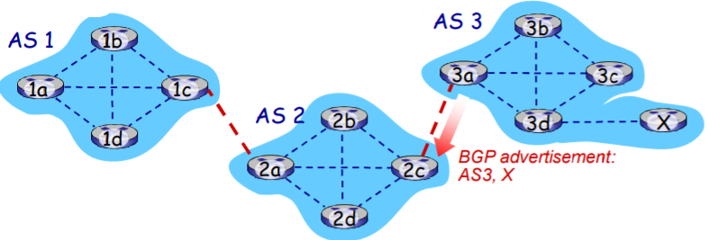

  当AS3网关路由器3a向AS2的网关路由器2c通告路径： AS3,X

  - 3a参与AS内路由运算，知道本AS所有子网X信息
  - 语义上：AS3向AS2承诺，它可以向子网X转发数据报
  - 3a是2c关于X的下一跳（next hop）

路径的属性：

- 当通告一个子网前缀时，通告包括 BGP 属性：
  - prefix + attributes = “route”
- 两个重要的属性：
  - **AS-PATH**: 前缀的通告所经过的AS列表: AS 67、AS 17
    - 检测环路；多路径选择
    - 在向其它AS转发时，需要将自己的AS号加在路径上
  - **NEXT-HOP**: 从当前AS到下一跳AS有多个链路，在NETX-HOP属性中，告诉对方通过那个 链路转发
  - 其它属性：路由偏好指标，如何被插入的属性

BGP是基于策略的路由：

- 当一个网关路由器接收到了一个路由通告, 使用**输入策略**来接受或过滤（accept / decline）
  - 过滤原因例1：不想经过某个AS，转发某些前缀的分组
  - 过滤原因例2：已经有了一条往某前缀的偏好路径
- 策略也决定了是否向它别的邻居通告收到的这个路由信息

#### BGP路径通告

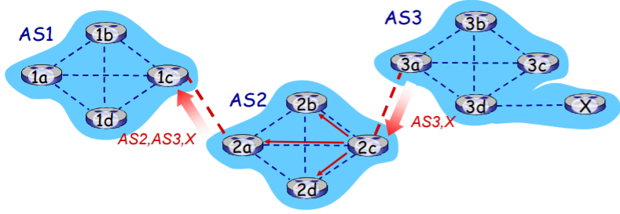

- 路由器AS2.2c从AS3.3a接收到的AS3,X路由通告 (通过eBGP)

- 基于AS2的输入策略，AS2.2c决定接收AS3,X的通告，而且通过iBGP（TCP连接）向AS2的所有路由器进行通告

- 基于AS2的策略，AS2路由器2a通过eBGP向AS1.1c路由器通告 AS2,AS3,X 路由信息

  > 路径上加上了 AS2自己作为AS序列的一跳

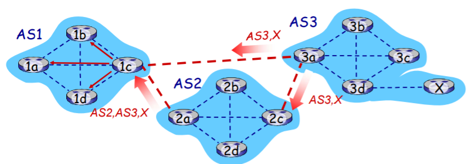

网关路由器可能获取有关一个子网X的多条路径，从多个eBGP 会话上：

- AS1 网关路由器1c从2a学习到路径：`AS2,AS3,X`

- AS1网关路由器1c从3a处学习到路径：`AS3,X`

- 基于策略，AS1路由器1c选择了路径：`AS3,X`，而且通过iBGP告诉所有AS1内部的路由器

  > 不一定跳数少即判定为代价小，要基于策略的判断
  >
  > 有政治策略（例如：敌对公司）、经济策略等

#### BGP报文

- 使用TCP协议交换BGP报文

- BGP 报文：

  `OPEN`：打开TCP连接，认证发送方

  `UPDATE`：通告新路径 (或者撤销原路径)

  `KEEPALIVE`：在没有更新时保持连接，也用于对 OPEN 请求确认

  `NOTIFICATION`：报告以前消息的错误，也用来关闭连接

问题：一个自治区域（AS1）中的普通路由器如何才能将分组传递到另一个自治区域（AS2）内的路由器？

区域边界路由器可以通过外部网关协议获知AS2中路由器的存在，并通过内部网关协议通告AS1中所有的路由器。

#### BGP 路径选择

- 路由器可能获得一个网络前缀的多个路径，路由器必须进行路径的选择，路由选择可以基于：
  - 本地偏好值属性: 偏好策略决定
  - 最短AS-PATH：AS的跳数
  - 最近的NEXT-HOP路由器：热土豆路由（给最近的）
  - 附加的判据：使用BGP标示
- 一个前缀对应着多种路径，采用消除规则直到留下一条路径

#### 热土豆路由

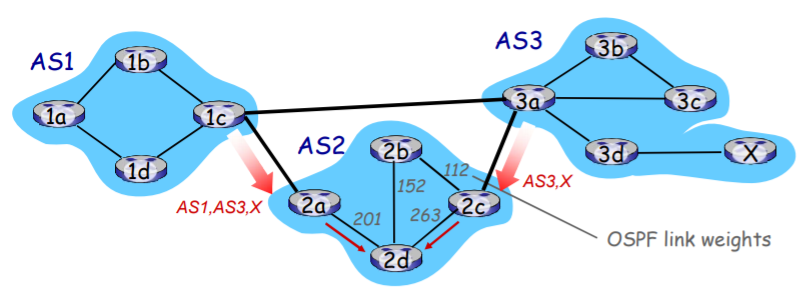

- 2d通过iBGP获知，它可以通过2a或者2c到达X
- 热土豆策略：选择具备最小内部区域代价的网关作为往X的出口（如：2d选择2a，即使往X可能有比较多的AS跳数）：**不要操心域间的代价**

### 内部网关协议与外部网关协议的不同

- 策略：
  - Inter-AS: 管理员需要控制通信路径，谁在使用它的网络进行数据传输
  - Intra-AS: 一个管理者，所以无需策略
    - AS内部的各子网的主机尽可能地利用资源进行快速路由
- 规模：
  - AS间路由必须考虑规模问题，以便支持全网的数据转发
  - AS内部路由规模不是一个大的问题
    - 如果AS 太大，可将此AS分成小的AS；规模可控
    - AS之间只不过多了一个点而已
    - 或者AS内部路由支持层次性，层次性路由节约了表空间, 降低了更新的数据流量
- 性能：
  - Intra-AS: 关注性能
  - Inter-AS: 策略可能比性能更重要

------------------------------------------------------------------------

# 后记

本篇已完结

（如有补充或错误，欢迎评论区留言）
