# 计算机网络学习笔记--计算机网络概述

> 📌 转载自 **花猪のBlog（作者 CNhuazhu）** —— 原文：https://cnhuazhu.top/butterfly/2021/03/09/%E8%AE%A1%E7%AE%97%E6%9C%BA%E7%BD%91%E7%BB%9C/%E8%AE%A1%E7%AE%97%E6%9C%BA%E7%BD%91%E7%BB%9C%E5%AD%A6%E4%B9%A0%E7%AC%94%E8%AE%B0-%E8%AE%A1%E7%AE%97%E6%9C%BA%E7%BD%91%E7%BB%9C%E6%A6%82%E8%BF%B0/
> 学习笔记，版权归原作者所有，仅供学弟学妹学习参考；如有侵权请联系删除。

---

# 前言

*正在学习计算机网络这门课程，顺便做个笔记，记录一下知识点。*

> 参考资料：
>
> 中科大郑烇老师全套《计算机网络（自顶向下方法 第7版，James F.Kurose，Keith W.Ross）》课程：<a href="https://www.bilibili.com/video/BV1JV411t7ow?p=1" target="_blank" rel="noopener external nofollow noreferrer">https://www.bilibili.com/video/BV1JV411t7ow?p=1</a>
>
> 《计算机网络（自顶向下方法 第7版，James F.Kurose，Keith W.Ross）》

------------------------------------------------------------------------

# 第一章：计算机网络概述

为了更好的理解`Internet（互联网`）这个概念，先从简单的`网络`概念说起：通俗的理解网络，就是由许多**节点**和**边**组成的系统。当我们把这些节点和边具象化之后，计算机网络以及Internet的概念就更容易理解了。

## 计算机网络

通俗的解释计算机网络的概念：**联网的计算机所构成的系统。**

其“节点”分为两类：分别为**主机节点**以及**数据交换节点**。

- 主机节点： 主机及其上运行的应用程序（是数据的源或目标）。

  举例：ipad、手机、智能冰箱…

- 数据交换节点： 路由器、交换机等网络交换设备（既不是数据的源也不是目标，而是数据的中转节点）。

其“边”（通信链路）同样分为两类：分别为**接入网链路**以及**主干链路**。其作用是将各个节点连接在一起。

- 接入网链路：主机连接到互联网的链路。
- 主干链路：路由器之间的链路。

仅仅依靠所谓的“节点”和“边”是无法进行互联网间的通信的，还有一个要素就是**协议**。

- 协议（protocol）：定义了在两个或多个通信实体之间交换的报文的格式和顺序，以及报文发送和/或接收一条报文或其他事件所采取的动作。

Internet 中所有的通信行为都受协议制约。

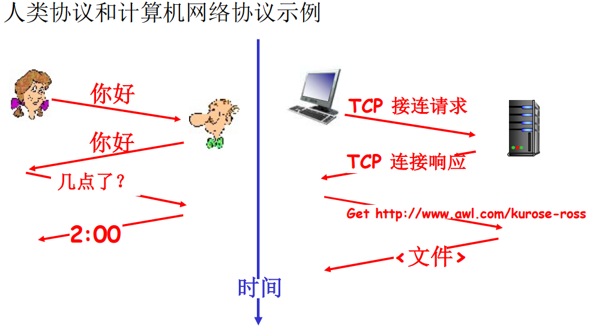

至此我们可以大致理解计算机网络的概念。

## Internet（互联网）

以TCP/IP协议为主的一簇协议，由该协议支撑起的计算机网络。

我们可以从两方面理解到底何为Internet：一个方面是从Internet的具体构成角度（即上文所提），另一方面是从服务的角度来理解。

### 从具体构成的角度

- 数以亿计的、互联的计算设备，具体包括：

  主机（host）= 端系统（end system）

  在操作系统中驻留的网络应用程序

- 通信链路

  举例：光纤、同轴电缆、无线电、卫星

  传输速率 = 带宽（bps）

  > 注意区分：
  >
  > 存储常用字节Byte：K/M/G层级为2^10进制
  >
  > 传输常用比特Bit：K/M/G层级为10^3进制

- 分组交换设备：转发分组（packets）。

  举例：路由器、交换机…

- 协议：控制发送、接收消息。

  举例：TCP、IP、HTTP、FTP、PPP…

- Internet标准：

  RFC（Request for comments）：请求评述

  IETF（Internet Engineering Task Force）：互联网工程任务组

- Internet即“网络的网络”

  > 理解：
  >
  > - 很多网络通过网络互联设备连接在一起
  > - 网络之下还包括很多小网络
  > - 小网络之间也可以任意互联

### 从服务的角度

**分布式的应用进程**以及为分布式应用进程提供通讯服务的**基础设施**。

> 基础设施：包括主机以及应用层以下的所有协议实体。

- 使用通信设施进行通信的分布式应用

  举例：Web、VoIP、email、分布式游戏、电子商务、社交网络…

- 通信基础设施为apps提供编程接口（通信服务）：将发送和接收数据的apps与互联网连接起来。

  > 通信服务分为两种：
  >
  > - 面向连接的服务：以TCP/IP协议向应用进程提供服务的形式。
  > - 无连接的服务：以UDP协议向应用进程提供服务的形式。

### 网络结构

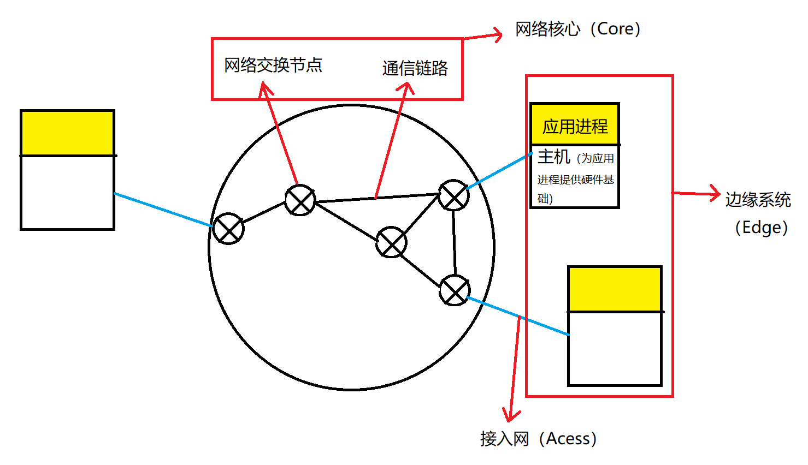

如上图，网络结构主要由三个部分组成：**网络边缘（Edge）**、**网络核心（Core）**、**接入网（Acess）\物理媒体**

- 网络边缘：包括应用进程（程序）以及为其提供硬件基础服务的主机。边缘上运行的网络应用是网络存在理由。
- 网络核心：包括网络交换节点（路由）以及节点间的通信链路。边缘主机只有通过接入网连接到网络核心才可以实现相互间的信息传递。
- 接入网：有线或无线的通信链路。其作用是将边缘的主机系统接入到网络核心中去。

## 网络边缘

网络边缘就是端系统（主机），包括网络应用（如：Web、Email）和支持网络应用的硬件设备。应用进程可以说是整个网络系统存在的理由，其中不同边缘的应用进程通过网络进行数据交换。

应用进程间的通讯模式有两种：

1.  C/S模式（客户端/服务器）：有着明确的客户端以及服务器。其特点也是该模式比较致命的问题：扩展性差。一个服务器的请求载荷是有限的，随着客户端的请求载荷增加，服务器的压力会越来越大，处理能力就会逐渐下降。一旦请求载荷超过某一个阈值时，服务器的处理能力就会出现断崖式下跌。目前的解决方式就是增加服务器的部署。
2.  P2P模式（peer-peer）：没有明确的客户端或者服务器的界限。每一个分布式的应用进程既可以是客户端，又可以是服务器。这样的模式可以很好地解决C/S模式中扩展性差的问题，因为随着请求服务的节点增加，从某种意义上来说提供服务的节点也在相应地增加。（实例：迅雷、BitTorrenth）

基础设施为网络应用提供的服务有两种方式：

> - 理解基础设施的概念：在网络应用（应用进程）下层的所有内容，包括主机、接入网、网络核心等，都统一理解为基础设施。
> - 两种服务方式的目的都是在端系统之间传输数据。

1.  面向连接的通信方式：

    代表：TCP服务（Transmission Control Protocol，传输控制协议）

    有握手：目的是两个通信主机间为连接建立状态，有一个数据传输前的准备的过程。

    特性：

    - **可靠地、按顺序地传送数据**：不同端系统间的通信归根到底都是数据通过底层的物理信道进行传输，如何保证物理信息在传输时准确，TCP服务给予保证。
    - **流量控制**：在信息传输时存在这样一种情况，即服务器的能力很强，可以高速地发送大量数据，但是信息接收方（客户端）接收、处理信息的能力很弱，二者的速度不匹配，信息传输就容易造成错误。TCP协议实体可以发送反馈，从而协调好发送方和接收方的速度，致使发送方不会淹没接收方。
    - **拥塞控制**：信息传输时还有一种情况：信息发送和接收双方的能力都很强，但是网络核心中的传输信道发生拥塞，如果此时发送方仍然不断地向外大量发送数据，很可能造成数据的丢失。TCP协议就可以根据情况判断，当网络拥塞时，控制发送方降低信息发送速率。

    使用TCP的应用： HTTP (Web)、FTP (文件传送)、Telnet (远程登录)、SMTP（email）

2.  无连接服务：

    代表：UDP服务（User Datagram Protocol，用户数据报协议）

    无握手：直接传输数据，没有传输前的准备过程。

    特性：

    - **数据传输不可靠**
    - **无流量控制**
    - **无拥塞控制**

    UDP服务不能保证信息传输的准确性，但是它的存在也具有价值。一些实时流媒体应用对于数据传输的延迟是无法接受的，UDP服务正是省去了信息传输的很多步骤从而保证了信息传输的速度。

    使用UDP的应用：流媒体、远程会议、DNS、Internet电话

## 网络核心

网络核心由**数据交换节点**和其间的**通信链路**组成。

网络核心的主要功能是：

- **路由**：决定分组采用的源主机到目标主机的路径（全局）
- **转发**：将分组从路由器的输入链路转移到输出链路（局部）

通信网络大致可以按照如下方式分类：

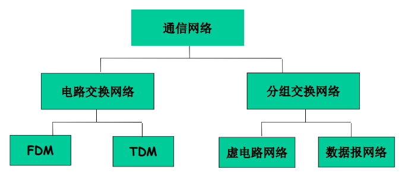

### 电路交换网络

端到端的资源被分配给从源端到目标端的呼叫（建立起一条专有链路）。

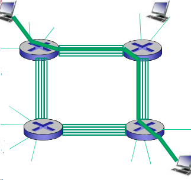

如图：每段链路有4条链路。从左上到右下角主机间建立了呼叫。该呼叫采用了上面链路的第2个线路，右边链路的第1个线路。

电路交换网络的特点是**资源独享**，即便主机间建立连接后无数据传输，也会占用线路资源，从而使其他用户无法使用，导致资源浪费。但是这种连接方式保证了性能，多用于传统电话网络，而不适用计算机间的连接。

> 计算机之间的通信不像电话，它具有很强的突发性，两台主机建立连接后并不是时时刻刻都在进行数据传输。（如浏览网页，用户发起请求之后的很长一部分时间都在进行页面浏览，此时并没有数据传输）

为了提高电路交换网络的使用效率，网络资源（如带宽）被分成“片段”，同时被多位用户使用。像这样分成片段的方式主要有：

- 频分（Frequency-division multiplexing）
- 时分（Time-division multiplexing）
- 波分（Wave-division multiplexing)）

**频分（FDM）**：将带宽分成几个片段，不同的用户使用不同的片段。

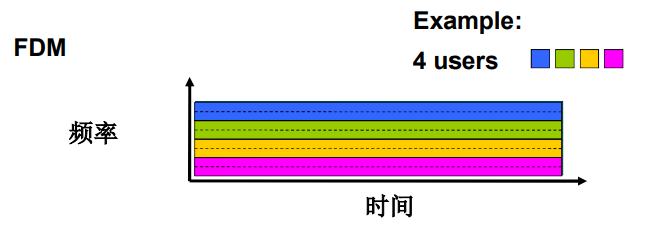

**时分（TDM）**：将带宽按周期分为成许多片段，每一个周期再分为几个不同的时隙（slot），每位用户固定使用其中的一个时隙。

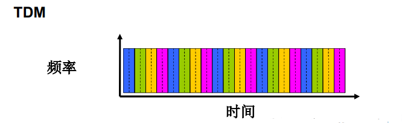

**波分（WDM）**：多用于光电路传输，把光信号分成不同波段，分给不同用户使用。

### 分组交换网络

将要传输的数据分成一个个的单位：**分组/包（packet）**

与电路交换网络不同，采用分组交换网路通信时，数据传输会占用通信链路的全部带宽。

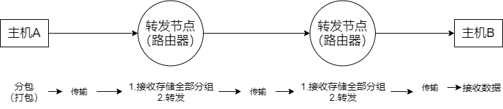

主机间的数据传输过程如图：转发节点接收前一个节点传来的分组，并存储起来，等分组的全部传输完成之后，再将数据传输给下一个节点。（存储-转发）

> 需要注意的是：每一个节点都必须接收分组的全部之后才能向后传递。如果边接收分组，边向后传输，就会造成多段通信链路全部处于占用状态，致使其他用户无法使用。分组也就失去了意义。

> 例子：如图，长度为**L = 7.5Mbits**的分组，在一个速率为**R = 1.5Mbps**的链路中传输，三次存储-转发的延时为**3 × (7.5 / 1.5)s = 15s**.

分组交换网络的**优势**就是：按需使用。即有需要时才占用网络资源。

但是这较于电路交换网络的延迟会高很多，延迟的具体组成分为两部分：

- 节点对分组进行存储
- 排队时间

> 分组交换的排队延迟和丢失：
>
> 当转发节点的**数据到达速率\>链路的输出速率**时，分组将会进行排队，如果路由器的缓存用尽，分组将会丢失。
>
> 为了保证数据可靠地传输，就需要协议来约束：拥塞控制

了解了分组交换网络的数据传输原理，就可以引出**统计时分多路复用（statistical time division multiplexing，STDM）**：

这个概念很像时分多路复用（TDM），区别在于：由于每个分组的传输时间不同，因此对于带宽无绝对的时间划分方式（每个时隙是不同的）。

**同样的网络资源，分组交换网络较电路交换网络允许更多的用户使用。**（具体的计算过程不赘述，但很有趣)

#### 存储-转发

分组的存储转发一段一段从源端到目标端，按照有无网络层的连接可分为两种：

- 数据报（datagram）网络
- 虚电路（virtual circuit）网络

数据报网络：

- 在通信之前无需建立连接，一有数据就传输。
- 每一个分组都独立路由（路径不一样，可能会失序）。
- 源主机发送给目标主机的分组，携带了目标主机的完整地址，路由器根据分组的目标地址进行路由。
- 路由器不会维护主机间的通讯状态。

虚电路网络：

- 在通信之前，主机间需要先通过**信令**建立连接，分组传输路径保持不变。
- 每个分组都带标签（虚电路标识VCID），标签决定了下一个跳转。
- 路由器会维持每个呼叫的状态信息。

## 接入网和物理媒体

将端系统和边缘路由器连接的方式可以分为三类：住宅接入网络；单位接入网络（学校、公司）；无线接入网络。

> 注意接入网络的带宽分为：共享；专用。（比如：有一个接入住宅大楼的网络是专用的，分发到每个住户的网络是共享这一接入网的。）

### 接入网

住宅接入：

- 调制解调器（moden）：将上网数据**调制**加载音频信号上，在电话线上传输，在局端将其中的数据**解调**出来，接入网络核心；反之亦然。

  > 拨号调制解调器：56kbps的速率直接接入路由器（通常更低）。不能同时上网和打电话。

- DSL（digital subscriber line）：采用现存的到交换局DSLAM的电话线。

  > - 依然采用调制解调的方式
  > - 带宽其中`0k~4k`的部分用于传播语音，其他的部分分为上行和下行数据传输（通常下行速度更大，称为ADSL（非对称））
  > - DSL线路上的数据被传到互联网
  > - DSL线路上的语音被传到电话网
  > - 小于2.5Mbps上行传输速率（typically \< 1 Mbps）
  > - 小于24Mbps下行传输速率（typically \< 10 Mbps）

- 线缆网络：有线电视信号线缆双向改造。（利用电视线传输）

  > - 带宽其中一部分用于传播电视信号，其他的部分分为上行和下行数据传输。
  > - FDM：在不同频段传输不同信道的数据，数字电视和上网数据（上、下行）。
  > - HFC（hybrid fiber coax，混合光纤同轴网）：光纤传输系统与同轴电缆分配网相结合。（非对称：最高30Mbps下行传输速率，2Mbps上行传输速率）
  > - 线缆和光纤网络：将各个家庭用户接入到ISP路由器。
  > - 各用户共享到线缆头端的接入网络。（注意与DSL不同，DSL中每个用户都有一个专用的线路到CO（central office））

- 电缆模式

  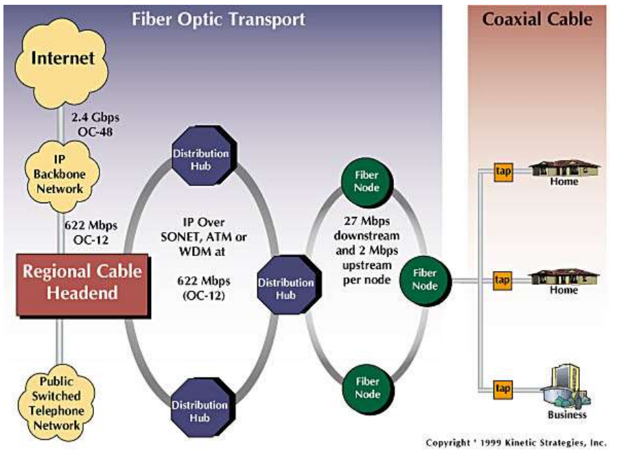

- 家庭网络：

  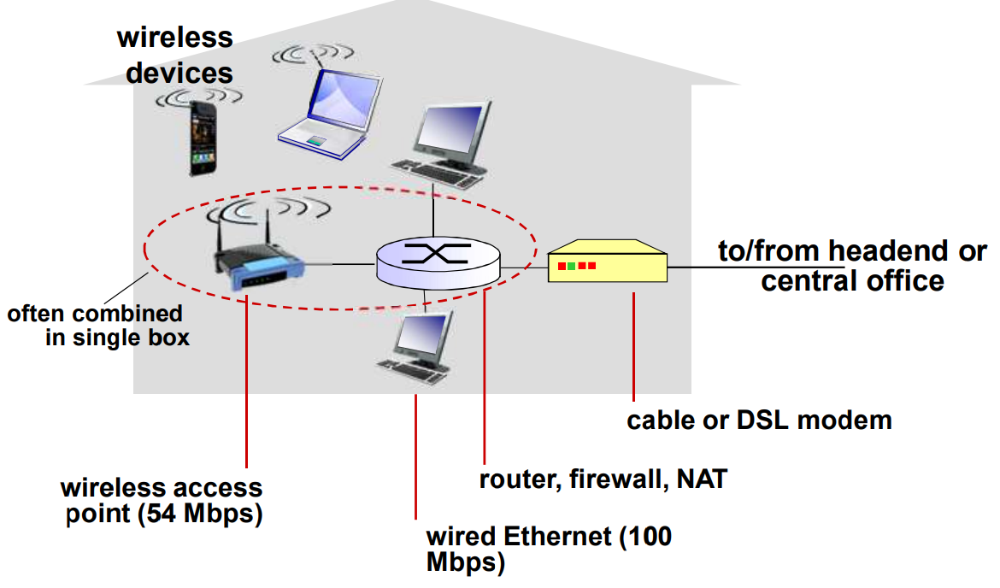

企业接入网络：

- 经常被企业或者大学等机构采用（10Mbps、100Mbps、1Gbps、10Gbps传输率。现在，端系统经常直接接到以太网络交换机上）

  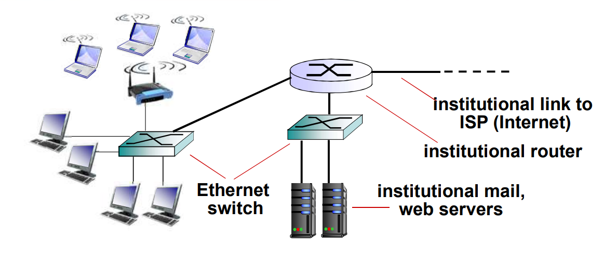

无线接入网络：

- 各无线端系统共享无线接入网络（端系统到无线路由器）

  > 无线LANs（建筑物内部）
  >
  > 广域无线接入

### 物理媒体

> 几个概念：
>
> - bit：在`发送-接受对`间传播
> - 物理链路：连接每个发送-接受对之间的物理媒体
> - 导引型媒体（看得见、摸得着）：信号沿着固体媒介被引导。（eg：同轴电缆、光纤、双绞线）
> - 非导引型媒体（看不见）：开放的空间传输电磁波或者光 信号，在电磁或者光信号中承 载数字数据。

双绞线、同轴电缆、光纤（导引型媒体）：

- 双绞线（TP）：由两根绝缘铜导线拧合（5类双绞线：100Mbps以太网；6类双绞线：10Gbps万兆以太网）

- 同轴电缆：由两根同轴的铜导线构成。

  > - 双向
  > - （窄）基带电缆：电缆上一个单个信道（Ethernet）
  > - 宽带电缆：电缆上有多个信道（HFC）

- 光纤和光缆：

  > - 光脉冲：每个脉冲表示一个bit，在玻璃纤维中传输
  > - 高速：点到点的高速传输（如：10Gbps~100Gbps的传输速率）
  > - 低误码率：在两个中继器之间可以有很长的距离，不受电磁噪声的干扰。
  > - 安全：光在内导体中进行全反射。

无线链路（非导引型媒体）：

开放空间传输电磁波，携带要传输的数据。（无需物理“线缆”）双向传播。

传播环境效应：反射、吸收、干扰。

类型：

- 地面微波
- LAN（eg：WiFi）
- wide-area（eg：蜂窝）
- 卫星

## Internet结构和ISP

ISP：Internet Service Provider

任何一个端系统都是通过接入ISP接入网络，因此就会有很多ISP。由于网络用户数量非常之多，因此也会有许多ISP，ISP必须是互联的，只有这样端系统之间才可以通信。那么ISP之间是如何互联的？

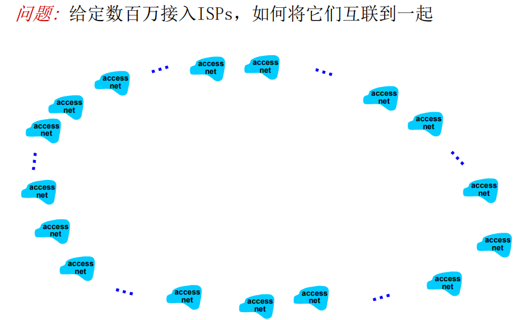

有一种办法是将他们两两互联，但是这会存在一个问题：ISP数量非常之多，在数量达到一定的情况下，再增添一个ISP所耗费的成本会非常巨大，整个体系的性能也会下降。因此这个方法并不可行，我们称其为：**不可扩展**。

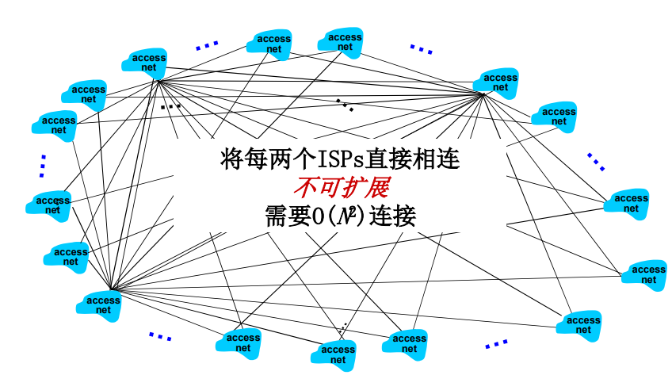

当意识到这点之后，人们就会想到利用一个`global ISP`作为“桥梁”，来将各个接入ISP连接起来。

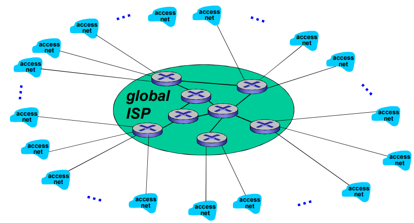

一个global ISP可以完成“桥梁”的工作，很明显这种做法一定是有利可图的，所以为了不让其出现垄断的局面（垄断总是不好的），所以这时一定会有其他的ISP来参与竞争（如图：部分接入网连接ISP A，部分连入ISP B…）。

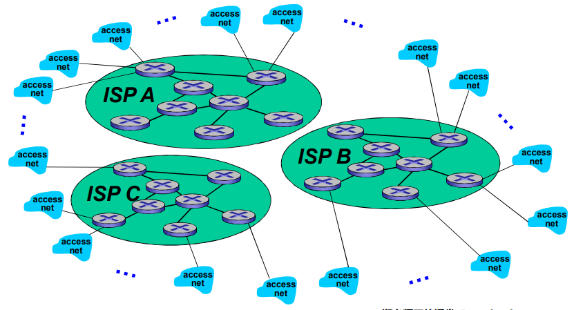

有竞争必然也有合作，运营商们可以互相商量，给彼此提供一个接口，这样所有的客户端就都可以相互通信。

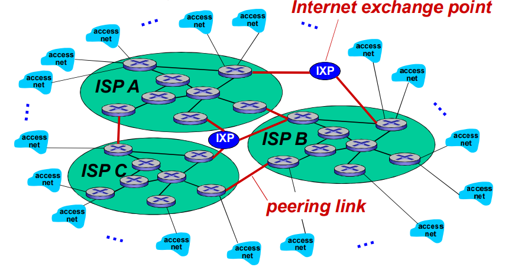

> ISP之间连接方式有两种：
>
> - 直接连接（peering link）
> - 通过IXP（Internet exchange point，网络交换点）来连接

接下来该种通信业务就会细分，出现所谓的区域性网络，他们可以更加方便地为某一地区提供通信服务，同时将与之接入的边缘ISP接入到全局的ISP。

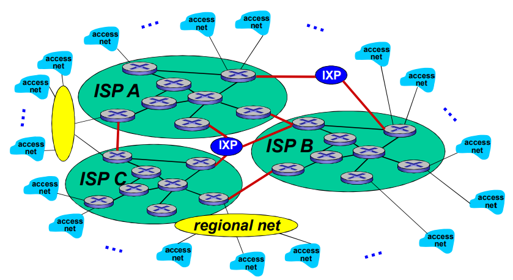

然后`内容提供商网络`（Internet Content Providers，ICP，例：Google，Microsoft），可能会构建他们自己的网络，将它们的服务、内容更 加靠近端用户，向用户提供更好的服务,减少自己的运营支出。

至此，整个网络体系就构成了当今的局面，即网络的网络。

### Internet结构

是一个具有层次的结构：

- 第一层ISP（中心）：国家/国际覆盖，速率极高。（如UUNet, BBN/Genuity, Sprint, AT&T）

  - 直接与其他第一层ISP相连
  - 与大量的第二层ISP和其他客户网络相连
  - 通过Peer或IXP连接

- 第二层ISP：更小些的 (通常是区域性的) ISP。

  - 与一个或多个第一层ISPs连接，也可能与其他第二层ISP相连。
  - 通过Peer或IXP连接

- 第三层ISP与其他本地ISP： 接入网 (与端系统最近)

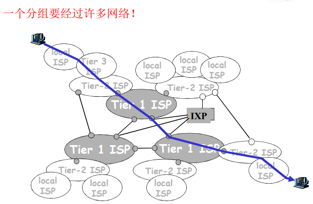

> ISP之间的连接：
>
> - POP: 高层ISP面向客户网络的接入点，涉及费用结算（如一个低层ISP接入多个高层ISP，多宿（multi home））
> - 对等接入：2个ISP对等互接，不涉及费用结算
> - IXP：多个对等ISP互联互通之处，通常不涉及费用结算（对等接入）
> - ICP自己部署专用网络，同时和各级ISP连接

## 分组延时、丢失和吞吐量

分组丢失和延时发生的原因：分组在传输过程中，会在路由器的缓冲区形成分组队列，分组等待排到队头，就会被传输至下一节点。这一排队过程就会产生排队延时（还有其他的延时，后面会详细提到）。如果缓冲区容纳不下被传输来的分组（队列容量不够），就会发生分组丢失的现象。

### 分组延时

1.  节点处理延时（nodal processing delay）：节点在收到分组时，为处理分组所花费的时间。
    - 检查bit级差错
    - 检查分组首部和决定将分组导向何处
    - 微秒级
2.  排队延时（queuing delay）：分组在节点中排队等待被发送所花费的时间。
    - 时间长短依赖于路由的拥塞程度（是不确定的）
    - 毫秒-微妙级
3.  传输延时（transmission delay）：数据从节点进入到传输媒体所耗费的时间。
    - R = 链路带宽（bps）
    - L = 分组长度（bits）
    - 将分组发送到链路上的时间：T = L/R
4.  传播延时（propagation delay）：数据（电磁波）在物理信道上传输一定距离所耗费的时间。
    - d = 物理链路的长度
    - s = 数据信号在介质上传播的速度（约为2×108 m/sec）
    - 传播延时：T = d/s

下面以车队的例子来类比：

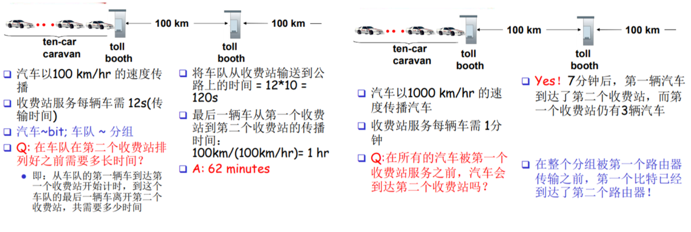

延时小结：

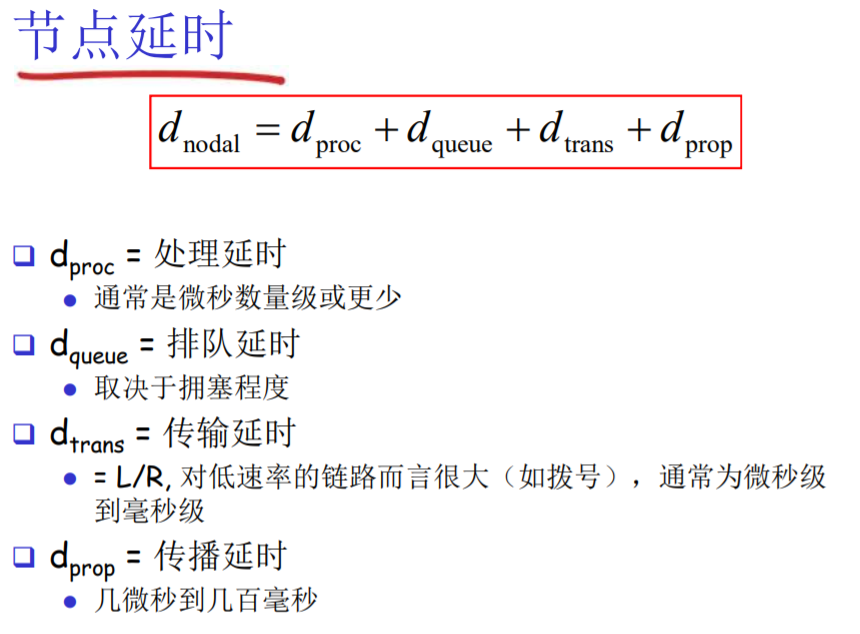

排队延时取决于流量强度：

> - R = 链路带宽 (bps)
> - L = 分组长度 (bits)
> - a = 分组到达队列的平均 速率

**流量强度 = La/R**

> - La/R ~ 0: 平均排队延时很小
> - La/R -\> 1: 延时变得很大
> - La/R \> 1: 比特到达队列的速率超过了从该队 列输出的速率，平均排队延时将趋向无穷大！
> - 注意：设计系统时流量强度不能大于1，会导致分组丢失！

`Traceroute` 诊断程序: 提供从源端，经过路 由器，到目的的延时测量。

- 沿着目的的路径，向每个路由器发送3个探测分组

- 路由器 i 将向发送方返回一个分组

- 发送方对发送和回复之间间隔计时

  > Traceroute具体实现原理：
  >
  > 利用了ICMP（Internet Control Message Protocol，互联网控制报文协议）。这种协议下的报文数据IP头部有一个字段：TTL（Time to Live，生存时间）字段。这个字段在最初传输时会被赋值，每经过一个路由器时，TTL减1。当TTL在某一个路由器降为零时，该分组会被抛掉，并会向源主机发送一个ICMP报文——通知源主机：分组发送到该路由时被“干掉”了（并附带IP地址），所以实现每一跳的查询方式就是设置不同的TTL。当分组到达目标主机时，肯定会占用一个端口，但是在目标主机中该端口并没有进程在跑，于是目标主机就会向源主机发送另一种ICMP报文——通知源主机：分组在我这边由于目标端口不可达，“挂掉了”（并附带IP地址）。这就是具体的工作原理。

  例子：

  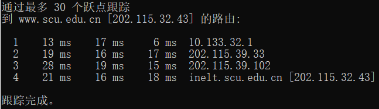

  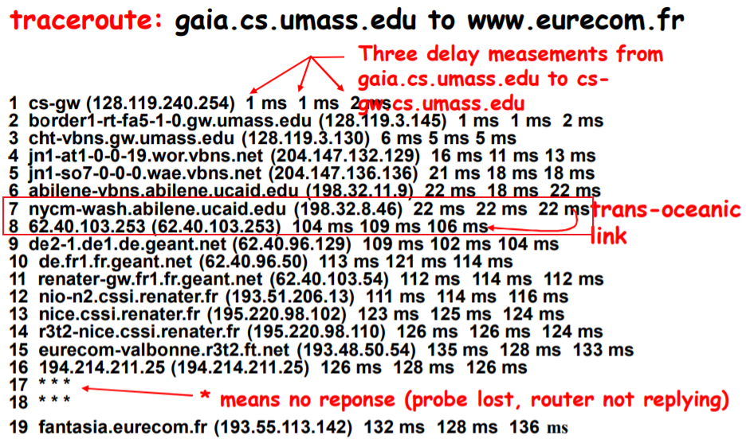

  > 上图在第7步和第8步延时出现了陡增的情况，很有可能是跨洋链路（该段链路特别长）

### 吞吐量（Throughput）

在源端和目标端之间传输的速率（数 据量/单位时间）

- 瞬间吞吐量: 在一个时间点的速率

- 平均吞吐量: 在一个长时间内平均值

  > 瓶颈链路：端到端路径上，限制端到端吞吐的链路。（短板效应）
  >
  > 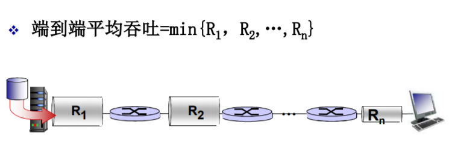
  >
  > 主机A到主机B之间的通信链路一定是公用的，我们假设有10个用户在用同一段链路（该链路带宽最小），那么A到B的连接就会占用这最小链路带宽的十分之一。这十分之一带宽就是A到B的瓶颈带宽，是它限制了A到B的吞吐量。

## 协议层次及服务模型

网络是一个复杂的系统。一般对于实现复杂的组织与功能的思路就是分模块，把不同的小功能分模块实现，然后总体实现一个复杂庞大的功能。计算机网络功能的实现同样利用这个思路，利用层次化方式实现复杂的网络功能。

> 层次化的具体思路：
>
> - 将网络复杂的功能分层功能明确的**层次**，每一层实现了其中一个或一 组功能，功能中有其上层可以使用的功能：**服务**
> - 本层协议实体相互交互执行本层的**协议动作**，目的是实现本层功能， 通过**接口**为上层提供更好的服务
> - 在实现本层协议的时候，直接**利用了下层所提供的服务**
> - 本层的服务：借助下层服务实现的本层协议实体之间交互带来的新功能（上层可以利用的）+ 更下层所提供的服务
>
> 服务（Service）：低层实体向上层实体提供它们之间的 通信的能力，是通过原语(primitive)来操作的，是垂直关系。
>
> 协议（protocol) ：对等层实体(peer entity)之间在相互通信的过程中，需要遵循的规则的集合，是水平关系。
>
> 协议和服务的关系：协议需要下层提供的服务才能实现，协议实现的目的是为了向上层提供更好的服务。本层的服务用户只能看见服务而无法看见下面的协议，下面的协议对上面的服务用户是透明的（看不见的）。

一些术语介绍：

- 实体（entity）：表示任何可发送或接收信息的硬件或软件进程。

- 服务（Service）：低层实体向上层实体提供它们之间的通信的能力。

- 服务访问点 SAP (Services Access Point) ：上层使用下层提供的服务通过层间的接口。

- 原语（primitive）：上层使用下层服务的形式，高层使用低层提供的服务，以及低层向高层提供服务都是通过服务访问原语来进行交互的。

  > 一个服务提供者（service provider）可能会向上层用户（(service user ）提供不同的服务，提供服务的具体接口就是层间的服务访问点（SAP），服务的具体形式就是原语。

服务的类型：

- 面向连接的服务（Connection-oriented Service）：
  - 连接(Connection)：两个通信实体为进行通信而建立的一 种结合。
  - 面向连接的服务通信的过程：建立连接，通信，拆除连接。
  - 适用范围：对于大的数据块要传输; 不适合小的零星报文。
  - 特点：保序（也不尽然）。
- 无连接的服务（Connectionless Service）：两个对等层实体在通信前不需要建 立一个连接，不预留资源；不需要通信双方都是 活跃。
  - 特点：不可靠、可能重复、可能失序。
  - 适用范围：适合传送零星数据。

分层处理和实现复杂系统的好处：

- 概念化：结构清晰，便于标示网络组件，以及描述其相互关系。（分层参考模型）

- 结构化：模块化更易于维护和系统升级。（改变某一层服务的实现不影响系统中的其他层次）

  > 分层也具有有害的地方：分层实现一个功能时，需要不同层次时时交换信息数据，那么整体的效率就会降低。（每一层都要做差错检测）

层具有的功能：

- 差错控制（error control）：使得两个对等体（不同端系统中相同的层次）之间的逻辑通信更加可靠。
- 流量控制（flow control）：防止发送方淹没接收方。
- 分段与重组（segmentation and reassembly）：在发送端将大数据块分割成小数据块，在接收端将小数据块重新组合成原来的大数据块。
- 多路复用（multiplexing）：允许多个上层会话共享一个下层连接。
- 连接建立（connection setup）：握手。

### Internet协议栈

从上至下层次划分为：

- 应用层（application）：完成应用报文之间的交互。（实现各种网络应用）

  数据单元：报文（message）

  eg：FTP、SMTP、HTTP

- 传输层（transport）：实现进程到进程之间的数据传输。

  数据单元：报文段（segment）

  eg：TCP、UDP

- 网络层（network）：实现端到端（源主机-目标主机）的以分组为单位的数据传输。

  数据单元：分组（packet）；如果是无连接的方式：数据报（datagram）

  eg：IP、routing protocols（路由协议）

- 链路层（link）：在**相邻**网络节点间以帧为单位传输数据。

  数据单元：帧（frame）

  eg：PPP（点对对协议）、802.11(wifi)、Ethernet

- 物理层（physical）：在线路上传送bit。（把数字数据转换成物理信号，使其承载于媒体之上）

  数据单元：位（bit）

  > Internet实际上只定义了上三层协议（应用层、传输层、网络层），下面的链路层和物理层被统一为网络接口层。
  >
  > 协议栈不同层中的协议并未实现全覆盖，有些应用可以直接跨层，由更低层的协议实现。
  >
  > 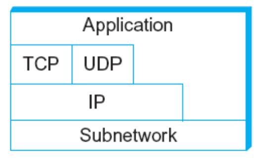

### OSI参考模型

从上至下层次划分为：

- 应用层（application）

- 表示层（presentation）：允许应用解释传输的数据。（关心交换数据的格式）

  > 表示层的目的是表示出用户看得懂的数据格式,实现与数据表示有关的功能。主要完成数据字符集的转换、数据格式化和文本压缩、数据加密、解密等工作。

- 会话层（session）：数据交换的同步，检查点，恢复。

- 传输层（transport）

- 网络层（network）

- 链路层（data link）

- 物理层（physical）

  > 表示层与会话层的功能在TCP/IP协议栈中由应用层完成。
  >
  > OSI参考模型包括了体系结构、服务定义和协议规范三级抽象。

### 封装与解封装

源主机向目标主机传送报文的真正流程——不断地封装与解封：

上层报文的传输需要借助层间接口，依托于下层的服务，在不同层加入相应的控制信息，形成本层的数据单元，继续向下传递，直到物理层将每一个bit传送给通信链路（这是封装的过程）。通过链路交换机，底部物理层会还原数据形成链路层的数据单元（帧），链路层查询帧头部的目标MAC地址，并查询该交换机的栈表（或交换表），并决定将帧从哪一个端口放出，接着就交给该端口的网卡，转换成对应物理层的bit，将其释放到通信链路中。通过路由器，先向上传递形成帧，再将帧转换为网络层的数据单元（分组），网络层从分组获取目标的IP信息，并查询网络层的转发表，决定将数据从哪一个网口释放出去，再形成对应的帧向下传递，进而转为bit由物理层将其传输到通信链路。就这样数据不断传输，最后到达目标主机，并不断解封装形成应用层的报文。

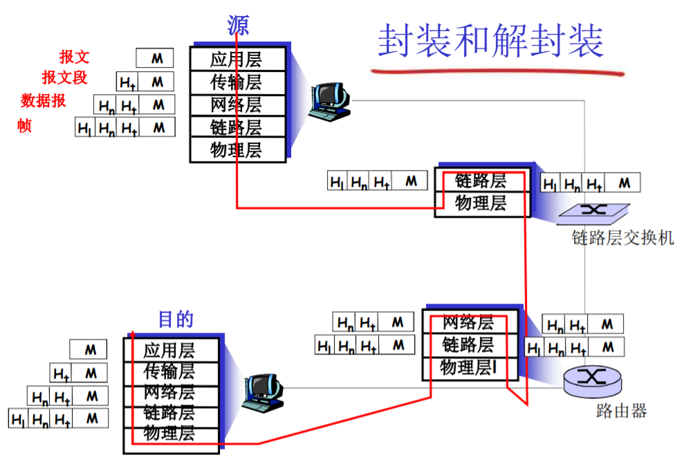

## 历史

早期（1960以前）计算机网络

- 线路交换网络
- 线路交换的特性使得其不适合计算机之间的通信
  - 线路建立时间过长
  - 独享方式占用通信资源，不适合突发性很强的计算机之间的通信
  - 可靠性不高：非常不适合军事通信
- 三个小组独立地开展分组交换的研究
  - 1961: Kleinrock(MIT)，排队论，展现了分组交换的有效性
  - 1964: Baran(美国兰德公司) – 军用网络上的分组交换
  - 1964：Donald（英国）等，NPL

1961-1972: 早期的分组交换概念

- 1967: 美国高级研究计划研究局考虑ARPAnet
- 1969: 第一个 ARPAnet 节点开始工作,UCLA
- 1969年底: 4个节点
- 1972:
  - ARPAnet 公众演示
  - 网络控制协议是第一个端系统直接的主机-主机协议（NCP协议：相当于传输层和网络层在一起，支持应用开发）
- 第一个e-mail程序（BBN）
- ARPAnet有15个节点

1972-1980: 专用网络和网络互联

- 出现了很多对以后来说重要的网络形式， 雨后春笋

  - 1970: ALOHAnet,夏威夷上的微波网络
  - 1973: Metcalfe在博士论文中提出了Ethernet
  - ATM网络
  - ALOHAnet，Telenet，Cyclades法国等

- 1970后期，网络体系结构的必要性

  - 专用的体系结构： DECnet, SNA, XNA
  - 标准化的体系结构

- 1974: 网际互联的Cerf and Kahn 体系结构

  > Cerf and Kahn 网络互联原则:
  >
  > - 极简、自治
  > - 尽力而为（best effort）服务模型
  > - 无状态的路由器
  > - 分布控制
  >
  > 定义了今天的Internet体系结构

- 1979: ARPAnet的规模在持续增加，体系结构也在酝酿着变化，以支持网络互联和其他目的（性能）需求。（有200个节点）

1980-1990: 体系结构变化, 网络数量激增，应用丰富

- 1983: TCP/IP部署，标记日
  - NCP分化成2个层次，TCP/IP， 从而出现UDP
  - 覆盖式IP解决网络互联问题
  - 主机设备和网络交换设备分开
- 1982: smtp e-mail协议定义
- 1983: DNS 定义，完成域名到IP地址的转换
- 1985: ftp 协议定义
- 1988: TCP拥塞控制
- 其他网络形式的发展
  - 新的国家级网络: Csnet, BITnet, NSFnet, Minitel
  - 1985年：ISO/OSI提出， 时机不对且太繁琐，
- 100,000主机连接到网络联邦

1990, 2000’s: 商业化, Web, 新的应用

- 1990年代初: NSF对ARPAnet 的访问网，双主干，ARPAnet退役
- 1991: NSF放宽了对NSFnet用于商业目的的限制 (1995退役)，ASFNET非盈利性机构维护，后面叫Internet
- UNIX 中TCP/IP的免费捆绑
- 1990年代初: Web
  - hypertext \[Bush 1945, Nelson 1960’s\]
  - HTML, HTTP: Berners-Lee
  - 1994: Mosaic (Netscape， andreesen)
  - 1990年代后期: Web的商业化
- 1990后期 – 21世纪:
  - TCP/IP体系结构的包容性，在其上部署应用便捷，出现非常多的应用
  - 新一代杀手级应用（即时讯息 ，P2P 文件共享，社交网络等 ）更进一步促进互联网的发展
  - 安全问题不断出现和修订（互联网的补丁对策）
  - 2001网络泡沫，使得一些好公司沉淀下来（谷歌，微软，苹果，Yahoo，思科）
  - 主干网的速率达到Gbps

2005-现在

- ~50+亿主机：包括智能手机和平板
- 宽带接入的快速部署
- 高速无线接入无处不在：移动互联时代
  - 4G部署,5G蓄势待发
  - 带宽大，终端性能高，价格便宜，应用不断增多
- 在线社交网络等新型应用的出现:
  - Facebook: 10亿用户
  - 微信，qq：数十亿用户
- 内容提供商 (Google, Microsoft)创建他们自己的网络。通过自己的专用网络提供对搜索、视频内容和电子邮件的即刻访问
- 电子商务，大学，企业在云中运行他们的服务 (eg, Amazon EC2)
- 体系结构酝酿着大的变化，未来网络蠢蠢欲动

------------------------------------------------------------------------

# 后记

本篇已完结

（如有补充或错误，欢迎评论区留言）
