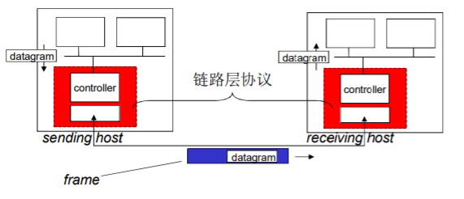
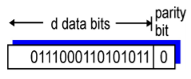
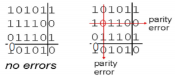
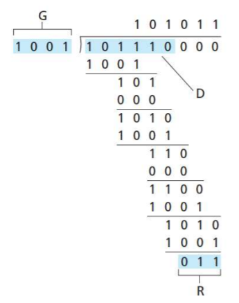

# 计算机网络学习笔记-链路层

> 📌 转载自 **花猪のBlog（作者 CNhuazhu）** —— 原文：https://cnhuazhu.top/butterfly/2021/07/15/%E8%AE%A1%E7%AE%97%E6%9C%BA%E7%BD%91%E7%BB%9C/%E8%AE%A1%E7%AE%97%E6%9C%BA%E7%BD%91%E7%BB%9C%E5%AD%A6%E4%B9%A0%E7%AC%94%E8%AE%B0-%E9%93%BE%E8%B7%AF%E5%B1%82/
> 学习笔记，版权归原作者所有，仅供学弟学妹学习参考；如有侵权请联系删除。

---

# 前言

*正在学习计算机网络这门课程，顺便做个笔记，记录一下知识点。*

> 参考资料：
>
> 中科大郑烇老师全套《计算机网络（自顶向下方法 第7版，James F.Kurose，Keith W.Ross）》课程：<a href="https://www.bilibili.com/video/BV1JV411t7ow?p=1" target="_blank" rel="noopener external nofollow noreferrer">https://www.bilibili.com/video/BV1JV411t7ow?p=1</a>
>
> 《计算机网络（自顶向下方法 第7版，James F.Kurose，Keith W.Ross）》

------------------------------------------------------------------------

# 第六章：链路层

网络层解决了分组如何从一个网络到达另一个网络的路由问题（以子网为单位），但是分组如何在子网内部的相邻节点之间传输，链路层解决了这个问题。

网络节点的连接方式：

- 点到点连接

  > 一般用于广域网（距离远）。举例：海底电缆将中国与其他国家的路由节点连接在一起。
  >
  > 点到点链路的链路层服务实现非常简单，封装和解封装

- 多点连接

  > 一般用于局域网（距离近）。举例：在局域网中通过交换机将不同的多个节点连接起来。
  >
  > 那么这就会产生一个问题，如果多方同时发送分组，就会产生碰撞（存在多点接入的问题）。后续我们会详细讨论。

## 导论

在开始前先规范一些术语：

| 术语 | 解释 |
|----|----|
| nodes（节点） | 主机、路由器、网桥和交换机都是节点 |
| links（链路） | 沿着通信路径,连接相邻节点通信信道的是链路（包括：有线链路、无线链路、局域网（共享性链路）） |
| frame（帧） | 链路层的数据单元（PDU） |

> 链路层负责从一个节点通过链路将（帧中的）数据报发送到相邻的物理节点。

> 下面我们举一个比较贴切的例子来分析分组在链路层的传输过程：
>
> 假设博主要从**普林斯顿**到**洛桑**，其中具体的路程规划如下：
>
> 1.  先坐轿车到肯尼迪国际机场
> 2.  再乘坐飞机飞往日内瓦
> 3.  最后乘火车到洛桑
>
> 其中：
>
> - 博主本人 = 数据报/分组
> - 交通段 = 通信链路（communication link）
> - 交通模式 = 链路层协议（protocol）
> - 票务代理 = 路由算法（routing algorithm）
>
> > - 数据报/分组在不同的链路上以不同的链路协议传送
> > - 不同的链路协议提供不同的服务

### 链路层提供的服务

- 成帧，链路接入：

  - 将数据报封装在帧中，加上帧头、帧尾部
  - 如果采用的是共享性介质，信道接入获得信道访问权
  - 在帧头部使用“MAC”（物理）地址来标示源和目的（注意：不同于IP地址）

- 在相邻两个节点（一个网络内）完成可靠数据传递

  - 在低出错率的链路上（光纤和双绞线电缆）很少使用

  - 在无线链路经常使用：出错率高

    > 注意：链路层也可以实现一定的可靠性
    >
    > 在无线链路的网络上，出错率高，如果在链路层不做差错控制工作，漏出去的错误比较高；到了上层如果需要可靠控制的数据传输代价会很大
    >
    > - 一般化的链路层服务，不是所有的链路层都提供这些服务
    > - 一个特定的链路层只是提供其中一部分的服务

- 流量控制

  使得相邻的发送和接收方节点的速度匹配

- 错误检测

  - 差错由信号衰减和噪声引起
  - 当接收方检测出错误时，通知发送端进行重传或丢弃帧

- 差错纠正

  接收端检查和纠正bit错误，不通过重传来纠正错误

- 半双工和全双工

  - 半双工：链路可以双向传输，但一次只有一个方向
  - 全双工：两个方向可以同时收发

### 链路层的实现位置

- 在每一个主机上

  - 包括路由器
  - 交换机的每个端口

- 链路层功能在“适配器”上实现（aka network interface card NIC)）或者在一个芯片组上

  - 以太网卡，802.11 网卡; 以太网芯片组

  - 实现链路层和相应的物理层功能

    > 适配器通信
    >
    > 
    >
    > - 发送方
    >   - 在帧中封装数据报
    >   - 借助于物理层，把每个bit发送出去
    >   - 加上差错控制编码，实现rdt（也可能不实现）和流量控制功能等
    > - 接收方
    >   - 把物理信号还原为数字信号，还原帧头、帧尾
    >   - 检查有无出错，执行rdt和流量控制功能等
    >   - 解封装数据报，将至交给上层

- 接到主机的系统总线上

- 硬件、软件和固件的综合体

## 差错检测和纠正

### 错误检测

*（⚠️ 原图已失效）*

> 说明：
>
> - EDC：差错检测和纠正位（冗余位）
> - D：数据由差错检测保护，可以包含头部字段
>
> 在数据传输的过程中数据有可能发生错误，这时接收方会检查EDC’以及D’是否符合约定的差错控制编码关系，如果不符合关系，那么数据一定出错。
>
> 此外，还存在一种情况，即EDC’以及D’都出错，且恰好又通过校验，这种情况被称为`残存错误`。
>
> - 错误检测不是100%可靠的
> - 编码越长，残存错误越低。（更长的EDC字段可以得到更好的检测和纠正效果）

### 奇偶校验

- 单bit奇偶校验

  

  - 检测单个bit级错误（容易理解）

- 二维奇偶校验

  

  - 检测和纠正单个bit错误
  - 不仅可以检测出错误，还可以检测出错误的位置
  - 无法检测出对偶错误

### Checksum（校验和）

目标: 检测在传输报文段时的错误（如位翻转），（仅仅用在传输层）

> 具体可以看传输层章节，这里不再赘述

### CRC（循环冗余校验）

- 强大的差错检测码

- 

  > （直接放一个过程，具体怎么操作自行搜索）
  >
  > D：数据bit
  >
  > G：生成多项式：双方协商r+1位模式（r次方）
  >
  > 目标：求R

- CRC性能分析

  - 能够检查出所有的1bit错误
  - 能够检查出所有的双bit错误
  - 能够检查出所有长度小于等于r位的错误
  - 出现长度为 r+1的突发错误，检查不出的概率是1/2r-1
  - 出现长度大于r+1的突发错误，检查不出的概率是1/2r

## 多点访问协议
